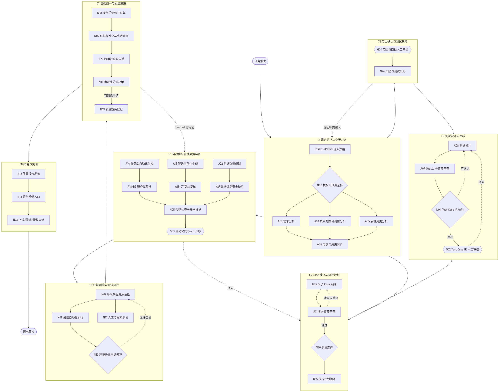
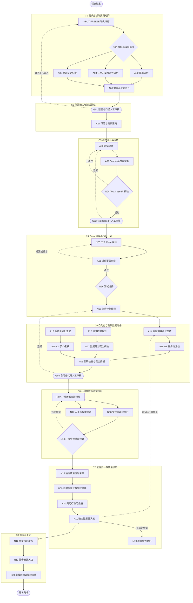

# Multica 八张任务卡简化版

## 一句话说明

一个需求进入 Multica 后，只展示 8 张任务卡，并按顺序自动执行。系统内部仍保留完整执行节点
和审计记录，但不再把每个小节点都拆成一张用户可见的卡。

## 工作流完整链路图

按用户视角固定 8 张卡（`C1`-`C8`），内部按以下完整链路执行。方框是确定性节点或 Agent，
菱形是判断节点，双线框是人工 Gate，虚线是退回或重试（只更新原卡，不新建卡片）。

> 矢量版：`docs/images/multica-workflow.svg`（放大不糊，适合 PPT/文档插图）。

Mermaid 源码（可编辑，改完可重新渲染）

## 八张卡与内部节点怎么对应

| 任务卡 | 内部节点 |
| --- | --- |
| 1. 需求分析与变更对齐 | INPUT-FREEZE、N00、A02、A03、A05、A06 |
| 2. 范围确认与测试策略 | G01、N24 |
| 3. 测试设计与审核 | A08、A09、N04、G02 |
| 4. Case 编译与执行计划 | N25、A11、N26、N15 |
| 5. 自动化与测试数据准备 | A14、A15、A22、A18-BE、A18-CT、N27、N05、G03 |
| 6. 环境预检与测试执行 | N07、N08、N17、N10 |
| 7. 证据归一与质量决策 | N18、N09、N20、N11、N19 |
| 8. 报告与关闭 | N12、N13、N23 |

当前服务端主链共 36 个内部节点，其中 12 个为 Agent（A02/A03/A05/A06/A08/A09/A11/A14/A15/
A22/A18-BE/A18-CT），3 个为人工 Gate（G01/G02/G03），其余为确定性节点。未进入某次模板的
可选节点记为“按策略跳过”，但仍归属于对应卡片；前端、E2E 或非功能自动化分支启用后归入
第 5 张卡，不额外增加用户可见卡片。

## 八张卡分别做什么

| 顺序 | 任务卡 | 主要内容 | 什么时候完成 |
| --- | --- | --- | --- |
| 1 | 需求分析与变更对齐 | 冻结输入，理解需求，对齐技术方案和代码变更，找出遗漏或冲突 | 需求、方案和变更范围已经对齐 |
| 2 | 范围确认与测试策略 | 人工确认测试范围，确定风险等级和必测内容 | 范围已确认，测试策略已确定 |
| 3 | 测试设计与审核 | 设计测试 Case，检查预期结果，校验并人工审核 | Case 校验通过且审核完成 |
| 4 | Case 编译与执行计划 | 拆分父子 Case，审查覆盖，选择要执行的 Case，决定自动或人工执行 | Case 和执行方式已经确定 |
| 5 | 自动化与测试数据准备 | 生成或更新自动化用例，规划测试数据，独立复核并完成代码检查 | 自动化、数据和检查全部就绪 |
| 6 | 环境预检与测试执行 | 检查环境、账号和数据，运行自动化及人工测试 | 测试执行完成，重试已有结论 |
| 7 | 证据归一与质量决策 | 汇总结果、识别重复缺陷，给出通过、警告或阻塞结论 | 质量结论已经确定 |
| 8 | 报告与关闭 | 发布报告、记录反馈，按授权执行上线后验证 | 报告和必要的后续记录已完成 |

## 卡片状态怎么看

卡片状态由卡内所有内部节点聚合得出，每次对一张卡只同步一次，优先级固定为
`进行中 > 待审核 > 已阻塞 > 已完成 > 待规划`。活动执行和重试优先于历史失败：

| 状态 | 含义 | 是否需要处理 |
| --- | --- | --- |
| 进行中 | 卡内至少有一个任务正在排队或执行 | 不需要，等待自动执行 |
| 待审核 | 无运行节点且存在等待人工决策的 Gate | 需要，按卡片中的“人工操作”处理 |
| 已阻塞 | 无活动重试且存在失败或阻塞节点 | 需要查看“异常处理”和下一步 |
| 已完成 | 卡内任务全部完成或按策略跳过 | 不需要 |
| 待规划 | 前面的卡还没有完成，本卡尚未开始 | 不需要，系统会自动推进 |
| 已取消 | 卡内节点全部取消或被新版本替代 | 不需要 |

任务开始排队后就应显示为“进行中”，不能仍停留在“待规划”。活动重试优先于历史失败，因此
失败任务重新运行时，也应从“已阻塞”自动恢复为“进行中”。

## 和内部执行怎么同步

- 需求项目（项目名称即需求名称）只展示 8 张阶段任务卡；Parent、Run、内部节点执行和人工
  Gate 技术卡保存在 `QA 内部执行与审计` 项目中，默认不显示为需求项目任务卡。
- 同步脚本 `qa-agents/scripts/sync_eight_card_progress.py` 读取内部项目已完成 Run，入库
  Artifact 后对账，再把阶段状态和详情投影回 8 张卡。
- A02、A03、A06 的结果齐备后，同步脚本自动生成 G01 请求、可读 Markdown 和决策模板；
  A06 的待确认项与需求、技术方案问题合并到一次人工审核，不再单独打断流程。
- 恢复既有运行时，只把重新发现的 Issue 绑定合并到当前状态，并以已发布 revision 为版本下限，
  不允许初始化规格把已完成节点改回“待规划”。
- 修正、退回和重试只更新原阶段卡的状态与正文，禁止创建新卡或后缀卡。
- 人工 Gate 仍以正式 Decision Artifact 为准，卡片上的“待审核”只是聚合入口，不能替代审批。

## 每张卡会展示什么

每张任务卡统一展示以下内容：

- 目标：这张卡要解决什么问题。
- 输入：使用了哪些需求、方案、代码或上游结果。
- 执行内容：当前阶段具体做什么，列出本卡内部节点。
- 当前进度：正在执行哪个节点，各状态数量是多少。
- 产出：生成了哪些 Case、自动化、证据或报告（含 Artifact 版本和哈希）。
- 异常处理：失败原因、重试情况和下一步去向。
- 人工操作：只有需要人工确认时才显示具体动作。
- 完成标准：满足什么条件后进入下一张卡。

长日志保留在 Artifact 和运行记录中，不复制到任务卡正文。

## 用户看到的实际效果

每个新需求固定只有 8 张主任务卡。内部步骤再多，也只更新对应阶段卡的进度和说明：

- 短链路和相近工作合并在同一张卡中。
- 自动执行时，卡片状态会跟随真实运行进度变化。
- 修正、退回和重试不会制造新卡。
- 人工审核仍会明确显示，但不会被大量内部节点淹没。
- 完整执行记录仍保留，出现问题时可以继续追查到具体内部节点。

完整设计（节点职责、同步边界、状态聚合规则和实施改造）见
`QA_AGENT_DESIGN.md` 第 5.1、5.3、5.4 节和第 6 章。
