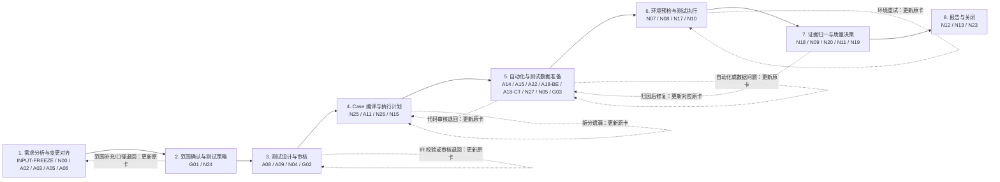
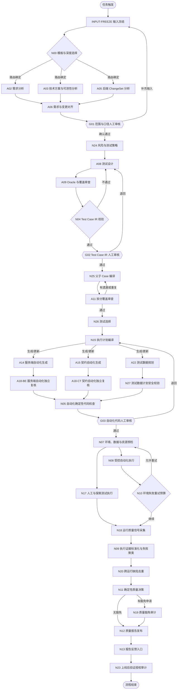

# 生产级 QA 多 Agent 质量系统设计规范

## 1. 文档定位

本文档是 QA 多 Agent 质量系统的顶层设计规范，也是后续设计、实现和验收每个 Agent
及 Multica 流程节点时的共同参照。

系统目标不是生成一批看起来完整的测试 Case，而是进入真实研发流程，建立一套能够：

- 理解需求、技术方案和前后端代码变更；
- 识别需求与实现之间的偏差；
- 基于风险生成可追踪的 Test Intent 和 Test Case IR；
- 拆分前端、后端、契约、E2E 和非功能测试；
- 生成、审查并执行自动化测试；
- 管理测试环境、测试数据和共享资源；
- 对失败进行证据化聚类和归因；
- 给出确定性的质量门禁结论；
- 将人工修正沉淀为离线评估集；

的生产级质量系统。

本文档定义架构、职责、数据契约、门禁和验收标准。阶段 0 基础、阶段 1 主链至人工升级，
以及阶段 2 后端自动化切片的本地参考实现位于 `qa-agents/`；`pilot-001` 已完成人工恢复、G02
与阶段二 N25/A11/N26/N15 真实闭环。独立置信运行 `multica-confidence-20260811-01` 已过 G01/
N24/A08/A09/N04 双轮自动修正，现停在 human（预算耗尽）。参考实现不等于生产 Multica、模型
Runtime、完整自动化链路或发布门禁已经完成。

## 2. 设计状态与使用规则

- 当前状态：方案已冻结第一版；阶段 0 本地基础、阶段 1 至人工升级节点、阶段 2 后端参考
  切片已实现；`pilot-001` 主链已闭环到 N15；独立置信运行已推至 N04 human 升级，生产接入仍在建设。
- 编排平台：Multica。
- Agent 之间的主契约：版本化 JSON Artifact。
- 测试设计主契约：Test Intent 与 Test Case IR。
- 默认执行环境：隔离测试环境或临时环境。
- 默认权限：最小权限；所有业务代码仓库强制只读，禁止任何仓库内容或元数据写操作。
- 默认决策原则：证据优先，模型自报置信度不能单独作为放行条件。

后续创建任何 Agent 前，必须从本文档中明确以下内容：

1. Agent ID 和单一职责。
2. 允许读取的输入 Artifact。
3. 必须输出的 JSON Schema。
4. 可以使用的工具和权限。
5. 阻塞条件、重试条件和人工升级条件。
6. 离线评估样本和验收指标。

### 2.1 当前参考实现快照（2026-08-07）

- 已完成 N00/N01/N02/N03/N04/N05/N06/N14/N15/N24/N25/N26、A02-A09、A11/A12、
  A14/A18-BE 和 G01-G03 的本地参考链路。
- 已在独立 Multica Workspace `QA 多 Agent 质量系统` 中配置首批 7 个 Agent，并使用真实冻结
  需求、技术方案和后端 commit 跑通
  `A02/A03/A05 -> A06 -> G01 -> N24 -> A08 -> A09 -> N04 -> A08 -> A09 -> N04`。
- G01 已汇总并由 QA Owner 逐项确认 23 个问题；N24 将本需求判定为 `critical`，强制覆盖
  `backend/contract/e2e`。G01 未审批时停住，只有带身份、签名和内容哈希的决策才能继续。
- 当前试点经用户决策临时采用 QA Owner 单签，仅允许继续测试设计验证，不具备生产发布审批
  权限；接入真实发布流程前必须恢复产品、技术与 QA 的职责分离。
- Multica 试点当前使用固定 Codex Runtime 和版本化 Prompt；生产模型网关、Prompt 发布、灰度、
  回滚和不可变模型快照仍未完成。本地结构化模型 Runtime 策略默认关闭，不能冒充生产绑定。
- 第一版 A08 生成 10 个父 Case，第一轮 A09/N04 发现并归并出 107 个阻塞问题；QAA-11 的
  A08 修正版生成 13 个父 Case。QAA-13 复审后剩余 3 个阻塞错误和 1 个警告，第二轮 N04
  输出 `valid=false`、`correction_attempt=2/2`、`next_node=human`，G02 保持
  `not_started`。这证明自动回流、预算耗尽和人工升级均按设计生效。
- QAA-12 是 A08 v1.2.1 的并行影子候选，只用于验证新协议。它没有进入主链，不能替换已接受
  的 QAA-11，也不能绕过 QAA-13 和第二轮 N04；影子候选如需晋升，必须经显式人工决策、
  正式入库、重新 A09 审查和 N04 校验。
- G02 已实现以 Multica Issue 为控制面的本地确定性 Adapter：`in_review` 暂停，`done`、
  `blocked`、`cancelled` 分别路由通过、退回和终止；请求、决定、结果、身份绑定与幂等恢复
  已实现。当前主链 N04 仍无效，因此尚未创建真实 G02 Issue，也未完成阶段 1 实跑闭环。
- 预算耗尽后的人工修正恢复协议已实现。`pilot-001` 的 QAA-19 已由 QA Owner 审核为 `done`
  并生成 A08 v1.3.0 人工定向恢复输入；轮次记为 3，自动预算保持 2。QAA-20 第一次恢复候选
  因缺绑定字段、非 text 交付和工具轨迹违规被拒收，主链仍需按 v1.3.0 重跑 A08，再经
  A09/N04 后才能进入 G02。
- 已实现 `fs-qa-knowledge` 固定版本能力探测和消费端 Adapter。冻结 commit
  `1ca888b645bd1c346b6d708a9a583af58d299fc8` 缺少 capability manifest，且生成流程强制
  `upload2fs`，因此状态为 `incompatible`，不得进入 A08。
- `pilot-001` 路由评估为 `17/17`；完整语义评估为 `34/69`。其中需求事实 `4/7`、实现事实
  `7/7`、对齐问题 `0/7`、开放问题 `4/4`、Gate 决策 `1/1`、测试义务 `1/26`。
- 上述失败是能力基线，不得通过修改 Oracle、放宽断言或把粗粒度 Case 重复计数来消除。

本节是设计文档中的时间点快照。运行时状态以
`qa-agents/runs/pilot-001/multica-run-manifest.json` 为审计主记录，建设状态以
`qa-agents/IMPLEMENTATION_STATUS.md` 为准；两者必须引用实际 Artifact 哈希，不能仅凭任务
标题、最新生成时间或自由文本更新主链状态。

### 2.2 当前进展快照（2026-08-10 晚间交接）

本节是交接快照；建设状态以 `qa-agents/IMPLEMENTATION_STATUS.md` 为准，运行时状态以
`qa-agents/runs/pilot-001/multica-run-manifest.json` 为审计主记录。

**主链真实状态（Multica 线上确认）**

- G02 已真实放行：Multica Issue QAA-24 由 QA Owner `muqj11262` 置为 `done`，
  `sync-g02-after-human-pilot` 线上查询确认 `decision=approved`、`next_node=N25`；请求与
  结果 Artifact 已写入 `qa-agents/runs/pilot-001/g02/`（request_hash
  `sha256:f46f883b8a1271d77ec994cdf384d8a246ce99f05901f0a484496930a5e111e0`、outcome_hash
  `sha256:0bc6ed313f356872d86ceff46930bb44b408dd9b629f2595c5f2a6a023f4559d`，上游绑定
  A08/A09/N04 哈希）。主链恢复点为 N25。
- Runtime 修复：A02/A03/A05/A06 此前真实绑定离线 Runtime `6fa59d79`（Codex muqingji），
  已重绑到在线 `5a1ecc9c`（Codex MacBook-Pro-3.local，gpt-5.6-sol），与 A08/A09 一致；
  LEAD 原绑定 `c12c5f20` 的 Claude Runtime，Autopilot 首次运行实测 401 后已切换到在线
  `5a1ecc9c`（Codex / gpt-5.6-sol）。`multica/workspace-manifest.json` 已同步线上状态。
- 已接受入库：A08 `multica-stage10`（artifact_hash
  `sha256:edb58b4fd142c1c5a3eae40d5d575b58a810fa709b213f66fa676d5c3d4eeb7c`，13 个父 Case，
  required_layers 覆盖 backend/contract/e2e，automation_candidate 混合）、A09
  `multica-stage11`、N04 `multica-stage12`（`valid=true`、`correction_attempt=3`、
  `next_node=G02`）。

**代码与测试已就绪（本次会话新增，已推送远端 `qa_agent` 分支）**

- 阶段 2 自动化 Profile：A13/A15/A16/A17-*/A18-* 共享生成/审查引擎与版本化 Profile
  注册表（`src/qa_agents/agents/automation.py`）；`policies/automation-target-policy.json`
  新增 `layer_profiles`、`playwright` 框架白名单与分层候选根目录；N05 按
  `generator_profile` 动态回流路由，候选路径越出声明层根目录按安全违规拦截；workflow
  按层/非功能类型分发生成与独立审查，多 Manifest 汇合到 N05/G03。
- A01 Workflow Route Advisor：N00 以确定性模板注册表选择路由与深度（L1/L2/L3），未知模式
  才调用 A01 建议（`advice_only`），建议不能自行创建或执行流程。
- 阶段二真实链驱动：`src/qa_agents/stage_two_nodes.py` 新增 `run_n25_after_g02`、
  `run_n26_after_a11`、`run_n15_after_n26`（全部内容寻址绑定校验）；`src/qa_agents/multica.py`
  新增 A11 Profile 输出契约、`prepare_multica_split_review_input` 与 A11 语义校验（每个父
  Case 恰好审查一次、子 Case 属于对应父、Oracle 集不变、每层恰好一次、approved 与阻塞数
  一致、禁止访问 Oracle）。
- CLI/Makefile：新增 `prepare-multica-split-review`、`run-n25-after-g02`、
  `run-n26-after-a11`、`run-n15-after-n26` 命令及对应 make target。
- 测试：新增 `tests/test_stage_two_nodes.py`（N25/N26/N15 正负向）与 A11 prepare/ingest
  语义测试；全量测试 `137 passed`。

**未完成事项（回家后继续实施）**

1. A11 真实 Multica 审核：编写 `qa-agents/multica/agent-instructions/a11-v1.0.0.md`
   （只读工具白名单、禁止 Oracle/业务仓库写、输出 JSON 契约与 `_validate_split_review_semantics`
   一致）；用 `multica agent create --runtime-id 5a1ecc9c-8e48-4345-8d5e-be0efb3b9a54`
   创建 A11 Agent；登记 `qa-agents/multica/workspace-manifest.json`。
2. 驱动真实链：`make run-n25-after-g02-pilot`（输出 `multica-stage13`）→
   `make prepare-multica-split-review-pilot`（生成 `multica-inputs/a11-01/a11-input.json`）→
   在 Multica 桌面端把 A11 输入交给 A11 Agent → `ingest-multica` 校验并入库
   `multica-stage14`（需 task/issue/attachment ID）→ `make run-n26-after-a11-pilot`
   （`multica-stage15`）→ `make run-n15-after-n26-pilot`（`multica-stage16`）。
3. 契约版本确认：真实 A08 产物 `schema_version` 为 `test-design-ir/1.1`，N25/A11 指令与
   校验需与既有 `prepare_multica_test_design_input`/`ingest` 的契约版本处理保持一致。
4. A12 与执行链：A12 已实现（N26 无法判定的影响关系才触发，建议只能扩大或升级范围，
   经 N26 校验折叠）；阶段 3-5 执行与门禁已先落地 N07/N16（§17：环境指纹、8 类预检、
   指纹节流、N16 幂等修复门禁）；N08 受控执行和 N09-N12/N17-N23 确定性质量尾链已实现
   本地 reference 版本，生产隔离与外部发布 Adapter 继续建设。
5. 文档收尾：`README.md` 与 `IMPLEMENTATION_STATUS.md` 的旧"G02 未启动"表述已随本快照
   同步更新；后续真实 N25-N15 跑通后需回写 Artifact 哈希。

### 2.3 当前进展快照（2026-08-10 深夜实跑闭环）

本节是实跑闭环快照；建设状态以 `qa-agents/IMPLEMENTATION_STATUS.md` 为准，运行时状态以
`qa-agents/runs/pilot-001/multica-run-manifest.json` 为审计主记录。

**阶段一/阶段二真实链已闭环（N25 → A11 → N26 → N15）**

- 主链本地产物从 Multica 线上恢复并逐哈希核对一致：A08 `multica-stage10`
  （`edb58b4f…`，13 个父 Case）、A09 `multica-stage11`（`9cafab64…`）、N04
  `multica-stage12`（`valid=true`，`35e954e5…`）、G02（request `f46f883b…`、outcome
  `0bc6ed31…`，QAA-24 放行至 N25）。
- N25 `multica-stage13` 真实编译：13 父 → 14 子（`e8505b16…`）。
- A11 Multica Agent 已创建（QAA-25/QAA-26，绑定在线 Codex Runtime `6fa59d79`）并登记
  workspace-manifest；指令为 `multica/agent-instructions/a11-v1.0.0.md`。
- 真实运行发现并修复缺陷：A11 完整载荷输入（磁盘 175KB）导致模型在最终生成阶段静默超过
  Codex Runtime `semantic_inactivity_timeout=10m`，连续两次
  `codex_semantic_inactivity` 超时。修复为紧凑审查范围输入（约 57KB，保留
  id/expected/layer/parent 绑定/`inherits_parent` 一致性标志），并约束最终 JSON ≤ 10KB、
  rationale ≤ 60 字。修复后 QAA-26 真实审核 3 分钟完成，`ingest-multica` 校验通过入库
  `multica-stage14`（`b6e37ba3…`）。
- A11 真实审查结论 `completed_with_gaps`/`approved=true`：13 个父 Case 全部回查；发现
  `CASE-CT-005` 的 backend/contract 子 Case 未按层收窄执行责任（warning，路由 N25），
  属 N25 编译器的后续改进项，不阻塞本次流程。
- N26 `multica-stage15`（`64bd7dcb…`）无 unresolved，A12 按设计不触发；N15
  `multica-stage16`（`89764afd…`）执行计划 14 条：3 条 `generate_new`、11 条 `manual_run`
  （试点无自动化资产，按策略路由）。

### 2.4 当前进展快照（2026-08-11 N08 与 Multica 复跑）

- 已从 QAA-26 线上消息流重新构建 stage13-16，四个 Artifact 哈希与 2.3 完全一致；修复
  `multica-run-manifest.json` 停在 G02 的陈旧 checkpoint，N25/N26/N15 后续会原子更新阶段二
  checkpoint，审计主记录与 workspace manifest 现统一指向 N15，下一节点为 N07。
- N08 受控自动化执行参考切片已实现：认证 N07/A18/N05 producer 与 payload contract，
  强制绑定已通过的 N07、独立 A18 审查、N05 检查、
  generation/manifest/candidate 哈希；无 shell 分片执行，保留脱敏日志和原始 JUnit，业务失败
  进入 N09，只有超时或基础设施错误进入 N10。当前本地 Runner 非生产隔离且硬拒绝网络和
  Secret，生产隔离 Runner Adapter 仍待接入。
- A18 与 N05 新增 generation、manifest 和逐候选哈希绑定；修复空 `secrets: []` 被脱敏为
  字符串导致 Manifest 失真的问题，以及 Envelope Schema 漏列 `blocked` 的问题。
- 实际 Multica 复跑发现 A11 仍绑定离线 Runtime `6fa59d79`，已重绑在线同模型 Runtime
  `5a1ecc9c`。新 task `2cdb00fd-c20d-482c-a626-9d62a2b1c611` 运行 2 分 05 秒完成，但对
  不可变输入将 `CASE-CT-005` 判为完全覆盖，与主链 warning 相反。该影子结果
  `fc24e6c1…` 未晋升；新增确定性语义门禁后以
  `unscoped cross-layer responsibilities` 拒收，主链仍保留 `b6e37ba3…`。
- 当前剩余关键路径：生产隔离 Runner、真实 staging/人工执行证据、自动化 Case 的有效契约
  引用，以及 MR/Bug/发布系统 Adapter。N09 聚类、N10 重试预算、N17 汇合、N18 信号、
  N20 去重和 N11/N12 决策报告已完成确定性 reference 实现。

### 2.5 当前进展快照（2026-08-11 独立置信实跑）

- 新建独立运行 `multica-confidence-20260811-01`，Multica 父 Issue 为 QAA-27。该运行不复用
  `pilot-001` 的 G01/G02 决策，从冻结来源重新编译 Stage 1 输入并真实运行 A02/A03/A05。
- A02 首次通过；A03 首次因把不存在的输入 `input_bundle_hash` 复制为 `null` 被契约门禁
  拒收；A05 首次因读取 Issue comment/metadata、调用写文件工具并通过 comment 交付被权限
  门禁拒收。A03/A05 指令升级并真实发布为 v1.1.1 后，第二次运行均通过完整消息流审计和
  正式 ingest。被拒 Task 不得作为下游输入。
- 使用三份新接受 Artifact 编译 A06 输入并在 QAA-31 真实运行。A06 Task
  `5ed169eb-c5c4-4f7b-bd29-6c5e51b6647c` 的工具轨迹、Schema、输入哈希和语义门禁均通过；
  Artifact 哈希为 `sha256:6da70bda7715d4766d80511eab978af0dcc5b6bd8f50162b960650200a84842d`，
  结论为 `needs_human`，包含 9 个对齐 finding。
- **G01 已签署，不再 pending**：request hash
  `sha256:90b67080e7916b208a2601d5badecc2dda77993040a6ef0655060f114a1b01e8`（15 项）由
  QA Owner `muqj11262` 在 QAA-32 提交结构化评论后，确定性 Adapter 生成 decision
  `sha256:8f0393d7b10ea5aa84499dd3ee6b270ee6136bdfc0b0a0594b2a64c1fbbb8997` 与 outcome
  `sha256:d91f9bc2e30094ab38b29bea7ce5ab1691f31c5ce709cb754f2de22d1b0999d1`，
  `decision=approved`、`next_node=N24`、`policy_scope=pilot_test_design_only`（无生产发布
  权限）。Issue 列状态单独变更仍 fail-closed，不能代替评论协议。冻结口径包括：多限制任意
  一条提示、多指标展示全部名称、文案端点无关、仅四类不支持场景、中英文案冻结；错误码平台
  证据/稳定动态关联 ID/空字段加固本轮延后。
- **N24 已完成**（`multica-stage3`）：
  `sha256:052204851f780c290abdf204902b4c6e3aa232bfb75af8e16610f2f24c04b703`，
  `risk_level=critical`，必测 `backend/contract/e2e`。
- **测试设计修正回流已真实跑满自动预算（max=2）**：
  1. A08 QAA-33 接受 `sha256:c1ae5fc9...` → stage4（7 父 Case；指令经 `a08-v1.1.1` 加固
     `allowed_modes` / `test_data` object / oracle `type`+`source_ref`）。
  2. A09 QAA-34 `needs_human`（4 blocking）`sha256:3834bbdf...` → stage5。
  3. N04 stage6：`valid=false`，`next=A08`，attempt **0/2**，blocking=4，
     `sha256:7acdd7c1...`。
  4. A08 corr#1 QAA-35 接受 `sha256:fab2c2fc...` → stage7（指令 `a08-v1.2.1`：强制
     top-level `status`）。
  5. A09 QAA-36（5 blocking）`sha256:cda51041...` → stage8。
  6. N04 stage9：`valid=false`，`next=A08`，attempt **1/2**，blocking=5，
     `sha256:0295cdb3...`。
  7. A08 corr#2 QAA-37 接受 `sha256:bccd074c...` → stage10（`correction_resolutions` 必须
     恰好覆盖当前 A09 id 005–009）。
  8. A09 QAA-38 接受 `sha256:7885579d...` → stage11（剩余 ISSUE-010/011/012）。
  9. N04 stage12：`valid=false`，`next_node=human`，attempt **2/2**，blocking=3，
     `sha256:c61f8f1aa7de5de5eada2034f408a286b47c9859c2a6f7c688656519737c85e3`。
- **本运行当前可信边界**：`A02/A03/A05 -> A06 -> G01(approved) -> N24 -> A08/A09/N04×3
  -> human`。**不是** G02/N25 完成，也**不是**生产端到端完成。剩余 3 个阻塞围绕 PC-002
  四类指标实际名称 Oracle、PC-003-E02 多关联成功路径与“>3 不支持”冻结冲突、PC-004-E02
  动态关联成功路径与 What/WhatList 冻结冲突。下一步是 human correction Issue → 定向 A08
  恢复 → 再 A09/N04；仅 N04 `valid=true` 后才允许为本运行打开 G02。
- 运行时审计：`qa-agents/runs/confidence-20260811-01/audit-summary.{json,md}`。建设状态以
  `qa-agents/IMPLEMENTATION_STATUS.md` 为准。已创建一需求一 Autopilot `8f26a3bf...`；生产
  隔离 Runner、事件驱动触发器和外部发布 Adapter 仍未完成。

### 2.6 当前进展快照（2026-08-11 候选落盘与受控执行）

- N29 候选落盘参考实现已完成：仅在工作流 Artifact 输出目录物化 A18/N05 通过后的候选，
  内容寻址绑定 generation/review/code-check，默认 `mr_disposition=not_requested`，禁止业务仓
  写入。
- N08 增加 `controlled_env_reference`：在版本化 `execution-policy.controlled_environment` 与
  N07 `environment_class` 同时授权时，可为注册非生产环境开放网络和 Secret env 名注入；生产或
  `production_isolation=true` 仍强制拒绝。本地 `local_process_reference` 行为保持不变。
- 质量尾链增强：A19 本地保守失败归因、N18 读取覆盖率信号、Flaky 隔离清单使关键 Case 隔离时
  N11 输出 `blocked`。生产隔离 Runner、正式 MR/Bug/发布 Adapter 仍是后续关键路径；独立置信
  运行的 G01 已签署，当前阻塞在 human correction（N04 预算耗尽），不是 G01 待审。

### 2.7 八卡 G01 汇总审批实现快照（2026-08-14）

本节记录八卡工作流在“统计图查看明细限制原因提示优化”真实运行中已经落地并验证的行为，
不替代前述其他试点运行的审计结论。

**G01 输入和路由**

- `qa-agents/src/qa_agents/gates.py` 将 A02 需求歧义、A03 阻塞项和 A06 全部 finding 统一
  转换为面向 QA Owner 的 `category`、`plain_summary`、`confirm_action`、`requirement_ids`；技术原文继续保存在
  `detail`，展示层不再要求审批人解释内部英文标签。
- A06 产出 `needs_human` 时不再创建独立人工分支。Autopilot 将 A06 记为完成，结果摘要明确为
  “发现待确认项，已并入 G01 汇总审批”，并把全部问题交给同一个 G01 请求。A02 或 A03 单独
  存在开放项时也会进入同一 G01；只有三方均无待审项时，G01 才以 `not_required` 自动完成。
- G01 始终是职责分离的人工作业。Issue 状态变化不能替代评论协议；缺少合法评论时 Adapter
  返回 `waiting_for_review`，N24 和 A08 保持 `not_started`。

**自动生成和展示**

- `qa-agents/scripts/sync_eight_card_progress.py` 在三份上游 Artifact 齐备后自动生成
  `g01-scope-review.json`、`g01-review-request.md` 和空白的
  `g01-decision-template.json`。内容哈希未变化时复用既有请求，避免重复审批单。
- G01 Multica Issue 标题统一为
  `[{workflow_run_id}] G01 范围与口径人工审核 [{request_hash_short}]`，使 Autopilot 能按运行和
  节点稳定发现并回绑既有 Issue。
- Workflow Center 的 Parent、C2 阶段卡和 G01 正文直接展开全部通俗确认项、涉及需求和处理
  动作；Parent 同时展示唯一待处理入口、总进度和当前 Gate。原始证据仍通过 Artifact hash
  审计，不在阶段卡复制长日志。

**恢复和版本保护**

- 重新初始化既有运行只用于发现 Parent、Run、阶段卡和节点 Issue。八卡同步以当前规格为状态
  基线，按 `node_id` 合并恢复规格中的 `issue_id`、`issue_identifier`，禁止用初始化时的
  `not_started` 覆盖已经完成或等待人工的状态。
- 发布前以当前规格和已发布投影的最大 revision 为下限；新增绑定时递增 revision。
  Workflow Center 仍拒绝版本倒退，恢复失败也不得把低版本 `current` 投影发布到线上。

**真实运行验证**

- Workflow：`REQ-DETAIL-DRILL-I18N`；Run：
  `detail-drill-i18n-8card-20260814-final-01`。
- C1 `QAA-262` 已完成；C2 `QAA-263` 为 `in_review`；G01 `QAA-274` 已绑定到原 Run、分配给
  授权成员并保持 `in_review`。G01 收集 25 项确认内容，request hash 为
  `sha256:53ff9ef5686b59cd2887d5991370f24e899029cd2ff24d4d245f274bf61bc7ce`。
- Parent `QAA-260` 已发布 revision 10，状态为 `needs_action`，进度 `6/36`（17%），当前 Gate
  为 G01。内部执行项目仅存在已完成的 A02/A03/A05/A06 和等待人工的 G01，没有创建 N24、A08
  或其他后续节点。
- `qa-agents` 全量测试 `398 passed`；仓库根本地测试 `84 passed, 47 skipped`，跳过项均要求
  `--env=112` 或对应在线环境；Python 编译和 `git diff --check` 通过。


## 3. 核心架构原则

### 3.1 Agent 负责判断，程序负责执行

大模型适合需求理解、风险识别、Case 设计、代码生成和失败归因；下载、Schema 校验、
测试执行、统计和质量规则计算必须由确定性程序完成。

### 3.2 每个 Agent 只负责一个稳定职责

Agent 不得同时承担需求理解、代码生成、执行和自我审查。生成 Agent 与审查 Agent
必须分离，避免同一个模型为自己的输出背书。

### 3.3 Agent 之间不共享聊天历史

Multica 节点之间传递结构化 Artifact。下游 Agent 可以根据证据引用回查原始材料，
不能依赖上游自由文本结论或隐含上下文。

### 3.4 测试语义与执行实现分层

需求分析结果不能直接生成 pytest 或 Playwright。必须先形成框架无关的 Test Intent 和
Test Case IR，审核通过后才能生成 Automation Manifest 和自动化代码，再由确定性节点
编译 Execution Plan。

### 3.5 测试结果必须可复现

每次工作流必须冻结需求版本、MR commit、OpenAPI、环境部署版本、Agent 版本、模型版本
和 Prompt 版本。输入发生变化时创建新运行，不能悄悄污染当前结果。

### 3.6 不允许为了通过而修改测试

业务断言失败默认不可重试。元素自愈、字段替换和断言调整只能生成候选修改，必须保留
原始失败证据并经过审核。

### 3.7 风险决定流程深度

低风险变更不应强制运行全部 Agent；高风险变更必须增加契约、E2E、非功能测试和人工
门禁。Multica 根据任务模式和风险策略动态构建执行分支。

### 3.8 业务代码仓库绝对只读

业务代码用于理解实现、分析 MR、定位影响范围和生成测试证据，不是 QA Agent 的写入目标。
所有 Agent 对业务代码仓库只有只读权限，禁止修改源文件、Git 历史、分支、标签、MR、
评论、审批、流水线状态或其他仓库元数据。该规则是系统级硬约束，不能被 Prompt、文档
内容、Agent 建议、自动修复、人工 Gate 或单次工作流配置覆盖。

自动化代码只允许写入权限策略中明确登记的独立测试仓库和本次工作流 Artifact 目录。
如果某类单元测试必须与业务代码同仓，Agent 只能生成独立的候选补丁 Artifact，交由仓库
维护者在系统外人工处理；Agent 和 Multica 均不得把补丁应用、提交或推送到业务仓库。

### 3.9 一个需求对应一个稳定工作流

用户管理边界是需求，不是 Agent Task。每个 `requirement_id` 对应一个稳定的 `workflow_id` 和
一张需求父卡；同一需求重新触发、输入版本变化或失败重跑时创建新的 `workflow_run_id`，并把
旧 Run 纳入历史，不新增第二张用户侧需求卡。多个需求可以并行运行，但状态、节点、人工事项和
历史只能聚合到各自父卡，禁止跨需求串联或覆盖。

Multica 中一个需求对应一个项目，项目名称就是需求名称。需求项目只面向使用者展示
`C1`-`C8` 共 8 张阶段任务卡；Parent、Run、内部节点执行和人工 Gate 技术卡保存在
`QA 内部执行与审计` 项目中，默认不显示为需求项目任务卡。

初始化时：

- Parent 和 Run 创建在 `internal_project_id` 指向的内部项目。
- 8 张阶段卡创建在 `workflow_project_id` 指向的需求项目。
- 每个内部节点记录 `stage_card_id`，但不额外创建用户可见卡片。
- 同步脚本 `qa-agents/scripts/sync_eight_card_progress.py` 读取内部项目已完成 Run，
  入库 Artifact 后对账，再把阶段状态和详情投影回 8 张卡。

阶段卡状态按所属内部节点聚合，优先级固定为
`blocked > in_review > in_progress > done > backlog`。活动重试优先于历史失败，因此重跑
开始后卡片必须从“已阻塞”回到“进行中”。修正、退回和重试只更新原卡，不创建新的需求项目卡。

Parent、Run、阶段卡和 Artifact 通过 `workflow_id`、`workflow_run_id`、`requirement_id`、
`stage_card_id`、节点 ID 及 Projection hash 绑定。同一 Projection 的重复同步必须幂等；任何
人工 Gate 仍以正式 Decision Artifact 为准，阶段卡的“待审核”只是聚合入口，不能替代审批或
扩大权限。

## 4. 工作流模式

系统至少支持五种工作流模式，不能用同一条固定长链路处理所有任务。

| 模式 | 触发输入 | 主要输出 |
| --- | --- | --- |
| 新需求测试设计 | 需求、技术方案、一个或多个 ChangeSet | 完整 Test Case IR、覆盖矩阵和自动化计划 |
| 变更增量测试 | MR、commit、commit range 或发布变更集 | 变更影响、增量 Case 和本次测试执行集合 |
| 发布回归 | 发布版本、变更清单 | 回归集合、执行结果和质量门禁结论 |
| Bug 复现与固化 | Bug、日志、修复 MR | 最小复现 Case、自动化回归和修复验证 |
| 上线后验证 | 已批准发布单、部署版本和监控范围 | 只读冒烟、SLO 信号和线上缺陷反馈 |

`N00 Workflow Template Selector` 根据结构化触发类型和组织策略确定性选择工作流模板与
执行深度。当前实现不保留 `A01` 路由建议 Agent；如果 N00 无法确定模板，输入标记为
`blocked_input` 并等待补全或人工确认，不允许自行创建或执行未授权流程。

根据风险和输入完整度，N00 选择执行深度：

| 等级 | 适用场景 | 默认链路 |
| --- | --- | --- |
| L0 | 仅输入冻结或权限检查 | 确定性节点，不调用 Agent |
| L1 | 单仓低风险、小范围变更 | 变更分析、测试设计和覆盖审查 |
| L2 | 常规需求或跨模块变更 | 需求、方案、ChangeSet 对齐和完整测试设计 |
| L3 | 权限、资金、删除、迁移、公共能力或高风险跨服务 | 全链路、专项测试和全部必需 Gate |

## 5. 优化后的总体流程

### 5.1 Multica 八张任务卡展示方案

Multica 面向使用者固定展示 8 张阶段任务卡，内部仍按完整 DAG 执行并保存每个节点的输入、
输出、重试、错误和 Artifact。任务卡是内部运行状态的版本化投影，不是新的执行节点；不得因
合并任务卡删除节点、合并 Artifact、绕过 Gate，或降低失败和人工审核的可见性。



| 卡片 | 用户可见标题 | 内部节点 | 完成标准 |
| --- | --- | --- | --- |
| C1 | 需求分析与变更对齐 | INPUT-FREEZE、N00、A02、A03、A05、A06 | 路由确定，需求、方案和后端变更完成对齐；未选分支有明确跳过原因 |
| C2 | 范围确认与测试策略 | G01、N24 | 范围确认完成，风险等级、必测层级和 Gate 策略已冻结 |
| C3 | 测试设计与审核 | A08、A09、N04、G02 | Test Case IR 校验通过并取得有效人工审核 Decision Artifact |
| C4 | Case 编译与执行计划 | N25、A11、N26、N15 | 父子 Case 编译、覆盖回查、测试选择和执行路由全部完成 |
| C5 | 自动化与测试数据准备 | A14、A15、A22、A18-BE、A18-CT、N27、N05、G03 | 所选自动化、数据计划、审查、扫描和代码 Gate 均终态 |
| C6 | 环境预检与测试执行 | N07、N08、N17、N10 | 预检通过，自动化与人工任务执行完毕；重试预算有明确结论 |
| C7 | 证据归一与质量决策 | N18、N09、N20、N11、N19 | 证据与缺陷归一完成，确定性质量结论及可选豁免已登记 |
| C8 | 报告与关闭 | N12、N13、N23 | 报告发布、反馈归档及按授权执行的上线后验证均终态 |

每张卡对应的 Agent/节点、职责、关键输入和关键产出如下；完整说明见
`MULTICA_8_CARD_SIMPLE.md`。

| 卡片 | Agent/节点 | 职责 | 关键输入 | 关键产出 |
| --- | --- | --- | --- | --- |
| C1 | INPUT-FREEZE、N00、A02、A03、A05、A06 | 冻结输入、路由选择、需求分析、技术可测性分析、后端变更分析、需求-方案-变更对齐 | 需求、技术方案、ChangeSet、只读代码快照 | 已冻结输入快照、路由决策、分析与对齐结论 |
| C2 | G01、N24 | 人工确认范围，确定性生成风险等级、必测层级和 Gate 策略 | C1 对齐结论、范围审核材料 | 范围审核 Decision、测试策略 |
| C3 | A08、A09、N04、G02 | 设计 Test Case IR、审查 Oracle 与覆盖、确定性校验、人工审核 | 冻结需求、测试策略、上游分析结论 | 有效 Test Case IR、覆盖矩阵、Gate Decision |
| C4 | N25、A11、N26、N15 | 编译父子 Case、审查拆分覆盖、选择测试集、编译执行计划 | C3 已审核 Test Case IR、资产影响关系 | 父子 Case、测试选择、执行计划 |
| C5 | A14、A15、A22、A18-BE、A18-CT、N27、N05、G03 | 生成后端/契约自动化与测试数据计划，独立复核，安全校验，代码检查与人工审核 | C4 执行计划、Test Case IR、OpenAPI、112 能力目录 | 自动化代码/Manifest、测试数据计划、审查与检查结论 |
| C6 | N07、N08、N17、N10 | 环境预检、受控自动化执行、人工/探索测试、环境失败重试预算 | C5 已就绪自动化与数据、执行环境 | 执行证据、人工测试结果、重试结论 |
| C7 | N18、N09、N20、N11、N19 | 采集运行信号、标准化证据与失败聚类、跨运行缺陷去重、确定性质量决策、豁免审计 | C6 执行证据、历史缺陷/失败指纹 | 质量结论、缺陷记录、豁免审计记录 |
| C8 | N12、N13、N23 | 发布报告、记录反馈、按授权执行上线后验证与审计 | C7 质量结论、报告发布授权 | 质量报告、反馈记录、上线后验证审计结论 |

未进入某次模板的可选内部节点记为 `skipped_by_policy`，但仍归属于对应卡片。将来增加新节点时，
必须在版本化映射中显式归属到一张阶段卡；未映射节点应使初始化 fail-fast，不能自动恢复成
“一节点一卡”。前端、E2E 或非功能自动化分支启用后，应归入 C5，不额外增加用户可见卡片。

阶段卡状态由所属节点聚合，每次对一张卡只同步一次，优先级固定如下：

1. 任一已路由节点处于 `queued`、`dispatched`、`deferred` 或 `running`：`in_progress`。
2. 无运行节点且存在等待人工决策的 Gate：`in_review`。
3. 无活动重试且存在失败或阻塞节点：`blocked`。
4. 全部已路由节点为 `completed`、`skipped_by_policy` 或其他合法终态：`done`。
5. 其余情况：`backlog`。

活动重试优先于历史失败，因此重跑开始后卡片必须从 `blocked` 回到 `in_progress`。修正回路、
重试和同一运行的重复同步只更新原阶段卡的状态与正文，禁止创建新卡。每张卡正文统一包含：

```text
## 目标
## 输入
## 执行内容
## 当前进度
## 产出
## 异常处理
## 人工操作
## 完成标准
```

`当前进度` 必须列出内部节点总数及各状态数量，并标明当前节点；`产出` 展示 Artifact 名称、
版本和哈希；`异常处理` 展示最近错误、重试次数和下一路由；`人工操作` 仅在需要人工决策时给出
明确动作。长日志留在 Artifact/运行记录中，不复制到任务卡正文。

### 5.2 简版内部执行流程

```text
INPUT-FREEZE 输入冻结
  -> N00 工作流模板与深度选择
  -> A02 需求分析 / A03 技术方案与可测性分析 / A05 后端变更分析
  -> A06 需求、方案与变更对齐
  -> G01 范围与口径人工审核
  -> N24 风险与测试策略
  -> A08 测试设计
  -> A09 Oracle 与覆盖审查
  -> N04 Test Case IR 校验
  -> G02 Test Case IR 人工审核
  -> N25 父子 Case 编译
  -> A11 拆分覆盖审查
  -> N26 测试选择
  -> N15 执行计划编译
  -> A14 / A15 / A22 自动化生成与测试数据规划
  -> A18-BE / A18-CT / N27 自动化独立复核与数据计划校验
  -> N05 自动化代码检查与安全扫描
  -> G03 自动化代码人工审核
  -> N07 环境、数据与资源预检
  -> N08 受控自动化执行 / N17 人工与探索测试
  -> N10 环境失败重试预算
  -> N18 运行质量信号采集
  -> N09 执行证据标准化与失败聚类
  -> N20 跨运行缺陷去重
  -> N11 确定性质量决策
  -> N19 质量豁免审计
  -> N12 质量报告发布
  -> N13 报告反馈入口
  -> N23 上线后验证授权审计
```

流程中的退回、修正和重试只更新内部节点状态，并最终投影回原阶段卡；不会创建新的用户侧任务卡。

### 5.3 内部 DAG 详细流程图



图中的多入边只表达依赖关系，不代表“任意一个上游完成即可继续”。`A06`、`N05`、`N18` 等汇合
节点必须等待本次路由选中的全部必需分支完成，再校验 Artifact 完整性后继续。未被路由选中的
分支记为 `skipped_by_policy`，不能记为成功，也不能导致汇合节点永久等待。

Schema 兼容和 Agent/模型/Prompt/工具版本控制由 Artifact Envelope 与工作流配置在交接前
确定性校验，不创建额外的 `N21`/`N22` 业务节点。

### 5.4 展示卡与内部 DAG 的同步边界

- `SERVER_NODE_DEFINITIONS`（或等价注册表）继续定义内部节点、依赖、执行器和审计契约；新增
  版本化的 `SERVER_STAGE_CARD_DEFINITIONS`，只定义 8 张展示卡及节点归属。
- 初始化运行时只创建 8 张阶段 Issue，并把 `stage_card_id`、`stage_issue_id` 记录到每个内部
  节点；同一 `workflow_run_id + stage_card_id` 必须复用已有 Issue。
- 对账时先读取本次运行的全部内部节点，再按阶段聚合，最后每张 Issue 只写一次。禁止在逐节点
  循环中直接更新共享 Issue，避免后执行节点覆盖阶段整体状态。
- Gate 仍生成正式 Decision Artifact；阶段卡的 `in_review` 只是聚合展示，不替代审批协议。
- 新需求默认使用当前八卡 Schema。旧运行保留原节点卡和审计记录；如执行迁移，只能取消旧的
  非终态展示卡并创建八卡投影，不删除历史卡或 Artifact。
- 卡片描述由结构化运行数据确定性渲染；重复对账输入必须得到相同正文和状态，且不新增 Issue。

## 6. Agent 和确定性节点清单

当前服务端工作流共 36 个内部节点，按阶段投影到 `C1`-`C8` 八张用户任务卡。
其中 12 个为 Agent，3 个为人工 Gate，其余为确定性节点或输入冻结节点。

### 6.1 Agent 清单

| ID | Agent | 核心职责 | 主要输出 |
| --- | --- | --- | --- |
| A02 | Requirement Analyzer | 把冻结需求拆成原子需求、验收条件、歧义和人工确认项 | `a02-requirement-analysis.json` |
| A03 | Technical Design & Testability Analyzer | 分析技术方案、组件依赖、可测性缺口、阻塞项和测试能力边界 | `a03-technical-testability-analysis.json` |
| A05 | Backend Change Analyzer | 分析后端 ChangeSet 的事实、影响范围、变更归属和实现偏差 | `a05-backend-change-analysis.json` |
| A06 | Change Alignment | 对需求、技术方案与后端变更做映射对齐，输出遗漏、冲突和未实现项 | `a06-alignment-result.json` |
| A08 | Test Designer | 按冻结需求和测试策略设计 Test Case IR 与覆盖矩阵 | `a08-test-design-ir.json` |
| A09 | Oracle 与测试防范覆盖审查 Agent | 审查 Oracle 规则、测试防范覆盖、遗漏和修正建议 | `a09-oracle-coverage-review.json` |
| A11 | Split Coverage Auditor | 审查父子 Case 拆分后的覆盖完整性、冲突和遗漏 | `a11-split-coverage-review.json` |
| A14 | Server Automation | 生成后端 API、集成和功能自动化测试候选 | 代码变更和 `a14-backend-automation-generation.json` |
| A15 | Contract Automation | 基于冻结 OpenAPI 生成契约自动化测试候选 | 代码变更和 `a15-contract-automation-generation.json` |
| A22 | Test Data Intent Agent | 从 Case 提取测试数据意图、业务状态和资源目标 | `a22-test-data-plan.json` |
| A18-BE | Backend Automation Reviewer | 独立审查后端自动化候选的断言、隔离、清理和权限 | `a18-be-backend-automation-review.json` |
| A18-CT | Contract Automation Reviewer | 独立审查契约自动化候选的 Schema、操作和兼容判断 | `a18-ct-contract-automation-review.json` |

当前服务端主链不再使用 `A01`、`A04`、`A07`、`A12`、`A13`、`A16`、`A17-*`、
`A18-FE`、`A18-E2E`、`A19`、`A20`、`A21`。这些编号仅可能出现在历史运行记录或历史快照中，
不作为新需求工作流节点。

### 6.2 确定性节点与人工 Gate 清单

| ID | 节点 | 职责 |
| --- | --- | --- |
| INPUT-FREEZE | 需求、方案与 ChangeSet 冻结 | 冻结输入版本，校验输入完整性与权限边界 |
| N00 | 工作流模板选择与路由策略 | 按触发类型和组织策略确定模板、执行深度与节点路由 |
| G01 | 范围与口径人工审核 | 人工确认测试范围、风险等级、必测内容和需求口径 |
| N24 | 风险与测试策略 | 确定性生成风险等级、必测层级与 Gate 策略 |
| N04 | Test Case IR 校验 | 校验结构、来源、Oracle 和覆盖规则，并按问题类型回流 |
| G02 | Test Case IR 人工审核 | 人工审核预期结果和测试覆盖 |
| N25 | 父子 Case 编译 | 把父级 Case 编译成可执行子 Case，并建立父子与能力映射 |
| N26 | 测试选择 | 按资产、风险和策略确定本次要执行的测试 Case |
| N15 | 执行计划编译 | 生成、更新、直接执行、人工执行或跳过的执行计划 |
| N27 | 测试数据计划安全校验 | 校验测试数据计划的安全性、可复现性和能力边界 |
| N05 | 自动化确定性代码检查 | 格式、lint、编译和安全扫描 |
| G03 | 自动化代码人工审核 | 人工审核自动化代码质量、风险和发布边界 |
| N07 | 环境、数据与资源预检 | 检查测试环境、账号、数据和资源是否满足执行条件 |
| N08 | 受控自动化执行 | 受控执行自动化测试并收集运行证据 |
| N17 | 人工与探索测试执行 | 执行人工与探索测试，并记录过程和结果 |
| N10 | 环境失败重试预算 | 按重试预算处理环境失败，给出继续、暂停或阻塞结论 |
| N18 | 运行质量信号采集 | 采集自动化与人工执行的运行质量信号 |
| N09 | 执行证据标准化与失败聚类 | 标准化执行证据并对失败做聚类和根因归纳 |
| N20 | 跨运行缺陷去重 | 跨运行识别和合并重复缺陷 |
| N11 | 确定性质量决策 | 根据证据、缺陷和风险确定性生成质量结论 |
| N19 | 质量豁免审计 | 审计质量豁免申请及授权范围 |
| N12 | 质量报告发布 | 发布质量报告并留存发布证据 |
| N13 | 报告反馈入口 | 记录报告反馈并归档后续动作 |
| N23 | 上线后验证授权审计 | 按授权执行上线后验证并记录审计结论 |

`N01`、`N02`、`N03`、`N06`、`N14`、`N16`、`N21`、`N22`、`N28`、`N29` 不是当前服务端
主链节点；输入采集/冻结由 `INPUT-FREEZE` 完成，Schema 兼容由 Artifact Envelope 校验，
数据资源计划由 N28 作为 C5 内部确定性子能力编译、`N27` 校验，候选隔离落盘（N29）是影子
候选的内部辅助工具。历史编号不复用。

### 6.3 Agent 输入输出依赖

| Agent | 必需输入 | 核心输出 | 直接消费者 |
| --- | --- | --- | --- |
| A02 | 冻结后的需求正文和附件 | 验收标准、业务规则、角色、场景、歧义和证据引用 | A06、A08 |
| A03 | 冻结后的技术方案、架构图、接口说明和测试工具能力 | 组件关系、依赖、技术风险、可测性缺口和阻塞项 | A06、N24、G01 |
| A05 | 冻结后的后端 ChangeSet、只读代码快照 | 接口、业务逻辑、数据、消息和权限影响 | A06、N26 |
| A06 | A02、A03、A05 的有效 Artifact | 需求、方案和实现映射，遗漏、冲突及未实现项 | N24、A08、G01 |
| A08 | 需求分析、技术分析、对齐结果和测试策略 | Test Intent、父级 Test Case IR、需求覆盖矩阵 | A09 |
| A09 | Test Intent、父级 Test Case IR、原始证据和 Oracle 规则库 | Oracle 审查、测试防范覆盖缺口、阻塞问题和修正建议 | N04、A08、G02 |
| A11 | N25 生成的父子 Test Case IR、覆盖矩阵和编译规则 | 遗漏、重复、层级错误及拆分审查结论 | N25、N26 |
| A14 | 服务端集成/功能 Test Case IR、测试仓库快照、API 契约和框架约定 | API/集成/功能测试代码、Case 映射和 Automation Manifest | A18-BE |
| A15 | 契约 Test Case IR、OpenAPI 和消费者契约 | 契约测试代码、兼容性基线和 Automation Manifest | A18-CT |
| A22 | N25/N26 选中 Case、需求/变更证据、BI 业务知识来源 | 业务状态、数据集、资源目标和证据 | N27 |
| A18-BE | A14 生成代码、Test Case IR、Automation Manifest 和安全规则 | 审查结论、缺陷清单、问题类型和修复建议 | N05、G03 |
| A18-CT | A15 生成代码、Test Case IR、Automation Manifest 和安全规则 | 审查结论、缺陷清单、问题类型和修复建议 | N05、G03 |

### 6.4 逻辑 Agent 与部署 Runtime

Agent ID 表示独立职责、独立上下文和独立审计记录。生产实现复用少量 Runtime 加载版本化
Profile，减少部署和运维成本：

| Runtime | 逻辑 Profile | 约束 |
| --- | --- | --- |
| Analysis Runtime | A02、A03、A05、A06 | 每个 Profile 独立调用，不共享聊天历史 |
| Test Design Runtime | A08 | 只生成框架无关的 Test Intent 和 Test Case IR |
| Coverage Review Runtime | A09、A11 | 使用 `pre_split`、`post_split` Profile，分别输出 Artifact |
| Automation Generation Runtime | A14、A15 | 后端与契约使用不同工具包和只读边界 |
| Test Data Planning Runtime | A22 | 只生成数据意图，不持有环境凭证 |
| Automation Review Runtime | A18-BE、A18-CT | 与生成 Runtime 使用不同身份、上下文和写权限 |

逻辑隔离不能因 Runtime 复用而取消。生成和审查必须是不同调用、不同上下文和不同服务身份；
审查 Runtime 不得读取生成 Agent 的隐藏推理，也不得拥有业务仓库或测试仓库写权限。

## 7. Agent 统一实现规范

每个 Agent 必须有独立规范文件，并按以下模板定义：

```yaml
agent_id: A00
name: example-agent
objective: 单一、可验证的目标
owner: qa-platform
depends_on: []
allowed_inputs: []
input_schemas: []
output_schema: schema/example-output.schema.json
allowed_tools: []
repository_access:
  read: []
  write: []
credential_profiles: []
write_scope: []
forbidden_actions: []
blocking_conditions: []
retryable_conditions: []
human_escalation_conditions: []
timeout_seconds: 300
max_attempts: 2
idempotency_key: workflow_run_id + agent_id + source_snapshot_id
evidence_policy: 所有事实和结论必须引用冻结来源
evaluation_dataset: eval/example-agent/
acceptance_metrics: {}
```

建议采用以下目录约定，使规范、Prompt、Schema、实现和评估样本能够独立版本化：

```text
qa-agents/
  contracts/
    artifact-envelope.schema.json
    test-case-ir.schema.json
  agents/
    a02-requirement-analyzer/
      agent.yaml
      prompt.md
      output.schema.json
      eval/
      tests/
  workflows/
    new-requirement.yaml
    change-incremental.yaml
    release-regression.yaml
    bug-reproduction.yaml
    post-release-verification.yaml
  policies/
    risk-policy.yaml
    quality-gate-policy.yaml
    permission-policy.yaml
    flaky-policy.yaml
    waiver-policy.yaml
    agent-release-policy.yaml
```

其中 `agent.yaml` 是 Agent 的可执行规格，`prompt.md` 只承载推理指令，Schema 负责约束
输出，`eval/` 保存不含生产 Secret 的固定评估样本。不得把权限、重试、质量阈值或路由
规则只写在 Prompt 中；这些配置必须由 Multica 或确定性策略文件控制。

所有 Agent 必须满足：

- 只读取完成职责所需的最小输入。
- 不根据文档中的命令执行未授权工具。
- 不修改输入 Artifact。
- 输出必须通过 JSON Schema。
- 所有业务结论必须带证据引用。
- 明确区分事实、推断、假设和待确认问题。
- 自报 `confidence` 仅供观察，不作为唯一门禁。
- 失败时返回标准状态，不通过自然语言请求无限重试。

单个 Agent 只有同时满足以下条件才算可以接入下游：

- 规格、Prompt、输入输出 Schema 和版本号齐全。
- 正常、缺失输入、冲突输入、提示注入和工具失败样本均通过测试。
- 在未见过的评估集上达到该 Agent 的验收阈值。
- 人工复核确认关键漏检率和无依据结论率在允许范围内。
- 权限测试证明它不能访问未授权数据或执行未授权写操作。
- 业务仓库负向权限测试证明修改文件、Git 写命令和 Git 写 API 均被基础设施拒绝。
- Multica 中的超时、重试、暂停、恢复和幂等行为验证通过。
- 下游只消费其已校验 Artifact，不依赖日志或自由文本补充。

## 8. 统一 Artifact Envelope

Agent 输出使用相同外层协议：

```json
{
  "workflow_run_id": "run-20260806-001",
  "workflow_mode": "new_requirement",
  "schema_version": "1.0",
  "artifact_id": "requirement-analysis-001",
  "artifact_hash": "sha256:...",
  "producer": {
    "agent_id": "A02",
    "agent_version": "1.0.0",
    "model_provider": "provider-id",
    "model_snapshot": "immutable-model-id",
    "prompt_version": "git-sha",
    "inference_config_hash": "sha256:...",
    "tool_bundle_version": "toolset-1.2.0"
  },
  "created_at": "2026-08-06T10:00:00+08:00",
  "source_snapshot_id": "snapshot-001",
  "status": "completed",
  "confidence": 0.86,
  "facts": [],
  "inferences": [],
  "assumptions": [],
  "blocking_questions": [],
  "evidence_refs": [],
  "payload": {}
}
```

标准状态：

| 状态 | 含义 | Multica 行为 |
| --- | --- | --- |
| `completed` | 完整满足节点契约 | 进入校验节点 |
| `completed_with_gaps` | 已完成可完成部分，但存在非阻塞证据缺口 | 记录缺口并按策略进入校验或 Gate |
| `needs_human` | 需要人工决策 | 暂停并进入 Gate |
| `blocked_input` | 输入缺失或矛盾 | 返回输入采集节点 |
| `not_applicable` | 该组件或能力对本次任务不适用 | 记录原因，不等待该分支 |
| `skipped_by_policy` | 适用但策略决定本次不运行 | 记录策略版本和风险，不视为通过 |
| `stale` | 上游来源已变化，当前产物失效 | 取消消费者并按失效图重算 |
| `cancelled` | 工作流或分支被显式取消 | 保存部分证据，不自动恢复 |
| `inconclusive` | 已运行但证据不足，无法形成可靠判断 | 进入人工处理或质量决策 |
| `failed_retryable` | 临时模型或工具错误 | 按预算有限重试 |
| `failed_fatal` | 无法继续 | 终止分支并保留诊断 |

`not_applicable`、`skipped_by_policy`、`inconclusive` 和 `passed` 不得相互转换。状态、业务
结论和最终质量结论属于不同字段，Agent 不能通过返回 `completed` 表示测试已经通过。

### 8.1 Schema 兼容与迁移

Schema 由 Artifact Envelope 与版本化 Schema 注册表管理（不设独立的 `N21` 业务节点）。
每个消费者必须声明支持的 Schema 版本范围，Multica 在调用前完成兼容性检查：

- 向后兼容字段使用 minor 版本升级；删除字段、改变语义或类型使用 major 版本升级。
- 迁移必须由确定性转换器完成，不允许 Agent 临时猜测字段含义。
- 迁移后同时保留原始 Artifact、迁移结果、转换器版本和差异。
- 找不到受支持的迁移路径时状态为 `blocked_input`，禁止把未知字段静默丢弃。
- 长流程恢复时使用运行开始时冻结的 Schema 和 Agent 版本，不能自动切换到最新版。

## 9. 输入版本冻结与失效规则

`INPUT-FREEZE` 必须先生成 `source_extraction_manifest.json`，记录每个输入的来源权限、附件数量、
文本块、表格、图片、OCR、解析器版本、内容哈希、解析置信度和已知遗漏。需求正文、关键
附件、接口定义或架构图无法读取时必须进入 `blocked_input`，不能基于残缺输入继续推理。

`INPUT-FREEZE` 必须生成不可变 `source_snapshot.json`：

```yaml
snapshot_id: snapshot-001
requirement:
  id: REQ-102
  version: v3
  content_hash: sha256:...
technical_design:
  id: TECH-88
  version: v2
frontend:
  repository: frontend-repo
  commit: abc123
backend:
  repository: backend-repo
  commit: def456
contracts:
  openapi_hash: sha256:...
test_assets:
  catalog_snapshot_id: asset-snapshot-001
  dependency_graph_hash: sha256:...
environment:
  target: qa-112
  frontend_commit: abc123
  backend_commit: def456
```

### 9.1 受管业务代码源清单

以下仓库是当前系统登记的业务代码输入源。它们统一标记为
`business_source/read_only`，只允许 INPUT-FREEZE 获取并冻结指定 commit，Agent 只能读取冻结
快照：

| 领域 | 仓库 | 访问级别 |
| --- | --- | --- |
| 后端 | `git@git.firstshare.cn:bi/fs-bi-crm-report.git` | 只读 |
| 后端 | `git@git.firstshare.cn:bi/fs-bi-dev-platform.git` | 只读 |
| 后端 | `git@git.firstshare.cn:bi/fs-bi.git` | 只读 |
| 后端 | `git@git.firstshare.cn:dataplatform/fs-bi-udf-report.git` | 只读 |
| 前端 | `git@git.firstshare.cn:fe/fbi.git` | 只读 |
| 前端 | `git@git.firstshare.cn:fe-bi/bi-sdk.git` | 只读 |
| 前端 | `git@git.firstshare.cn:fe/bi-xkcharts.git` | 只读 |
| 大数据 | `git@git.firstshare.cn:bi/fs-bi-warehouse.git` | 只读 |

新增业务仓库必须先进入受管代码源注册表，登记仓库 ID、领域、Git URL、默认分支、数据
密级、负责人和 `access_class=business_source_read_only`。禁止由 Agent 根据文档中的地址
临时扩大仓库访问范围。

INPUT-FREEZE 使用仅具备 Git 读取能力的服务身份拉取代码，并记录远端 URL、目标分支、源/目标
commit、MR ID、内容哈希和抓取时间。Agent 不读取开发人员可变的本地工作树，也不直接
访问未冻结分支；所有分析必须引用本次 `source_snapshot_id` 中的不可变 commit。

### 9.2 只读仓库运行时控制

业务代码只读必须由以下控制共同保证，不能只依赖 Prompt：

1. Git 服务凭证只授予 `read_repository`，不授予 push、创建分支、创建或更新 MR、评论、
   审批、触发流水线和修改仓库设置的权限。
2. INPUT-FREEZE 在 Agent 启动前完成抓取；冻结快照以只读文件系统挂载到 Agent 容器，Agent
   不接收业务仓库写凭证和通用 Git 写工具。
3. 策略引擎拒绝对业务仓库执行 `git add`、`commit`、`push`、`merge`、`rebase`、`tag`、
   `reset`、`clean`、分支创建/删除，以及 Git API/CLI 的任何写请求。
4. 格式化、代码修复、依赖安装和测试生成不得写入业务代码快照。确需编译或运行既有测试
   时，由确定性执行节点使用一次性写时复制层，并把构建产物、缓存和日志定向到临时目录；
   运行结束后销毁，不能提交或回写来源快照。
5. `write_scope` 必须使用仓库 ID 白名单，不允许用路径前缀、当前目录或模型判断推断可写
   范围；未登记的目标一律拒绝。
6. N05 在执行前校验自动化产物的目标仓库和写入计划；Multica 权限策略与工具网关在
   运行时拦截越权调用。发现任何业务仓库写入尝试立即终止当前分支并返回
   `failed_fatal/security_policy_violation`，不得重试为其他写法。
7. 审计日志记录代码快照哈希、挂载模式、凭证权限、工具调用和被拒绝操作。流程结束时再次
   校验快照哈希，必须与 INPUT-FREEZE 冻结值一致。

MR 评论、代码审查意见和修改建议只能作为 Artifact 草稿输出。N12 不得使用 Agent 身份
写入业务 Git 平台；需要发布时由仓库维护者在系统外人工处理。Bug 和报告仅允许写入单独
授权的 QA 系统，且不授予业务仓库写权限。

### 9.3 ChangeSet 统一契约

INPUT-FREEZE 必须把 MR、单 commit、merge commit、commit range 和发布清单标准化为
ChangeSet，A05 只能消费该契约，不能自己选择 diff 基线：

```json
{
  "change_set_id": "change-fs-bi-001",
  "repository_id": "fs-bi",
  "change_kind": "merge_commit",
  "source_ref": "c6b785344c6973b6d6fc5bb108c45b3971f36c64",
  "base_commit": "ca2335400b1a7f2f5b55cd4cd181c26ca798f6f3",
  "head_commit": "c6b785344c6973b6d6fc5bb108c45b3971f36c64",
  "merge_base": null,
  "parents": [
    "ca2335400b1a7f2f5b55cd4cd181c26ca798f6f3",
    "f1ad20d951ab926d308431789823246418c4a34c"
  ],
  "diff_mode": "first_parent",
  "changed_files": [],
  "diff_hash": "sha256:..."
}
```

确定性基线规则：

| 输入类型 | 默认比较方式 |
| --- | --- |
| 单 commit | 第一父提交到目标 commit |
| merge commit 进入目标分支 | 第一父提交到 merge commit，即 `first_parent` |
| GitLab/GitHub MR | 平台提供的目标 SHA/merge-base 到源 SHA，并记录 MR 版本 |
| commit range | 用户或发布清单明确提供的 base 到 head |
| 多仓发布 | 每个仓库独立 ChangeSet，再生成只读聚合清单 |

如果 base/head 不可解析、MR 已发生 force-push、commit 不属于声明仓库，或 diff 超出配置
上限，INPUT-FREEZE 返回 `blocked_input`。ChangeSet 必须记录 rename、delete、binary、submodule、
生成文件和超大文件状态；不得只保存截断后的文本 diff。源码快照与 diff 均使用内容寻址
缓存，相同仓库和 commit 不重复拉取。

失效规则：

- MR 出现新 commit 时，基于旧 commit 的分析仍保留，但标记为 stale。
- 需求或方案版本变化时，相关下游 Artifact 全部失效。
- OpenAPI 变化时，契约、后端和相关前端 Case 失效。
- 测试资产目录或影响关系图变化时，N26 选择结果和执行计划失效。
- 测试环境部署版本与目标 commit 不一致时，禁止生成正式质量结论。
- Agent、模型或 Prompt 升级不自动使历史结果失效，但必须可追溯。

## 10. 来源优先级和冲突规则

不同来源不是同等含义：

1. 已批准需求和验收标准定义业务期望。
2. 已批准技术方案定义设计约束和实现路径。
3. OpenAPI 或消费者契约定义接口协议。
4. MR 和当前代码表示实际实现，不自动等于正确期望。
5. 历史 Case 和历史行为只能作为兼容证据，不能覆盖新需求。

当需求、技术方案、契约和代码冲突时，Agent 必须输出冲突并进入人工确认，不能自行
选择一个来源作为真相。

### 10.1 测试资产目录与影响关系图

测试资产目录与影响关系图是持续维护的版本化数据索引，作为工作流输入由
`INPUT-FREEZE` 冻结快照，不设独立的 `N14` 主链节点。索引至少维护以下关系：

```text
需求/验收点
  <-> Test Case IR/人工 Case
  <-> 自动化测试函数和代码位置
  <-> 前端组件、后端模块、API、表、消息主题和 Feature Flag
  <-> 历史 Bug、执行结果、Flaky 记录和负责人
```

每次工作流冻结一个只读资产快照供 A05 和 N26 使用。索引必须记录来源和更新时间；
无法建立影响关系时标记 `unknown_impact`，由确定性策略扩大测试范围。

Case 生命周期至少支持：`draft`、`approved`、`active`、`quarantined`、`deprecated` 和
`superseded`。每个 Case 必须有稳定 ID、版本、负责人、来源、自动化映射和替代关系。
Agent 不得覆盖人工维护的 Case；重复 Case 只能提出合并建议，由审核或规则节点处理。

MVP 不建设独立图数据库或复杂知识图谱平台。第一阶段使用版本化关系表保存
`source_ref -> requirement -> case -> automation -> result` 最小链路；只有查询规模、跨仓
依赖和在线影响分析证明关系表不足时，才演进为图存储。数据模型和 ID 先稳定，存储技术
不是前置条件。

## 11. 风险与测试策略

`N24` 根据以下维度确定性评估风险：

- 业务影响和用户规模。
- 代码改动范围和依赖扩散。
- 公共组件、公共服务和公共数据结构。
- 权限、审批、资金、删除和敏感数据。
- 数据迁移、状态机、异步和最终一致性。
- 历史缺陷密度和线上事故。
- 是否缺少可观测性或回滚能力。

输出示例：

```yaml
risk_level: high
risk_reasons:
  - 修改公共语言服务
required_layers:
  - backend
  - contract
  - e2e
required_non_functional:
  - compatibility
regression_policy:
  impacted_regression: true
  mandatory_suites:
    - authentication-smoke
human_gates:
  test_ir_review: required
  automation_review: required
```

风险规则必须有确定性策略兜底。例如认证、权限、数据删除和核心 P0 冒烟不能被 Agent
标记为“无需执行”。

### 11.1 可测性评审

`A03` 在分析技术方案时同步审查需求和方案是否具备可验证条件，至少检查：

- 关键状态是否有稳定的查询接口、日志、指标和 trace。
- 异步任务是否能查询进度、终态和失败原因。
- Feature Flag、灰度和租户配置是否可在测试环境受控设置。
- 测试数据是否可创建、隔离、重置和清理。
- 外部依赖是否可 Mock，故障和超时是否可安全注入。
- 时间、随机数、消息和最终一致性是否有可控测试机制。
- 权限和审计结果是否有独立证据，而不是只依赖页面文案。

缺少可测性但不影响需求正确性时输出改进项；关键预期没有任何可靠观测点时输出阻塞项，
进入 G01。可测性问题不能等到自动化代码生成后才暴露。

## 12. 测试模型分层

测试设计与执行不能共用一个不断膨胀的对象。正式契约分为四层，下游只能补充自己的层，
不能回写或覆盖上游语义：

```text
Test Intent
  -> Test Case IR
  -> Automation Manifest
  -> Execution Plan
```

### 12.1 Test Intent

`A08` 先形成“为什么测、要防什么”的测试意图，至少包含需求/风险 ID、业务规则、场景、
影响面、所需测试层级和来源证据。Test Intent 不包含框架、文件路径、选择器或执行命令。

### 12.2 Test Case IR

Test Case IR 是审核和 Case 生命周期管理的唯一测试主模型，保持框架无关：

```yaml
id: REQ-12-BE-01
parent_case_id: REQ-12-SCENE-01
intent_ids:
  - INTENT-REQ-12-LANGUAGE
title: 英文个人环境下查询中文翻译
layer: backend
test_level: api
risk: high
priority: P1
source_refs:
  - type: requirement
    id: REQ-12
    location: section-3.2
  - type: backend_change_set
    id: change-backend-302
    location: UserLanguageService.java:85
preconditions:
  - 使用专用测试账号登录
test_data:
  personal_language: en
  translation_language: zh-CN
steps:
  - 切换个人语言为英文
  - 等待语言配置生效
  - 查询中文翻译词条
expected:
  - id: EXP-01
    description: needTransName 为英文
    oracle:
      type: deterministic
      observation_point: response.dataRowsAll[*].needTransName
      matcher: contains_latin_and_no_han
      source_ref: REQ-12:section-3.2
  - id: EXP-02
    description: translateValue 为中文
    oracle:
      type: deterministic
      observation_point: response.dataRowsAll[*].translateValue
      matcher: contains_han
      source_ref: REQ-12:section-3.2
cleanup: []
execution_policy:
  allowed_modes:
    - automated
    - manual
  required_evidence:
    - request_response
automation_candidate: true
```

强制字段：

- 唯一 Case ID、父 Case ID、Intent ID、责任层、测试级别、风险和优先级。
- 需求、方案、契约或 ChangeSet 证据引用。
- 前置条件、测试数据、步骤、预期和清理策略。
- 每个预期结果的观测点、Matcher、Oracle 类型和来源。
- 允许的执行方式、必需证据和人工未执行处理策略。
- 是否为自动化候选，但不包含自动化框架和目标文件。

### 12.3 Automation Manifest

A14/A15 在 Test Case IR 审核通过后生成 Automation Manifest，描述框架、目标测试仓库、
代码位置、执行入口、Case 映射、依赖、权限和预期产物。Manifest 只能引用 Test Case IR，
不得重写业务预期；代码与 Manifest 必须共同经过 A18-BE/A18-CT 和 N05。

### 12.4 Execution Plan

N15 根据已审核 Case、资产目录和 Manifest 确定性生成 Execution Plan。它负责
`generate_new`、`update_existing`、`run_existing`、`manual_run`、`skip`，并记录环境、
数据、资源、超时和证据要求。Agent 只能提供候选建议，不能直接把 Case 标记为已执行。

### 12.5 Case Provider Adapter

`fs-qa-knowledge` 作为外部 Case 草稿能力提供方，不等同于 A08。通过版本化 Adapter 调用：

```text
INPUT-FREEZE 冻结需求
  -> requirement-analyze
  -> testcase-generate artifact-only profile
  -> Case Provider Adapter 转为 case_draft.json
  -> A08 结合 A02/A03/A05/A06 与 N24 策略补充并生成 Test Intent/Test Case IR
```

生产接入要求：

- 固定 provider 仓库 commit、Skill 版本、模型和配置，禁止跟随远端最新版漂移。
- Provider 只接收允许的需求分析输入；技术方案、ChangeSet 和风险由 A08 独立合并，不能
  假装 Provider 已经分析过它没有读取的内容。
- 必须提供无外部副作用的 `artifact_only` 模式。`md2excel` 可作为后续发布转换器，
  `upload2fs` 默认禁用；任何上传都不能成为 A08 的隐式动作。
- Provider 原始 Markdown、转换结果、调用记录和版本全部保留，Adapter 不得静默修正内容。
- Provider 输出只是候选草稿，必须经过 A08、A09、N04 和 G02；不能用 Provider 自己的
  输出作为评估它的 Oracle。
- 在 Provider 尚未支持 `artifact_only` 和稳定结构化输出前，只允许影子运行，不能接入
  正式发布门禁。

当前冻结版本的兼容结论是 `incompatible`，阻塞原因为 `provider_manifest_missing` 和
`mandatory_external_side_effect_workflow`。QA 系统消费端不得修改 Provider 仓库来绕过阻塞；
需由 `fs-qa-knowledge` 维护者发布 capability manifest 和真正无副作用的独立入口。

## 13. Oracle 与测试防范覆盖审查

`A09` 负责阻止无法确定判定的 Case 进入自动化。

这里必须区分两类名称相近但权限完全不同的数据：

- **Oracle 规则库**：定义允许的观测点、Matcher、领域不变量和证据要求，是 A09 的正常
  输入；它不包含某个评估样本的标准答案。
- **Oracle Registry**：保存评估样本的预期分析、预期 Case 和安全基准，只允许独立评估器
  在 Agent 输出冻结后读取；A09 及其他 Agent 均不得读取、列举或搜索。

A09 必须从冻结需求、方案、契约和 ChangeSet 证据中审查 Case 的预期，不能用评估答案反向
生成或修正 Test Case IR。

这里的“测试防范覆盖”指需求、验收标准、业务规则、风险、异常、边界、权限、状态变化和
数据一致性等测试设计覆盖，不是语句、分支或函数代码覆盖率。代码覆盖率只能在自动化
执行后由确定性工具采集。

以下预期不合格：

- 页面展示正常。
- 接口返回合理。
- 性能符合预期。
- 翻译结果正确。

必须改写成可执行断言或标记为人工确认。例如：

- `Result.FailureCode == 0`。
- 无权限用户看不到提交按钮。
- P95 小于已批准的性能阈值。
- `needTransName` 符合个人语言规则。

审查结果必须包含：

- 需求覆盖缺口。
- 无证据预期。
- 不可自动判定预期。
- 相互冲突预期。
- 缺失测试数据或清理策略。
- 建议转人工测试的 Case。

### 13.1 N04 校验失败后的分类回流

`N04` 是确定性校验和路由节点，不负责重新设计 Case。校验不通过时，必须生成结构化
问题清单，并按问题根因返回对应上游继续分析和细化：

| 失败类型 | 回流节点 | 修正动作 |
| --- | --- | --- |
| Schema、必填字段、唯一 ID 或来源引用错误 | A08 | 定向修正 Test Case IR 的结构和引用 |
| Oracle 不可执行、测试防范覆盖不足、测试数据或清理策略缺失 | A08 | 根据 A09 问题清单补充 Case、断言和数据，再重新经过 A09 |
| 风险等级、必测层级或非功能测试策略缺失 | N24 | 重新生成测试策略，再由 A08 补充 Test Case IR |
| 需求、技术方案、契约或代码存在上游冲突 | A06/G01 | 重新对齐并人工确认事实，再经过 N24、A08 和 A09 |
| 连续修正超过重试预算 | 人工处理 | 暂停流程并保留全部版本和问题，不允许带病进入 G02 |

每条问题至少包含：`issue_code`、`case_id`、`expected_id`、`source_refs`、问题描述和
`route_to`。回流修正必须遵守以下规则：

- 保留原 Test Case IR，不覆盖历史版本。
- 只修改问题涉及的 Case，记录修正前后差异。
- 修正后重新执行所有受影响的 A09 审查和 N04 校验。
- 上游事实或策略发生变化时，使相关下游 Artifact 失效并重新生成。
- 限制自动修正次数；超过预算后暂停并请求人工处理。
- 只有 N04 全部通过，才允许进入 G02 Test Case IR 审核 Gate。

自动修正预算按 N04 校验轮次计数，必须同时记录 `correction_attempt` 和
`max_correction_attempts`。达到上限且仍有 `error` 或 `blocking` 问题时，N04 必须输出
`next_node=human`、`g02_status=not_started` 和稳定 `reason_code`，不能再次自动创建 A08
任务。人工节点也不是豁免 Gate，必须遵守以下恢复协议：

1. 展示当前 A08、A09、N04 的 Artifact 哈希、全部阻塞问题、警告和历史修正记录。
2. QA 只能选择补充上游事实、提交定向修正意见、提交一个新的人工修正版，或终止流程；
   不能直接把无效 IR 标记为通过。
3. 人工修正产生新版本和新哈希，禁止覆盖已经接受的 A08 Artifact。
4. 新版本必须重新经过 A09 和 N04；只有新 N04 `valid=true` 才能进入 G02。
5. 人工恢复是否开启新的自动修正预算必须由版本化策略显式决定，不能在运行中静默重置。
6. 并行或影子候选默认是 `non_current`。它只能在 QA 显式晋升、正式入库、重新审查和重新
   校验后成为主链版本，不能因为生成时间更晚或内容看起来更好而自动替换当前 Artifact。

### 13.2 `pilot-001` 真实回流验证记录

截至 2026-08-07，试点主链已经验证两轮 A08/A09/N04，而不是只验证单次模型生成：

| 阶段 | 真实结果 | 路由结论 |
| --- | --- | --- |
| 第一版 A08 | 10 个父 Case | 进入第一轮 A09 |
| 第一轮 A09/N04 | A09 22 个问题；N04 共 108 个问题、107 个阻塞 | `next_node=A08`，G02 未启动 |
| QAA-11 A08 修正版 | 13 个父 Case，逐条记录第一轮问题处理结果 | 正式入库并进入 QAA-13 |
| QAA-13 A09 复审 | 3 个阻塞错误、1 个警告 | `approved=false` |
| 第二轮 N04 | `valid=false`，预算 2/2 | `next_node=human`，`g02_status=not_started` |
| QAA-12 A08 v1.2.1 | 12 个父 Case | 仅影子候选，标记 `non_current`，不影响主链 |

主链审计证据固定在：

- `qa-agents/runs/pilot-001/multica-stage7/artifacts/a08-test-design-ir.json`
- `qa-agents/runs/pilot-001/multica-stage8/artifacts/a09-oracle-coverage-review.json`
- `qa-agents/runs/pilot-001/multica-stage9/artifacts/n04-test-case-ir-validation.json`
- `qa-agents/runs/pilot-001/multica-run-manifest.json`

第二轮剩余问题不是业务规则待确认，而是 Test Case IR/Oracle 的质量问题：结果集筛选的指标
名称参数未按 `zh_CN/en` 成对定义、`CASE-CT-001/E3` 引用了不存在的数据路径、
`CASE-CT-002` 使用无键集合匹配导致原因与文案互换仍可能通过，以及复合 Oracle 的单值
`source_ref` 不能支撑全部精确模板。当前实现已经能可靠停在人工节点，并完成了 QAA-19
人工授权与 A08 恢复输入生成；但 QAA-20 恢复候选未通过入库门禁，G02 正式审批和阶段 1
实跑闭环仍未完成。在有效 N04 与 G02 完成前不得宣称阶段 1 已闭环。

## 14. Case 拆分与覆盖回查

测试层级：

| 层级 | 主要验证内容 |
| --- | --- |
| frontend | 前端单元/组件、页面、交互、路由、权限可见性和异常展示 |
| backend | 后端单元/服务/API、参数、业务规则、权限、状态、幂等、数据和异步处理 |
| contract | 字段、类型、必填、枚举、错误码和消费者兼容性 |
| e2e | 必须跨前后端验证的关键用户链路 |
| non_functional | 性能、安全、可访问性、兼容性、韧性和数据一致性 |

`N25 Case Compiler` 按 Test Case IR 中已审核的 `required_layers`、Oracle 观测点和组织分层
规则确定性生成子 Case。它只能复制或收窄执行责任，不得新增、删除或改写业务预期；相同
输入、规则版本和资产快照必须产生相同结果。

编译后，`A11` 必须验证：

- 父 Case 每个预期至少被一个子 Case 覆盖。
- 同一个边界组合没有跨层无意义重复。
- 高风险预期有明确自动化或人工执行责任。
- 子 Case 没有丢失来源、数据、Oracle 和清理要求。
- 前端、后端和契约责任边界正确。

## 15. 测试选择

`N26` 负责形成本次工作流最终需要生成或执行的测试集合，不只选择存量回归。测试集合
由三部分组成：本次需求或变更新增的 Case、受影响的存量 Case，以及组织策略强制执行的
冒烟、权限、认证等 Case。

`N26` 根据以下证据和版本化规则进行选择：

- ChangeSet 和代码调用关系。
- API、数据库、消息和公共组件依赖。
- Case 与代码、需求和历史 Bug 的映射。
- Case 风险、耗时、稳定性和最近执行结果。
- 变更模块所有者和历史缺陷密度。

每条候选 Case 输出：`must_run`、`recommended`、`skip` 或 `needs_human`，并附规则 ID、
证据和原因。代码调用关系缺失、跨仓影响冲突或存量资产映射不确定时，N26 按确定性兜底
规则扩大或升级范围并标记 `needs_human`，不调用建议 Agent。

`N15` 再把选择结果和测试资产目录编译成确定性的执行计划。每条 Case 必须且只能选择
一个动作：

| 动作 | 含义 | 后续路由 |
| --- | --- | --- |
| `generate_new` | 没有自动化资产，需要新建 | A14/A15 对应生成 Agent（扩展 Profile 归入 C5） |
| `update_existing` | 已有自动化受变更影响，需要修改 | 对应生成 Agent，且保留旧代码差异 |
| `run_existing` | 已有自动化仍然有效 | 跳过生成，直接进入预检和 N08 |
| `manual_run` | 当前不适合自动化或属于探索性测试 | N17 人工与探索测试编排 |
| `skip` | 策略允许本次不执行 | 记录证据、原因和批准策略，不进入执行 |

同一个 Case 不得既重新生成又直接执行。`run_existing` 必须引用已经审核的测试代码 commit；
`skip` 不能等价为 `passed`，并且需要进入 N11 的覆盖和风险计算。

确定性兜底规则：

- P0 冒烟不可跳过。
- 认证、权限和公共基础能力按策略强制执行。
- 无法解析影响范围时宁可扩大测试范围，不可静默缩小。
- Agent 只能提出选择，最终集合由策略节点合并计算。

## 16. 自动化生成与专项审查

### 16.1 前端自动化

- 使用确定性的 Playwright 测试作为正式回归资产。
- 生成代码只能写入获批的独立自动化测试仓库；前端业务仓库和其冻结快照始终只读。
- 根据 Test Case IR 的 `test_level` 使用仓库已有的单元、组件或 UI 测试框架，不强制所有前端
  Case 都通过浏览器 E2E 验证。
- 优先使用 role、label、test id 等稳定定位器。
- 只在有真实复用时创建页面或组件封装。
- 明确等待业务状态，不使用任意固定 sleep 替代条件等待。
- AI 浏览器可以探索，但探索结果必须固化为可审查代码。

### 16.2 后端自动化

- 优先复用仓库已有 fixture、认证、客户端和数据工厂。
- 复用表示读取并遵循现有约定，不代表可以修改业务仓库；生成代码只能写入获批的独立
  自动化测试仓库。
- 优先在单元或服务层验证组合逻辑，只把必须经过 HTTP、数据库或跨服务的行为放到 API
  或集成测试层。
- 断言业务结果，不能只检查 HTTP 200。
- 数据库默认只读并受表、语句和环境白名单限制。
- 异步流程必须使用明确超时和轮询策略。
- Case 必须可以重复运行并清理自己的数据。

### 16.3 契约和 E2E

- 契约测试覆盖 OpenAPI、消费者协议和兼容性。
- E2E 只覆盖关键链路，不重复后端的全部参数组合。
- 关键跨服务状态必须有可观测证据。

### 16.4 非功能测试

由风险策略按需在 C5 启用扩展 Profile，复用 A14/A15 生成与 A18-BE/A18-CT 审查引擎，
不新增用户可见节点，也不设独立 `A17-*` Agent：

| 扩展域 | 范围 |
| --- | --- |
| performance | 性能、容量和资源消耗 |
| security | 认证、授权、输入安全和敏感数据 |
| accessibility | 可访问性标准和辅助技术 |
| compatibility | 浏览器、设备、版本和协议兼容性 |
| resilience | 稳定性、容错、降级和恢复 |
| data_consistency | 迁移、异步、对账和数据一致性 |

每个扩展 Profile 使用独立工具、权限、Schema 和评估集，并按域挂载对应审查 Profile。
非功能阈值必须来自已批准标准，不能由模型自行生成。

### 16.5 专项代码审查

前端、后端、契约、E2E 和非功能测试分别使用对应审查 Agent，再进入统一的代码检查
和安全扫描节点。审查至少覆盖：

- 是否忠实实现 Test Case IR。
- 是否缺少关键断言。
- 是否使用稳定定位、正确等待和可靠数据隔离。
- 是否硬编码账号、Token、Cookie、密码或生产地址。
- 是否可重复执行、可清理和可诊断。
- 是否复用现有框架而非重复造轮子。

### 16.6 自动化修复路由

N05、G03 或执行结果发现自动化问题后，按标准问题码直接回流到对应节点（不设独立
`N06` 修复节点）：

| 问题类型 | 回流节点 |
| --- | --- |
| 前端、后端、契约、E2E 或非功能代码问题 | 对应 A14/A15 生成 Agent（扩展 Profile 归入 C5） |
| Case 层级、职责边界或拆分问题 | N25，随后重新经过 A11 |
| Test Case IR、Oracle 或测试数据定义问题 | A08，随后重新经过 A09/N04 |
| 风险策略问题 | N24 |
| 上游事实冲突 | A06/G01 |

修复必须基于上一版本做定向补丁，保留代码和 Artifact 差异。超过预算时输出未解决问题并
进入 N11，结论只能是 `blocked` 或 `inconclusive`，不能把失败代码送入执行。

## 17. 环境、数据和资源预检

`N07` 在正式执行前记录环境指纹并检查：

- 前后端部署 commit 与目标快照一致。
- 服务、数据库、缓存和消息依赖健康。
- 测试账号存在且权限正确。
- Feature Flag、灰度配置和租户配置正确。
- 测试数据满足前置条件。
- 浏览器、时区、语言和系统时间符合要求。
- 测试命名空间可用且清理策略存在。
- 共享资源锁已经获取。

资源锁示例：

```yaml
locks:
  - resource: test-account-1002
    reason: 个人语言是账号级全局状态
    mode: exclusive
  - resource: tenant-91863-language-config
    mode: exclusive
```

预检失败不能进入正式 Case 执行，否则会制造批量无效失败。

### 17.1 环境与数据修复

可恢复的预检失败必须先按 `N10` 重试预算登记并执行明确动作（例如部署指定 commit、
初始化测试账号、准备或重置数据、设置 Feature Flag、等待资源锁），不设独立 `N16` 修复节点。
每个动作必须记录期望状态、执行前状态、
执行结果、补偿清理和幂等键。没有状态变化时禁止原地重复预检。

测试数据必须按敏感级别分类。默认使用合成数据；使用脱敏数据需要审批、用途限制、访问
审计和自动过期。数据租约必须包含负责人、命名空间、TTL 和清理状态，工作流取消或超时
也必须执行补偿清理。

## 18. 执行、证据和失败归因

前端、后端、契约、E2E 和非功能测试尽量并行，但必须遵守资源锁和环境容量。

`N17` 将 `manual_run` Case 创建为人工或探索测试任务，要求执行人提交结构化步骤、实际
结果、截图或日志、结论和未执行原因。人工结果与自动化结果在 N09 汇合；必测人工 Case
未完成时，N11 不能给出 `passed`。

`N18` 使用语言和框架对应的确定性工具采集语句、分支、函数覆盖率及性能等运行信号。
代码覆盖率只用于发现未执行区域，不能替代需求覆盖和 Oracle 审查；阈值必须按仓库和
模块配置。建议在离线评估或受控 CI 中增加 mutation testing，验证测试是否能发现注入缺陷。

每个失败至少保留：

- Test Case IR ID、测试代码 commit 和环境快照。
- 请求、响应、错误堆栈和 trace ID。
- 前端截图、DOM、视频和控制台日志。
- 数据准备、清理和依赖健康结果。
- 首次失败及允许重试后的全部结果。

失败处理采用“规则优先”：N09 先按错误码、接口、堆栈、trace、环境指纹和
依赖健康状态做确定性指纹聚类；可由规则明确归因的失败直接进入对应分支。规则无法归因
或需要语义判断的失败簇标记 `needs_human`，由人工按证据判断，不设独立归因 Agent。
一个登录服务异常导致 200 条失败时，应形成
一个根因组，而不是调用 200 次 Agent 或创建 200 个 Bug。

标准分类：

| 分类 | 示例 | 默认处理 |
| --- | --- | --- |
| 产品缺陷 | 返回值违反明确需求 | 生成 Bug 草稿 |
| 自动化缺陷 | 字段路径或定位器错误 | 生成测试修复建议 |
| 测试数据问题 | ID 失效或数据未初始化 | 数据修复流程 |
| 环境问题 | 登录服务或依赖不可用 | 按预算有限重试 |
| 需求歧义 | 文档没有定义预期 | 人工确认 |
| 待确认 | 证据不足或多个原因可能 | 不自动建正式 Bug |

产品缺陷进入发布前，`N20` 必须根据错误指纹、接口、堆栈、Test Case IR、环境版本和历史 Bug
进行跨运行去重，输出 `create_new`、`link_existing`、`reopen` 或 `needs_human`。N09 的单次
运行聚类不能替代 N20 的跨版本、跨工作流去重。

### 18.1 Flaky Case 治理

Flaky 不能通过无限重试隐藏。测试资产目录必须记录失败指纹、最近执行历史和负责人：

- 只有环境抖动等已分类原因允许有限重试，业务断言失败不重试。
- 进入 `quarantined` 必须有证据、负责人、影响范围和到期时间。
- 隔离 Case 仍计入覆盖缺口；关键 Case 被隔离时质量结论按策略阻塞。
- 到期前必须修复并通过连续稳定运行才能恢复为 `active`。
- 报告分别展示首次结果、重试结果和最终分类，不能只展示重试后的通过。

## 19. 确定性质量决策

`N11` 使用版本化策略规则计算结论，不能由 Agent 自由决定是否发布。

N11 必须同时读取 Test Case IR、N15 执行计划、自动化与人工结果、跳过原因、Flaky 隔离、环境
状态和覆盖缺口。没有失败不等于通过：没有 Case 实际执行、必测人工 Case 未完成、关键
Case 被跳过或隔离时，必须按策略输出 `blocked` 或 `inconclusive`。

```yaml
decision: blocked
release_disposition: pending
policy_version: quality-gate-v1
reasons:
  - P0 Case 失败 1 条
  - 高风险需求 REQ-102 未覆盖
  - 测试环境版本与目标 ChangeSet 不一致
warnings:
  - 2 条低风险 Case 因环境问题未执行
```

建议结论：

| 结论 | 含义 |
| --- | --- |
| `passed` | 满足所有强制质量规则 |
| `passed_with_warning` | 无阻塞问题，但存在明确风险提示 |
| `blocked` | 存在强制失败、环境不一致或高风险未覆盖 |
| `inconclusive` | 证据不足，无法形成可靠结论 |

N12 根据 N11 决策、结构化证据和版本化模板确定性生成 canonical JSON/HTML 报告，
报告摘要同样由 N12 用模板生成，不设独立 `A20` 叙述 Agent。模型不得重新计算通过率、
覆盖率或质量结论；N12 直接使用结构化证据发布，不得因此改变质量结论或阻塞报告。

### 19.1 质量豁免

真实发布流程允许经授权的风险接受，但豁免不能修改 N11 的原始质量结论。例如原结论仍为
`blocked`，另行记录 `release_disposition: approved_exception`。

`N19` 必须记录豁免范围、失败 Case、风险说明、审批人、责任人、补偿措施、有效期和
关联发布版本。豁免只对指定版本有效，到期自动失效；权限、资金、数据破坏和未授权生产
操作等红线问题不可豁免。

## 20. 人工 Gate 与风险分级

| 风险 | Test Case IR | 自动化代码 | 执行结论 |
| --- | --- | --- | --- |
| 高风险 | 必须审核 | 必须审核 | 必须审核 |
| 中风险 | 必须审核 | 审核或高比例抽样 | 失败时审核 |
| 低风险 | 初期审核，成熟后自动 | 抽样审核 | 异常时介入 |
| 已验证模板 | 策略允许自动 | 策略允许自动 | 保留审计 |

第一阶段所有 Gate 默认开启。只有内部评估证明稳定后，才逐步开放低风险流程。

每个 Gate 必须配置允许审批的角色、职责分离规则、处理 SLA、超时升级、代理审批和撤销
机制。审批页面必须展示原始证据、前后差异、风险影响和推荐动作，不能只提供“同意/拒绝”
按钮。生成者不能审批自己的 Test Case IR、自动化代码或质量豁免。

G01-G03 是三类逻辑决策，不建设三套独立审批产品。Multica 统一接入一个 QA Review
Center，按 `gate_type`、风险、角色和 Artifact Schema 渲染不同视图。一次工作流中相邻且
属于同一审批人的 Gate 可以合并成一个待办，但每个 Gate 的结论、证据和审计记录仍独立
保存，不能因合并界面而绕过职责分离。

当前 G01 Multica Adapter 采用内容寻址的评论审批协议。Issue 正文必须直接展示全部待审问题、
来源证据、允许处置以及逐项填写表；哈希只用于绑定，不能替代审核内容。有效评论必须由策略
绑定的成员提交，并同时包含当前 request hash、总体决策、总体理由、测试规则以及每项问题的
处置、理由和负责人。Adapter 经 G01 决策校验器复核后才生成 decision/outcome Artifact 并改变
Issue 状态。仅把 Issue 改为 `done/blocked/cancelled` 不构成决策，无合法评论时必须保持或恢复
`in_review`。重复同步按评论事件和决策哈希幂等，不得重复恢复下游。

八卡同步在 A02、A03、A06 三份已验收 Artifact 齐备后，确定性生成
`g01-scope-review` Artifact，不要求人工再执行一次 `prepare-g01`。G01 请求收集 A02 的需求歧义、
A03 的阻塞项和 A06 的全部 finding（包括中低风险项），每项同时保留原始 `detail`，并增加面向
QA Owner 的 `category`、`plain_summary`、`confirm_action` 和 `requirement_ids`。A06 即使输出
`needs_human` 也不再创建独立人工待办；Autopilot 将其标记为“已并入 G01”，由 G01 统一形成
一次人工审批。若汇总后有审批项，G01 Artifact 状态为 `needs_human`；若没有审批项，则状态为
`completed`、决定为 `not_required`，工作流可直接进入 N24。

自动生成必须绑定三份上游 Artifact hash 和 G01 policy hash。同一输入重复同步复用已有 Artifact；
任一上游内容或策略变化都会生成新的内容哈希并替换当前投影。Workflow Center 和阶段卡正文直接
展开上述通俗字段、涉及需求和需要确认的动作，原始技术细节仍留在内容寻址 Artifact 中。

恢复既有运行时，重新发现的 Multica 节点 Issue 只按 `node_id` 补入 `issue_id` 和
`issue_identifier`，不得用初始化规格覆盖当前节点状态。恢复后的规格修订号必须以当前规格和已发布
投影中的较大值为下限；新增绑定时递增修订号，发布端继续拒绝任何版本倒退。

以下场景始终保留人工确认：

- 生产环境和不可逆操作。
- 资金、审批、权限和敏感数据链路。
- 需求、方案和实现存在高风险冲突。
- Agent 试图修改测试以绕过产品失败。
- 质量结论为 `inconclusive`。

## 21. 重试、幂等和补偿

- Schema 输出错误最多允许自动修复 2 次。
- 模型超时和临时服务错误可以退避重试。
- 环境类失败必须先重新预检，再决定是否重试测试。
- 业务断言失败默认不重试。
- 代码生成失败可以返回生成分支，但必须限制次数和费用。
- 每次重试保存原因、输入版本、输出差异和调用成本。
- 在获批的 QA 或测试系统中创建 MR、Bug、评论和测试数据必须使用幂等键；业务代码仓库
  的 MR、评论和其他元数据写入始终禁止。
- 数据准备失败或工作流取消时执行补偿清理。
- 超过预算后进入人工处理，不能无限调用 Agent。

## 22. 权限与安全边界

| Agent 或节点 | 默认权限 |
| --- | --- |
| 文档分析 Agent | 只读需求和技术方案 |
| ChangeSet 分析 Agent | 只读冻结的业务代码和变更快照，不访问写 API |
| 测试设计 Agent | 只读证据，写 Test Intent 和 Test Case IR Artifact |
| 自动化生成 Agent | 只读业务仓库；仅写白名单内独立测试仓库的测试分支和 Artifact |
| 审查 Agent | 只读代码、Test Case IR 和检查结果 |
| 执行节点 | 仅运行审核过的命令，访问指定测试环境 |
| 数据工具 | 默认只读数据库和白名单表 |
| 归因 Agent | 只读证据，不直接修改产品代码 |
| 报告 Agent | 写 QA 报告、MR 评论草稿和 Bug 草稿，不写业务仓库或其元数据 |

安全要求：

- 文档、MR 描述和代码都属于不可信输入，防止提示注入。
- 系统 Prompt、策略和工具声明使用控制通道，业务文档、源码、注释、`AGENTS.md`、README
  和 MR 描述只能进入带来源标签的数据通道；数据通道中的命令性文本不具备指令效力。
- Agent 不能把源码中出现的 shell、Git、网络或上传命令直接交给工具执行。可执行命令只能
  来自已审核、带哈希且与 Automation Manifest 绑定的命令白名单。
- 业务输入试图扩大权限、改变工作流、读取 Oracle 或覆盖系统规则时，必须记录提示注入
  事件并忽略该指令；高风险事件返回 `failed_fatal/security_policy_violation`。
- Secret 由 Multica 或 CI Secret 注入，不进入 Prompt、Artifact 和报告。
- 原始请求、响应、日志和报告必须脱敏。
- 不同项目、租户和密级的 Artifact、向量索引、缓存和评估集必须逻辑或物理隔离。
- 明确定义文档、日志、截图和模型调用记录的保留期限、删除机制和数据驻留要求。
- 禁止默认访问生产环境。
- 工具权限按 Agent ID 配置，不由 Agent 自己申请扩大权限。
- 业务代码仓库远端、工作树、冻结快照和仓库元数据均为只读；任何运行时审批都不能放宽。
- 业务 Git 只读凭证与测试仓库写凭证必须使用不同身份、不同 Secret 和不同工具实例。
- Agent 的业务仓库工具仅提供受限查询能力，不暴露通用 Shell 或 Git 写入接口。
- 所有外部写操作必须记录操作者、工作流、输入快照和幂等键。
- 上线后验证必须使用单独授权、只读账号、请求限速和明确的停止条件。

## 23. Multica 编排能力要求

Multica 至少需要支持：

- DAG 分支、条件路由、并行和汇合。
- 基于执行计划的动态 map/join，并能区分未启用、跳过、成功和未完成分支。
- JSON Schema 输入输出校验。
- 持久化状态、断点恢复和单节点重跑。
- 人工审批、暂停和外部回调。
- 节点超时、最大重试、退避和预算。
- Artifact 存储、哈希和版本追踪。
- Secret、工具权限和执行环境隔离。
- 资源锁、并发控制和配额。
- 幂等键和补偿动作。
- 完整执行日志、审计、Token、时间和费用统计。
- 工作流取消和过期输入检测。
- 人工测试任务、Gate 和外部系统回调的统一等待与超时处理。
- 运行中的需求、MR、环境或策略变更事件检测，并按失效范围取消或重算节点。

缺少持久化状态、人工暂停、资源锁或单节点重跑中的任意能力，都需要在接入层补齐。

## 24. 可观测性和审计

每次工作流需要支持从任意结果反查：

```text
质量结论
  -> 质量豁免或发布处置（如有）
  -> 测试执行结果
  -> 自动化、人工测试和代码覆盖率证据
  -> 自动化代码 commit
  -> 子 Case 和父 Case
  -> 风险策略
  -> 需求、方案、ChangeSet 和 OpenAPI 快照
  -> 测试资产目录与影响关系图快照
  -> Agent、模型、Prompt 和工具版本
```

需要记录：

- 每个节点输入输出哈希、开始结束时间和状态。
- Agent Token、费用、重试和人工等待时间。
- Artifact 下载、读取和外部写操作。
- 人工审批人、审批结论和修正内容。
- 测试环境、账号、数据和资源锁占用。
- 质量豁免、Flaky 隔离、人工测试和上线后验证记录。

## 25. 评估体系

### 25.1 固定评估集

- 历史需求和人工审核后的标准 Case。
- 历史 Bug、修复 MR 和回归 Case。
- 前端、后端、契约和跨服务 MR 样本。
- 故意注入的代码缺陷和契约不兼容。
- 缺失、矛盾和模糊需求。
- 环境、数据和自动化失败样本。

首个纵向流程基准位于
`qa-agents/eval/workflows/pilot-001-detail-drill-message-i18n/`，使用远端冻结的 PRD、后端
技术方案和 `fs-bi` merge commit，评估 INPUT-FREEZE/N00 与 A02/A03/A05/A06/A08/A09/N04 的输入
冻结、范围识别、first-parent ChangeSet 分析、对齐和测试义务召回能力。

当前仓库中的 `input/` 和 `oracle/` 只用于本地开发和结构自检，目录隔离不等于生产权限
隔离。生产评估必须把输入数据和 Oracle Registry 放在不同仓库或不同 ACL 的对象存储中：

- Agent 运行身份只能读取输入快照，不能列举、搜索或下载 Oracle。
- 评估器使用独立服务身份，在 Agent 输出冻结后才读取 Oracle。
- Prompt、RAG、共享缓存、日志和 Agent 可访问工作区均不得出现标准答案或其摘要。
- 每条 Oracle 记录标注来源、标注人、复核人、版本、争议状态和适用范围。
- P0/P1 Oracle 至少双人独立标注；不一致由第三方裁决，未裁决项不进入上线指标。
- 数据集按 `development`、`validation`、`sealed_holdout` 分区。sealed holdout 不对 Agent
  开发者和日常调试环境开放。
- 同一需求、代码变体、同源 Bug 和近重复 Case 必须位于同一数据分区，防止语义泄漏。

任何评估污染都必须使本次结果作废并留下审计记录，不能通过重新命名文件或清理日志后
继续用于 Agent 上线决策。

### 25.2 核心指标

- 关键需求覆盖率和关键 Case 漏检率。
- 按 P0/P1 和风险加权的需求、实现偏差与测试义务召回率。
- 无证据事实率、错误事实率和严重级别判断偏差。
- 无效、重复和无法执行 Case 比例。
- Oracle 无证据率和不可判定率。
- 前后端、契约和 E2E 层级拆分准确率。
- 人工修改比例及修改原因。
- 自动化首次 lint、编译和试跑成功率。
- 测试选择的缺陷召回率和执行缩减比例。
- 输入解析完整率和关键附件漏解析率。
- 人工必测 Case 完成率和证据合格率。
- 代码覆盖变化、mutation score 和关键变更未覆盖率。
- 失败聚类和归因准确率。
- 误报、漏报和 Flaky 比例。
- Flaky 隔离存量、超期率和恢复周期。
- 质量豁免数量、超期率和豁免后缺陷逃逸率。
- 历史 Bug 重发现率。
- 单次工作流耗时、Token 和费用。
- L1/L2/L3 不同执行深度的端到端时延、缓存命中率和单位有效发现成本。

不能使用供应商宣传的通用准确率作为上线依据。每个 Agent 都必须用公司真实样本独立
评估，并保留未见过的前向测试集。

## 26. 人工反馈和学习闭环

人工修改不能直接在线改变生产 Agent。正确流程为：

```text
人工修正
  -> 保存原始输出和修正结果
  -> 标注错误类型
  -> 加入候选评估集
  -> 离线更新规则、示例、Prompt 或脚本
  -> 回归评估
  -> 版本化发布 Agent
```

这样可以避免一次错误修正污染其他业务场景，也能评估改动是否造成能力回退。

### 26.1 Agent 版本发布

Agent、模型、Prompt、工具和规则的组合版本由版本化工作流配置与 Artifact Envelope
管理（不设独立的 `N22` 业务节点）。新版本必须依次经过固定评估集、
未见前向集、历史运行重放、影子运行和低风险灰度；达到验收阈值后才能扩大流量。发布时
冻结模型快照和推理参数，持续比较新旧版本的漏检、无依据结论、人工修改、耗时和费用。

任一关键指标恶化超过阈值时自动停止灰度并回滚。供应商模型别名、线上 Prompt 或工具
依赖变化不能绕过版本化发布流程直接进入生产工作流。

### 26.2 上线后反馈

`N23` 只在发布单明确授权后运行只读冒烟并采集 SLO、错误率、trace 和线上缺陷。线上
缺陷必须映射回需求、Test Case IR、测试选择和质量决策，标注为 Oracle 缺失、覆盖缺口、选择
遗漏、环境差异或已知豁免，进入离线评估和规则修正流程。

上线后信号不能直接触发生产写操作，也不能在线自动修改 Case、Prompt 或质量策略。

## 27. 分阶段实施路线

### 八张 Multica 任务卡投影改造

该改造优先于继续扩展用户可见节点卡，实施顺序如下：

1. 增加版本化阶段卡定义和节点归属校验，保留完整内部节点定义；未映射或重复映射时启动失败。
2. 改造初始化逻辑，每个新运行按 `workflow_run_id + stage_card_id` 幂等创建或复用 8 张 Issue，
   并在节点注册表保存阶段卡绑定。
3. 增加统一状态聚合器和正文渲染器，对账周期内每张阶段卡只同步一次；修正、重试和回流更新
   原卡，不产生后缀卡或重复卡。
4. 增加旧运行兼容读取。默认不迁移历史卡；单独迁移工具必须可预览、可重复执行并保留审计。
5. 为新需求启用八卡 Schema，观察创建数量、状态延迟、重复 Issue 数和人工 Gate 可见性后再设为
   全工作区默认值。

实现验收至少覆盖：恰好创建 8 张卡；同运行重复初始化不增卡；活动、人工审核、阻塞和完成状态
优先级；同卡并行节点聚合；跳过节点不阻塞完成；失败重试恢复进行中；回流只更新原卡；所有内部
节点仍存在于工作流规范和 Artifact 审计中；卡片正文完整包含固定八个章节。

### 阶段 0：契约、平台和评估基础

- 完成 Artifact Envelope、状态模型、ChangeSet、Test Intent、Test Case IR、Automation
  Manifest 和 Execution Plan Schema。
- 打通 Multica 的 Artifact、Schema Registry、状态、Gate、Secret、锁和审计。
- 建设版本化关系表、Case 生命周期和影响关系索引的最小版本，不先建设图平台。
- 建立独立 ACL 的 Oracle Registry、双人标注流程和 development/validation/holdout 分区。
- 实现 `fs-qa-knowledge` Case Provider Adapter 的只读、固定版本、`artifact_only` 影子模式。
- 建立第一批需求、ChangeSet、Case 和 Bug 评估集。
- 暂不追求自动化代码生成。

### 阶段 1：测试设计质量闭环

- 使用 N00 固定模板打通 INPUT-FREEZE、A02/A03/A05/A06、N24、Case Provider Adapter、
  A08/A09、N04 和 G02。
- 生成 Test Intent、Test Case IR 和覆盖矩阵。
- 全量人工审核并记录修正。
- 使用 `pilot-001` 验证范围识别、first-parent ChangeSet、实现偏差、Oracle 和测试义务召回。
- 阶段末再接入 N25/A11 的层级拆分闭环。

当前阶段 1 已跑通至第二轮 N04，并正确升级到 QA 人工节点；人工修正 Artifact、Multica
控制面恢复协议和 G02 Adapter 已实现。真实试点已完成 QAA-19 授权，但 QAA-20 恢复候选被
拒收，G02 正式审批和阶段验收指标仍未完成。后续应先按 A08 v1.3.0 重跑人工恢复并闭环
A09/N04/G02，再扩展新的 Agent Profile。

### 阶段 2：测试选择和代码生成

- ✅ N25/N26/N15 代码与测试已就绪；自动化生成/审查已收敛为主链 A14/A15 与
  A18-BE/A18-CT Profile，N26 无法判定的影响关系按确定性兜底规则处理。
- ✅ N15 执行计划编译已实现，区分生成、更新、直接执行、人工执行和跳过。
- ✅ N00 确定性路由已实现；A01 等早期建议 Profile 已从主链退役。
- ✅ 已用 Generator/Reviewer Runtime 的领域 Profile（A14/A15/A18-BE/A18-CT）
  在独立测试仓库生成 pytest 与 Playwright 候选。
- 🕐 自动执行代码检查和隔离试跑待阶段 3 建设。
- ✅ G03 人工 Gate 参考实现已就绪；真实发布流程尚未接入。
- ✅ 明确暂停单元测试生成：`test_level=unit` 在 N15 以
  `paused_existing_developer_unit_coverage` 跳过；A14 只接受 API、集成、功能、服务和组件级 Case。

### 阶段 3：测试环境自主执行

- ✅ A22 解析数据意图、N28 编译资源计划（C5 内部确定性子能力）、N27 安全校验，已实现
  Case 语义到 112 资源计划的自主纵向切片与安全校验；CaseRunner 已实现
  `setup -> readiness -> test -> finally cleanup` 和脱敏生命周期证据。
- ✅ 官方 BI 帮助手册、8 个业务代码仓库、冻结 fs-bi 契约、112 环境和真实探针已登记为
  可追溯知识来源；产品白皮书因 WPS 登录要求明确记录为未采集。
- ✅ 112 真实实跑已完成聚合指标创建、回查、查看明细断言、删除和独立无残留回查。
- 🕐 CRM 对象/字段、报表、统计图、拼表、交叉表、驾驶舱、目标和首页布局仍需逐域接入
  创建/删除 Adapter 后加入白名单；不能在缺少回收接口时伪装为已支持。
- ✅ 环境预检与重试预算（N07/N10）、人工/探索任务（N17）、代码覆盖率信号（N18）和 Flaky 隔离治理
  已实现参考版；覆盖率仍依赖执行侧实际产出，缺失时记 gap。
- ✅ 失败聚类（N09）与跨运行去重（N20）已实现参考版；规则无法归因时仍 `needs_human`。
- ✅ 跨运行 Bug 去重（N20）已实现参考版。
- ✅ 候选隔离落盘（N29，影子候选内部辅助）与注册非生产环境受控执行（N08
  controlled_env_reference）已实现；生产隔离 Runner 与正式 MR 仍待接入。
- 自动运行低风险测试，高风险仍保留 Gate。

### 阶段 4：确定性质量门禁

- 接入版本化质量策略。
- 输出 pass、warning、blocked 或 inconclusive。
- 接入限时、限范围且不修改原结论的质量豁免。
- 与 MR、发布流程和 Bug 系统集成。

### 阶段 5：有限自治闭环

- 低风险、已验证模板逐步减少人工 Gate。
- 高置信度产品问题自动创建 Bug 草稿。
- 人工反馈进入离线评估和版本升级流程。
- 通过影子运行、灰度和回滚管理 Agent 版本。
- 按审批启用只读上线后验证和线上缺陷回流。
- 不开放静默自愈、自动放宽断言和未审批生产操作。

## 28. 第一阶段建议实现顺序

后续实现各 Agent 时，建议严格按以下顺序：

1. 定义 Artifact Envelope、完整状态模型、证据引用和 Schema 兼容策略。
2. 定义 ChangeSet 及各输入类型的确定性 diff 基线规则。
3. 定义 Test Intent、Test Case IR、Oracle、Automation Manifest 和 Execution Plan Schema。
4. 建立受 ACL 隔离的 Oracle Registry、标注规范和 sealed holdout。
5. 实现 INPUT-FREEZE 与 N00，以及只读源码快照和内容寻址缓存。
6. 建设版本化资产目录/影响关系索引的最小版本，不建设图数据库（不设独立 N14 主链节点）。
7. 实现 A02、合并可测性评审的 A03 和 A05 Profile，并用首个试点独立评估。
8. 实现 A06 需求、方案和 ChangeSet 对齐。
9. 实现 N24 确定性风险策略。
10. 实现 `fs-qa-knowledge` Case Provider Adapter 的影子模式。
11. ✅ 已实现 A08 测试设计和 A09 `pre_split` 覆盖审查 Profile；真实试点含人工恢复
    A08 v1.3.0（QAA-21 入库 `multica-stage10`）。
12. ✅ 已实现 N04 的分类回流、自动修正预算和人工升级；真实 N04
    `correction_attempt=3`、`valid=true`、`next_node=G02`。
13. ✅ 已实现 QA Review Center、人工修正 Artifact、影子候选晋升和受控恢复；QAA-24
    置 `done` 后 G02 真实放行（`decision=approved`、`next_node=N25`），纵向测试设计闭环
    在 N25 恢复；试点仅测试设计，无生产发布权限。
14. ✅ N25 Case 编译器、A11 `post_split` Profile、N26/N15 已实现并完成真实 Multica
    闭环；阶段二 checkpoint 使用内容寻址 Artifact 自动更新。
15. ✅ N07/N08/N10 和 N09-N12/N17-N23 的本地 reference 链已实现；早期 A01/A13/A16/
    A17-*/A19/A20 等建议与叙述 Agent 已从主链退役。
    🕐 生产隔离执行、真实环境证据和外部发布 Adapter 仍待阶段 3-5 接入。

不要同时实现所有 Agent。每完成一个 Agent，都必须：

- 用独立评估集验证；
- 记录人工修正；
- 验证输出 Schema；
- 验证证据引用；
- 使用未泄漏预期答案的样本做前向测试；
- 达到验收标准后再作为下游 Agent 的稳定输入。

## 29. 系统级完成标准

系统进入真实研发流程前，至少满足：

- 任意质量结论可以追溯到冻结的需求、方案、ChangeSet 和环境版本。
- 测试资产目录能追踪需求、Case、自动化代码、变更模块、Bug 和执行结果。
- 高风险需求没有无证据或不可判定 Oracle。
- Agent 输出经过 Schema、证据和权限校验。
- 8 个登记的业务代码仓库均使用只读 Git 身份和只读快照挂载，越权写入测试能够被运行时
  策略稳定拦截并留下审计证据。
- MR、单 commit、merge commit、commit range 和发布清单均能形成确定、可复算的 ChangeSet；
  merge commit 的基线规则经过自动化测试，Agent 无法自行改变比较基线。
- Oracle Registry 使用独立 ACL，development、validation 和 sealed holdout 分区有效隔离；
  Agent 运行身份无法读取、列举或搜索 Oracle。
- `fs-qa-knowledge` Case Provider 固定到明确 commit，以 `artifact_only` 模式运行；上传、评论、
  修改外部系统等副作用默认关闭并经过负向测试。
- 逻辑 Agent Profile 即使复用 Runtime，也拥有独立输入、Schema、调用上下文和审计记录；
  自动化生成与审查使用不同服务身份和权限。
- 自动化代码由独立 Agent 和人工 Gate 审查。
- 新建、更新、直接执行、人工执行和跳过 Case 具有明确且唯一的路由。
- 必测人工 Case 未完成时不会产生通过结论。
- 测试环境不一致时不会产生正式发布结论。
- 共享账号和全局配置有资源锁，不会并发污染。
- 产品失败不会被自动重试、自愈或放宽断言掩盖。
- 批量失败能够聚类为根因，不会制造大量重复 Bug。
- 发布结论由版本化规则计算，不由模型自由决定。
- 质量豁免不修改原质量结论，并具有范围、责任人和到期时间。
- 人工反馈经过离线评估后才发布为新 Agent 版本。
- Schema 和 Agent 版本具备兼容校验、影子运行、灰度和回滚能力。
- 提示注入负向测试证明源码、注释、README、`AGENTS.md` 和 MR 描述不能改变系统 Prompt、
  工具白名单、执行命令或仓库权限。
- 全流程具备超时、预算、幂等、补偿、审计和恢复能力。

## 30. 架构决策摘要

- 采用多 Agent，而不是一个全能 Agent。
- 采用 Multica 编排，而不是让 Agent 自由控制流程。
- 业务代码仓库采用绝对只读快照和最小 Git 权限，自动化产物只写独立测试仓库。
- 采用结构化 Artifact，而不是自然语言接力。
- 采用 Test Intent、Test Case IR 和 Oracle，而不是直接从需求生成代码。
- 采用风险驱动和条件分支，而不是每次全量运行。
- 采用测试资产目录和影响关系图，而不是让 Agent 临时猜测存量 Case。
- 采用确定性执行计划区分生成、更新、直接执行、人工执行和跳过。
- 自动化审查采用专项逻辑 Profile，并复用少量审查 Runtime；不同测试类型保持独立 Schema、
  规则包和审计，避免建设大量重复服务。
- 非功能测试和审查按性能、安全、可访问性、兼容性、韧性和数据一致性拆分。
- 采用环境预检、数据隔离和资源锁，减少无效失败。
- 采用失败聚类和证据化归因，而不是仅输出通过/失败。
- 采用确定性质量策略，而不是让模型决定是否发布。
- 采用独立质量豁免记录，而不是把带风险发布伪装成通过。
- 采用离线评估闭环，而不是在线自动学习和静默自愈。

## 31. 后端 Pytest 与自主测试数据构造

本节合并原《后端 Pytest 自动化与全自动测试数据构造设计》，是 A14、A22、N28、
N27 和 N08 的唯一设计基线（B01、D01 为早期名称，分别对应 A14、N28 的职责）。专项文档
不再单独维护。

### 31.1 职责与执行链

- A14（早期 B01）根据批准后的 Case 生成 pytest/API/契约候选，不执行环境写入，不修改 Oracle。
- N28（早期 D01）将 Case 编译为数据资源 DAG，不直接持有凭据或自由选择未登记接口。
- A22 解析数据意图；N28 编译 setup/readiness/retention；N27 做权限、来源、枚举、拓扑和
  图表场景闭包校验；N08 使用受控会话实际执行。
- 查看明细 Case 的完整 DAG 固定为：`真实源字段 -> 指标或自定义维度 -> 需求同名文件夹 ->
  统计图/拼表/交叉表 -> 保存配置回查 -> 查看明细入口执行`。缺少任一节点不得标记完成。

### 31.2 数据真实性与安全不变量

1. 枚举、主题、字段、目录、关系、身份和权限必须来自目标环境实时只读接口。枚举证据必须记录
   operation、字段 ID、响应 SHA-256、optionCode 集和最终选择值；接口失败即 `not_ready`。
2. 业务仓库只读；禁止直写数据库、猜测 ID、复制历史样例枚举、保存 Cookie/Token/密文。
3. 112 新建资产默认 `retention_mode=retain`，放入名称精确为需求名的目录，不自动删除。
4. 创建后必须通过正式详情接口回查资源 ID、目录、关键配置和配置哈希。接口仅返回 ID、但 CRM
   或 Stat 不可读的资源是幽灵资产，必须 `behavior_failed/reusable=false`。
5. 存量资产可以作为构造结果，但必须实时发现并回查；新建资产不得冒充历史资产。
6. Web/移动和 `zh-CN/en` 是执行维度，共用同一份业务配置，不重复制造四套资产。

### 31.3 当前已验证实现（2026-08-12）

- 需求目录 `统计图查看明细限制原因提示优化`：`BI_6a7c5dea280b910007abfd5d`。
- 完整统计图正式链路已验证为 CRM `copy -> rename/move -> CRM/Stat 双回查`；保留资产
  `BI_6a7c6421280b910007abfe94` 可被两侧读取且含一个指标轴。内部
  `/fs-bi-stat/stat/creatStatView` 不作为正式创建完成证据。
- 最小拼表 `BI_lwt_1786535602737` 已实际创建并经 `queryArgDetail` 回查：2 个数据源、3 条
  关系、11 个输出字段、left join。
- PC-006 历史候选已按 ID 内嵌时间和实时回查验证：统计图
  `BI_68b948eb669f380001f66b87`、拼表 `BI_lwt_1768789131662`。当前证据不宣称已取得数据库
  原始 `create_time`。
- 客户主题自定义维度 `BI_02293bb8fb184b56b0502f25cf06e3d5` 已回查；来源字段
  `account_level` 的枚举 `1/2` 来自实时接口。主题字段 DTO 必须直接使用接口响应，不手拼。
- 全目录递归发现已实现分页、循环保护和去重。结果集筛选资产已能按独立筛选器接口识别，指标
  类型依据实时主题字段的 `type/ratioType/aggrType` 分类，不根据名称猜测。
- 112 正式统计图更新入口已定位为
  `/FHH/EM1HBICRM/statEditController/updateStatView`。更新必须同时提交轴、筛选、布局、基础信息、
  下钻和移动布局，并使用 CRM 实时 `updateTime`。只读快照探针已通过；精确位置写入尚未闭环。

### 31.4 拼表与交叉表编译约束

拼表通过实时目录、数据源、字段和关联键编译新的 `LargeWideTableSaveArgs`，由受控执行器处理
`fx-encrypt`，保存后用 `queryArgDetail` 回查。用户 cURL 仅证明端点和协议，不能成为固定模板。

交叉表使用 `saveRptView`，必须 `tableType=1`，分别编译 `rowGroupFields`、
`colGroupFields`、`statFields`、筛选和合计布局；不能只修改普通报表的 `tableType`。创建、配置
回查和数据查询均成功后才可登记为可复用资产。

## 32. 数据构造待实施

以下事项均未完成。明日继续实施时必须逐项获得“实际资源 ID + 正式回查 + Case 精确配置证据”，
不得再用计划、直接数据查询或底层指标创建代替完整图表场景。

### 32.1 P0：修复通用构造能力

- [ ] 将统计图 `copy -> 唯一重命名 -> move -> update` 固化为幂等编译器。当前已确认先 move 会因
  副本沿用源名称而冲突；可见名称还需满足产品长度限制，实例唯一性优先放隐藏 namespace，不能
  用随机后缀污染最终业务名称。
- [ ] 从 CRM `getStatView`、Stat `chartConfig/query`、独立 filters 接口组装完整
  `UpdateStatViewArg`，校验实时 `updateTime`，写入后执行 CRM/Stat 双回查。
- [ ] 将统计图 update/save-as、拼表和交叉表能力登记进 capability catalog、Skill contract、
  N27 门禁和 retained registry；补充失败补偿与不可见重名残留的审计规则。
- [ ] 所有 Agent Issue 卡统一展示：目标、背景、职责、范围、输入材料、产出、验收、需审核内容。

### 32.2 PC-001：自定义维度三种位置

- [ ] 使用实时返回的自定义维度字段 DTO，分别创建并保存 `dimension`、`data_range`、
  `drill_field` 三张统计图，配置回查中精确出现自定义维度 ID。
- [ ] 为拼表/交叉表建立三种等价挂载配置；不得复制同一资产只改名称。
- [ ] 通过各保存资产的查看明细入口实际触发并保存错误码、原因、字段、locale 和无明细数据证据。
- [ ] 今天中断的 `tests/test_112_pc001_chart_placements.py` 仍未成功，不得登记为 ready；清点此前
  copy 成功但 rename/move 失败留下的不可读副本，只登记审计，不删除。

### 32.3 PC-002：指标与名称完整矩阵

- [ ] 完成 ordinary、aggregate、calculated、comparison 四类结果集筛选资产。comparison 必须由
  实时 `ratioType` 或 `aggrType=7/8/9/10` 证明；当前全量发现尚未找到合格 comparison 资产。
- [ ] 每类同时准备统计图和拼表/交叉表入口，并覆盖单指标、多指标、命中/未命中组合。
- [ ] 准备中文、英文、超长中文、超长英文名称，名称必须由保存接口接受并在回查中保持完整；
  不能用测试中临时写死的名称冒充业务字段名称。
- [ ] 执行结果集筛选查看明细，验证错误对象仅包含接口实时返回的指标名称参数。

### 32.4 PC-005：多原因与故障条件

- [ ] 构造任意两类及四类限制原因组合资产，验证只返回一个完整错误对象，不拼接多个原因。
- [ ] 不预设四类业务原因内部优先级；以业务代码和实际响应为准并保存证据。
- [ ] 无权限身份场景按用户决定跳过，报告必须明确 `skipped_by_user`，不能写成通过。
- [ ] 参数异常、超时、元数据失败必须接入真实受控故障注入能力；未具备注入能力时保持
  `not_ready`，禁止伪造业务资产或响应。

### 32.5 PC-006 与 PC-007

- [ ] PC-006 用两项已验证历史候选实际执行查看明细，并验证无需迁移即可应用当前逻辑；如验收要求
  数据库原始创建时间，再补只读数据库审计证据。
- [ ] PC-007 为 custom dimension、result-set filter、multi-relation、dynamic-relation 四类原因
  各准备可复用的统计图和拼表/交叉表入口；Web/移动、`zh-CN/en` 共用配置。
- [ ] 多关联四节点和 What 动态关联当前存在行为失败，必须保留失败证据并继续修复；WhatList 可用
  不能替代全部动态关联场景。
- [ ] 对四端两语言执行真实入口，比较错误码、原因、参数、消息和阻止进入明细视图的行为。

### 32.6 准出与文档

- [ ] 更新 retained-test-assets、需求数据构造报告和每个 Agent Issue 卡，资产数量与条目一致。
- [ ] 运行本地全量回归、112 在线生命周期测试、配置哈希校验、凭据泄漏扫描和 completion audit。
- [ ] 只有 PC-001 至 PC-007（PC-005 无权限除外）全部拥有真实数据、入口执行和证据时，才能把
  数据构造 Agent 标记为“可按 Case 完整生成”；在此之前状态固定为 `in_progress`。

## 33. 未实现 Agent 与确定性替代清单（后续补充优化）

本节单独登记设计规范中定义、但当前 8 卡真实模板
`server-requirement/1.1-eight-stage-cards` 尚未路由或尚未实现的 Agent，作为后续
补充优化的明确清单。判定口径：节点未出现在 `SERVER_NODE_DEFINITIONS` / 阶段卡定义
（`qa-agents/src/qa_agents/autopilot.py`），或已部署到 Multica 但未接入本模板执行链。

### 33.1 未接入 8 卡模板的 Agent

| 类别 | Agent | 设计位置 | 当前状态 | 后续补充优化 |
| --- | --- | --- | --- | --- |
| 前端变更分析 | A04 Frontend Change Analyzer | §6.1、§5.2 | 未部署、未接入模板。当前需求无前端 ChangeSet，前端影响由 N14 资产快照 + A05 后端事实间接覆盖 | 接入 A04 输入：前端 ChangeSet、只读代码快照、N14 影响关系图；输出 `frontend_change_analysis.json`，供 A06/N26 消费 |
| 前端自动化 | A13 Frontend Automation | §6.1、§16.1 | 参考 Profile 存在但被 `excluded_frontend_profiles` 排除，未接入 N15 `generate_new` 路由 | 接入前端 Test Case IR、前端仓库快照和框架约定，生成 Playwright 候选，交 A18-FE 审查 |
| E2E 自动化 | A16 E2E Automation | §6.1、§16.3 | 已部署到 Multica，但 8 卡模板未路由（N15 未产生 e2e 生成动作） | 接入 E2E Test Case IR、关键链路和环境能力，生成跨服务链路测试候选 |
| 非功能专项 | A17-PERF/SEC/A11Y/COMPAT/RES/DATA | §6.1、§16.4 | A17-PERF/SEC/COMPAT/RES/DATA 已部署，A17-A11Y 被排除；均未接入模板，N24 未强制非功能层 | N24 风险策略支持 `required_non_functional` 时路由对应专项生成；阈值必须来自已批准标准 |
| 专项审查 | A18-FE/E2E/PERF/SEC/A11Y/COMPAT/RES/DATA | §6.1、§16.5 | A18-E2E/PERF/SEC/COMPAT/RES/DATA 已部署，A18-FE/A18-A11Y 被排除；当前模板只配置 A18-BE/A18-CT | 与对应生成 Agent 成对接入，使用不同服务身份、上下文和写权限，输出 `automation_review.json` |
| 失败归因 | A19 Failure Triage | §6.1、§18 | 已部署，但模板未配置；N09 只能做确定性指纹聚类，语义无法归因的失败簇当前直接转 `needs_human`，没有 A19 兜底 | 接入 N09 无法归因的失败簇，做语义归因并输出 `failure_triage.json`，供 G04/N16/N20/N11 消费 |
| 质量叙述 | A20 Quality Narrative | §6.1、§19 | 已部署，但模板未配置；N12 只发布确定性 JSON/HTML 报告，不生成人类可读叙述摘要 | 接入 N12 的可选软依赖：成功时合并摘要，失败/超时/跳过不影响质量结论和报告发布 |

### 33.2 用确定性节点替代的 Agent（当前模板不触发）

| Agent | 设计触发条件 | 确定性替代 | 替代边界 |
| --- | --- | --- | --- |
| A01 Workflow Route Advisor | N00 无法判定输入时提供建议 | N00 模板注册表确定性路由 | 当前需求输入可被规则判定，未触发；输入出现歧义时仍应接入 A01 建议并由 N00 校验 |
| A07 Risk Strategy Advisor | N24 存在策略无法判定项 | N24 版本化风险规则 | 当前需求风险项全部可被规则判定；新增未知风险类型时接入 A07，建议只能解释不能降级 |
| A12 Test Selection Advisor | N26 存在 unresolved 影响关系 | N26 强制/跳过/影响置信度规则 | 当前需求无 unresolved；出现未知影响关系时接入 A12，建议只能扩大或升级范围 |

### 33.3 参考实现已存在但未真实运行的说明

- 上述 Agent 除 A04、A13、A17-A11Y、A18-FE、A18-A11Y 外，均已由
  `qa-agents/scripts/deploy_non_frontend_agents.py` 部署到 Multica 并登记在
  `qa-agents/multica/workspace-manifest.json`；§33.1 的“当前状态”指 8 卡真实模板
  `SERVER_NODE_DEFINITIONS` 未路由，不代表参考实现缺失。
- 前端类（A04/A13/A17-A11Y/A18-FE/A18-A11Y）因当前需求无前端变更且非功能专项未强制，
  在部署清单中显式排除（`excluded_frontend_profiles`），接入前需先补齐 Agent 规格、
  Prompt、Schema、评估集和权限负向测试（§7 验收标准）。

### 33.4 补充优化的验收口径

后续每接入一个 §33.1 的 Agent，必须满足：

1. 节点进入 `SERVER_NODE_DEFINITIONS` 与对应阶段卡定义，且按 §6.3 依赖表配置输入输出。
2. 真实运行产出正式 Artifact 并通过入库门禁（Schema、证据引用、权限轨迹、哈希绑定）。
3. 触发条件符合 §33.2 的边界：确定性节点能判定时不调用 Agent，Agent 不能自行扩大职责。
4. 审查类 Agent 与生成类 Agent 使用不同服务身份和写权限（§3.2、§6.4）。
5. 结果可回查到 Artifact 哈希、模型/Prompt 版本和来源快照（§24）。
