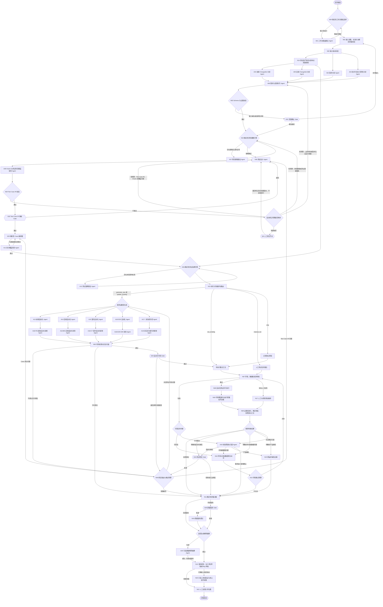

# 生产级 QA 多 Agent 质量系统设计规范

## 1. 文档定位

本文档是 QA 多 Agent 质量系统的顶层设计规范，也是后续设计、实现和验收每个 Agent
及 Multica 流程节点时的共同参照。

系统目标不是生成一批看起来完整的测试 Case，而是进入真实研发流程，建立一套能够：

- 理解需求、技术方案和前后端代码变更；
- 识别需求与实现之间的偏差；
- 基于风险生成可追踪的 Test Intent 和 Test Case IR；
- 拆分前端、后端、契约、E2E 和非功能测试；
- 生成、审查并执行自动化测试；
- 管理测试环境、测试数据和共享资源；
- 对失败进行证据化聚类和归因；
- 给出确定性的质量门禁结论；
- 将人工修正沉淀为离线评估集；

的生产级质量系统。

本文档定义架构、职责、数据契约、门禁和验收标准。阶段 0 基础、阶段 1 主链至人工升级，
以及阶段 2 后端自动化切片的本地参考实现位于 `qa-agents/`；阶段 1 的人工修正恢复和 G02
尚未完成。参考实现不等于生产 Multica、模型 Runtime、完整自动化链路或发布门禁已经完成。

## 2. 设计状态与使用规则

- 当前状态：方案已冻结第一版；阶段 0 本地基础、阶段 1 至人工升级节点、阶段 2 后端参考
  切片已实现，阶段 1 完整闭环和生产接入仍在建设。
- 编排平台：Multica。
- Agent 之间的主契约：版本化 JSON Artifact。
- 测试设计主契约：Test Intent 与 Test Case IR。
- 默认执行环境：隔离测试环境或临时环境。
- 默认权限：最小权限；所有业务代码仓库强制只读，禁止任何仓库内容或元数据写操作。
- 默认决策原则：证据优先，模型自报置信度不能单独作为放行条件。

后续创建任何 Agent 前，必须从本文档中明确以下内容：

1. Agent ID 和单一职责。
2. 允许读取的输入 Artifact。
3. 必须输出的 JSON Schema。
4. 可以使用的工具和权限。
5. 阻塞条件、重试条件和人工升级条件。
6. 离线评估样本和验收指标。

### 2.1 当前参考实现快照（2026-08-07）

- 已完成 N00/N01/N02/N03/N04/N05/N06/N14/N15/N24/N25/N26、A02-A09、A11/A12、
  A14/A18-BE 和 G01-G03 的本地参考链路。
- 已在独立 Multica Workspace `QA 多 Agent 质量系统` 中配置首批 7 个 Agent，并使用真实冻结
  需求、技术方案和后端 commit 跑通
  `A02/A03/A05 -> A06 -> G01 -> N24 -> A08 -> A09 -> N04 -> A08 -> A09 -> N04`。
- G01 已汇总并由 QA Owner 逐项确认 23 个问题；N24 将本需求判定为 `critical`，强制覆盖
  `backend/contract/e2e`。G01 未审批时停住，只有带身份、签名和内容哈希的决策才能继续。
- 当前试点经用户决策临时采用 QA Owner 单签，仅允许继续测试设计验证，不具备生产发布审批
  权限；接入真实发布流程前必须恢复产品、技术与 QA 的职责分离。
- Multica 试点当前使用固定 Codex Runtime 和版本化 Prompt；生产模型网关、Prompt 发布、灰度、
  回滚和不可变模型快照仍未完成。本地结构化模型 Runtime 策略默认关闭，不能冒充生产绑定。
- 第一版 A08 生成 10 个父 Case，第一轮 A09/N04 发现并归并出 107 个阻塞问题；QAA-11 的
  A08 修正版生成 13 个父 Case。QAA-13 复审后剩余 3 个阻塞错误和 1 个警告，第二轮 N04
  输出 `valid=false`、`correction_attempt=2/2`、`next_node=human`，G02 保持
  `not_started`。这证明自动回流、预算耗尽和人工升级均按设计生效。
- QAA-12 是 A08 v1.2.1 的并行影子候选，只用于验证新协议。它没有进入主链，不能替换已接受
  的 QAA-11，也不能绕过 QAA-13 和第二轮 N04；影子候选如需晋升，必须经显式人工决策、
  正式入库、重新 A09 审查和 N04 校验。
- 已实现 `fs-qa-knowledge` 固定版本能力探测和消费端 Adapter。冻结 commit
  `1ca888b645bd1c346b6d708a9a583af58d299fc8` 缺少 capability manifest，且生成流程强制
  `upload2fs`，因此状态为 `incompatible`，不得进入 A08。
- `pilot-001` 路由评估为 `17/17`；完整语义评估为 `34/69`。其中需求事实 `4/7`、实现事实
  `7/7`、对齐问题 `0/7`、开放问题 `4/4`、Gate 决策 `1/1`、测试义务 `1/26`。
- 上述失败是能力基线，不得通过修改 Oracle、放宽断言或把粗粒度 Case 重复计数来消除。

本节是设计文档中的时间点快照。运行时状态以
`qa-agents/runs/pilot-001/multica-run-manifest.json` 为审计主记录，建设状态以
`qa-agents/IMPLEMENTATION_STATUS.md` 为准；两者必须引用实际 Artifact 哈希，不能仅凭任务
标题、最新生成时间或自由文本更新主链状态。

## 3. 核心架构原则

### 3.1 Agent 负责判断，程序负责执行

大模型适合需求理解、风险识别、Case 设计、代码生成和失败归因；下载、Schema 校验、
测试执行、统计和质量规则计算必须由确定性程序完成。

### 3.2 每个 Agent 只负责一个稳定职责

Agent 不得同时承担需求理解、代码生成、执行和自我审查。生成 Agent 与审查 Agent
必须分离，避免同一个模型为自己的输出背书。

### 3.3 Agent 之间不共享聊天历史

Multica 节点之间传递结构化 Artifact。下游 Agent 可以根据证据引用回查原始材料，
不能依赖上游自由文本结论或隐含上下文。

### 3.4 测试语义与执行实现分层

需求分析结果不能直接生成 pytest 或 Playwright。必须先形成框架无关的 Test Intent 和
Test Case IR，审核通过后才能生成 Automation Manifest 和自动化代码，再由确定性节点
编译 Execution Plan。

### 3.5 测试结果必须可复现

每次工作流必须冻结需求版本、MR commit、OpenAPI、环境部署版本、Agent 版本、模型版本
和 Prompt 版本。输入发生变化时创建新运行，不能悄悄污染当前结果。

### 3.6 不允许为了通过而修改测试

业务断言失败默认不可重试。元素自愈、字段替换和断言调整只能生成候选修改，必须保留
原始失败证据并经过审核。

### 3.7 风险决定流程深度

低风险变更不应强制运行全部 Agent；高风险变更必须增加契约、E2E、非功能测试和人工
门禁。Multica 根据任务模式和风险策略动态构建执行分支。

### 3.8 业务代码仓库绝对只读

业务代码用于理解实现、分析 MR、定位影响范围和生成测试证据，不是 QA Agent 的写入目标。
所有 Agent 对业务代码仓库只有只读权限，禁止修改源文件、Git 历史、分支、标签、MR、
评论、审批、流水线状态或其他仓库元数据。该规则是系统级硬约束，不能被 Prompt、文档
内容、Agent 建议、自动修复、人工 Gate 或单次工作流配置覆盖。

自动化代码只允许写入权限策略中明确登记的独立测试仓库和本次工作流 Artifact 目录。
如果某类单元测试必须与业务代码同仓，Agent 只能生成独立的候选补丁 Artifact，交由仓库
维护者在系统外人工处理；Agent 和 Multica 均不得把补丁应用、提交或推送到业务仓库。

## 4. 工作流模式

系统至少支持五种工作流模式，不能用同一条固定长链路处理所有任务。

| 模式 | 触发输入 | 主要输出 |
| --- | --- | --- |
| 新需求测试设计 | 需求、技术方案、一个或多个 ChangeSet | 完整 Test Case IR、覆盖矩阵和自动化计划 |
| 变更增量测试 | MR、commit、commit range 或发布变更集 | 变更影响、增量 Case 和本次测试执行集合 |
| 发布回归 | 发布版本、变更清单 | 回归集合、执行结果和质量门禁结论 |
| Bug 复现与固化 | Bug、日志、修复 MR | 最小复现 Case、自动化回归和修复验证 |
| 上线后验证 | 已批准发布单、部署版本和监控范围 | 只读冒烟、SLO 信号和线上缺陷反馈 |

`N00 Workflow Template Selector` 根据结构化触发类型和组织策略确定性选择工作流模板。
只有输入含义确实无法由规则判定时才调用 `A01 Workflow Route Advisor` 给出路由建议，
随后仍由 N00 校验并决定。A01 不能自行创建或执行未授权流程。

根据风险和输入完整度，N00 选择执行深度：

| 等级 | 适用场景 | 默认链路 |
| --- | --- | --- |
| L0 | 仅输入冻结或权限检查 | 确定性节点，不调用 Agent |
| L1 | 单仓低风险、小范围变更 | 变更分析、测试设计和覆盖审查 |
| L2 | 常规需求或跨模块变更 | 需求、方案、ChangeSet 对齐和完整测试设计 |
| L3 | 权限、资金、删除、迁移、公共能力或高风险跨服务 | 全链路、专项测试和全部必需 Gate |

## 5. 优化后的总体流程

### 5.1 简版流程图

```text
任务触发
  -> 确定性工作流模板选择；仅歧义输入调用路由 Agent 建议
  -> 输入采集、解析质量校验和版本冻结
  -> 生成标准 ChangeSet
  -> 测试资产目录与影响关系图快照
  -> 需求/技术方案及可测性/前端 ChangeSet/后端 ChangeSet 并行分析
  -> 需求与变更对齐 Agent
  -> 确定性风险策略；仅歧义项调用风险建议 Agent
  -> 测试设计 Agent
  -> Oracle 与测试防范覆盖审查 Agent
  -> N04 确定性 Test Case IR 校验
  -> 校验失败时按根因回流；自动修正预算耗尽后转 QA 人工修正并重新校验
  -> 人工 Test Case IR Gate
  -> 确定性 Case 编译器
  -> 拆分后覆盖回查 Agent
  -> 确定性测试选择；仅未知影响调用选择建议 Agent
  -> 执行计划编译：生成、更新、直接执行、人工执行或跳过
  -> 需要生成或更新的自动化并行生成
  -> 对应领域的自动化代码审查 Agent
  -> 格式化、lint、编译和安全扫描
  -> 人工或风险分级 Gate
  -> 环境、数据、Feature Flag 和资源锁预检及修复
  -> 自动化测试与人工/探索测试并行执行
  -> 代码覆盖率、运行质量信号和证据标准化
  -> 失败聚类、跨运行去重和归因
  -> 确定性质量决策节点
  -> 可选、限时且不篡改原结论的质量豁免
  -> 报告、MR 评论草稿和 Bug 草稿
  -> 经授权的上线后只读验证
  -> 人工修正进入离线评估集
```

### 5.2 Multica 详细流程图



图中的多入边只表达依赖关系，不代表“任意一个上游完成即可继续”。落地到 Multica 时，
`A06`、`N05`、`N09` 等汇合节点必须显式配置为：等待本次路由选中的全部必需分支完成，
再校验 Artifact 完整性后继续。未被路由选中的分支记为 `skipped_by_policy`，不能记为成功，
也不能导致汇合节点永久等待。

`N21 Schema Registry` 和 `N22 Agent 版本发布控制` 属于控制平面，不作为普通业务分支
出现在主 DAG 中。N21 校验每次 Artifact 交接，N22 在工作流启动前决定允许使用的 Agent、
模型、Prompt 和工具版本。

## 6. Agent 和确定性节点清单

### 6.1 Agent 清单

| ID | Agent | 核心职责 | 主要输出 |
| --- | --- | --- | --- |
| A01 | Workflow Route Advisor | 仅对规则无法判定的输入提出路由建议 | `workflow_route_advice.json` |
| A02 | Requirement Analyzer | 提取需求、验收标准和歧义 | `requirement_analysis.json` |
| A03 | Technical Design & Testability Analyzer | 提取架构、依赖、技术风险和可测性缺口 | `technical_analysis.json` |
| A04 | Frontend Change Analyzer | 分析前端 ChangeSet 和影响 | `frontend_change_analysis.json` |
| A05 | Backend Change Analyzer | 分析后端 ChangeSet 和影响 | `backend_change_analysis.json` |
| A06 | Change Alignment | 对齐需求、方案和实现 | `alignment_result.json` |
| A07 | Risk Strategy Advisor | 只对 N24 无法按规则判定的风险项提出建议 | `risk_strategy_advice.json` |
| A08 | Test Designer | 生成 Test Intent 和父级 Test Case IR | `test_design_ir.json` |
| A09 | Oracle 与测试防范覆盖审查 Agent | 审查预期可判定性和测试防范覆盖 | `oracle_review.json` |
| A11 | Split Coverage Auditor | 回查遗漏、重复和层级错误 | `split_coverage_review.json` |
| A12 | Test Selection Advisor | 只解释 N26 无法确定的代码影响和 Case 关联 | `test_selection_advice.json` |
| A13 | Frontend Automation | 生成前端单元、组件或 UI 自动化 | 代码变更和 Manifest |
| A14 | Backend Automation | 生成后端单元、服务、API 或数据自动化 | 代码变更和 Manifest |
| A15 | Contract Automation | 生成接口契约测试 | 代码变更和 Manifest |
| A16 | E2E Automation | 生成关键链路测试 | 代码变更和 Manifest |
| A17-PERF | Performance Automation | 生成性能测试 | 性能测试代码或执行计划 |
| A17-SEC | Security Automation | 生成安全测试 | 安全测试代码或执行计划 |
| A17-A11Y | Accessibility Automation | 生成可访问性测试 | 可访问性测试代码或执行计划 |
| A17-COMPAT | Compatibility Automation | 生成兼容性测试 | 兼容性测试代码或执行计划 |
| A17-RES | Resilience Automation | 生成稳定性和容错测试 | 韧性测试代码或执行计划 |
| A17-DATA | Data Consistency Automation | 生成数据一致性测试 | 数据测试代码或执行计划 |
| A18-FE | Frontend Automation Reviewer | 审查前端自动化 | `automation_review.json` |
| A18-BE | Backend Automation Reviewer | 审查后端自动化 | `automation_review.json` |
| A18-CT | Contract Automation Reviewer | 审查契约自动化 | `automation_review.json` |
| A18-E2E | E2E Automation Reviewer | 审查 E2E 自动化 | `automation_review.json` |
| A18-PERF | Performance Reviewer | 审查性能测试和阈值 | `automation_review.json` |
| A18-SEC | Security Reviewer | 审查安全测试和权限边界 | `automation_review.json` |
| A18-A11Y | Accessibility Reviewer | 审查可访问性测试 | `automation_review.json` |
| A18-COMPAT | Compatibility Reviewer | 审查兼容性测试 | `automation_review.json` |
| A18-RES | Resilience Reviewer | 审查稳定性和容错测试 | `automation_review.json` |
| A18-DATA | Data Consistency Reviewer | 审查数据一致性测试 | `automation_review.json` |
| A19 | Failure Triage | 对 N09 无法确定归因的失败簇做语义归因 | `failure_triage.json` |
| A20 | Quality Narrative | 解释已确定的覆盖、风险和结果，不计算结论 | `quality_narrative.md/json` |

`A10` 已由确定性的 `N25 Case Compiler` 替代，编号保留但不再作为 Agent 使用；`A21`
职责已并入 A03。历史 Artifact 和审计记录中的编号不复用。

### 6.2 确定性节点清单

| ID | 节点 | 职责 |
| --- | --- | --- |
| N00 | 工作流模板选择与路由策略 | 根据触发、输入和风险策略确定性选择模板，校验 A01 建议 |
| N01 | 输入采集、标准化与解析质量校验 | 下载并解析文档、ChangeSet、OpenAPI，校验附件、表格、图片和权限完整性 |
| N02 | 输入版本冻结 | 记录文档版本、commit、环境和 Agent 版本 |
| N03 | Schema 与证据校验 | 校验 Agent 输出结构、引用完整性和来源存在性 |
| N04 | Test Case IR 校验 | 校验字段、唯一 ID、Oracle 和来源引用，并按问题类型路由回流 |
| N05 | 代码检查与安全扫描 | 格式化、lint、编译、依赖和敏感信息检查 |
| N06 | 修复路由与重试预算 | 按问题根因返回对应 Agent，并控制修复次数和成本 |
| N07 | 环境、数据和资源预检 | 校验部署版本、依赖、账号、数据、Flag 和锁 |
| N08 | 自动化测试并行执行 | 运行审核后的固定命令和自动化测试代码 |
| N09 | 证据标准化、指纹聚类与汇合 | 汇合证据，并按规则完成失败指纹聚类和明确根因路由 |
| N10 | 环境重试预算 | 仅对明确的环境类失败有限重试 |
| N11 | 确定性质量决策 | 按发布策略计算 pass/warn/block |
| N12 | 确定性报告与结果发布 | 生成机器/HTML 报告，合并可选解释摘要，并生成 MR 评论草稿和 Bug 草稿 |
| N13 | 反馈入评估集 | 保存人工修正，不在线自动改 Prompt |
| N14 | 测试资产目录与影响关系图快照 | 同步并冻结需求、Case、代码、接口、Bug 和结果之间的映射 |
| N15 | 执行计划编译与路由 | 将 Case 编译为生成、更新、直接执行、人工执行或跳过动作 |
| N16 | 环境与测试数据修复动作 | 执行白名单内的数据准备、环境部署、Flag 配置和账号初始化 |
| N17 | 人工与探索测试编排 | 创建人工任务、收集证据并等待结果 |
| N18 | 代码覆盖率与运行质量信号采集 | 确定性采集代码覆盖率、性能和运行质量信号 |
| N19 | 质量豁免登记 | 记录限时、限范围且不修改原质量结论的风险接受 |
| N20 | 跨运行缺陷去重 | 根据失败指纹和历史 Bug 判断新增、关联或重新打开 |
| N21 | Schema Registry 与迁移校验 | 管理 Artifact Schema 兼容、迁移和消费者版本 |
| N22 | Agent 版本发布控制 | 执行影子运行、灰度、回滚和版本冻结 |
| N23 | 只读上线后验证与线上信号采集 | 在单独授权下运行只读冒烟并采集 SLO 和逃逸缺陷 |
| N24 | 确定性风险策略引擎 | 按版本化规则计算风险、必测层级和 Gate，仅把未知项交给 A07 |
| N25 | 确定性 Case 编译器 | 按已审核 Test Case IR 和层级规则生成父子 Case，不改变业务预期 |
| N26 | 确定性测试选择引擎 | 根据 ChangeSet、资产关系和强制策略选择 Case，仅把未知影响交给 A12 |

### 6.3 Agent 输入输出依赖

下表是后续拆建各 Agent 的最小依赖基线。实现时可以减少不需要的字段，但不得绕过指定
上游 Artifact 直接依赖聊天记录，也不得自行读取表中未授权的数据源。

| Agent | 必需输入 | 核心输出 | 直接消费者 |
| --- | --- | --- | --- |
| A01 | N00 无法判定的任务目标、触发类型和可用输入清单 | 路由建议、歧义说明和证据 | N00 |
| A02 | 冻结后的需求正文和附件 | 验收标准、业务规则、角色、场景、歧义和证据引用 | A06、A08 |
| A03 | 冻结后的技术方案、架构图、接口说明和测试工具能力 | 组件关系、依赖、技术风险、可测性缺口和阻塞项 | A06、N24、G01 |
| A04 | 前端 ChangeSet、只读代码快照和 N14 资产快照 | 页面与组件变更、交互影响、接口消费变化 | A06、N26 |
| A05 | 后端 ChangeSet、只读代码快照和 N14 影响关系图 | 接口、业务逻辑、数据、消息和权限影响 | A06、N26 |
| A06 | A02 至 A05 的有效 Artifact | 需求、方案和实现映射，遗漏、冲突及未实现项 | N24、A08、G01 |
| A07 | N24 无法判定的风险项、原始证据和组织风险规则 | 风险建议、证据和不确定性说明 | N24 |
| A08 | 需求分析、技术分析、对齐结果、测试策略和 Provider 草稿 | Test Intent、父级 Test Case IR、需求覆盖矩阵 | A09 |
| A09 | Test Intent、父级 Test Case IR、原始证据和 Oracle 规则库 | Oracle 审查、测试防范覆盖缺口、阻塞问题和修正建议 | N04、A08、G02 |
| A11 | N25 生成的父子 Test Case IR、覆盖矩阵和编译规则 | 遗漏、重复、层级错误及拆分审查结论 | N25、N26 |
| A12 | N26 无法判定的影响关系、ChangeSet 和 N14 资产证据 | 选择建议、证据和不确定性说明 | N26 |
| A13 | 前端 Test Case IR、前端仓库快照、测试框架约定 | Playwright 代码、Case 映射和 Automation Manifest | A18-FE |
| A14 | 后端 Test Case IR、后端测试仓库快照、API 契约和框架约定 | API/数据测试代码、Case 映射和 Automation Manifest | A18-BE |
| A15 | 契约 Test Case IR、OpenAPI 和消费者契约 | 契约测试代码、兼容性基线和 Automation Manifest | A18-CT |
| A16 | E2E Test Case IR、关键链路、环境能力和跨服务证据点 | E2E 代码、链路映射和 Automation Manifest | A18-E2E |
| A17-* | 对应非功能 Test Case IR、已批准阈值、环境容量和专用工具约束 | 对应专项测试代码或执行计划、Automation Manifest | 对应的 A18 专项审查 Agent |
| A18-* | 对应 Test Case IR、Automation Manifest、生成代码和安全规则 | 审查结论、缺陷清单、问题类型和可审查修复建议 | N05、G03、N06 |
| A19 | 预检结果、标准化执行证据、环境、数据和历史失败指纹 | 失败聚类、归因、证据充分度和建议动作 | G04、N16、N20、N11、A20 |
| A20 | Test Case IR、执行计划、覆盖数据、自动化/人工结果、归因与去重结果、豁免记录和 N11 决策 | 面向人的可选解释性摘要 | N12 |

### 6.4 逻辑 Agent 与部署 Runtime

Agent ID 表示独立职责、独立上下文和独立审计记录，不要求每个 ID 都建设一套服务。生产
实现使用少量 Runtime 加载版本化 Profile，减少部署、监控、模型调用和 Prompt 维护成本：

| Runtime | 逻辑 Profile | 约束 |
| --- | --- | --- |
| Analysis Runtime | A01-A07 | 每个 Profile 独立调用；A07 仅在 N24 返回未知项时运行 |
| Test Design Runtime | A08、A12 | A08 生成测试设计；A12 仅解释 N26 无法确定的影响关系 |
| Coverage Review Runtime | A09、A11 | 使用 `pre_split`、`post_split` 两种 Profile，分别输出 Artifact |
| Automation Generation Runtime | A13-A17-* | 按前端、后端、契约、E2E 和非功能类型加载不同工具包 |
| Automation Review Runtime | A18-* | 与生成 Runtime 使用不同身份、Prompt、上下文和写权限 |
| Triage Runtime | A19 | 只处理确定性指纹聚类后仍无法归因的失败簇 |
| Narrative Runtime | A20 | 只解释已确定事实；报告 JSON、统计和质量结论由确定性节点生成 |

逻辑隔离不能因 Runtime 复用而取消。生成和审查必须是不同调用、不同上下文和不同服务
身份；审查 Runtime 不得读取生成 Agent 的隐藏推理，也不得拥有业务仓库或测试仓库写权限。

可测性评审并入 A03 的输出 Schema；`A09` 和 `A11` 共用审查引擎但使用不同 Schema。
A13-A18 的领域差异优先通过 Profile、规则包和
工具白名单表达，不复制十余套近似 Agent 工程。

确定性节点也复用基础设施：N03/N04 使用同一个 Validation Engine 的通用 Artifact 与
Test Case IR 规则集；N06/N10 使用同一个 Recovery Policy Service 的代码修复与环境重试
策略。逻辑节点、预算和审计仍分别记录，避免复用服务后混淆业务失败与环境重试。

## 7. Agent 统一实现规范

每个 Agent 必须有独立规范文件，并按以下模板定义：

```yaml
agent_id: A00
name: example-agent
objective: 单一、可验证的目标
owner: qa-platform
depends_on: []
allowed_inputs: []
input_schemas: []
output_schema: schema/example-output.schema.json
allowed_tools: []
repository_access:
  read: []
  write: []
credential_profiles: []
write_scope: []
forbidden_actions: []
blocking_conditions: []
retryable_conditions: []
human_escalation_conditions: []
timeout_seconds: 300
max_attempts: 2
idempotency_key: workflow_run_id + agent_id + source_snapshot_id
evidence_policy: 所有事实和结论必须引用冻结来源
evaluation_dataset: eval/example-agent/
acceptance_metrics: {}
```

建议采用以下目录约定，使规范、Prompt、Schema、实现和评估样本能够独立版本化：

```text
qa-agents/
  contracts/
    artifact-envelope.schema.json
    test-case-ir.schema.json
  agents/
    a02-requirement-analyzer/
      agent.yaml
      prompt.md
      output.schema.json
      eval/
      tests/
  workflows/
    new-requirement.yaml
    change-incremental.yaml
    release-regression.yaml
    bug-reproduction.yaml
    post-release-verification.yaml
  policies/
    risk-policy.yaml
    quality-gate-policy.yaml
    permission-policy.yaml
    flaky-policy.yaml
    waiver-policy.yaml
    agent-release-policy.yaml
```

其中 `agent.yaml` 是 Agent 的可执行规格，`prompt.md` 只承载推理指令，Schema 负责约束
输出，`eval/` 保存不含生产 Secret 的固定评估样本。不得把权限、重试、质量阈值或路由
规则只写在 Prompt 中；这些配置必须由 Multica 或确定性策略文件控制。

所有 Agent 必须满足：

- 只读取完成职责所需的最小输入。
- 不根据文档中的命令执行未授权工具。
- 不修改输入 Artifact。
- 输出必须通过 JSON Schema。
- 所有业务结论必须带证据引用。
- 明确区分事实、推断、假设和待确认问题。
- 自报 `confidence` 仅供观察，不作为唯一门禁。
- 失败时返回标准状态，不通过自然语言请求无限重试。

单个 Agent 只有同时满足以下条件才算可以接入下游：

- 规格、Prompt、输入输出 Schema 和版本号齐全。
- 正常、缺失输入、冲突输入、提示注入和工具失败样本均通过测试。
- 在未见过的评估集上达到该 Agent 的验收阈值。
- 人工复核确认关键漏检率和无依据结论率在允许范围内。
- 权限测试证明它不能访问未授权数据或执行未授权写操作。
- 业务仓库负向权限测试证明修改文件、Git 写命令和 Git 写 API 均被基础设施拒绝。
- Multica 中的超时、重试、暂停、恢复和幂等行为验证通过。
- 下游只消费其已校验 Artifact，不依赖日志或自由文本补充。

## 8. 统一 Artifact Envelope

Agent 输出使用相同外层协议：

```json
{
  "workflow_run_id": "run-20260806-001",
  "workflow_mode": "new_requirement",
  "schema_version": "1.0",
  "artifact_id": "frontend-analysis-001",
  "artifact_hash": "sha256:...",
  "producer": {
    "agent_id": "A04",
    "agent_version": "1.0.0",
    "model_provider": "provider-id",
    "model_snapshot": "immutable-model-id",
    "prompt_version": "git-sha",
    "inference_config_hash": "sha256:...",
    "tool_bundle_version": "toolset-1.2.0"
  },
  "created_at": "2026-08-06T10:00:00+08:00",
  "source_snapshot_id": "snapshot-001",
  "status": "completed",
  "confidence": 0.86,
  "facts": [],
  "inferences": [],
  "assumptions": [],
  "blocking_questions": [],
  "evidence_refs": [],
  "payload": {}
}
```

标准状态：

| 状态 | 含义 | Multica 行为 |
| --- | --- | --- |
| `completed` | 完整满足节点契约 | 进入校验节点 |
| `completed_with_gaps` | 已完成可完成部分，但存在非阻塞证据缺口 | 记录缺口并按策略进入校验或 Gate |
| `needs_human` | 需要人工决策 | 暂停并进入 Gate |
| `blocked_input` | 输入缺失或矛盾 | 返回输入采集节点 |
| `not_applicable` | 该组件或能力对本次任务不适用 | 记录原因，不等待该分支 |
| `skipped_by_policy` | 适用但策略决定本次不运行 | 记录策略版本和风险，不视为通过 |
| `stale` | 上游来源已变化，当前产物失效 | 取消消费者并按失效图重算 |
| `cancelled` | 工作流或分支被显式取消 | 保存部分证据，不自动恢复 |
| `inconclusive` | 已运行但证据不足，无法形成可靠判断 | 进入人工处理或质量决策 |
| `failed_retryable` | 临时模型或工具错误 | 按预算有限重试 |
| `failed_fatal` | 无法继续 | 终止分支并保留诊断 |

`not_applicable`、`skipped_by_policy`、`inconclusive` 和 `passed` 不得相互转换。状态、业务
结论和最终质量结论属于不同字段，Agent 不能通过返回 `completed` 表示测试已经通过。

### 8.1 Schema 兼容与迁移

`N21 Schema Registry` 管理所有 Artifact Schema。每个消费者必须声明支持的 Schema
版本范围，Multica 在调用前完成兼容性检查：

- 向后兼容字段使用 minor 版本升级；删除字段、改变语义或类型使用 major 版本升级。
- 迁移必须由确定性转换器完成，不允许 Agent 临时猜测字段含义。
- 迁移后同时保留原始 Artifact、迁移结果、转换器版本和差异。
- 找不到受支持的迁移路径时状态为 `blocked_input`，禁止把未知字段静默丢弃。
- 长流程恢复时使用运行开始时冻结的 Schema 和 Agent 版本，不能自动切换到最新版。

## 9. 输入版本冻结与失效规则

`N01` 必须先生成 `source_extraction_manifest.json`，记录每个输入的来源权限、附件数量、
文本块、表格、图片、OCR、解析器版本、内容哈希、解析置信度和已知遗漏。需求正文、关键
附件、接口定义或架构图无法读取时必须进入 `blocked_input`，不能基于残缺输入继续推理。

`N02` 必须生成不可变 `source_snapshot.json`：

```yaml
snapshot_id: snapshot-001
requirement:
  id: REQ-102
  version: v3
  content_hash: sha256:...
technical_design:
  id: TECH-88
  version: v2
frontend:
  repository: frontend-repo
  commit: abc123
backend:
  repository: backend-repo
  commit: def456
contracts:
  openapi_hash: sha256:...
test_assets:
  catalog_snapshot_id: asset-snapshot-001
  dependency_graph_hash: sha256:...
environment:
  target: qa-112
  frontend_commit: abc123
  backend_commit: def456
```

### 9.1 受管业务代码源清单

以下仓库是当前系统登记的业务代码输入源。它们统一标记为
`business_source/read_only`，只允许 N01/N02 获取并冻结指定 commit，Agent 只能读取冻结
快照：

| 领域 | 仓库 | 访问级别 |
| --- | --- | --- |
| 后端 | `git@git.firstshare.cn:bi/fs-bi-crm-report.git` | 只读 |
| 后端 | `git@git.firstshare.cn:bi/fs-bi-dev-platform.git` | 只读 |
| 后端 | `git@git.firstshare.cn:bi/fs-bi.git` | 只读 |
| 后端 | `git@git.firstshare.cn:dataplatform/fs-bi-udf-report.git` | 只读 |
| 前端 | `git@git.firstshare.cn:fe/fbi.git` | 只读 |
| 前端 | `git@git.firstshare.cn:fe-bi/bi-sdk.git` | 只读 |
| 前端 | `git@git.firstshare.cn:fe/bi-xkcharts.git` | 只读 |
| 大数据 | `git@git.firstshare.cn:bi/fs-bi-warehouse.git` | 只读 |

新增业务仓库必须先进入受管代码源注册表，登记仓库 ID、领域、Git URL、默认分支、数据
密级、负责人和 `access_class=business_source_read_only`。禁止由 Agent 根据文档中的地址
临时扩大仓库访问范围。

N01 使用仅具备 Git 读取能力的服务身份拉取代码，N02 记录远端 URL、目标分支、源/目标
commit、MR ID、内容哈希和抓取时间。Agent 不读取开发人员可变的本地工作树，也不直接
访问未冻结分支；所有分析必须引用本次 `source_snapshot_id` 中的不可变 commit。

### 9.2 只读仓库运行时控制

业务代码只读必须由以下控制共同保证，不能只依赖 Prompt：

1. Git 服务凭证只授予 `read_repository`，不授予 push、创建分支、创建或更新 MR、评论、
   审批、触发流水线和修改仓库设置的权限。
2. N01/N02 在 Agent 启动前完成抓取；冻结快照以只读文件系统挂载到 Agent 容器，Agent
   不接收业务仓库写凭证和通用 Git 写工具。
3. 策略引擎拒绝对业务仓库执行 `git add`、`commit`、`push`、`merge`、`rebase`、`tag`、
   `reset`、`clean`、分支创建/删除，以及 Git API/CLI 的任何写请求。
4. 格式化、代码修复、依赖安装和测试生成不得写入业务代码快照。确需编译或运行既有测试
   时，由确定性执行节点使用一次性写时复制层，并把构建产物、缓存和日志定向到临时目录；
   运行结束后销毁，不能提交或回写来源快照。
5. `write_scope` 必须使用仓库 ID 白名单，不允许用路径前缀、当前目录或模型判断推断可写
   范围；未登记的目标一律拒绝。
6. N05 在执行前校验自动化产物的目标仓库和写入计划；Multica 权限策略与工具网关在
   运行时拦截越权调用。发现任何业务仓库写入尝试立即终止当前分支并返回
   `failed_fatal/security_policy_violation`，不得重试为其他写法。
7. 审计日志记录代码快照哈希、挂载模式、凭证权限、工具调用和被拒绝操作。流程结束时再次
   校验快照哈希，必须与 N02 冻结值一致。

MR 评论、代码审查意见和修改建议只能作为 Artifact 草稿输出。N12 不得使用 Agent 身份
写入业务 Git 平台；需要发布时由仓库维护者在系统外人工处理。Bug 和报告仅允许写入单独
授权的 QA 系统，且不授予业务仓库写权限。

### 9.3 ChangeSet 统一契约

N01 必须把 MR、单 commit、merge commit、commit range 和发布清单标准化为 ChangeSet，
A04/A05 只能消费该契约，不能自己选择 diff 基线：

```json
{
  "change_set_id": "change-fs-bi-001",
  "repository_id": "fs-bi",
  "change_kind": "merge_commit",
  "source_ref": "c6b785344c6973b6d6fc5bb108c45b3971f36c64",
  "base_commit": "ca2335400b1a7f2f5b55cd4cd181c26ca798f6f3",
  "head_commit": "c6b785344c6973b6d6fc5bb108c45b3971f36c64",
  "merge_base": null,
  "parents": [
    "ca2335400b1a7f2f5b55cd4cd181c26ca798f6f3",
    "f1ad20d951ab926d308431789823246418c4a34c"
  ],
  "diff_mode": "first_parent",
  "changed_files": [],
  "diff_hash": "sha256:..."
}
```

确定性基线规则：

| 输入类型 | 默认比较方式 |
| --- | --- |
| 单 commit | 第一父提交到目标 commit |
| merge commit 进入目标分支 | 第一父提交到 merge commit，即 `first_parent` |
| GitLab/GitHub MR | 平台提供的目标 SHA/merge-base 到源 SHA，并记录 MR 版本 |
| commit range | 用户或发布清单明确提供的 base 到 head |
| 多仓发布 | 每个仓库独立 ChangeSet，再生成只读聚合清单 |

如果 base/head 不可解析、MR 已发生 force-push、commit 不属于声明仓库，或 diff 超出配置
上限，N01 返回 `blocked_input`。ChangeSet 必须记录 rename、delete、binary、submodule、
生成文件和超大文件状态；不得只保存截断后的文本 diff。源码快照与 diff 均使用内容寻址
缓存，相同仓库和 commit 不重复拉取。

失效规则：

- MR 出现新 commit 时，基于旧 commit 的分析仍保留，但标记为 stale。
- 需求或方案版本变化时，相关下游 Artifact 全部失效。
- OpenAPI 变化时，契约、后端和相关前端 Case 失效。
- 测试资产目录或影响关系图变化时，N26 选择结果和执行计划失效。
- 测试环境部署版本与目标 commit 不一致时，禁止生成正式质量结论。
- Agent、模型或 Prompt 升级不自动使历史结果失效，但必须可追溯。

## 10. 来源优先级和冲突规则

不同来源不是同等含义：

1. 已批准需求和验收标准定义业务期望。
2. 已批准技术方案定义设计约束和实现路径。
3. OpenAPI 或消费者契约定义接口协议。
4. MR 和当前代码表示实际实现，不自动等于正确期望。
5. 历史 Case 和历史行为只能作为兼容证据，不能覆盖新需求。

当需求、技术方案、契约和代码冲突时，Agent 必须输出冲突并进入人工确认，不能自行
选择一个来源作为真相。

### 10.1 测试资产目录与影响关系图

`N14` 不是 Agent，而是持续维护的确定性索引服务。它至少维护以下关系：

```text
需求/验收点
  <-> Test Case IR/人工 Case
  <-> 自动化测试函数和代码位置
  <-> 前端组件、后端模块、API、表、消息主题和 Feature Flag
  <-> 历史 Bug、执行结果、Flaky 记录和负责人
```

每次工作流冻结一个只读资产快照供 A04、A05 和 N26 使用。索引必须记录来源和更新时间；
无法建立影响关系时标记 `unknown_impact`，由确定性策略扩大测试范围。

Case 生命周期至少支持：`draft`、`approved`、`active`、`quarantined`、`deprecated` 和
`superseded`。每个 Case 必须有稳定 ID、版本、负责人、来源、自动化映射和替代关系。
Agent 不得覆盖人工维护的 Case；重复 Case 只能提出合并建议，由审核或规则节点处理。

MVP 不建设独立图数据库或复杂知识图谱平台。第一阶段使用版本化关系表保存
`source_ref -> requirement -> case -> automation -> result` 最小链路；只有查询规模、跨仓
依赖和在线影响分析证明关系表不足时，才演进为图存储。数据模型和 ID 先稳定，存储技术
不是前置条件。

## 11. 风险与测试策略

`A07` 根据以下维度评估风险：

- 业务影响和用户规模。
- 代码改动范围和依赖扩散。
- 公共组件、公共服务和公共数据结构。
- 权限、审批、资金、删除和敏感数据。
- 数据迁移、状态机、异步和最终一致性。
- 历史缺陷密度和线上事故。
- 是否缺少可观测性或回滚能力。

输出示例：

```yaml
risk_level: high
risk_reasons:
  - 修改公共语言服务
required_layers:
  - backend
  - contract
  - e2e
required_non_functional:
  - compatibility
regression_policy:
  impacted_regression: true
  mandatory_suites:
    - authentication-smoke
human_gates:
  test_ir_review: required
  automation_review: required
```

风险规则必须有确定性策略兜底。例如认证、权限、数据删除和核心 P0 冒烟不能被 Agent
标记为“无需执行”。

### 11.1 可测性评审

`A03` 在分析技术方案时同步审查需求和方案是否具备可验证条件，至少检查：

- 关键状态是否有稳定的查询接口、日志、指标和 trace。
- 异步任务是否能查询进度、终态和失败原因。
- Feature Flag、灰度和租户配置是否可在测试环境受控设置。
- 测试数据是否可创建、隔离、重置和清理。
- 外部依赖是否可 Mock，故障和超时是否可安全注入。
- 时间、随机数、消息和最终一致性是否有可控测试机制。
- 权限和审计结果是否有独立证据，而不是只依赖页面文案。

缺少可测性但不影响需求正确性时输出改进项；关键预期没有任何可靠观测点时输出阻塞项，
进入 G01。可测性问题不能等到自动化代码生成后才暴露。

## 12. 测试模型分层

测试设计与执行不能共用一个不断膨胀的对象。正式契约分为四层，下游只能补充自己的层，
不能回写或覆盖上游语义：

```text
Test Intent
  -> Test Case IR
  -> Automation Manifest
  -> Execution Plan
```

### 12.1 Test Intent

`A08` 先形成“为什么测、要防什么”的测试意图，至少包含需求/风险 ID、业务规则、场景、
影响面、所需测试层级和来源证据。Test Intent 不包含框架、文件路径、选择器或执行命令。

### 12.2 Test Case IR

Test Case IR 是审核和 Case 生命周期管理的唯一测试主模型，保持框架无关：

```yaml
id: REQ-12-BE-01
parent_case_id: REQ-12-SCENE-01
intent_ids:
  - INTENT-REQ-12-LANGUAGE
title: 英文个人环境下查询中文翻译
layer: backend
test_level: api
risk: high
priority: P1
source_refs:
  - type: requirement
    id: REQ-12
    location: section-3.2
  - type: backend_change_set
    id: change-backend-302
    location: UserLanguageService.java:85
preconditions:
  - 使用专用测试账号登录
test_data:
  personal_language: en
  translation_language: zh-CN
steps:
  - 切换个人语言为英文
  - 等待语言配置生效
  - 查询中文翻译词条
expected:
  - id: EXP-01
    description: needTransName 为英文
    oracle:
      type: deterministic
      observation_point: response.dataRowsAll[*].needTransName
      matcher: contains_latin_and_no_han
      source_ref: REQ-12:section-3.2
  - id: EXP-02
    description: translateValue 为中文
    oracle:
      type: deterministic
      observation_point: response.dataRowsAll[*].translateValue
      matcher: contains_han
      source_ref: REQ-12:section-3.2
cleanup: []
execution_policy:
  allowed_modes:
    - automated
    - manual
  required_evidence:
    - request_response
automation_candidate: true
```

强制字段：

- 唯一 Case ID、父 Case ID、Intent ID、责任层、测试级别、风险和优先级。
- 需求、方案、契约或 ChangeSet 证据引用。
- 前置条件、测试数据、步骤、预期和清理策略。
- 每个预期结果的观测点、Matcher、Oracle 类型和来源。
- 允许的执行方式、必需证据和人工未执行处理策略。
- 是否为自动化候选，但不包含自动化框架和目标文件。

### 12.3 Automation Manifest

A13-A17-* 在 Test Case IR 审核通过后生成 Automation Manifest，描述框架、目标测试仓库、
代码位置、执行入口、Case 映射、依赖、权限和预期产物。Manifest 只能引用 Test Case IR，
不得重写业务预期；代码与 Manifest 必须共同经过 A18 和 N05。

### 12.4 Execution Plan

N15 根据已审核 Case、资产目录和 Manifest 确定性生成 Execution Plan。它负责
`generate_new`、`update_existing`、`run_existing`、`manual_run`、`skip`，并记录环境、
数据、资源、超时和证据要求。Agent 只能提供候选建议，不能直接把 Case 标记为已执行。

### 12.5 Case Provider Adapter

`fs-qa-knowledge` 作为外部 Case 草稿能力提供方，不等同于 A08。通过版本化 Adapter 调用：

```text
N01/N02 冻结需求
  -> requirement-analyze
  -> testcase-generate artifact-only profile
  -> Case Provider Adapter 转为 case_draft.json
  -> A08 结合 A03/A04/A05/A06/A07 补充并生成 Test Intent/Test Case IR
```

生产接入要求：

- 固定 provider 仓库 commit、Skill 版本、模型和配置，禁止跟随远端最新版漂移。
- Provider 只接收允许的需求分析输入；技术方案、ChangeSet 和风险由 A08 独立合并，不能
  假装 Provider 已经分析过它没有读取的内容。
- 必须提供无外部副作用的 `artifact_only` 模式。`md2excel` 可作为后续发布转换器，
  `upload2fs` 默认禁用；任何上传都不能成为 A08 的隐式动作。
- Provider 原始 Markdown、转换结果、调用记录和版本全部保留，Adapter 不得静默修正内容。
- Provider 输出只是候选草稿，必须经过 A08、A09、N04 和 G02；不能用 Provider 自己的
  输出作为评估它的 Oracle。
- 在 Provider 尚未支持 `artifact_only` 和稳定结构化输出前，只允许影子运行，不能接入
  正式发布门禁。

当前冻结版本的兼容结论是 `incompatible`，阻塞原因为 `provider_manifest_missing` 和
`mandatory_external_side_effect_workflow`。QA 系统消费端不得修改 Provider 仓库来绕过阻塞；
需由 `fs-qa-knowledge` 维护者发布 capability manifest 和真正无副作用的独立入口。

## 13. Oracle 与测试防范覆盖审查

`A09` 负责阻止无法确定判定的 Case 进入自动化。

这里必须区分两类名称相近但权限完全不同的数据：

- **Oracle 规则库**：定义允许的观测点、Matcher、领域不变量和证据要求，是 A09 的正常
  输入；它不包含某个评估样本的标准答案。
- **Oracle Registry**：保存评估样本的预期分析、预期 Case 和安全基准，只允许独立评估器
  在 Agent 输出冻结后读取；A09 及其他 Agent 均不得读取、列举或搜索。

A09 必须从冻结需求、方案、契约和 ChangeSet 证据中审查 Case 的预期，不能用评估答案反向
生成或修正 Test Case IR。

这里的“测试防范覆盖”指需求、验收标准、业务规则、风险、异常、边界、权限、状态变化和
数据一致性等测试设计覆盖，不是语句、分支或函数代码覆盖率。代码覆盖率只能在自动化
执行后由确定性工具采集。

以下预期不合格：

- 页面展示正常。
- 接口返回合理。
- 性能符合预期。
- 翻译结果正确。

必须改写成可执行断言或标记为人工确认。例如：

- `Result.FailureCode == 0`。
- 无权限用户看不到提交按钮。
- P95 小于已批准的性能阈值。
- `needTransName` 符合个人语言规则。

审查结果必须包含：

- 需求覆盖缺口。
- 无证据预期。
- 不可自动判定预期。
- 相互冲突预期。
- 缺失测试数据或清理策略。
- 建议转人工测试的 Case。

### 13.1 N04 校验失败后的分类回流

`N04` 是确定性校验和路由节点，不负责重新设计 Case。校验不通过时，必须生成结构化
问题清单，并按问题根因返回对应上游继续分析和细化：

| 失败类型 | 回流节点 | 修正动作 |
| --- | --- | --- |
| Schema、必填字段、唯一 ID 或来源引用错误 | A08 | 定向修正 Test Case IR 的结构和引用 |
| Oracle 不可执行、测试防范覆盖不足、测试数据或清理策略缺失 | A08 | 根据 A09 问题清单补充 Case、断言和数据，再重新经过 A09 |
| 风险等级、必测层级或非功能测试策略缺失 | A07 | 重新分析测试策略，再由 A08 补充 Test Case IR |
| 需求、技术方案、契约或代码存在上游冲突 | A06/G01 | 重新对齐并人工确认事实，再经过 A07、A08 和 A09 |
| 连续修正超过重试预算 | 人工处理 | 暂停流程并保留全部版本和问题，不允许带病进入 G02 |

每条问题至少包含：`issue_code`、`case_id`、`expected_id`、`source_refs`、问题描述和
`route_to`。回流修正必须遵守以下规则：

- 保留原 Test Case IR，不覆盖历史版本。
- 只修改问题涉及的 Case，记录修正前后差异。
- 修正后重新执行所有受影响的 A09 审查和 N04 校验。
- 上游事实或策略发生变化时，使相关下游 Artifact 失效并重新生成。
- 限制自动修正次数；超过预算后暂停并请求人工处理。
- 只有 N04 全部通过，才允许进入 G02 Test Case IR 审核 Gate。

自动修正预算按 N04 校验轮次计数，必须同时记录 `correction_attempt` 和
`max_correction_attempts`。达到上限且仍有 `error` 或 `blocking` 问题时，N04 必须输出
`next_node=human`、`g02_status=not_started` 和稳定 `reason_code`，不能再次自动创建 A08
任务。人工节点也不是豁免 Gate，必须遵守以下恢复协议：

1. 展示当前 A08、A09、N04 的 Artifact 哈希、全部阻塞问题、警告和历史修正记录。
2. QA 只能选择补充上游事实、提交定向修正意见、提交一个新的人工修正版，或终止流程；
   不能直接把无效 IR 标记为通过。
3. 人工修正产生新版本和新哈希，禁止覆盖已经接受的 A08 Artifact。
4. 新版本必须重新经过 A09 和 N04；只有新 N04 `valid=true` 才能进入 G02。
5. 人工恢复是否开启新的自动修正预算必须由版本化策略显式决定，不能在运行中静默重置。
6. 并行或影子候选默认是 `non_current`。它只能在 QA 显式晋升、正式入库、重新审查和重新
   校验后成为主链版本，不能因为生成时间更晚或内容看起来更好而自动替换当前 Artifact。

### 13.2 `pilot-001` 真实回流验证记录

截至 2026-08-07，试点主链已经验证两轮 A08/A09/N04，而不是只验证单次模型生成：

| 阶段 | 真实结果 | 路由结论 |
| --- | --- | --- |
| 第一版 A08 | 10 个父 Case | 进入第一轮 A09 |
| 第一轮 A09/N04 | A09 22 个问题；N04 共 108 个问题、107 个阻塞 | `next_node=A08`，G02 未启动 |
| QAA-11 A08 修正版 | 13 个父 Case，逐条记录第一轮问题处理结果 | 正式入库并进入 QAA-13 |
| QAA-13 A09 复审 | 3 个阻塞错误、1 个警告 | `approved=false` |
| 第二轮 N04 | `valid=false`，预算 2/2 | `next_node=human`，`g02_status=not_started` |
| QAA-12 A08 v1.2.1 | 12 个父 Case | 仅影子候选，标记 `non_current`，不影响主链 |

主链审计证据固定在：

- `qa-agents/runs/pilot-001/multica-stage7/artifacts/a08-test-design-ir.json`
- `qa-agents/runs/pilot-001/multica-stage8/artifacts/a09-oracle-coverage-review.json`
- `qa-agents/runs/pilot-001/multica-stage9/artifacts/n04-test-case-ir-validation.json`
- `qa-agents/runs/pilot-001/multica-run-manifest.json`

第二轮剩余问题不是业务规则待确认，而是 Test Case IR/Oracle 的质量问题：结果集筛选的指标
名称参数未按 `zh_CN/en` 成对定义、`CASE-CT-001/E3` 引用了不存在的数据路径、
`CASE-CT-002` 使用无键集合匹配导致原因与文案互换仍可能通过，以及复合 Oracle 的单值
`source_ref` 不能支撑全部精确模板。当前实现已经能可靠停在人工节点，但 QA Review Center
中的人工修正提交、版本晋升和恢复执行仍是待实现能力；在该能力完成前不得宣称阶段 1 已闭环。

## 14. Case 拆分与覆盖回查

测试层级：

| 层级 | 主要验证内容 |
| --- | --- |
| frontend | 前端单元/组件、页面、交互、路由、权限可见性和异常展示 |
| backend | 后端单元/服务/API、参数、业务规则、权限、状态、幂等、数据和异步处理 |
| contract | 字段、类型、必填、枚举、错误码和消费者兼容性 |
| e2e | 必须跨前后端验证的关键用户链路 |
| non_functional | 性能、安全、可访问性、兼容性、韧性和数据一致性 |

`N25 Case Compiler` 按 Test Case IR 中已审核的 `required_layers`、Oracle 观测点和组织分层
规则确定性生成子 Case。它只能复制或收窄执行责任，不得新增、删除或改写业务预期；相同
输入、规则版本和资产快照必须产生相同结果。

编译后，`A11` 必须验证：

- 父 Case 每个预期至少被一个子 Case 覆盖。
- 同一个边界组合没有跨层无意义重复。
- 高风险预期有明确自动化或人工执行责任。
- 子 Case 没有丢失来源、数据、Oracle 和清理要求。
- 前端、后端和契约责任边界正确。

## 15. 测试选择

`N26` 负责形成本次工作流最终需要生成或执行的测试集合，不只选择存量回归。测试集合
由三部分组成：本次需求或变更新增的 Case、受影响的存量 Case，以及组织策略强制执行的
冒烟、权限、认证等 Case。

`N26` 根据以下证据和版本化规则进行选择：

- ChangeSet 和代码调用关系。
- API、数据库、消息和公共组件依赖。
- Case 与代码、需求和历史 Bug 的映射。
- Case 风险、耗时、稳定性和最近执行结果。
- 变更模块所有者和历史缺陷密度。

每条候选 Case 输出：`must_run`、`recommended`、`skip` 或 `needs_human`，并附规则 ID、
证据和原因。只有代码调用关系缺失、跨仓影响冲突或存量资产映射不确定时才调用 A12；
A12 只给出建议，N26 校验建议后形成最终选择。

`N15` 再把选择结果和测试资产目录编译成确定性的执行计划。每条 Case 必须且只能选择
一个动作：

| 动作 | 含义 | 后续路由 |
| --- | --- | --- |
| `generate_new` | 没有自动化资产，需要新建 | A13-A17-* 对应生成 Agent |
| `update_existing` | 已有自动化受变更影响，需要修改 | 对应生成 Agent，且保留旧代码差异 |
| `run_existing` | 已有自动化仍然有效 | 跳过生成，直接进入预检和 N08 |
| `manual_run` | 当前不适合自动化或属于探索性测试 | N17 人工与探索测试编排 |
| `skip` | 策略允许本次不执行 | 记录证据、原因和批准策略，不进入执行 |

同一个 Case 不得既重新生成又直接执行。`run_existing` 必须引用已经审核的测试代码 commit；
`skip` 不能等价为 `passed`，并且需要进入 N11 的覆盖和风险计算。

确定性兜底规则：

- P0 冒烟不可跳过。
- 认证、权限和公共基础能力按策略强制执行。
- 无法解析影响范围时宁可扩大测试范围，不可静默缩小。
- Agent 只能提出选择，最终集合由策略节点合并计算。

## 16. 自动化生成与专项审查

### 16.1 前端自动化

- 使用确定性的 Playwright 测试作为正式回归资产。
- 生成代码只能写入获批的独立自动化测试仓库；前端业务仓库和其冻结快照始终只读。
- 根据 Test Case IR 的 `test_level` 使用仓库已有的单元、组件或 UI 测试框架，不强制所有前端
  Case 都通过浏览器 E2E 验证。
- 优先使用 role、label、test id 等稳定定位器。
- 只在有真实复用时创建页面或组件封装。
- 明确等待业务状态，不使用任意固定 sleep 替代条件等待。
- AI 浏览器可以探索，但探索结果必须固化为可审查代码。

### 16.2 后端自动化

- 优先复用仓库已有 fixture、认证、客户端和数据工厂。
- 复用表示读取并遵循现有约定，不代表可以修改业务仓库；生成代码只能写入获批的独立
  自动化测试仓库。
- 优先在单元或服务层验证组合逻辑，只把必须经过 HTTP、数据库或跨服务的行为放到 API
  或集成测试层。
- 断言业务结果，不能只检查 HTTP 200。
- 数据库默认只读并受表、语句和环境白名单限制。
- 异步流程必须使用明确超时和轮询策略。
- Case 必须可以重复运行并清理自己的数据。

### 16.3 契约和 E2E

- 契约测试覆盖 OpenAPI、消费者协议和兼容性。
- E2E 只覆盖关键链路，不重复后端的全部参数组合。
- 关键跨服务状态必须有可观测证据。

### 16.4 非功能测试

由风险策略按需启用独立专项 Agent：

| Agent | 范围 |
| --- | --- |
| A17-PERF | 性能、容量和资源消耗 |
| A17-SEC | 认证、授权、输入安全和敏感数据 |
| A17-A11Y | 可访问性标准和辅助技术 |
| A17-COMPAT | 浏览器、设备、版本和协议兼容性 |
| A17-RES | 稳定性、容错、降级和恢复 |
| A17-DATA | 迁移、异步、对账和数据一致性 |

每个专项 Agent 使用独立工具、权限、Schema、评估集和审查 Agent。非功能阈值必须来自
已批准标准，不能由模型自行生成。

### 16.5 专项代码审查

前端、后端、契约、E2E 和非功能测试分别使用对应审查 Agent，再进入统一的代码检查
和安全扫描节点。审查至少覆盖：

- 是否忠实实现 Test Case IR。
- 是否缺少关键断言。
- 是否使用稳定定位、正确等待和可靠数据隔离。
- 是否硬编码账号、Token、Cookie、密码或生产地址。
- 是否可重复执行、可清理和可诊断。
- 是否复用现有框架而非重复造轮子。

### 16.6 自动化修复路由

N05、G03 或执行结果发现自动化问题后，由 `N06` 根据标准问题码回流：

| 问题类型 | 回流节点 |
| --- | --- |
| 前端、后端、契约、E2E 或非功能代码问题 | 对应 A13-A17-* 生成 Agent |
| Case 层级、职责边界或拆分问题 | N25，随后重新经过 A11 |
| Test Case IR、Oracle 或测试数据定义问题 | A08，随后重新经过 A09/N04 |
| 风险策略问题 | N24；只有规则无法判定时调用 A07 |
| 上游事实冲突 | A06/G01 |

修复必须基于上一版本做定向补丁，保留代码和 Artifact 差异。超过预算时输出未解决问题并
进入 N11，结论只能是 `blocked` 或 `inconclusive`，不能把失败代码送入执行。

## 17. 环境、数据和资源预检

`N07` 在正式执行前记录环境指纹并检查：

- 前后端部署 commit 与目标快照一致。
- 服务、数据库、缓存和消息依赖健康。
- 测试账号存在且权限正确。
- Feature Flag、灰度配置和租户配置正确。
- 测试数据满足前置条件。
- 浏览器、时区、语言和系统时间符合要求。
- 测试命名空间可用且清理策略存在。
- 共享资源锁已经获取。

资源锁示例：

```yaml
locks:
  - resource: test-account-1002
    reason: 个人语言是账号级全局状态
    mode: exclusive
  - resource: tenant-91863-language-config
    mode: exclusive
```

预检失败不能进入正式 Case 执行，否则会制造批量无效失败。

### 17.1 环境与数据修复

可恢复的预检失败必须先进入 `N16` 执行明确动作，例如部署指定 commit、初始化测试账号、
准备或重置数据、设置 Feature Flag、等待资源锁。每个动作必须记录期望状态、执行前状态、
执行结果、补偿清理和幂等键。没有状态变化时禁止原地重复预检。

测试数据必须按敏感级别分类。默认使用合成数据；使用脱敏数据需要审批、用途限制、访问
审计和自动过期。数据租约必须包含负责人、命名空间、TTL 和清理状态，工作流取消或超时
也必须执行补偿清理。

## 18. 执行、证据和失败归因

前端、后端、契约、E2E 和非功能测试尽量并行，但必须遵守资源锁和环境容量。

`N17` 将 `manual_run` Case 创建为人工或探索测试任务，要求执行人提交结构化步骤、实际
结果、截图或日志、结论和未执行原因。人工结果与自动化结果在 N09 汇合；必测人工 Case
未完成时，N11 不能给出 `passed`。

`N18` 使用语言和框架对应的确定性工具采集语句、分支、函数覆盖率及性能等运行信号。
代码覆盖率只用于发现未执行区域，不能替代需求覆盖和 Oracle 审查；阈值必须按仓库和
模块配置。建议在离线评估或受控 CI 中增加 mutation testing，验证测试是否能发现注入缺陷。

每个失败至少保留：

- Test Case IR ID、测试代码 commit 和环境快照。
- 请求、响应、错误堆栈和 trace ID。
- 前端截图、DOM、视频和控制台日志。
- 数据准备、清理和依赖健康结果。
- 首次失败及允许重试后的全部结果。

失败处理采用“规则优先、Agent 兜底”：N09 先按错误码、接口、堆栈、trace、环境指纹和
依赖健康状态做确定性指纹聚类；可由规则明确归因的失败直接进入对应分支。`A19` 只分析
仍然存在多种可能或需要语义判断的失败簇。一个登录服务异常导致 200 条失败时，应形成
一个根因组，而不是调用 200 次 Agent 或创建 200 个 Bug。

标准分类：

| 分类 | 示例 | 默认处理 |
| --- | --- | --- |
| 产品缺陷 | 返回值违反明确需求 | 生成 Bug 草稿 |
| 自动化缺陷 | 字段路径或定位器错误 | 生成测试修复建议 |
| 测试数据问题 | ID 失效或数据未初始化 | 数据修复流程 |
| 环境问题 | 登录服务或依赖不可用 | 按预算有限重试 |
| 需求歧义 | 文档没有定义预期 | 人工确认 |
| 待确认 | 证据不足或多个原因可能 | 不自动建正式 Bug |

产品缺陷进入发布前，`N20` 必须根据错误指纹、接口、堆栈、Test Case IR、环境版本和历史 Bug
进行跨运行去重，输出 `create_new`、`link_existing`、`reopen` 或 `needs_human`。A19 的单次
运行聚类不能替代跨版本、跨工作流去重。

### 18.1 Flaky Case 治理

Flaky 不能通过无限重试隐藏。测试资产目录必须记录失败指纹、最近执行历史和负责人：

- 只有环境抖动等已分类原因允许有限重试，业务断言失败不重试。
- 进入 `quarantined` 必须有证据、负责人、影响范围和到期时间。
- 隔离 Case 仍计入覆盖缺口；关键 Case 被隔离时质量结论按策略阻塞。
- 到期前必须修复并通过连续稳定运行才能恢复为 `active`。
- 报告分别展示首次结果、重试结果和最终分类，不能只展示重试后的通过。

## 19. 确定性质量决策

`N11` 使用版本化策略规则计算结论，不能由 Agent 自由决定是否发布。

N11 必须同时读取 Test Case IR、N15 执行计划、自动化与人工结果、跳过原因、Flaky 隔离、环境
状态和覆盖缺口。没有失败不等于通过：没有 Case 实际执行、必测人工 Case 未完成、关键
Case 被跳过或隔离时，必须按策略输出 `blocked` 或 `inconclusive`。

```yaml
decision: blocked
release_disposition: pending
policy_version: quality-gate-v1
reasons:
  - P0 Case 失败 1 条
  - 高风险需求 REQ-102 未覆盖
  - 测试环境版本与目标 ChangeSet 不一致
warnings:
  - 2 条低风险 Case 因环境问题未执行
```

建议结论：

| 结论 | 含义 |
| --- | --- |
| `passed` | 满足所有强制质量规则 |
| `passed_with_warning` | 无阻塞问题，但存在明确风险提示 |
| `blocked` | 存在强制失败、环境不一致或高风险未覆盖 |
| `inconclusive` | 证据不足，无法形成可靠结论 |

N12 根据 N11 决策、结构化证据和版本化模板确定性生成 canonical JSON/HTML 报告。A20 只
生成可选的人类可读摘要，不能重新计算通过率、覆盖率或质量结论；A20 失败时仍必须能够发布
不含叙述摘要的完整报告。Multica 对 A20 设置软依赖：成功时由 N12 合并摘要，跳过、超时或
失败时 N12 直接使用结构化证据发布，不得因此改变质量结论或阻塞报告。

### 19.1 质量豁免

真实发布流程允许经授权的风险接受，但豁免不能修改 N11 的原始质量结论。例如原结论仍为
`blocked`，另行记录 `release_disposition: approved_exception`。

`G05/N19` 必须记录豁免范围、失败 Case、风险说明、审批人、责任人、补偿措施、有效期和
关联发布版本。豁免只对指定版本有效，到期自动失效；权限、资金、数据破坏和未授权生产
操作等红线问题不可豁免。

## 20. 人工 Gate 与风险分级

| 风险 | Test Case IR | 自动化代码 | 执行结论 |
| --- | --- | --- | --- |
| 高风险 | 必须审核 | 必须审核 | 必须审核 |
| 中风险 | 必须审核 | 审核或高比例抽样 | 失败时审核 |
| 低风险 | 初期审核，成熟后自动 | 抽样审核 | 异常时介入 |
| 已验证模板 | 策略允许自动 | 策略允许自动 | 保留审计 |

第一阶段所有 Gate 默认开启。只有内部评估证明稳定后，才逐步开放低风险流程。

每个 Gate 必须配置允许审批的角色、职责分离规则、处理 SLA、超时升级、代理审批和撤销
机制。审批页面必须展示原始证据、前后差异、风险影响和推荐动作，不能只提供“同意/拒绝”
按钮。生成者不能审批自己的 Test Case IR、自动化代码或质量豁免。

G01-G05 是五类逻辑决策，不建设五套独立审批产品。Multica 统一接入一个 QA Review
Center，按 `gate_type`、风险、角色和 Artifact Schema 渲染不同视图。一次工作流中相邻且
属于同一审批人的 Gate 可以合并成一个待办，但每个 Gate 的结论、证据和审计记录仍独立
保存，不能因合并界面而绕过职责分离。

以下场景始终保留人工确认：

- 生产环境和不可逆操作。
- 资金、审批、权限和敏感数据链路。
- 需求、方案和实现存在高风险冲突。
- Agent 试图修改测试以绕过产品失败。
- 质量结论为 `inconclusive`。

## 21. 重试、幂等和补偿

- Schema 输出错误最多允许自动修复 2 次。
- 模型超时和临时服务错误可以退避重试。
- 环境类失败必须先重新预检，再决定是否重试测试。
- 业务断言失败默认不重试。
- 代码生成失败可以返回生成分支，但必须限制次数和费用。
- 每次重试保存原因、输入版本、输出差异和调用成本。
- 在获批的 QA 或测试系统中创建 MR、Bug、评论和测试数据必须使用幂等键；业务代码仓库
  的 MR、评论和其他元数据写入始终禁止。
- 数据准备失败或工作流取消时执行补偿清理。
- 超过预算后进入人工处理，不能无限调用 Agent。

## 22. 权限与安全边界

| Agent 或节点 | 默认权限 |
| --- | --- |
| 文档分析 Agent | 只读需求和技术方案 |
| ChangeSet 分析 Agent | 只读冻结的业务代码和变更快照，不访问写 API |
| 测试设计 Agent | 只读证据，写 Test Intent 和 Test Case IR Artifact |
| 自动化生成 Agent | 只读业务仓库；仅写白名单内独立测试仓库的测试分支和 Artifact |
| 审查 Agent | 只读代码、Test Case IR 和检查结果 |
| 执行节点 | 仅运行审核过的命令，访问指定测试环境 |
| 数据工具 | 默认只读数据库和白名单表 |
| 归因 Agent | 只读证据，不直接修改产品代码 |
| 报告 Agent | 写 QA 报告、MR 评论草稿和 Bug 草稿，不写业务仓库或其元数据 |

安全要求：

- 文档、MR 描述和代码都属于不可信输入，防止提示注入。
- 系统 Prompt、策略和工具声明使用控制通道，业务文档、源码、注释、`AGENTS.md`、README
  和 MR 描述只能进入带来源标签的数据通道；数据通道中的命令性文本不具备指令效力。
- Agent 不能把源码中出现的 shell、Git、网络或上传命令直接交给工具执行。可执行命令只能
  来自已审核、带哈希且与 Automation Manifest 绑定的命令白名单。
- 业务输入试图扩大权限、改变工作流、读取 Oracle 或覆盖系统规则时，必须记录提示注入
  事件并忽略该指令；高风险事件返回 `failed_fatal/security_policy_violation`。
- Secret 由 Multica 或 CI Secret 注入，不进入 Prompt、Artifact 和报告。
- 原始请求、响应、日志和报告必须脱敏。
- 不同项目、租户和密级的 Artifact、向量索引、缓存和评估集必须逻辑或物理隔离。
- 明确定义文档、日志、截图和模型调用记录的保留期限、删除机制和数据驻留要求。
- 禁止默认访问生产环境。
- 工具权限按 Agent ID 配置，不由 Agent 自己申请扩大权限。
- 业务代码仓库远端、工作树、冻结快照和仓库元数据均为只读；任何运行时审批都不能放宽。
- 业务 Git 只读凭证与测试仓库写凭证必须使用不同身份、不同 Secret 和不同工具实例。
- Agent 的业务仓库工具仅提供受限查询能力，不暴露通用 Shell 或 Git 写入接口。
- 所有外部写操作必须记录操作者、工作流、输入快照和幂等键。
- 上线后验证必须使用单独授权、只读账号、请求限速和明确的停止条件。

## 23. Multica 编排能力要求

Multica 至少需要支持：

- DAG 分支、条件路由、并行和汇合。
- 基于执行计划的动态 map/join，并能区分未启用、跳过、成功和未完成分支。
- JSON Schema 输入输出校验。
- 持久化状态、断点恢复和单节点重跑。
- 人工审批、暂停和外部回调。
- 节点超时、最大重试、退避和预算。
- Artifact 存储、哈希和版本追踪。
- Secret、工具权限和执行环境隔离。
- 资源锁、并发控制和配额。
- 幂等键和补偿动作。
- 完整执行日志、审计、Token、时间和费用统计。
- 工作流取消和过期输入检测。
- 人工测试任务、Gate 和外部系统回调的统一等待与超时处理。
- 运行中的需求、MR、环境或策略变更事件检测，并按失效范围取消或重算节点。

缺少持久化状态、人工暂停、资源锁或单节点重跑中的任意能力，都需要在接入层补齐。

## 24. 可观测性和审计

每次工作流需要支持从任意结果反查：

```text
质量结论
  -> 质量豁免或发布处置（如有）
  -> 测试执行结果
  -> 自动化、人工测试和代码覆盖率证据
  -> 自动化代码 commit
  -> 子 Case 和父 Case
  -> 风险策略
  -> 需求、方案、ChangeSet 和 OpenAPI 快照
  -> 测试资产目录与影响关系图快照
  -> Agent、模型、Prompt 和工具版本
```

需要记录：

- 每个节点输入输出哈希、开始结束时间和状态。
- Agent Token、费用、重试和人工等待时间。
- Artifact 下载、读取和外部写操作。
- 人工审批人、审批结论和修正内容。
- 测试环境、账号、数据和资源锁占用。
- 质量豁免、Flaky 隔离、人工测试和上线后验证记录。

## 25. 评估体系

### 25.1 固定评估集

- 历史需求和人工审核后的标准 Case。
- 历史 Bug、修复 MR 和回归 Case。
- 前端、后端、契约和跨服务 MR 样本。
- 故意注入的代码缺陷和契约不兼容。
- 缺失、矛盾和模糊需求。
- 环境、数据和自动化失败样本。

首个纵向流程基准位于
`qa-agents/eval/workflows/pilot-001-detail-drill-message-i18n/`，使用远端冻结的 PRD、后端
技术方案和 `fs-bi` merge commit，评估 N00/N01/N02 与 A02-A09/N04 的输入冻结、范围识别、
first-parent ChangeSet 分析、对齐和测试义务召回能力。

当前仓库中的 `input/` 和 `oracle/` 只用于本地开发和结构自检，目录隔离不等于生产权限
隔离。生产评估必须把输入数据和 Oracle Registry 放在不同仓库或不同 ACL 的对象存储中：

- Agent 运行身份只能读取输入快照，不能列举、搜索或下载 Oracle。
- 评估器使用独立服务身份，在 Agent 输出冻结后才读取 Oracle。
- Prompt、RAG、共享缓存、日志和 Agent 可访问工作区均不得出现标准答案或其摘要。
- 每条 Oracle 记录标注来源、标注人、复核人、版本、争议状态和适用范围。
- P0/P1 Oracle 至少双人独立标注；不一致由第三方裁决，未裁决项不进入上线指标。
- 数据集按 `development`、`validation`、`sealed_holdout` 分区。sealed holdout 不对 Agent
  开发者和日常调试环境开放。
- 同一需求、代码变体、同源 Bug 和近重复 Case 必须位于同一数据分区，防止语义泄漏。

任何评估污染都必须使本次结果作废并留下审计记录，不能通过重新命名文件或清理日志后
继续用于 Agent 上线决策。

### 25.2 核心指标

- 关键需求覆盖率和关键 Case 漏检率。
- 按 P0/P1 和风险加权的需求、实现偏差与测试义务召回率。
- 无证据事实率、错误事实率和严重级别判断偏差。
- 无效、重复和无法执行 Case 比例。
- Oracle 无证据率和不可判定率。
- 前后端、契约和 E2E 层级拆分准确率。
- 人工修改比例及修改原因。
- 自动化首次 lint、编译和试跑成功率。
- 测试选择的缺陷召回率和执行缩减比例。
- 输入解析完整率和关键附件漏解析率。
- 人工必测 Case 完成率和证据合格率。
- 代码覆盖变化、mutation score 和关键变更未覆盖率。
- 失败聚类和归因准确率。
- 误报、漏报和 Flaky 比例。
- Flaky 隔离存量、超期率和恢复周期。
- 质量豁免数量、超期率和豁免后缺陷逃逸率。
- 历史 Bug 重发现率。
- 单次工作流耗时、Token 和费用。
- L1/L2/L3 不同执行深度的端到端时延、缓存命中率和单位有效发现成本。

不能使用供应商宣传的通用准确率作为上线依据。每个 Agent 都必须用公司真实样本独立
评估，并保留未见过的前向测试集。

## 26. 人工反馈和学习闭环

人工修改不能直接在线改变生产 Agent。正确流程为：

```text
人工修正
  -> 保存原始输出和修正结果
  -> 标注错误类型
  -> 加入候选评估集
  -> 离线更新规则、示例、Prompt 或脚本
  -> 回归评估
  -> 版本化发布 Agent
```

这样可以避免一次错误修正污染其他业务场景，也能评估改动是否造成能力回退。

### 26.1 Agent 版本发布

`N22` 管理 Agent、模型、Prompt、工具和规则的组合版本。新版本必须依次经过固定评估集、
未见前向集、历史运行重放、影子运行和低风险灰度；达到验收阈值后才能扩大流量。发布时
冻结模型快照和推理参数，持续比较新旧版本的漏检、无依据结论、人工修改、耗时和费用。

任一关键指标恶化超过阈值时自动停止灰度并回滚。供应商模型别名、线上 Prompt 或工具
依赖变化不能绕过 N22 直接进入生产工作流。

### 26.2 上线后反馈

`N23` 只在发布单明确授权后运行只读冒烟并采集 SLO、错误率、trace 和线上缺陷。线上
缺陷必须映射回需求、Test Case IR、测试选择和质量决策，标注为 Oracle 缺失、覆盖缺口、选择
遗漏、环境差异或已知豁免，进入离线评估和规则修正流程。

上线后信号不能直接触发生产写操作，也不能在线自动修改 Case、Prompt 或质量策略。

## 27. 分阶段实施路线

### 阶段 0：契约、平台和评估基础

- 完成 Artifact Envelope、状态模型、ChangeSet、Test Intent、Test Case IR、Automation
  Manifest 和 Execution Plan Schema。
- 打通 Multica 的 Artifact、Schema Registry、状态、Gate、Secret、锁和审计。
- 建设版本化关系表、Case 生命周期和影响关系索引的最小版本，不先建设图平台。
- 建立独立 ACL 的 Oracle Registry、双人标注流程和 development/validation/holdout 分区。
- 实现 `fs-qa-knowledge` Case Provider Adapter 的只读、固定版本、`artifact_only` 影子模式。
- 建立第一批需求、ChangeSet、Case 和 Bug 评估集。
- 暂不追求自动化代码生成。

### 阶段 1：测试设计质量闭环

- 使用 N00 固定模板打通 N01/N02、A02/A03/A05/A06、N24、Case Provider Adapter、
  A08/A09、N04 和 G02；A07 只处理 N24 的未知项。
- 生成 Test Intent、Test Case IR 和覆盖矩阵。
- 全量人工审核并记录修正。
- 使用 `pilot-001` 验证范围识别、first-parent ChangeSet、实现偏差、Oracle 和测试义务召回。
- 阶段末再接入 N25/A11 的层级拆分闭环；暂不实现 A01 歧义路由建议 Profile。

当前阶段 1 已跑通至第二轮 N04，并正确升级到 QA 人工节点，但尚未完成：生产 Review
Center、人工修正 Artifact 契约、人工修正后的受控恢复、G02 正式审批和阶段验收指标仍需
建设。后续应先完成这些能力并处理 `pilot-001` 的 3 个阻塞问题，再扩展新的 Agent Profile。

### 阶段 2：测试选择和代码生成

- 实现 N26/A12 和 A13-A18-*；A12 只处理 N26 的未知影响关系。
- 实现 N15 执行计划编译，区分生成、更新、直接执行、人工执行和跳过。
- 在各模式稳定后实现 A01 歧义路由建议 Profile，最终模板仍由 N00 确定。
- 使用少量 Generator/Reviewer Runtime 的领域 Profile，在独立测试仓库生成 pytest、
  Playwright 和契约测试 MR。
- 自动执行代码检查和隔离试跑。
- 代码必须人工审核后合入。

### 阶段 3：测试环境自主执行

- 实现环境、数据、资源锁和证据标准化节点。
- 实现环境修复动作、人工/探索测试、代码覆盖率和 Flaky 治理。
- 实现失败聚类与归因。
- 接入跨运行 Bug 去重。
- 自动运行低风险测试，高风险仍保留 Gate。

### 阶段 4：确定性质量门禁

- 接入版本化质量策略。
- 输出 pass、warning、blocked 或 inconclusive。
- 接入限时、限范围且不修改原结论的质量豁免。
- 与 MR、发布流程和 Bug 系统集成。

### 阶段 5：有限自治闭环

- 低风险、已验证模板逐步减少人工 Gate。
- 高置信度产品问题自动创建 Bug 草稿。
- 人工反馈进入离线评估和版本升级流程。
- 通过影子运行、灰度和回滚管理 Agent 版本。
- 按审批启用只读上线后验证和线上缺陷回流。
- 不开放静默自愈、自动放宽断言和未审批生产操作。

## 28. 第一阶段建议实现顺序

后续实现各 Agent 时，建议严格按以下顺序：

1. 定义 Artifact Envelope、完整状态模型、证据引用和 Schema 兼容策略。
2. 定义 ChangeSet 及各输入类型的确定性 diff 基线规则。
3. 定义 Test Intent、Test Case IR、Oracle、Automation Manifest 和 Execution Plan Schema。
4. 建立受 ACL 隔离的 Oracle Registry、标注规范和 sealed holdout。
5. 实现 N00、N01、N02，以及只读源码快照和内容寻址缓存。
6. 建设 N14 的版本化关系表最小版本，不建设图数据库。
7. 实现 A02、合并可测性评审的 A03 和 A05 Profile，并用首个试点独立评估。
8. 实现 A06 需求、方案和 ChangeSet 对齐。
9. 实现 N24 确定性风险策略和 A07 未知项建议 Profile。
10. 实现 `fs-qa-knowledge` Case Provider Adapter 的影子模式。
11. 实现 A08 测试设计和 A09 `pre_split` 覆盖审查 Profile。
12. 实现 N04 的分类回流、自动修正预算和人工升级，验证失败不能进入 G02。
13. 实现统一 QA Review Center、人工修正 Artifact、影子候选晋升和受控恢复；新版本重新经过
    A09/N04 后，完成 G02 纵向测试设计闭环。
14. 再实现 N25 Case 编译器、A11 `post_split` Profile、N26/A12 和 N15。
15. 最后实现 A01 歧义路由建议 Profile 和自动化生成、审查、执行链路。

不要同时实现所有 Agent。每完成一个 Agent，都必须：

- 用独立评估集验证；
- 记录人工修正；
- 验证输出 Schema；
- 验证证据引用；
- 使用未泄漏预期答案的样本做前向测试；
- 达到验收标准后再作为下游 Agent 的稳定输入。

## 29. 系统级完成标准

系统进入真实研发流程前，至少满足：

- 任意质量结论可以追溯到冻结的需求、方案、ChangeSet 和环境版本。
- 测试资产目录能追踪需求、Case、自动化代码、变更模块、Bug 和执行结果。
- 高风险需求没有无证据或不可判定 Oracle。
- Agent 输出经过 Schema、证据和权限校验。
- 8 个登记的业务代码仓库均使用只读 Git 身份和只读快照挂载，越权写入测试能够被运行时
  策略稳定拦截并留下审计证据。
- MR、单 commit、merge commit、commit range 和发布清单均能形成确定、可复算的 ChangeSet；
  merge commit 的基线规则经过自动化测试，Agent 无法自行改变比较基线。
- Oracle Registry 使用独立 ACL，development、validation 和 sealed holdout 分区有效隔离；
  Agent 运行身份无法读取、列举或搜索 Oracle。
- `fs-qa-knowledge` Case Provider 固定到明确 commit，以 `artifact_only` 模式运行；上传、评论、
  修改外部系统等副作用默认关闭并经过负向测试。
- 逻辑 Agent Profile 即使复用 Runtime，也拥有独立输入、Schema、调用上下文和审计记录；
  自动化生成与审查使用不同服务身份和权限。
- 自动化代码由独立 Agent 和人工 Gate 审查。
- 新建、更新、直接执行、人工执行和跳过 Case 具有明确且唯一的路由。
- 必测人工 Case 未完成时不会产生通过结论。
- 测试环境不一致时不会产生正式发布结论。
- 共享账号和全局配置有资源锁，不会并发污染。
- 产品失败不会被自动重试、自愈或放宽断言掩盖。
- 批量失败能够聚类为根因，不会制造大量重复 Bug。
- 发布结论由版本化规则计算，不由模型自由决定。
- 质量豁免不修改原质量结论，并具有范围、责任人和到期时间。
- 人工反馈经过离线评估后才发布为新 Agent 版本。
- Schema 和 Agent 版本具备兼容校验、影子运行、灰度和回滚能力。
- 提示注入负向测试证明源码、注释、README、`AGENTS.md` 和 MR 描述不能改变系统 Prompt、
  工具白名单、执行命令或仓库权限。
- 全流程具备超时、预算、幂等、补偿、审计和恢复能力。

## 30. 架构决策摘要

- 采用多 Agent，而不是一个全能 Agent。
- 采用 Multica 编排，而不是让 Agent 自由控制流程。
- 业务代码仓库采用绝对只读快照和最小 Git 权限，自动化产物只写独立测试仓库。
- 采用结构化 Artifact，而不是自然语言接力。
- 采用 Test Intent、Test Case IR 和 Oracle，而不是直接从需求生成代码。
- 采用风险驱动和条件分支，而不是每次全量运行。
- 采用测试资产目录和影响关系图，而不是让 Agent 临时猜测存量 Case。
- 采用确定性执行计划区分生成、更新、直接执行、人工执行和跳过。
- 自动化审查采用专项逻辑 Profile，并复用少量审查 Runtime；不同测试类型保持独立 Schema、
  规则包和审计，避免建设大量重复服务。
- 非功能测试和审查按性能、安全、可访问性、兼容性、韧性和数据一致性拆分。
- 采用环境预检、数据隔离和资源锁，减少无效失败。
- 采用失败聚类和证据化归因，而不是仅输出通过/失败。
- 采用确定性质量策略，而不是让模型决定是否发布。
- 采用独立质量豁免记录，而不是把带风险发布伪装成通过。
- 采用离线评估闭环，而不是在线自动学习和静默自愈。
