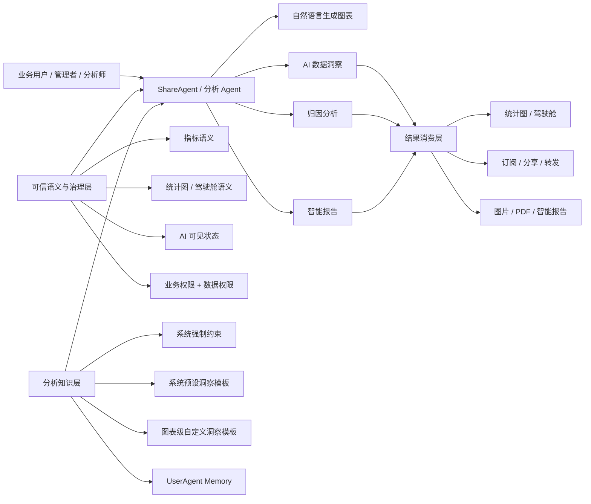

# BI AI 产品说明文档

> 文档版本：V1.0  
> 盘点日期：2026-08-21  
> 盘点范围：BI 团队面向客户的 AI / Agent 产品能力  
> 主要来源：[AI 原生协作工作区](https://git.firstshare.cn/bi/fs-bi-ai-native-workspace)（提交 `4fcb46a9`，2026-08-20）与 [TAPD 需求列表](https://www.tapd.cn/tapd_fe/20097211/story/list?sort_name=custom_field_91&order=asc&useScene=storyList&groupType=&conf_id=1120097211001342274&queryToken=6e81523591db6b57462ad8055b9bd9c9&page=1)

## 1. 文档结论

BI 团队正在建设的不是单一“问数助手”，而是一套以 **ShareAgent / 分析 Agent** 为交互入口、以 **BI 语义资产与权限治理** 为可信基础、以 **图表生成、数据洞察、归因和报告** 为任务闭环的 AI 分析产品。

当前建设路径已经比较清晰：

1. **从生成图表切入**：自然语言交互生成图表已标记为标准产品上线，是当前最明确的已交付能力。
2. **从通用洞察走向业务化洞察**：正在把统一系统提示扩展为图表级自定义洞察策略，并支持从 ShareAgent 对话中沉淀为组织配置或个人记忆。
3. **从点击查看走向随处可见**：规划把 AI 洞察结论直接嵌入统计图、驾驶舱卡片、订阅、分享和导出结果。
4. **补齐可信语义底座**：规划对指标、统计图和驾驶舱增加 AI 可见治理，确保 Agent 只使用已启用、已授权、明确开放的 BI 资产。
5. **向高阶分析闭环演进**：需求池已出现归因分析和智能报告，但目前只有需求名称，产品范围、交互和验收口径尚未形成有效 PRD。

一句话定位建议：

> BI 分析 Agent 是一个基于企业可信语义资产和用户数据权限，通过自然语言完成图表生成、业务洞察、原因分析与报告交付的智能分析助手。

## 2. 产品边界

### 2.1 面向客户的产品能力

本文纳入以下能力：

- ShareAgent / 分析 Agent 的自然语言分析入口。
- 自然语言生成统计图。
- 统计图 AI 洞察及洞察策略配置。
- 指标、统计图、驾驶舱的 AI 语义接入与可见性治理。
- 归因分析和智能报告。
- Agent 的组织级洞察配置、个人记忆、权限、审计和多端消费。

### 2.2 不纳入产品路线图的内容

仓库本身还承载了产品、研发、测试使用 AI Skill 协同交付的内部工程体系，例如 `bi-write-prd`、`bi-feature-dev`、`bi-write-test-cases`。这属于 **AI 原生研发协作能力**，不是客户使用的 BI AI 产品能力，本文只在附录说明，不纳入产品成熟度判断。

## 3. 目标用户与核心价值

| 用户 | 核心任务 | 当前痛点 | AI 产品价值 |
| --- | --- | --- | --- |
| 一线业务人员 | 快速查数、生成图表、理解变化 | 不熟悉报表配置和分析方法；需要反复找分析人员 | 用自然语言完成分析，降低专业门槛 |
| 经营管理者 | 看趋势、目标差距、异常与风险 | 图表多、结论分散，需要逐图阅读和人工总结 | 直接获得面向决策的洞察与报告 |
| 数据分析师 / 图表设计者 | 构建图表、定义分析方法 | 通用 AI 洞察不理解具体业务关注点 | 把分析经验沉淀为可复用的图表级洞察策略 |
| 报表管理员 / CRM 管理员 | 管理可被 AI 使用的资产 | 测试指标、争议口径和低质量图表可能被误召回 | 建立 AI 可见白名单、权限与审计闭环 |
| 企业管理者 | 规模化推广可信 AI 分析 | 回答可信度、权限、配置迁移和效果难治理 | 形成可管、可控、可审计、可度量的企业级能力 |

## 4. 产品能力架构

产品链路可以概括为：

> 用户意图 -> Agent 任务理解 -> 可信 BI 资产召回 -> 权限与 AI 可见校验 -> 图表或数据计算 -> 业务洞察 / 归因 -> 图表、驾驶舱或报告交付。

## 5. 能力全景与成熟度

### 5.1 状态总览

| 能力域 | 需求 | 需求编号 | 仓库最新状态 | 本文成熟度判断 | 结论可信度 |
| --- | --- | --- | --- | --- | --- |
| 自然语言分析 | 分析 Agent 支持自然语言交互生成图表 | 2026-04-23-20346 | 已上线（标准产品） | 已上线 | 中：迭代索引与 PRD 状态冲突，PRD 仍写“开发中”且正文为空模板 |
| 个性化洞察 | 自定义图表级数据洞察思路 | 2026-01-30-19555 | 测试中 | 近期交付 | 高：PRD、测试材料完整，迭代索引标记测试中 |
| 洞察展示 | 统计图支持 AI 洞察结论显示布局设置 | 2026-08-04-26278 | 需求设计 | 已规划 | 高：PRD 完整，尚无有效技术评审与开发计划 |
| 语义治理 | 阶段一：统计指标接入 AI 语义层 | 未回填 | 待填写 | 已规划，排期待确认 | 中：PRD 和测试设计较完整，但迭代状态、技术评审与开发计划未完成 |
| 语义治理 | 阶段三：统计图接入 AI 语义层 | 未回填 | 待填写 | 已规划，排期待确认 | 中：PRD 和测试设计较完整，但迭代状态、技术评审与开发计划未完成 |
| 高阶分析 | 归因分析 | 2025-04-01-15212 | 待填写 | 需求池概念 | 低：只有标题，PRD、技术方案和验收口径为空模板 |
| 分析交付 | 智能报告整体能力支持 | 2026-03-09-19777 | 待填写 | 需求池概念 | 低：只有标题，PRD、技术方案和验收口径为空模板 |

### 5.2 已上线能力

#### 自然语言交互生成图表

当前可确认的产品事实是：分析 Agent 已支持通过自然语言生成图表，并在迭代索引中标记为“已上线（标准产品）”。它承担整个 BI AI 产品的首个用户价值闭环：用户不再必须理解统计图配置方式，可以直接表达分析意图并获得图表结果。

由于该需求的 PRD 正文仍是空模板，现阶段不能从仓库确认以下细节：

- 支持的图表类型和问题范围。
- 多轮修改、澄清和追问能力。
- 图表保存、复用和权限规则。
- 语义召回准确率与失败降级策略。
- Web、移动端及其他入口的覆盖范围。

因此，本文只把“自然语言生成图表”本身列为已上线，不对上述细节作上线判断。

## 6. 已规划能力

### 6.1 图表级自定义洞察策略

该能力把 AI 洞察从“所有图表使用统一分析方法”升级为“每张图表可以携带自己的业务分析方法”。

核心能力包括：

- 图表设计者可配置、编辑、清除和预览“自定义洞察提示词模板”。
- AI 洞察优先使用图表级模板；未配置时回退到系统预设模板。
- AI 输入组合为：系统强制约束 + 图表级自定义模板或系统模板 + 当前用户可见的真实图表数据。
- 用户可以在 ShareAgent 中反复调整分析角度，经确认后通过 Tool 将有效分析方法保存为图表级模板。
- 有图表新建或编辑权限的用户可沉淀为组织共享的图表配置；无权限用户降级保存到个人 `UserAgent Memory`。
- 图表配置支持报表日志、沙盒、更改集、配置包和多语言。
- 当前明确只覆盖统计图及 ShareAgent 中针对统计图的洞察，不包含驾驶舱级自定义洞察。

产品价值是把优秀分析师的经验从一次性对话转化为可复用、可迁移、可审计的组织分析资产，同时保留个人偏好的记忆层。

### 6.2 AI 洞察结论内嵌展示

该能力解决“必须点击图标打开 ShareAgent 才能看到结论”的消费摩擦，让结论与图表数据在同一视图出现。

核心能力包括：

- AI 洞察结论支持顶部、底部、左侧、右侧、无五种布局。
- 卡片态可单独控制是否显示结论，适配驾驶舱、首页、自定义页面、对象列表和对象详情等场景。
- 移动端遇到左侧或右侧布局时自动降级到底部，原始配置不被覆盖。
- 全局筛选、自定义筛选和被联动刷新后，洞察需要根据最新数据更新。
- 订阅、转发、分享、图片和 PDF 导出按配置携带结论。
- 配置继承现有图表编辑权限，展示继续受 AI 权限和当前用户数据权限约束。

尚待解决的关键产品问题是洞察刷新周期、批量图表同时生成时的性能和成本，以及导出、订阅场景中结论生成的一致性。

### 6.3 统计指标 AI 语义接入与可见治理

该能力为 Agent 建立第一层可信资产白名单。

核心能力包括：

- 管理员可单条或批量设置指标“AI 可见 / AI 不可见”。
- 支持指标批量启用和停用，操作结果区分成功、跳过和失败原因。
- 能力受 ShareAgent License 控制，仅 CRM 管理员和报表管理员可治理 AI 可见状态。
- Agent 实际可调用条件为：**指标已启用 AND AI 可见 AND 用户原有权限允许**。
- 关闭 AI 可见不影响指标在普通 BI 报表、统计图和导出中的使用。
- 变更写入报表日志，并随沙盒、更改集和配置包迁移。
- 兼容 ShareAgent 基础版的向量化语义解析，以及满血版的大模型语义生成。

这一阶段只做列表侧最小治理闭环，不做指标编辑态的完整语义配置。PRD 明确把详细语义编辑留到阶段二。

### 6.4 统计图与驾驶舱 AI 语义接入

该能力把可信治理从指标扩展到用户已经创建的分析资产。

核心能力包括：

- 新建或编辑统计图、驾驶舱时可配置 AI 可见状态。
- 报表列表页展示 AI 可见状态，并支持单条和批量操作。
- Agent 只可调用 AI 可见且当前用户有原始查看权限的统计图或驾驶舱。
- AI 可见状态随复制、另存为、沙盒、更改集和配置包迁移。
- AI 不可见不改变该资源原有查看、订阅、分享和导出权限。

本阶段明确不做：

- 报表、交叉表和拼表的 AI 可见治理。
- 业务相关度、Alias、Definition、Usage Notes 等语义字段。
- Agent 召回、排序和推荐策略改造。
- 独立 Agent 管理员角色和新增功能权限项。
- 移动端配置入口。

## 7. 未来规划能力

未来规划分为两类：已经在仓库中出现、但尚未形成有效方案的“正式需求方向”；以及根据当前产品缺口推导的“建议规划”。两者不能混为已承诺范围。

### 7.1 已进入需求池的方向

#### 归因分析

目标方向是从“描述发生了什么”升级到“解释为什么发生”。结合现有自定义洞察 PRD 中对归因场景的语义同步要求，归因分析预计需要复用图表语义、指标口径、维度关系和图表级洞察策略。

当前仅能确认需求名称，不能确认具体算法、交互、支持范围和交付时间。正式立项前至少需要明确：

- 归因对象是指标、统计图还是驾驶舱。
- 支持的变化类型：同比、环比、目标差距、异常波动或预测偏差。
- 候选维度的生成、贡献度计算和统计显著性口径。
- AI 解释与确定性计算之间的边界。
- 用户如何追问、验证和下钻到证据数据。

#### 智能报告

目标方向是把单图洞察汇总为可持续消费的多图、多指标经营报告，形成“分析结果 -> 结论组织 -> 分发”的闭环。

当前仅能确认需求名称。正式方案应至少覆盖：

- 报告创建方式：自然语言生成、模板生成、驾驶舱转报告或定时生成。
- 内容结构：摘要、关键指标、变化、异常、原因、风险与建议动作。
- 数据时间点、一致性、引用图表和证据可追溯性。
- 在线阅读、订阅、分享、导出 PDF 等消费方式。
- 定时刷新、失败重试、权限快照和历史版本。

### 7.2 PRD 已明确后置的方向

以下能力已被现有 PRD 明确排除在当前阶段之外，可视为后续候选：

- **指标语义编辑阶段二**：为指标补齐详细业务语义，而不仅是 AI 可见开关。
- **驾驶舱级自定义洞察**：在多图上下文中配置统一经营分析策略。
- **更多 BI 资产接入**：报表、交叉表、拼表等资源进入 AI 可调用范围。
- **语义丰富度**：业务相关度、别名、定义、使用说明等字段。
- **Agent 召回优化**：可信资产上的召回、排序、推荐和低质量结果抑制。
- **移动端治理入口**：在移动端配置 AI 可见状态和洞察策略。
- **独立 AI 治理角色**：从写死管理员角色演进到可配置的 Agent 管理权限。

### 7.3 建议补齐的产品规划

以下内容是基于现有需求之间的依赖关系提出的建议，不代表已立项：

1. **统一可信语义资产中心**：统一管理指标、图表、驾驶舱的名称、定义、口径、别名、责任人、认证状态、AI 可见状态和生命周期，避免各资产分别治理。
2. **Agent 多轮分析工作台**：补齐问题澄清、图表修改、分析追问、证据查看、保存和分享的一致会话体验。
3. **确定性分析工具层**：趋势、异常、贡献度、相关性和归因由可验证的分析工具计算，大模型负责意图理解和结论表达，降低“语言正确、数据错误”的风险。
4. **结果可追溯与反馈闭环**：每个结论可查看使用的数据范围、指标口径、筛选条件和生成时间，并支持有帮助、无帮助、口径错误等反馈。
5. **质量评测体系**：建设自然语言生成图表、资产召回、数据准确性、洞察相关性、归因正确性和权限安全的离线评测集与线上监控。
6. **成本与性能治理**：对驾驶舱多图洞察、订阅和智能报告实施缓存、批量计算、刷新策略、超时降级和模型成本预算。

## 8. 建议路线图

### 阶段 A：巩固可用性与可信底座

目标：让已上线的自然语言生成图表稳定可用，并确保 Agent 只使用可信、授权的 BI 资产。

- 补齐自然语言生成图表的正式 PRD、支持边界、失败降级和效果指标。
- 完成指标 AI 可见治理。
- 完成统计图、驾驶舱 AI 可见治理。
- 建立统一的权限校验、审计日志和配置迁移规则。
- 建立基础评测集：问题理解、资产召回、图表生成、数据准确性、权限隔离。

### 阶段 B：强化洞察与组织知识沉淀

目标：从“能生成图表”升级到“能给出贴合业务的可信洞察”。

- 上线图表级自定义洞察模板和 UserAgent Memory。
- 上线洞察结论布局与卡片态展示。
- 补齐详细指标语义、别名、定义和使用说明。
- 统一统计图入口和 ShareAgent 入口的洞察逻辑、权限和反馈。
- 建设洞察刷新、缓存、成本和性能策略。

### 阶段 C：形成高阶分析与报告闭环

目标：覆盖“发现问题 -> 解释原因 -> 形成报告 -> 持续跟踪”的完整经营分析流程。

- 建设可验证的归因分析。
- 建设多图、多指标智能报告。
- 扩展到驾驶舱级洞察策略和更多 BI 资产类型。
- 支持定时生成、订阅、分享、导出和历史版本。
- 建立业务结果指标，衡量洞察是否缩短决策时间、提高分析复用率。

## 9. 产品原则

1. **可信优先于能力数量**：AI 可见只是第一层，实际调用必须同时满足资产启用、用户权限和数据权限。
2. **计算与表达分层**：指标计算、异常检测和归因应尽量由确定性工具完成，大模型负责意图理解、编排和解释。
3. **组织配置与个人偏好分层**：图表级模板代表组织共享分析方法，UserAgent Memory 代表个人偏好，二者需要明确优先级和权限边界。
4. **结果必须可追溯**：结论需要能回到图表、指标口径、筛选条件和数据时间点。
5. **默认兼容存量行为**：新增 AI 配置不得改变原有报表、图表、订阅、分享和导出权限。
6. **多端一致、窄屏降级**：Web、移动端、卡片、订阅和导出的显隐与权限语义应一致。
7. **配置可迁移、操作可审计**：企业级 AI 配置应支持沙盒、更改集、配置包和日志追踪。

## 10. 成功指标

### 10.1 现有 PRD 已定义指标

| 能力 | 指标 | 目标 |
| --- | --- | --- |
| 指标 AI 可见 | AI 可见过滤准确率 | 100% |
| 指标 AI 可见 | 单条操作成功率 | 上线后 2 周内不低于 99% |
| 指标 AI 可见 | 批量操作成功率 | 上线后 2 周内不低于 98% |
| 自定义洞察模板 | 配置采用率 | 上线后 6 个月内达到 2% |
| 自定义洞察模板 | 洞察使用率 | 上线后 6 个月内达到 70% |
| 洞察布局 | 移动端左右布局降级正确率 | 100% |
| 洞察布局 | 总开关关闭后的结论展示率 | 0 |
| 统计图语义接入 | AI 不可见手动关闭占比 | 上线后 90 天内低于 30%，用于观察默认策略质量 |

### 10.2 建议增加的产品级指标

| 指标层级 | 建议指标 | 说明 |
| --- | --- | --- |
| 北极星指标 | 有效分析任务完成率 | 用户通过 Agent 得到正确且被采用的图表、洞察或报告的任务数 / 发起任务数 |
| 可信度 | 数据准确率、语义召回准确率、权限泄漏数 | 权限泄漏目标必须为 0 |
| 效率 | 首个有效结果耗时、完成分析耗时 | 与传统手工建图和分析流程对比 |
| 质量 | 图表生成一次成功率、洞察采纳率、归因验证通过率 | 区分生成正确与业务有用 |
| 使用 | 周活跃分析用户、连续追问率、保存率、分享率 | 衡量是否形成稳定工作流 |
| 复用 | 图表级模板复用次数、智能报告订阅数 | 衡量组织分析知识沉淀效果 |
| 成本 | 单次有效分析任务模型成本 | 与成功任务绑定，避免只看调用量 |

## 11. 当前风险与决策项

| 风险 / 决策项 | 现状 | 建议 |
| --- | --- | --- |
| 产品命名不统一 | 文档同时使用“分析 Agent”“ShareAgent”“Agent” | 明确一个对外产品名，并定义 ShareAgent、UserAgent Memory 等子概念 |
| 状态源不一致 | 自然语言生成图表在迭代索引为“已上线”，PRD 为“开发中”；自定义洞察模板也存在状态差异 | 以 TAPD 为唯一状态源，仓库自动同步状态与更新时间 |
| 已上线需求缺正式方案 | 自然语言生成图表 PRD 仍为空模板 | 补齐现网能力说明、支持边界、指标、已知限制和版本记录 |
| 语义阶段断档 | 文档提到阶段一、阶段二、阶段三，但阶段二没有独立需求材料 | 建立统一 Epic 和阶段依赖图，明确阶段二范围与交付时间 |
| 技术成熟度不可判断 | 多个需求的技术评审、开发计划仍为空模板 | 状态进入开发前强制完成技术评审和端到端验收口径 |
| 归因和报告定义不足 | 目前只有标题 | 先完成场景、输入输出、证据链和非目标，再排期 |
| 洞察成本与性能未定 | 多图驾驶舱、订阅、导出都可能触发生成 | 提前定义刷新周期、缓存、批量生成、超时降级和成本上限 |
| 默认 AI 可见风险 | 指标和图表方案倾向新建默认可见 | 对测试资产、未认证资产和低质量资产增加默认策略或认证门槛 |

## 12. 需求来源清单

| 需求 | 仓库文件 |
| --- | --- |
| 自然语言交互生成图表 | `stories/03- 【分析 Agent】分析Agent支持自然语言交互生成图表/product/prd.md` |
| 归因分析 | `stories/03- 【分析 Agent】归因分析/product/prd.md` |
| 智能报告 | `stories/03- 【分析 Agent】智能报告整体能力支持/product/prd.md` |
| 图表级自定义洞察 | `stories/03- 【分析 Agent】支持自定义图表级数据洞察思路。/product/PRD_统计图支持配置图表级自定义洞察思路.md` |
| AI 洞察结论布局 | `stories/03-【分析Agent】统计图支持AI洞察结论显示布局设置/product/分析Agent_PRD_统计图AI洞察结论布局.md` |
| 指标 AI 语义接入 | `stories/01-阶段一：统计指标接入AI语义层——AI可见列表操作/product/prd.md` |
| 统计图 / 驾驶舱 AI 语义接入 | `stories/01-阶段三_统计图接入AI语义层/product/prd.md` |
| 需求状态 | `iterations/AI+BI/index.md`、`iterations/BI-20270116大迭代/index.md` |

## 13. 数据质量说明

- 本文基于 2026-08-20 的仓库快照整理。
- 仓库说明明确指出需求状态和进度以 TAPD 为准，但当前环境调用 TAPD API 返回 `401 Unauth`；用户提供的 TAPD 页面可访问前端壳，但无法在无登录态下读取列表数据。
- 因此，本文的状态取自仓库迭代索引，并对状态冲突和缺少有效正文的需求降低了结论可信度。
- “已进入需求池的方向”只代表仓库中存在需求项，不代表已有承诺版本或交付日期。
- “建议补齐的产品规划”是基于现有需求依赖和产品缺口的分析建议，不是团队已经确认的规划。

## 附录：BI 团队 AI 原生研发协作

除客户产品外，BI 团队还在建设 AI 原生的需求交付工作区：产品、研发和测试围绕同一需求目录协作，使用 Skill 辅助创建需求、撰写 PRD、研发反讲、技术评审、开发计划、代码实现和测试用例。这条内部能力线有助于提高 AI 产品自身的交付效率和文档一致性，但应与对客户售卖的 BI 分析 Agent 分开度量。
