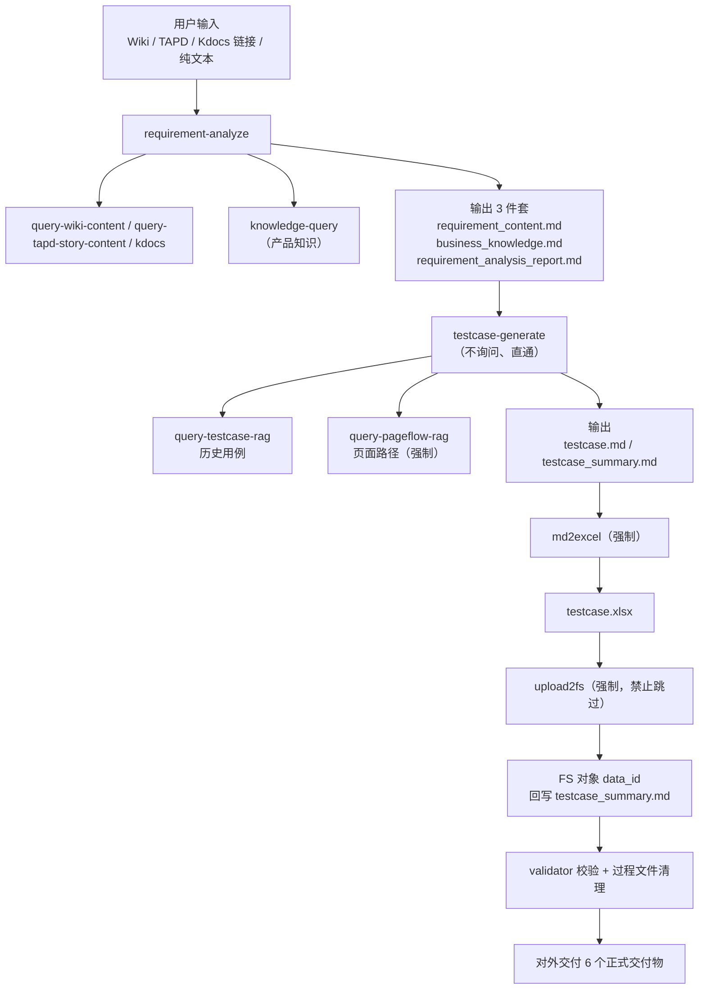

# fs-qa-knowledge 架构、职能与输入输出分析

> 分析对象：`/Users/liushanshan/code/QA/fs-qa-knowledge`
> 分析日期：2026-09-17
> 分析方式：静态阅读仓库入口文档、13 个 `SKILL.md`、`scripts/` 与 `tools/` 脚本、`db/` 索引产物

---

## 一、项目定位

fs-qa-knowledge 是纷享销客 QA 的**测试知识库 + 测试用例生成 Agent 编排仓库**。它同时承担三个角色：

| 角色 | 承载目录 | 说明 |
| --- | --- | --- |
| 知识库 | `knowledge/` | 按团队沉淀业务规则、页面流程、历史用例、术语与模板 |
| Agent 技能集 | `skills/` | 13 个 Skill，覆盖需求分析、用例生成、用例评测、检索、转换、上传、初始化 |
| 跨平台工具链 | `tools/`、`scripts/`、`db/` | 为 Skill 提供 macOS/Windows 双平台包装脚本、索引构建与本地 SQLite 检索底座 |

**要解决的核心问题**：把「需求（Wiki/TAPD/文档/口述）→ 测试用例（Excel）」这条链路从纯人工，变成由 Agent 在强约束下自动完成，并让团队沉淀的业务知识、历史用例、页面路径反过来提升生成质量。

**核心编排角色**：`testcase-designer`（用例设计师），运行于 `.claude-runtime/testcase-designer/workspace/`，是执行全链路编排的主体。

---

## 二、总体架构

仓库是一个**七层结构**，自上而下逐层收敛：

```
┌───────────────────────────────────────────────────────────────┐
│ L1 交互层   Claude Code / OpenClaw Agent 会话（自然语言入口）   │
│             用户输入：Wiki 链接 / TAPD 链接 / Kdocs 链接 / 纯文本 │
└───────────────────────────┬───────────────────────────────────┘
                            │ 意图识别
┌───────────────────────────▼───────────────────────────────────┐
│ L2 编排层   AGENTS.md（根，最高优先级）/ CLAUDE.md / skills/AGENTS.md │
│             职责：意图路由、流程编排、STRICT_SKILL_MODE 门禁       │
└───────────────────────────┬───────────────────────────────────┘
                            │ 按流程调用
┌───────────────────────────▼───────────────────────────────────┐
│ L3 能力层   skills/（13 个 Skill）                              │
│   编排类：requirement-analyze / testcase-generate / testcase-validate │
│   获取类：query-wiki-content / query-tapd-story-content / kdocs   │
│   检索类：knowledge-query / query-pageflow-rag / query-testcase-rag │
│   转换交付类：md2excel / excel2md / upload2fs                     │
│   环境类：init-agent-team                                        │
└──────┬──────────────────────────────┬─────────────────────────┘
       │ 读知识                        │ 写产物
┌──────▼──────────────┐      ┌────────▼────────────────────────┐
│ L4 知识层 knowledge/ │      │ L7 产物层 outputs/               │
│ 团队 × 知识类型       │      │ testcase_时间戳_英文标题/          │
└──────┬──────────────┘      └─────────────────────────────────┘
       │ 建索引
┌──────▼────────────────────────────────────────────────────────┐
│ L5 索引层   scripts/*.py → db/knowledge.db（SQLite + FTS5）      │
│             db/index-registry.json（注册表）                     │
└───────────────────────────┬───────────────────────────────────┘
                            │ 平台包装
┌───────────────────────────▼───────────────────────────────────┐
│ L6 适配层   tools/{init,adapter,index,query,convert,upload}/{mac,windows} │
└───────────────────────────────────────────────────────────────┘
```

### 分层职责表

| 层 | 目录 / 文件 | 职责 | 关键约束 |
| --- | --- | --- | --- |
| L1 交互 | 会话 | 接收需求与指令 | 输入形态只有 4 种：Wiki / TAPD / Kdocs / 纯文本 |
| L2 编排 | `AGENTS.md`、`CLAUDE.md`、`skills/AGENTS.md` | 意图路由、流程串联、门禁裁决 | 根 `AGENTS.md` 优先级最高，命中关键词时覆盖 Skill 自动调用 |
| L3 能力 | `skills/` | 单点能力实现 | 每次执行前必须重新读取对应 `SKILL.md` |
| L4 知识 | `knowledge/` | 可复用业务知识、历史用例、页面流程 | 按「团队 → 知识类型」两级组织 |
| L5 索引 | `scripts/`、`db/` | 本地全文检索底座 | 单库模型，索引只在根 `db/` 下 |
| L6 适配 | `tools/` | 双平台命令包装、环境变量注入、定时任务 | 与 Skill 核心逻辑分离 |
| L7 产物 | `outputs/` | 每轮任务的正式交付物与过程证据 | 目录名全英文，交付前只保留正式交付物 |

---

## 三、目录结构与职能

| 路径 | 职能 | 关键内容 |
| --- | --- | --- |
| `AGENTS.md` | **总入口 / 编排规则**（最高优先级） | 意图路由表、编排流程、STRICT_SKILL_MODE 13 条硬约束、用例充分性门禁、交付与清理门禁 |
| `CLAUDE.md` | Claude Code 项目指令 | 仅声明「必须先读 AGENTS.md」 |
| `README.md` | 仓库入口 | 说明、设计目标、目录原则、命名与元数据规范、贡献入口 |
| `QUICKSTART.md` | 引导式初始化手册 | 7 步：环境变量 → 初始化脚本 → 建索引 → 补配置 → 对话初始化 → 提需求 → 查产物 |
| `CONTRIBUTING.md` | 贡献流程 | 新增/修改知识文档的提交规范 |
| `docs/` | 文档目录 | `quickstart/`（claude.md、openclaw.md）、`guidelines/`（architecture.md 团队花名册、maintenance-standard.md 维护规范）、`plans/`（重构与贡献指南设计决策） |
| `knowledge/` | **知识库正文** | 11 个团队目录 + `AGENTS.md` + `general/templates/` |
| `skills/` | **Skill 定义** | 13 个 Skill，每个含 `SKILL.md` + `scripts/` + `references/`（`init-agent-team` 另有 `assets/`） |
| `tools/` | 平台适配层 | `init` / `adapter` / `index` / `query` / `convert` / `upload`，各含 `mac` 与 `windows` 两套实现 |
| `scripts/` | 索引与同步脚本 | `build-index.py`、`index-knowledge.py`、`sync_index_registry.py`、`search-index.py`、`auto_sync_knowledge.sh`、`check-doc-compliance.sh` |
| `db/` | 索引产物 | `knowledge.db`（SQLite+FTS5）、`index-registry.json`（注册表）、`verify/`（抽样校验） |
| `outputs/` | **交付物产出** | 每轮一个 `testcase_YYYYMMDD_HHMM_EnglishTitle/` 目录 |
| `.claude-runtime/` | Agent 运行时 | `testcase-designer/workspace/`（`USER.md`、`AGENTS.md`、索引副本）、`logs/` |
| `.qoder/repowiki/` | 代码知识库（自动生成） | 项目概述、知识管理、工具链、API 参考等分册 |
| `archived/` | 历史归档 | 仅 `README.md` |
| `.github/` | PR 模板 | `PULL_REQUEST_TEMPLATE.md` |

---

## 四、Skill 职能矩阵

13 个 Skill 按职责分为五类：

### 4.1 类 A：主链路编排 Skill（3 个）

| Skill | 版本 | 职能 | 输入 | 输出 |
| --- | --- | --- | --- | --- |
| `requirement-analyze` | 1.10.0 | 需求 → 结构化需求分析报告；鉴别入口、拉取需求、提关键字、调产品知识、做功能点拆分 | Wiki/TAPD/Kdocs 链接或纯文本 | `requirement_content.md`、`business_knowledge.md`、`requirement_analysis_report.md` |
| `testcase-generate` | 2.5.0 | 需求分析报告 → 覆盖完整的测试用例集（含原子规则/影响面/七维度/13 范式/双向追溯） | `requirement_analysis_report.md`（必选）、`business_knowledge.md`（必选） | `testcase.md`、`testcase.xlsx`、`testcase_summary.md` |
| `testcase-validate` | — | 评测 AI 用例质量，计算采纳率/召回率（模式A）或合规率/需求覆盖率（模式B） | 模式A：`testcase.xlsx` + `testcase_adopt.xlsx` + `testcase_user.xlsx`；模式B：`testcase.xlsx` + `requirement_content.md` + `business_knowledge.md` | `testcase_validate_report.md`（模式A 另出 `testcase_recall_detail.xlsx`） |

### 4.2 类 B：内容获取 Skill（3 个）

| Skill | 版本 | 职能 | 输入 | 输出 | 硬约束 |
| --- | --- | --- | --- | --- | --- |
| `query-wiki-content` | 2.3.0 | 通过 Wiki REST API 读取页面 | Wiki URL（含 `wiki.firstshare.cn` + `pageId`） | Markdown 正文、`title`、`pageId`、`space` | **获取 Wiki 内容的唯一方式**；失败即终止，不降级、不用浏览器兜底 |
| `query-tapd-story-content` | 2.0.0 | 读取 TAPD Story 正文 | TAPD Story URL | Story 文本（已剥 HTML、去部署信息） | 若正文含 Wiki 链接需回落 `query-wiki-content` |
| `kdocs` | — | 金山文档（Kdocs）读写与协同 | `365.kdocs.cn` / `www.kdocs.cn` 链接 | 文档内容 | 覆盖 kwiki、dbsheet、drive、otl、ppt 等子系统 |

### 4.3 类 C：检索 Skill（3 个）

| Skill | 职能 | 输入 | 输出 | 检索范围 |
| --- | --- | --- | --- | --- |
| `knowledge-query` | 通用知识检索（PRD、方案、业务规则、页面说明） | 查询词或整段需求描述 | 命中片段（`chunk_text` 完整正文、`chunk_summary`、路径、分数）+ `Recall@5`/`Precision@5`/`MRR` 评估摘要 | 全部知识文档 |
| `query-pageflow-rag` | 页面操作路径检索 | 功能/模块关键词 + `--team` | 页面流程片段 | 页面流程类文档 |
| `query-testcase-rag` | 历史测试用例检索 | 功能名/模块名/场景 + `--team` | 历史用例（含 `template_fields`：用例标题/前置条件/步骤/预期） | 仅测试用例类文档 |

> 三者共用同一个 FTS 索引 `db/knowledge.db` 与同一份注册表 `db/index-registry.json`，但各自维护独立检索脚本（`search_knowledge.py` / `search_pageflow.py` / `search_testcase.py`）。
> 检索优先级固定为：**团队知识 → 公共知识 → 其他团队知识**。

### 4.4 类 D：转换与交付 Skill（3 个）

| Skill | 职能 | 输入 | 输出 |
| --- | --- | --- | --- |
| `md2excel` | Markdown 表格 → Excel | `.md` 绝对路径 | `.xlsx` 路径（`<br>` 转换行、表头加粗浅蓝、列宽自适应） |
| `excel2md` | Excel → Markdown 表格 | `.xlsx` 路径 | `.md` 文件 |
| `upload2fs` | 交付物上传到 FS 对象（CRM 附件落库） | 4 个文件路径（需求原文、配套知识、用例 Excel、需求分析报告） | FS `data_id`（后续评测可据此更新对象） |

### 4.5 类 E：环境 Skill（1 个）

| Skill | 职能 | 输入 | 输出 |
| --- | --- | --- | --- |
| `init-agent-team` | 初始化 Agent 工作环境：创建 `testcase-designer`、复制角色文件、收集团队成员、克隆 QA 知识库、重建索引、安装 skills | 团队成员名称、Git token | `workspace/USER.md`（含 Team Members）、本地知识库副本、可用索引与 skills |

> 附带 heartbeat 入口：知识库内容无变化则静默退出。

---

## 五、主链路：从需求到交付物

`AGENTS.md` 定义的**流程一（生成测试用例）**是仓库的核心链路：



### 各步骤输入输出

| 步骤 | 执行者 | 输入 | 动作 | 输出 | 门禁 |
| --- | --- | --- | --- | --- | --- |
| 1 | `requirement-analyze` Step 2 | Wiki / TAPD / Kdocs / 文本 | 判别入口并拉取原文；过滤行业背景、竞品分析等噪声 | `requirement_content.md` | 拉取失败直接终止 |
| 2 | Step 3–4 | 需求原文 | 归纳 3–5 个关键字；产出 30–80 字需求描述 | 关键字、需求描述 | 空泛关键字或整段粘贴视为未完成 |
| 3 | Step 5 | 需求描述 | 调用 `knowledge-query` | `business_knowledge.md` | 命中专项/通用/无匹配三种结果须如实落档；为空只写「无」 |
| 4 | Step 6–7 | 需求原文 + 产品知识 | 生成需求分析报告 | `requirement_analysis_report.md` | 必含原子规则清单、配套功能点补充检查、细分功能点覆盖判定表 |
| 5 | `testcase-generate` Step 4–5 | 分析报告 | 历史用例检索 + 页面路径检索 | 检索结论 | 页面路径为**强制调用**；历史用例不可用须注明 |
| 6 | Step 6.0–6.2 | 分析报告 | 枚举原子规则清单与影响面清单；做七维度评估 | 原子规则、影响面、七维度矩阵 | 未形成清单禁止进入生成 |
| 7 | Step 7–8 | 上述规划 | 生成合并大表用例；评审 + 三层交叉验证 | `testcase.md` | 每条原子规则至少 1 条用例，禁止孤立用例 |
| 8 | Step 10 | 用例集 | 保存交付物 | `testcase.md`、`testcase_summary.md` | 摘要必须含七维度、13 范式、影响面、原子规则、三层验证摘要 |
| 9 | `md2excel` | `testcase.md` | Markdown → Excel | `testcase.xlsx` | 必须经 skill 调用，禁止直接跑脚本 |
| 10 | `upload2fs` | 4 个文件 | 上传 FS 对象 | `data_id` | **禁止跳过、禁止延后、禁止先交付后补传** |
| 11 | 编排层 | 全部产物 | 校验 + 清理过程文件 | 仅剩 6 个正式交付物 | 多出任何文件禁止回复「已完成」 |

---

## 六、输入输出全景

### 6.1 外部输入（4 类）

| 输入类型 | 判别特征 | 处理方式 | Token 依赖 |
| --- | --- | --- | --- |
| Wiki 链接 | 含 `wiki.firstshare.cn` | `query-wiki-content` | `WIKI_TOKEN` |
| TAPD 链接 | 含 `tapd.cn` | `query-tapd-story-content`（含 Wiki 链接则回落前者） | `TAPD_ACCESS_TOKEN` |
| Kdocs 链接 | 含 `365.kdocs.cn` / `www.kdocs.cn` | `kdocs` skill | `KINGSOFT_DOCS_TOKEN` |
| 纯文本 | 以上皆不含 | 直接作为需求内容，需求链接记为「无」 | — |

### 6.2 中间产物（Skill 之间传递）

| 文件 | 生产者 | 消费者 |
| --- | --- | --- |
| `requirement_content.md` | `requirement-analyze` | `upload2fs`、`testcase-validate`（模式B） |
| `business_knowledge.md` | `requirement-analyze` | `testcase-generate`、`upload2fs`、`testcase-validate`（模式B） |
| `requirement_analysis_report.md` | `requirement-analyze` | `testcase-generate`（**唯一需求来源**）、`upload2fs` |
| `testcase.md` | `testcase-generate` | `md2excel` |
| `testcase.xlsx` | `md2excel` | `upload2fs`、`testcase-validate` |
| `testcase_summary.md` | `testcase-generate` | `upload2fs`（提取用例总数）、交付 |

### 6.3 正式交付物

**仅需求分析场景（3 个）**：

1. `requirement_content.md`
2. `business_knowledge.md`
3. `requirement_analysis_report.md`

**完整生成用例场景（6 个，清理门禁后的最终状态）**：

1. `requirement_content.md`
2. `business_knowledge.md`
3. `requirement_analysis_report.md`
4. `testcase.md`
5. `testcase.xlsx`
6. `testcase_summary.md`

输出目录命名：`outputs/testcase_YYYYMMDD_HHMM_EnglishTitle/`，**全英文**，禁止出现 Wiki ID、TAPD ID、纯数字。

### 6.4 过程证据文件（交付前必须清理）

`execution_checklist.md`、`execution_trace.md`、`skill_read_receipt.md`、`compliance_report.md`、`atomic_rules.md`、`subfeature_coverage_matrix.md`、`impact_matrix.md`、`feature_coverage_matrix.md`、`pattern_matrix.md`、`traceability_matrix.md`、`testcase_rag.txt`、`pageflow_rag.txt`、`wiki_fetch.json` 及任意临时稿（`testcase1.md`、`testcase2.md` 等）。

> 结论必须**先沉淀进正式交付物**（主要落点是 `requirement_analysis_report.md` 和 `testcase_summary.md`），再删除过程文件。

### 6.5 FS 对象字段映射（`upload2fs`）

| 本地文件 | FS 字段 API | 含义 |
| --- | --- | --- |
| `requirement_content.md` | `ai_analysis_generate_requi__c` | 需求文档原文 |
| `business_knowledge.md` | `ai_get_supporting_product__c` | 配套业务知识 |
| `testcase.xlsx` | `ai_generate_test_case__c` | AI 生成的测试用例 |
| `requirement_analysis_report.md` | `ai_requirement_analysis_re__c` | 需求分析报告 |
| `testcase_validate_report.md` | `ai_case_evaluation_report__c` | 用例评测报告 |
| `testcase_user.xlsx` | `manually_written_test_case__c` | 用户编写的用例 |
| `testcase_adopt.xlsx` | `adoption_rate_user_labelin__c` | 采纳率手工打标 |
| `testcase_recall_detail.xlsx` | `ai_evaluation_detail_docum__c` | 用例召回明细 |

自动提取字段：`module__c`、`requirement_directory__c`、`requirement_link__c`、`requirement_title__c`、`ai_generated_case_count__c`、`manual_adoption_rate__c`、`manual_recall_rate__c`、`ai_adoption_rate__c`、`ai_recall_rate__c`、`test_case_evaluation_mode__c`、`user_adopted_case_count__c`、`user_written_case_count__c`、`recall_case_number__c`、`knowledge_base_supplementa__c`；`mobile` 源自 `MOBILE_PHONE`。

对象 API Name：`agent_requirement_analysis__c`（新建返回 `data_id`，评测结果再按 `data_id` 更新同一对象）。

### 6.6 评测（`testcase-validate`）输入输出

| 模式 | 触发条件 | 输入 | 指标 | 输出 |
| --- | --- | --- | --- | --- |
| 模式 A：参照标准评测 | 提供打标或手工用例文件 | `testcase.xlsx` + `testcase_adopt.xlsx` + `testcase_user.xlsx` | 采纳率、召回率 | `testcase_validate_report.md`（+ 召回明细） |
| 模式 B：全自动无参照物评测 | 两个参照文件都未提供 | `testcase.xlsx` + `requirement_content.md` + `business_knowledge.md` | 合规率、需求覆盖率 | `testcase_validate_report.md` |

召回匹配规则：仅已采纳的 AI 用例参与匹配；相似度阈值 70%（标题 30% + 前置条件 20% + 步骤 30% + 预期 20%）；一对一匹配不可重复。

---

## 七、知识建设：知识层是怎么搭起来的

知识层是仓库工程量最大的部分（6697 行 Python 中约一半在服务它）。它不是「一个 Markdown 文件夹」，而是**内容规范 → 派生加工 → 全文索引 → 多路检索 → 回归评估**五段流水线。

### 7.0 总体结构

```
┌─────────────────────────────────────────────────────────────┐
│ ① 内容层（人写）  knowledge/<team>/{business,testcase,pageflow,common}/ │
│    约束：命名规范 + frontmatter + 模板 + 评审                        │
└──────────────────────────┬──────────────────────────────────┘
                           │ build-index.py
┌──────────────────────────▼──────────────────────────────────┐
│ ② 加工层（脚本）  解析 frontmatter → 派生 7 类字段 → 按标题层级切块     │
└──────────────────────────┬──────────────────────────────────┘
                           │ index-knowledge.py
┌──────────────────────────▼──────────────────────────────────┐
│ ③ 索引层（SQLite） db/knowledge.db                            │
│    files / documents / chunks / chunks_fts(FTS5) / team_tag_index │
└──────────────────────────┬──────────────────────────────────┘
                           │ search_*.py
┌──────────────────────────▼──────────────────────────────────┐
│ ④ 检索层  通用 / 页面流程 / 历史用例 三个特化检索器                    │
└──────────────────────────┬──────────────────────────────────┘
                           │ evaluate_retrieval.py
┌──────────────────────────▼──────────────────────────────────┐
│ ⑤ 评估层  golden set 回归（Recall@5 / Precision@5 / MRR）      │
└─────────────────────────────────────────────────────────────┘
```

### 7.1 内容层：组织方式与「路径即元数据」

```
knowledge/<team>/
├── business/    # 业务规则知识
├── testcase/    # 历史测试用例
├── pageflow/    # 页面操作流程
└── common/      # 公共基础知识（部分团队）
```

关键设计：**目录路径本身就是元数据**。`scripts/index-knowledge.py:271` 的 `_extract_path_metadata()` 从路径直接推出 `team`（第 1 段）、`category`（第 2 段）、`module`（第 3 段），类型则按目录名推断：

```python
if "/pageflow/" in norm_path:   type_guess = "pageflow"
elif "/testcase/" in norm_path: type_guess = "testcase"
```

frontmatter 只作**覆盖**用（`type = frontmatter["type"] or path_meta["type_guess"]`）。也就是说：「把页面流程文档放进 `pageflow/`」本身就等于完成了类型标注——**规范约束被编码进了检索逻辑**。

### 7.2 团队与内容现状（截至 2026-09-17）

| 团队目录 | Markdown 文档数 | 说明 |
| --- | --- | --- |
| `BI/` | 42 | 数据业务，含 `common/` 与独立 `README.md` |
| `order/` | 21 | 订货通（含 upstream / downstream 分层用例） |
| `fmcg/` | 20 | 消费品（business 下含 sales / tpm / fieldwork 子域） |
| `general/` | 7 | 公司通用知识 + `templates/` 模板 |
| `paas/` | 6 | PaaS 平台 |
| `sfa/`、`marketing/`、`manufacture/`、`interconnect/`、`integration/`、`flow/` | 0 | 目录已建，暂无文档 |
| 合计 | 96（+ 根 `knowledge/AGENTS.md`） | — |

### 7.3 内容层规范

- **文件命名**：`{team}-{module}-{scenario}-{type}.md`，全小写 + 连字符；固定文件名仅 `overview.md`；禁止 `index.md`
- **文档类型**：`knowledge`、`testcase`、`flow`、`term`、`overview`
- **必填 frontmatter**：`id`、`title`、`team`、`type`、`module`、`scenario`、`source`、`status`、`owner`、`updated_at`
- **模板**：`knowledge/general/templates/{knowledge,testcase,flow,term}-template.md`
- **合规自检**：`bash scripts/check-doc-compliance.sh`
- **维护流程**（`docs/guidelines/maintenance-standard.md`）：
  - 新建：判断可复用性 → 选类型与模板 → 按规范命名 → 补齐元数据与摘要 → 填来源与关联 → 自检后提交评审
  - 更新：优先改既有权威文档，避免重复新建；同步更新 `updated_at`，规则变化明显时补变更记录
  - 废弃：`status` 置为 `deprecated` / `archived` 并说明替代关系，**不直接删除**
- **跨团队协作**：确定唯一权威文档，其他用 `related_docs` 引用；公共规则需受影响团队参与评审

模板结构（以 `testcase-template.md` 为例）：frontmatter + `## 摘要`（测试目标/核心校验点/适用范围）+ `## 前置条件` + `## 用例列表` + `## 补充说明` + `## 关联文档` + `## 变更记录`。

### 7.4 加工层：入库管线与增量机制

```
knowledge/*.md
   │  build-index.py            调度层：全量 / --rebuild / --team 增量
   ▼
index-knowledge.py             解析 → 派生字段 → 切块 → 写 SQLite + FTS
   ├─ scan_directory()          扫描 .md
   ├─ index_file()              逐文件处理（含增量判定）
   └─ cleanup_stale_records()   清理已删除文件的残留记录
   ▼
db/knowledge.db
   ▼
sync_index_registry.py   →  db/index-registry.json（路径 + 统计 + 团队清单）
   ▼
db/verify/knowledge-verify.md（20 条抽样校验）+ db/verify/knowledge-health.json（健康指标）
```

**增量靠内容哈希**（`index_file()`）：

```python
content_hash = md5(文件全文)
if existing_file and existing_file.content_hash == content_hash:
    return None              # 未变更，整篇跳过
# 已变更：删除该文档所有 chunk 与 FTS 行，全量重建
```

配套的 `cleanup_stale_records()` 会删除源文件已消失的索引记录，避免"幽灵文档"被检索到。

一键同步入口：`bash scripts/auto_sync_knowledge.sh` 或 `scripts/run_auto_sync_knowledge.ps1`。

> ⚠️ `db/` 在 `.gitignore` 中 —— **索引不进版本库，每个 Agent 本地重建**。新人未执行 `--rebuild-index` 时检索结果为空。

### 7.5 加工层：切块策略（按标题层级「滚雪球」）

不是固定长度切分，而是先按 Markdown 结构聚合（`build_chunks` → `_rollup_sections_for_chunks`）：

| 参数 | 值 | 作用 |
| --- | --- | --- |
| `MAX_CHUNK_CHARS` | 1400 | 单块字符上限 |
| `MIN_CHUNK_TARGET_CHARS` | 380 | 低于此值的相邻块会被合并，减少碎片 |
| `MIN_CHUNK_OVERLAP` | 150 | 长文本二次切分时的重叠量，防止截断丢上下文 |
| `MIN_SECTION_BODY_CHARS` | 24 | 过短的章节正文直接丢弃 |
| `MAX_CHUNK_SUMMARY_CHARS` | 120 | 块摘要长度上限 |

聚合逻辑：

1. h2 为主块，h2 之后到下一个 h2 之前的 h3 及以下**全部并入该块**
2. 合并后超过 1400 字符 → 按子标题再切（`_split_oversized_block`），**子块保留父级标题上下文**
3. 相邻的过短块合并（`_merge_small_blocks`）
4. 仍超长 → 按换行 / 句号 / 空格优先级找边界切分，并保留 150 字符重叠
5. 全文无标题时兜底：整篇纯文本切分

因此一个 chunk 通常等于「一条完整的业务规则小节」，而不是机械的 1400 字窗口。

### 7.6 加工层：中文全文索引处理（2/3-gram）

SQLite FTS5 的 `unicode61` 分词器**不支持中文分词**，整句中文会被当作单个 token。索引侧的解法在 `_to_fts_text()`：

```python
tokens.append(term)              # 1. 保留原词
for n in (2, 3):                 # 2. 再生成 2-gram 与 3-gram
    for i in range(len(chars) - n + 1):
        tokens.append("".join(chars[i:i+n]))
```

示例：「外勤计划」入库为 `外勤计划 外勤 勤计 计划 外勤计 勤计划`。

代价是索引膨胀与潜在误命中，收益是**无需引入分词库即可获得可用召回**。检索侧对应的开关是 `query-config.json` 的 `fts_cjk_ngram_enabled`（当前为 0，即查询侧走整词匹配，更稳）。

### 7.7 加工层：文档级派生字段（把 Markdown 变成可检索实体）

除原文外，索引会为每篇文档自动派生 7 类字段（写入 `documents` 表）：

| 字段 | 来源 | 说明 |
| --- | --- | --- |
| `summary` | 正文 `## 摘要` 章节 | 取不到则回退正文前 160–200 字 |
| `normalized_keywords` | 标题 + 摘要 + tags + 前 12 个章节名 | 去重、去停用词，最多 24 个 |
| `intent_tags` | `INTENT_KEYWORDS` 字典命中 | 登录 / 权限 / 流程 / 配置 / 报表 |
| `entity_terms` | 词频排序 | Top 20 实体候选 |
| `page_terms` | 锚点词「页/页面/入口/看板/列表/详情/弹窗/tab」 | 页面类术语 |
| `rule_terms` | 锚点词「规则/限制/校验/条件/逻辑/异常/兜底/判定/优先」 | 规则类术语 |
| `threshold_terms` | 正则 | **自动抽取数值约束** |

其中 `threshold_terms` 的设计最贴合测试场景，它用两条正则把「上限 100」「3 天内」「不少于 5 次」这类**边界条件**直接抽出来：

```python
r"\d+\s*(?:米|m|分钟|秒|天|次|%|万|w|kb|mb|gb)"
r"(?:阈值|上限|下限|最大|最小|不少于|不超过|至少|最多)[\u4e00-\u9fffA-Za-z0-9_]{0,10}"
```

### 7.8 索引层：库结构与表

`db/knowledge.db`（SQLite）：

| 表 | 作用 | 关键列 |
| --- | --- | --- |
| `files` | 文件级去重与增量控制 | `file_path`(UNIQUE)、`content_hash`、`mtime`、`team`、`category` |
| `documents` | 文档级元数据与派生字段 | `doc_key`、`title`、`team`、`type`、`module`、`scenario`、`summary`、7 类派生字段（JSON）、`word_count` |
| `chunks` | 切块正文 | `doc_id`、`section_title`、`line_start/end`、`chunk_summary`、`chunk_text`、`chunk_hash` |
| `chunks_fts` | FTS5 虚表（检索入口） | `title`、`section_title`、`tags`、`chunk_summary`、`chunk_text`，`tokenize='unicode61'` |
| `team_tag_index` | 团队 × 标签索引 | `team`、`tag`、`normalized_tag`、`source_count` |

配套索引：`idx_files_team`、`idx_documents_team/type/module`、`idx_chunks_doc`、`idx_team_tag_index_team`。建库时有 schema 变更检测——`chunks_fts` 列不一致会自动 DROP 重建。

### 7.9 检索层：三个特化检索器

| Skill | 脚本 | 行数 | 检索范围与特化 |
| --- | --- | --- | --- |
| `knowledge-query` | `search_knowledge.py` | 2049 | 全部知识，**主力检索器** |
| `query-pageflow-rag` | `search_pageflow.py` | 846 | 仅页面流程；路径加权、`--extra` 多词合并、`type ∈ (pageflow, flow)` |
| `query-testcase-rag` | `search_testcase.py` | 909 | 仅测试用例；路径/类型/内容特征三重过滤 + testcase 专属 rerank |

三者共用同一份 `knowledge.db` 与注册表，但**各自独立实现、各自重排**。

`query-testcase-rag` 的筛选策略最典型——两轮筛选 + 一轮专属重排：

1. **路径匹配**：file 路径含 `testcase` / `用例` / `case`
2. **类型匹配**：`meta.type ∈ {testcase, 用例, 测试用例, case}`
3. **内容特征匹配**（放宽）：文本中出现 ≥2 个用例特征字段（前置条件、测试步骤、预期结果等）
4. **专属 rerank**：对 title / path / type / section / `template_fields` 命中加分
5. **分层回退**：精确词 → 同义词 → 场景词 → 模块词

满足 1/2 标记为确定用例，仅满足 3 的标记 `tentative: true`——**检索结果自带置信度标记**，调用方（`testcase-generate`）只把 `score ≥ 5.0 且 tentative=false` 的结果当模板。

### 7.10 检索层：通用检索器的多路召回与融合

**① 多路查询变体**（`build_query_variants`）：把一段需求拆成 8 类变体并发检索，各带权重：

| 变体 | 权重 | 设计意图 |
| --- | --- | --- |
| `keyword_and` | 1.25 | 关键词 AND 组合，偏精准 |
| `like_phrase_base` | 1.10 | LIKE 短语路径基础权重 |
| `segment` | 1.05 | 按标点切分的句段 |
| `fulltext` | 1.00 | 整段需求原文 |
| `strong_phrase` | 0.90 | 强短语（降低泛词主导） |
| `keyword_term` | 0.80 | 单关键词，偏广召回 |
| `intent_hint` | 0.72 | 意图词补召回 |
| `anchor_term` | 0.65 | 单锚点词（抑制泛召回） |

**② 两路独立召回，始终并行**：

- 路径 1：FTS5 精确匹配（`chunks_fts MATCH` + `bm25()` 打分）
- 路径 2：LIKE 短语模糊匹配（带实体词门槛、弱词抑制、失效时可放宽重试）

两路结果按配额融合（`merge_results_with_like_quota`），保证 LIKE 路径有保底条数。

**③ BM25 字段权重**：

| 字段 | 权重 |
| --- | --- |
| `title` | 10.0 |
| `section_title` | 5.0 |
| `chunk_summary` | 3.0 |
| `tags` | 2.0 |
| `chunk_text` | 1.0 |

标题命中权重是正文的 10 倍。

**④ 重排**（`rerank_result`）：在 BM25 之外再叠一层业务打分：

```
rerank = 基础优先级 + title_hit×1.6 + section_hit×1.2 + summary_hit×0.8
       + coverage×3.0 + team_hit×1.4 + rank_score
       + multi_term_bonus×0.8 − generic_only_penalty×1.0
       × variant_weight
```

`coverage`（术语覆盖率）权重最高；`generic_only_penalty` 专门惩罚「只命中泛词」的结果；最后乘以变体权重。

**⑤ 团队过滤语义**：指定 team 时 SQL 加 `LOWER(d.team) = ?` **硬过滤**（`general` 除外）；未命中不会自动跨团队回退，需调用方自行放宽参数。这是实测中最常见的「查不到」原因。

**⑥ 配置外置且强校验**：所有权重与阈值都在 `skills/knowledge-query/references/query-config.json`，脚本启动时逐项校验 `retrieval_weights` 与 `retrieval_controls` 的必需字段必须存在、类型正确，**改配置不会静默失效**。

配置文件中还有两个业务化的设计：

- `entity_anchor_terms`（全局锚点：外勤/流程/权限/报表/审批/配置）
- `domain_anchor_terms`（团队锚点：`fmcg` → 水印/打卡/poi/车销/引单；`bi` → 报表/看板/指标/统计/图表）

### 7.11 评估层：golden set 回归

| 资产 | 位置 | 用途 |
| --- | --- | --- |
| 标注集 | `skills/knowledge-query/references/retrieval-golden-set.jsonl` | 12 条样本（query + `expected_any` + `expected_team`） |
| 评估脚本 | `scripts/evaluate_retrieval.py` | 计算 Recall@5 / Recall@10 / Precision@5 / MRR |
| 回归入口 | `scripts/run_retrieval_regression.sh` | 批量跑标注集 |
| 最近一次结果 | `references/reports/retrieval-regression.json` | `recall@5=0.70`、`precision@5=0.62`、`mrr=0.6333` |

意义：**调检索权重不再是凭感觉**——改完 `query-config.json` 跑一次回归，看指标涨没涨。

此外 `index-knowledge.py --health-out` 会产出索引健康指标（空摘要数、缺标签数、缺关键词数、chunk 长度分布 min/avg/max），构建时直接打印在控制台。

### 7.12 端到端：从写一篇文档到被检索命中

```
人：按 {team}-{module}-{scenario}-{type}.md 命名
    放进 knowledge/<team>/<category>/，写 frontmatter + ## 摘要 + 正文
     ↓ git 提交
脚本：build-index.py
    ├─ 路径推 team / category / type / module
    ├─ md5 比对 → 仅处理变更文件
    ├─ 派生 keywords / intent / entity / page / rule / threshold terms
    ├─ 按 h2/h3 聚合切块（≤1400 字，重叠 150）
    └─ 正文转 2/3-gram 写入 FTS5
     ↓
db/knowledge.db（本地，不入 git）
     ↓
Agent：search_knowledge.py → 8 路变体 → FTS + LIKE 融合 → rerank → Top-N
     ↓
返回 chunk_text 完整正文 + Recall@5/Precision@5 供自查
```

### 7.13 检索质量约束（强制）

- **正文优先**：调用方需要业务规则细节时必须取 `chunk_text`（完整正文），`summary` / `chunk_summary` 仅为摘要
- **禁止替换实现**：只允许通过 `knowledge-query` skill 检索，禁止自写脚本或绕过索引直接读知识文件
- **禁止补充替代**：检索到通用知识时不得自行读其他文件「拼」出看似相关的内容
- **质量分级**：命中专项知识 / 命中通用知识 / 完全无匹配，三种结果须如实落档
- **不得伪造影响**：必须记录检索结果如何影响后续功能点拆分；无影响也要写明原因

### 7.14 设计取舍与已知局限

| 取舍 | 收益 | 代价 |
| --- | --- | --- |
| **路径即元数据** | 标注成本低、目录即类型 | 目录改名为**静默**语义变更，`pageflow/` 改名后文档会退化成普通知识且不报错 |
| **手写简化 YAML 解析器** | 零依赖 | 只支持一层键值 + 字符串列表，嵌套结构不支持 |
| **frontmatter 缺失时静默兜底** | 容错性好 | 不合规文档同样进索引，把质量问题藏起来 |
| **中文 2/3-gram** | 无需分词库 | 索引膨胀；2-gram 易误命中（靠 rerank 的 `coverage` 与 `generic_only_penalty` 回收） |
| **团队硬过滤** | 保证领域相关性 | 跨团队复用知识的场景需调用方手动放宽 |
| **索引不入 git** | 避免二进制冲突 | 新人必须先 `--rebuild-index`，否则检索为空 |

---

## 八、环境变量与平台适配

### 8.1 环境变量

| 变量 | 用途 | 申请入口 |
| --- | --- | --- |
| `WIKI_TOKEN` | Wiki REST API 读取 | wiki.firstshare.cn 个人 token |
| `TAPD_ACCESS_TOKEN` | TAPD Story 读取 | tapd.cn 个人 token |
| `ACCESS_TOKEN` | Git（知识库同步） | git.firstshare.cn 个人访问令牌 |
| `KINGSOFT_DOCS_TOKEN` | 金山文档（Kdocs） | 金山文档开放平台 |
| `MOBILE_PHONE` | `upload2fs` 的 `mobile` 参数 | — |
| `OPENCLAW_AGENT_ROOT` | 指定当前 Agent workspace | — |
| `KNOWLEDGE_QUERY_INDEX_REGISTRY` | 显式指定索引注册表 | — |
| `GITLAB_PAT` | `init-agent-team` 克隆知识库 | — |

> Token 一律从环境变量读取，禁止硬编码在代码中。

### 8.2 双平台适配矩阵

`tools/` 下每条能力均提供 `mac/` 与 `windows/` 两套实现，Skill 核心逻辑不含平台判断：

| 能力 | macOS | Windows |
| --- | --- | --- |
| 环境变量注入 | `set_claude_env_var.sh` | `Set-ClaudeEnvVar.ps1` |
| 适配层加载 | `claude_adapter.sh`（提供 repo root / python / registry 路径解析） | `ClaudeAdapter.ps1` |
| 引导式初始化 | `start_guided_initialization.sh`（+ `.command` 双击入口） | `Start-GuidedInitialization.ps1` |
| 初始化自检 | `Test-ClaudeInitialization.sh` | `Test-ClaudeInitialization.ps1` |
| 索引构建 | `Build-ClaudeIndex.sh` | `Build-ClaudeIndex.ps1` |
| 定时刷新 | `Install-ClaudeIndexRefreshLaunchAgent.sh`（launchd） | `Install-ClaudeIndexRefreshTask.ps1`（计划任务） |
| 知识/流程/用例检索 | `Invoke-Claude{KnowledgeQuery,PageflowQuery,TestcaseQuery}.sh` | 对应 `.ps1` |
| Wiki 抓取 | `Invoke-ClaudeWikiFetch.sh` | `Invoke-ClaudeWikiFetch.ps1` |
| Markdown→Excel | `Invoke-ClaudeMd2Excel.sh` | `Invoke-ClaudeMd2Excel.ps1` |
| 上传 FS | `Invoke-ClaudeUploadToFs.sh` | `Invoke-ClaudeUploadToFs.ps1` |

### 8.3 初始化与运维

- **引导式初始化**：`Start-GuidedInitialization`（含 `--rebuild-index`）；逐项检查并补齐 `TeamMember`、各 Token、Python 依赖、知识索引
- **首次必须**：创建 `.claude-runtime/testcase-designer/workspace/USER.md`
- **索引定时刷新**：Windows 计划任务 / macOS launchd，默认每日 03:00，日志写入 `.claude-runtime/logs/`
- **Agent 入职**：`init-agent-team` → `init-agent-team.sh` / `.ps1` + `check-and-sync.sh` + `save-token.sh`

---

## 九、质量门禁体系

仓库最重要的「软资产」是其**约束体系**，全部集中在根 `AGENTS.md`：

### 9.1 意图优先声明

命中「生成测试用例 / 分析需求 / 评测用例 / 查知识库 / 转 Excel / 初始化 Agent」等关键词时，**本文件定义的编排流程优先于任何已注册 Skill 的自动调用**。

### 9.2 STRICT_SKILL_MODE（默认开启）

对 `requirement-analyze`、`testcase-generate`、`testcase-validate` 生效的 13 条硬约束，核心思想：

- **禁止等价替代**：必须逐步执行 `SKILL.md` 原文的每个 step
- **结果正确不等于合规**：内容对但步骤不一致仍判定失败
- **每一步必须有证据**：`skill_read_receipt.md`（读文确认）+ `compliance_report.md`（逐 Step 合规）+ `execution_trace.md`（Step 级执行证据表）
- **不能证明即视为未执行**；未留痕不得进入下一步
- **必须逐步对外回报**：`Step编号 / 步骤名 / 产物路径 / 是否通过`

### 9.3 用例充分性门禁（`testcase-generate` 专属）

| 门禁 | 要求 |
| --- | --- |
| 细分功能点三元组 | 每个功能点至少 3 条：正向 + 异常 + 边界 |
| 高优先级功能点 | 覆盖 UI 操作、接口/参数校验、数据落库或展示、权限/灰度 |
| 导入类能力 | 模板字段、必填为空、非法格式、起止边界、批量部分成功、错误文件、最大数量/性能 |
| 筛选类能力 | 单日命中/不命中、开始/结束边界、日期段有/无交集、跨月跨年、多条混合 |
| 特殊影响面 | 灰度、国际化、沙盒、移动端、老客户升级必须各有独立用例 |
| 数量下限 | 用例数 ≥ 细分功能点数 N × 3 |

### 9.4 禁止过度合并

必须拆成独立用例的组合：灰度开/关、UI 展示与接口非法传参、正常/异常导入、日期格式错误与逻辑错误、单日筛选与日期段筛选、地图/日历/列表展示、Web 与移动端、中文与英文环境、新客户灰度与老客户未灰度。

### 9.5 交付与清理门禁

回复「已完成」前必须同时满足：6 个正式交付物齐全 → `requirement-analyze` 与 `testcase-generate` 各自校验通过 → 上传步骤已执行留痕 → 输出目录只剩 6 个文件。

---

## 十、观察到的风险与文档漂移

以下为静态阅读中发现的**不一致点**，不影响主流程可用性，但建议收敛：

| # | 问题 | 证据 | 影响 |
| --- | --- | --- | --- |
| 1 | 交付物清单自相矛盾 | `AGENTS.md:258` 列出 `testcase_validate_report.md` 为交付物，但「最终交付文件清理门禁」只允许保留 6 个文件（不含它） | 评测产物可能被误删或误留 |
| 2 | 门禁编号跳号 | `AGENTS.md` 「编排层交付门禁」从第 4 条直接跳到第 6 条 | 阅读歧义 |
| 3 | README 目录约定与实际不符 | README 写 `testcases/`、`page-flows/`、`terms/`；实际为 `testcase/`、`pageflow/`，且无 `terms/` | 新成员按 README 建目录会不合规 |
| 4 | 索引注册表统计严重滞后 | `db/index-registry.json` 记录 68 文档 / 4 团队（`BI,fmcg,general,paas`），实际已有 96 篇 / 11 个团队目录 | 检索召回可能不全，需重建索引 |
| 5 | 索引抽样报告指向已不存在的路径 | `db/verify/knowledge-verify.md` 中 `general/governance/architecture.md`，当前实际路径为 `docs/guidelines/architecture.md` | 印证 db 是基于旧目录结构构建的 |
| 6 | validator 无实体 | 根 `AGENTS.md` 要求 `requirement-analyze` / `testcase-generate` 的 validator 返回 0，但这两个 Skill 目录下只有 `references/`，没有校验脚本；`requirement-analyze` 的 Step 8.1 明确写「不再使用脚本校验作为交付步骤」 | 门禁只能靠 Agent 自检，缺乏可执行兜底 |
| 7 | 知识库空目录多 | `sfa`、`marketing`、`manufacture`、`interconnect`、`integration`、`flow` 六个团队目录无任何文档 | 对应团队检索为空 |
| 8 | 团队目录命名大小写不一 | `BI` 大写，其余团队小写；注册表 `teams` 中大小写混用 | `--team` 过滤需注意大小写 |
| 9 | 团队 README 覆盖不全 | `knowledge/AGENTS.md` 要求每个团队有 `README.md`，实际仅 `BI/` 有 | 导航入口缺失 |
| 10 | Skill 内仍引用旧路径 | 多个 `SKILL.md` 引用 `~/.openclaw/skills/<skill>/scripts/...`，而本仓库已把 skills 收敛到 `skills/` | 需按「优先当前仓库」的兼容规则执行 |

---

## 十一、快速索引

| 想了解什么 | 看哪里 |
| --- | --- |
| 整体编排与门禁 | `AGENTS.md` |
| 上手流程 | `QUICKSTART.md` |
| 仓库约定与命名 | `README.md`、`docs/guidelines/maintenance-standard.md` |
| 团队成员与知识库目录映射 | `docs/guidelines/architecture.md` |
| 需求分析怎么做 | `skills/requirement-analyze/SKILL.md` + `references/report-template.md` |
| 用例怎么生成 | `skills/testcase-generate/SKILL.md` + `references/testcase-generation-spec.md` |
| 用例怎么评测 | `skills/testcase-validate/SKILL.md` + `references/report-template.md` |
| 知识怎么检索 | `skills/knowledge-query/SKILL.md`、`skills/query-pageflow-rag/SKILL.md`、`skills/query-testcase-rag/SKILL.md` |
| 索引怎么建 | `scripts/README.md` |
| 平台命令怎么用 | `QUICKSTART.md` + `tools/*/{mac,windows}/` |
| 交付物长什么样 | `outputs/testcase_*/` |

