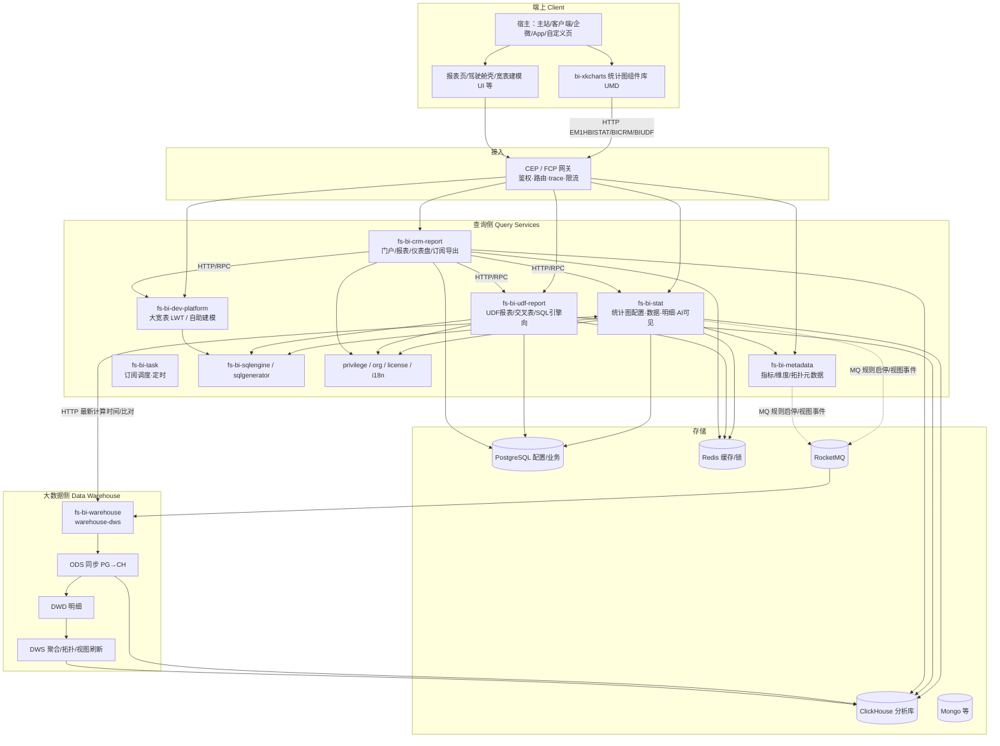
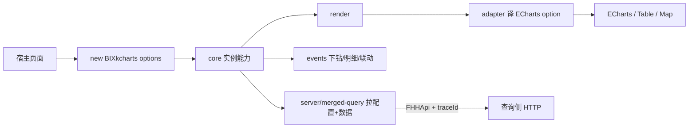
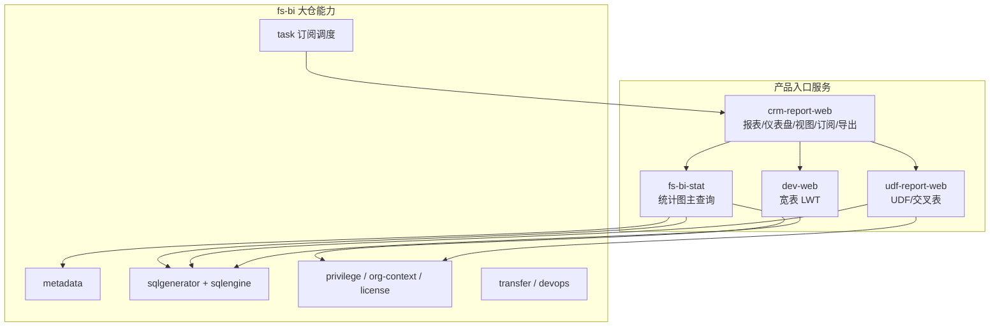
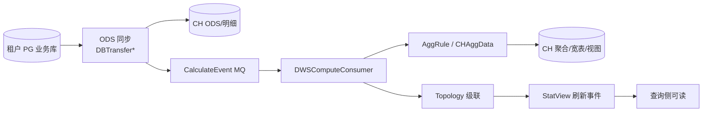

# BI 平台架构一页纸（端上 · 查询侧 · 大数据侧）

> 范围：BI **整系统**，不只数仓。  
> 仓库依据：`bi-xkcharts`（端）、`fs-bi` / `fs-bi-crm-report` / `fs-bi-udf-report` / `fs-bi-dev-platform`（查询侧）、`fs-bi-warehouse`（大数据侧）。  
> 补充：服务注册表、运维 skill、wiki 数仓分层理念。  
> 日期：2026-08-25

---

## 1. 一句话

BI = **端上可视化组件** + **查询侧应用服务集群** + **大数据侧数仓同步/聚合**。  
用户在端上配图/看数；查询侧做权限、元数据、SQL 生成与查询编排；大数据侧把 CRM/PG 数据变成可预聚合的 CH 分析态。

---

## 2. 三侧总览



---

## 3. 三侧职责对照

| 侧 | 回答的问题 | 核心仓库/产物 | 不负责 |
| --- | --- | --- | --- |
| **端上** | 怎么渲染、交互、下钻、多端适配 | `bi-xkcharts`（UMD/`BIXkcharts`） | 算数、权限裁决、同步 |
| **查询侧** | 配置从哪来、SQL 怎么生成、权限怎么注入、结果怎么缓存/导出/订阅 | `fs-bi*` 多仓多 WAR | PG→CH 全量同步与底层聚合作业 |
| **大数据侧** | 数据如何进仓、如何预聚合、视图何时算完 | `fs-bi-warehouse` | 图表 UI、门户产品交互 |

---

## 4. 端上架构（一页内）



**要点**
- 形态：组件库，不是完整 SPA；CDN UMD，全局 `BIXkcharts`
- 栈：Vue2 运行时组件 + ECharts + jQuery + 宿主 `Fx/FS/FHHApi`
- 主请求（新统计图）：
  - 配置：`/FHH/EM1HBISTAT/fs-bi-stat/stat/chartConfig/query`
  - 数据：`/FHH/EM1HBISTAT/fs-bi-stat/stat/data/query`
  - 合并：`/FHH/EM1HBISTAT/fs-bi-stat/stat/chart/query`
  - 异步：`async/sendQueryStatRequest` + `loadQueryStatResult`
  - 明细：`stat/detail/data/*`
- 兼容老门户：`/EM1HBICRM/...` → crm-report；定制图 `/EM1HBIUDF/...` → udf-report
- 能力：20+ 图型、下钻、明细、联动、主题、灰度合并查询、多端（PC/H5/企微/App）

---

## 5. 查询侧架构（一页内）



| 服务/模块 | 侧重点 |
| --- | --- |
| `fs-bi-crm-report` | CRM 门户聚合：报表/Dashboard/View CRUD、分享、订阅、导出；下游调 stat/udf/dev |
| `fs-bi` → `fs-bi-stat` | 统计图配置/数据/明细/目标规则/AI 可见；EasyStat 流水线 |
| `fs-bi` → `fs-bi-metadata` | 指标、维度、拓扑等元数据 |
| `fs-bi` → `fs-bi-task` | 订阅与定时（Sundial/Quartz） |
| `fs-bi-udf-report` | UDF 报表、透视/交叉、较重 SQL 查询 |
| `fs-bi-dev-platform` | 大宽表建模与查询（LWT） |
| `fs-bi-sqlengine` | 统一 SQL 执行（PG/CH 等，供多服务 HTTP 调用） |

**查询侧标准分层（每个 WAR）**  
Controller/Resource → Service（权限/灰度/上下文）→ SQL 生成 → SQL 执行 → PG/CH/Redis → DTO

**典型读路径（统计图预聚合）**
```text
xkcharts → CEP → fs-bi-stat
  → 缓存 → 配置/权限/组织上下文
  → EasyStat 节点（权限范围、采样、分页）
  → CH 预聚合 SQL → 回写缓存
  →（可选）HTTP warehouse 取 latestCalTime
```

---

## 6. 大数据侧架构（一页内）



| 层 | 职责 |
| --- | --- |
| ODS | PG→CH 增量/存量同步、分区 INC/STOCK/CAL、状态回写 |
| DWD | 明细规范化（仓内分层） |
| DWS | 事件驱动聚合、拓扑级联、自定义维、多币种、延迟/状态事件 |
| 运维面 | 比对 PG/CH、修分区、TTL、建表（Ods/Dws Controller） |

**与查询侧契约**
- MQ：规则启停、计算事件、视图变更（如 offline topic）
- HTTP：`getLatestCalTime` / `batchCompareViewField` 等供 stat 展示“数据更新于”

---

## 7. 跨侧主链路（必记 4 条）

### A. 统计图出图（端→查→仓数据）
```text
宿主页 → BIXkcharts.showDetail
  → chartConfig + data（或 merged chart/query）
  → fs-bi-stat →（读）CH 预聚合 + PG 元数据 + Redis
  → adapter → ECharts
  → 可选 warehouse latestCalTime
```

### B. 报表/驾驶舱（端→门户→多查询服务）
```text
门户 UI → crm-report-web
  → 权限/i18n/缓存
  → 下游 stat / udf-report / dev-platform / IQueryService
  → PG 配置 + CH 数据
```

### C. 数据变新鲜（业务→仓→可查）
```text
业务写 PG →（同步任务/事件）warehouse ODS
  → CH 明细 → CalculateEvent
  → DWS 聚合/拓扑 → StatView 刷新
  → stat/crm-report 查询命中新数据
```

### D. 配置变更驱动计算（查→仓）
```text
fs-bi 启停统计图/聚合规则（PG）
  → MQ 通知 warehouse
  → 停止或恢复 CH 侧计算资源
```

---

## 8. 存储与中间件一览

| 组件 | 端上 | 查询侧 | 大数据侧 |
| --- | --- | --- | --- |
| 浏览器/CDN | 组件与静态资源 | — | — |
| CEP/FCP | 调入口 | 接入 | 内网运维接口为主 |
| PostgreSQL | — | 配置/元数据/部分查询 | 同步源库 |
| ClickHouse | — | 分析查询 | 同步目标+聚合 |
| Redis | 前端请求缓存策略配合 | 查询缓存/锁 | 分布式锁/缓存 |
| RocketMQ | — | 发规则/任务事件 | 计算主总线 |
| Mongo | — | 部分配置/stat 相关 | 视模块而定 |
| Dubbo/ZK | — | 模块间/组织权限 | 较少用户面 |

---

## 9. 设计原则（三侧统一）

1. **端查仓分离**：渲染 / 查询编排 / 数据生产解耦  
2. **预计算优先**：交互查询尽量打 DWS，而不是每次重扫业务库  
3. **元数据驱动**：拓扑、指标、槽位、规则同时约束“怎么算”和“怎么查”  
4. **权限下推查询侧**：端上不裁决数据范围  
5. **事件驱动仓内计算**：同步完成再算，算完再通知视图就绪  
6. **多代并存**：新统计图（stat+xkcharts）与老门户（crm-report）、UDF/宽表路径并行  
7. **可分层排障**：先定侧，再定层（见 `02`）

---

## 10. 怎么用这张一页纸

- 对产品/新人：看 §2 总览 + §3 职责  
- 对前端：§4 + 链路 A  
- 对后端查询：§5 + 链路 A/B/D  
- 对数据/仓：§6 + 链路 C/D  
- 排障：转 `02-BI故障排查分层速查.md`  
- 深读：转 `03-BI整体系统架构-知识库综合.md` 与 `code-repo-analysis` 各仓架构分析
