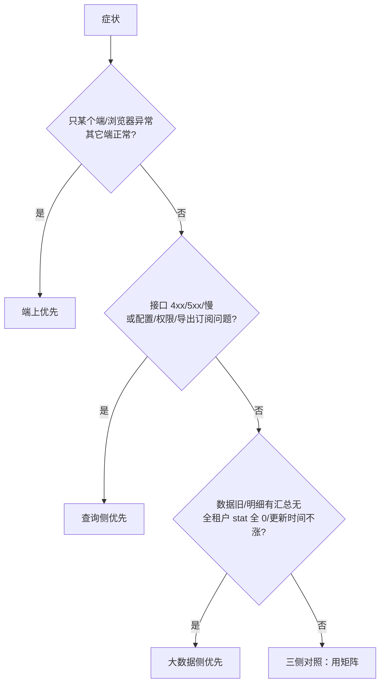

# BI 故障排查分层速查（端上 · 查询侧 · 大数据侧）

> 配套：`01-BI平台架构一页纸.md` / `03-BI整体系统架构-知识库综合.md`  
> 原则：**先定三侧，再定层；先证伪读路径，再追写路径；禁止一上来只查数仓或只怪前端。**  
> 日期：2026-08-25

---

## 0. 30 秒：先定侧



| 侧 | 典型症状 | 首查 |
| --- | --- | --- |
| 端上 | 白屏但接口 200；图型错乱；仅 App/企微缺筛选；点击下钻无反应 | xkcharts 参数/容器/全局筛选 |
| 查询侧 | CEP 5xx；stat/report 报错；权限少数据；SQL 慢但仓新鲜；导出订阅失败 | traceId → 服务 → SQL/权限/缓存 |
| 大数据侧 | 全员数据旧；latestCalTime 停更；agg 空明细有；MQ 堆积；同步任务失败 | copier/warehouse ODS→DWS |

---

## 1. 统一分层（跨三侧）

```text
端上渲染
  → 网关 CEP/FCP
  → 查询服务（crm-report / stat / udf / dev / metadata / task）
  → 权限·组织·元数据·SQL 生成/执行 · Redis
  → ClickHouse / PostgreSQL
  ↑
业务 PG → warehouse ODS → CH 明细 → MQ → DWS 聚合/拓扑/视图刷新
```

| 顺序 | 层 | 关键问题 |
| --- | --- | --- |
| 1 | 端上入参 | viewId、scene、全局筛选、人员范围是否传全 |
| 2 | 网关 | 路由 biz、status、request_time、traceId |
| 3 | 查询服务 | 配置是否存在、权限是否滤光、缓存、SQL |
| 4 | 元数据/拓扑/槽位 | topology、stat_field、udf_obj_field |
| 5 | CH/PG 数据面 | 明细/agg 是否有、值是否对 |
| 6 | 仓写路径 | ODS 新鲜度、DWS 是否算完、MQ lag |
| 7 | 异步产品 | 导出任务、订阅调度、推送 |

---

## 2. 场景矩阵（四类高频 × 三侧）

| 场景 | 端上 | 查询侧 | 大数据侧 |
| --- | --- | --- | --- |
| **同步延迟/数据旧** | 看「更新于」展示；排除仅前端缓存 | latestCalTime 接口、查询是否读旧缓存 | **主战场**：ODS lag、MQ、DWS 消费、视图刷新 |
| **数据不一致** | 展示格式/百分比/时区误导 | SQL 口径、权限过滤、slot/topology、采样 | 明细 vs agg、聚合规则、拓扑级联漏刷 |
| **报表/图慢** | 端重渲染、端容器差、无合并查询 | **主战场**：stat/udf SQL、权限范围膨胀、缓存冷 | CH merge/资源、预聚合未就绪导致打明细 |
| **权限/字段丢失** | 功能入口隐藏 vs 真无数据 | **主战场**：privilege、dt_auth、主属部门注入、field_desc | 组织维/ dim 未同步、auth 表未跟上 |

---

## 3. 场景一：数据旧 / 未更新

### 3.1 分流
1. 仅自己慢刷新、他人正常 → 查查询侧缓存键 / 端缓存  
2. 单图旧、其它图新 → 查该 view 规则是否停用、topology/agg_rule  
3. 大面积旧 → 大数据侧 ODS/DWS/MQ  

### 3.2 大数据侧步骤
1. CH 明细 `max(event_time)` vs 业务更新时间 → 量化 ODS lag  
2. MQ consumer lag（计算事件/同步相关）  
3. `paas-bi-copier` / warehouse ODS 任务错误率  
4. DWSComputeConsumer 是否消费、重试是否打满（如 cal_retry_times）  
5. StatView 刷新是否完成；stat 调 `getLatestCalTime` 是否停更  

### 3.3 查询侧步骤
- Redis `bi_stat_querycache_*` 是否长期命中旧值  
- 图/规则是否 offline（配置层停算会发 MQ 给仓）  
- 计算字段：`job-schedule` → `calculate-task-job-default` → `calculate-task`  

### 3.4 出口模板
- lag=X；卡在 ODS/MQ/DWS/缓存/规则停用；证据；是否多租户升级  

---

## 4. 场景二：数据不一致（有数但值不对）

### 4.1 对账顺序
```text
业务源 count/sum
  → CH 明细 object/mt
  → dim_data
  → agg_data + finalizeAggregation()
  → 查询侧实际 SQL（含权限/采样/时间窗）
  → 端上展示（单位/百分比/时区）
```

### 4.2 按侧常见根因
| 侧 | 根因 |
| --- | --- |
| 大数据 | 同步丢数；agg 缺；拓扑未级联；窗口未关 |
| 查询侧 | slot 错位/重复；topology 未重建；权限最小交集滤行；uniq 口径 |
| 端上 | 错误 series 映射；前端二次计算；时区展示 |

### 4.3 查询侧元数据检查
- `bi_mt_topology_table` 状态  
- `udf_obj_field` slot vs 规则映射  
- `stat_field` 聚合类型  
- 多对象图是否未开「指标级数据权限」导致整行滤光  

---

## 5. 场景三：慢 / 超时 / 转圈

### 5.1 假慢 vs 真慢
| 类型 | 特征 | 方向 |
| --- | --- | --- |
| 假慢-仓未就绪 | 稍后好了，latestCalTime 落后 | 大数据侧 |
| 假慢-缓存冷 | 首次慢再次快 | 查询侧 Redis |
| 真慢-SQL | rows_read 大、CH duration 高 | 查询 SQL 或未走预聚合 |
| 真慢-服务 | CH 不慢接口慢 | 权限/组织预处理、多次 RPC |
| 真慢-端 | 接口快画面卡 | xkcharts 渲染/端容器 |
| 网关超时 | CEP request_time 到顶 | 拆下游 |

### 5.2 端上
- 是否走合并查询灰度（减少 RTTs）  
- 是否重复 queryData；大明细是否该异步  
- 仅 PC 客户端差、浏览器正常 → 容器性能（偏端）  

### 5.3 查询侧
1. traceId：CEP → fs-bi-stat/crm-report/udf  
2. 是否命中预聚合；是否采样降级  
3. `system.query_log`：duration/rows_read/memory  
4. 权限人员集合是否膨胀  
5. udf/交叉表是否重 SQL；导出是否 CH OOM  

### 5.4 大数据侧
- 预聚合表是否存在/过期导致查询打明细  
- part merge、集群 CPU/内存、写入堆积反压查询  

---

## 6. 场景四：权限丢失 & 字段丢失

### 6.1 端上先问清
- 入口菜单都没有 → 功能权限/License/前端灰度  
- 能进图但无数据 → 数据权限或真无数  
- 仅移动端无数据 → 是否没传全局人员范围（已知端问题）  

### 6.2 查询侧
```text
功能权限 → dt_auth_simple → dim auth_code/life_status
  → 主属部门/人员范围注入 → 多对象最小交集
  → bi_field_desc / 字段类型是否支持 / API Name 限制
```

### 6.3 大数据侧
- 组织维、dim、auth 相关同步是否落后于组织变更  
- 停用员工 life_status 未更新导致“多了人”或映射断裂  

### 6.4 字段专线（计算字段）
```text
后台字段启用 → bi_field_desc
  → job-schedule 触发 → MQ calculate-task-job-default
  → calculate-task 执行 → CH 有值 → 查询侧能选出
```

---

## 7. 端上专项清单

| 检查项 | 方法 |
| --- | --- |
| 请求是否发出 | 网络面板：chartConfig/data/chart/query |
| 参数 | id/viewId、from、scene、queryParams、全局筛选 |
| 宿主依赖 | `FHHApi`、`Fx`、`$t`、echarts 是否加载 |
| 错误态 | xkcharts 空态/错误 DOM vs 接口 error |
| 多端差异 | 对比 Web 与 App/企微同一 viewId |
| 第三方壳 | 自定义页/驾驶舱布局问题 vs 数据问题（壳归前端团队） |

**端上结论必须带**：接口 status + 关键请求 URL + 是否他端复现  

---

## 8. 查询侧专项清单

| 服务 | 何时查 |
| --- | --- |
| `fs-bi-stat` | 统计图配置/数据/明细/异步查询 |
| `fs-bi-crm-report` | 报表门户、订阅、导出、仪表盘编排 |
| `fs-bi-udf-report` | UDF/交叉表/重 SQL |
| `fs-bi-dev-platform` | 宽表 LWT |
| `fs-bi-metadata` | 指标维度拓扑元数据 |
| `fs-bi-task` | 订阅定时是否触发 |
| `fs-bi-sqlengine` | 统一 SQL 执行异常 |
| `data-auth-service-bi` / privilege | 权限差异 |

**最小取证包**
1. tenant/ei/ea、user、viewId/reportId、时间窗  
2. traceId/reqId  
3. CEP status + request_time  
4. 服务内错误栈 / StopWatch  
5. 实际 SQL + CH query_log  
6. 缓存是否命中  
7. 权限 diff（列表可见 vs 图可见）  

---

## 9. 大数据侧专项清单

| 组件 | 何时查 |
| --- | --- |
| ODS `DBTransfer*` | 明细不进 CH |
| `CalculateEventProducer/Consumer` | 明细到了汇总没有 |
| `DWSComputeService` / AggRule | 聚合值错或空 |
| `TopologyTableService` | 下游表未级联 |
| StatView 刷新 | 图一直提示计算中/旧 |
| 比对接口 compare PG/CH | 修数前置 |
| License 同步许可 | 同步被拒 |

**仓侧出口必须带**：ODS lag、DWS 消费滞后、规则状态、latestCalTime  

---

## 10. 产品异步面：导出 / 订阅

| 问题 | 顺序 |
| --- | --- |
| 导出失败 | 先网页查询是否正常 → export 服务/任务 → CH 内存/超时 → 文件服务 |
| 订阅不推 | 网页数据是否正常 → task 调度记录 → 快照导出 → 推送权限/企信邮件 → 时区 |

大面积调度失败 → 按查询侧 S2；推送泄露 → S1。

---

## 11. 三侧协作升级

| 现象 | 协作 |
| --- | --- |
| 仅一端 UI 异常且接口正常 | 前端/端团队 |
| 接口错/慢/权限错 | BI 查询侧后端 |
| 多租户数据停更/聚合停 | 数据平台/warehouse |
| 组织权限底座异常 | PaaS 权限/组织 + BI |
| 驾驶舱壳白屏 | 大前端布局；数据接口另案 |

---

## 12. 反模式

- 只盯 wiki 数仓图，忽略 xkcharts 入参与 stat 流水线  
- 数据不对不先对账明细 vs agg，直接改前端  
- 慢查询不拆 CEP/服务/CH/端渲染四段耗时  
- 跨租户对比配置与数据量  
- CH 裸查无租户/时间过滤  
- 把移动端缺全局筛选当成数仓丢数  

---

## 13. 和文档/代码索引的关系

- 架构总览：`01` / `03`  
- 仓内细链路：`code-repo-analysis/大数据/*warehouse*`  
- 查询侧细链路：`code-repo-analysis/后端/*`  
- 端上细链路：`code-repo-analysis/前端/*xkcharts*`  
- 单接口时序：`code-repo-analysis/调用链路/*`  
