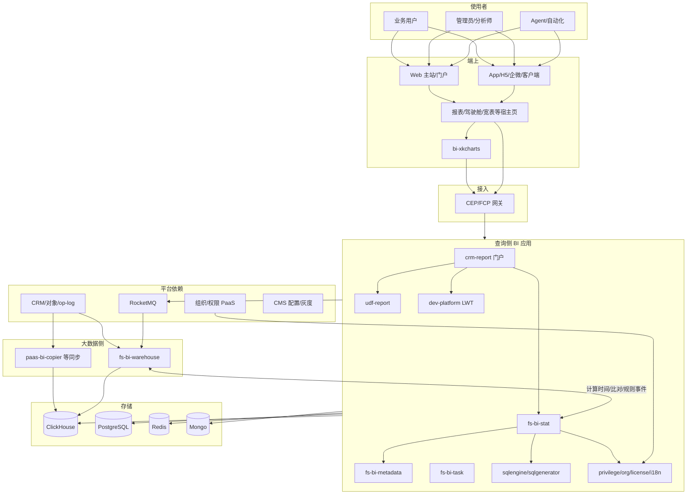
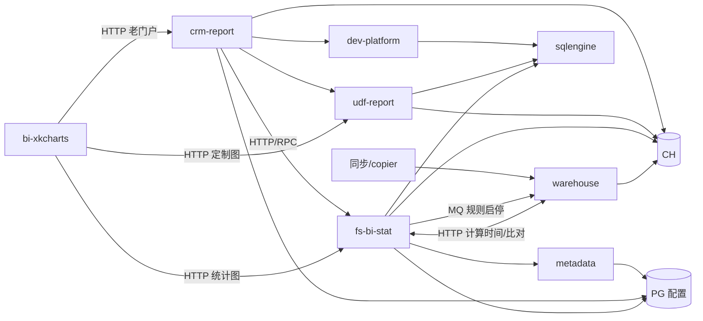

# BI 整体系统架构（端上 · 查询侧 · 大数据侧）

> **定位**：BI 全系统架构说明（不是只讲数仓）。  
> **主要依据**：
> - 代码解读：`code-repo-analysis` 下前端 / 后端 / 大数据六仓架构分析与全链路走读（2026-08-20）
> - 运行注册：`fx-ops-knowledge` 服务注册表
> - 运维诊断：`fx-ops-bi` / `fx-ops-query`
> - 数仓理念补充：wiki「数据平台架构图」（仅覆盖大数据侧分层，需放入三侧框架理解）
>
> 日期：2026-08-25

---

## 1. 结论摘要

纷享 BI 是一个 **三侧协同的分析系统**：

| 侧 | 本质 | 核心仓库 |
| --- | --- | --- |
| **端上** | 可视化与交互运行时（组件库） | `bi-xkcharts` |
| **查询侧** | 分析应用与查询编排（多 WAR/多仓） | `fs-bi`、`fs-bi-crm-report`、`fs-bi-udf-report`、`fs-bi-dev-platform` |
| **大数据侧** | 数据生产：同步 + 预聚合 + 视图就绪 | `fs-bi-warehouse`（及同步生态如 `paas-bi-copier`） |

一句话链路：

```text
端上负责“看与点” → 查询侧负责“权、配、查、导” → 大数据侧负责“进得来、算得完”
```

wiki《数据平台架构图》描述的 ODS/DWD/DWS、宽表、CH 事件，属于 **大数据侧**；若只读该文会漏掉端上组件化出图与查询侧多服务编排，导致架构不完整。

---

## 2. 系统上下文



---

## 3. 三侧详解

### 3.1 端上（Client）

#### 定位
- **不是**后端微服务，而是 **UMD 统计图组件库**（全局 `BIXkcharts`），被主站、客户端、第三方页以 script 引入。
- 负责：图表渲染、交互（图例/下钻/明细/联动）、多端适配、请求封装（traceId、FHHApi、解密）。

#### 技术栈
- Vue 2 运行时组件 + ECharts + jQuery + underscore + moment 等
- 构建：`@vue/cli-service`，产物 `dev/devo/prod` 上传 CDN
- 宿主全局：`Fx` / `FS` / `$t` / `window.BI.util.FHHApi` / `biPluginManager` / seajs 动态组件

#### 内部结构
```text
宿主环境
  → BIXkcharts 实例（一图一例）
  → core（server / merged-query / events / render / theme / resize…）
  → adapter（bar-line/pie/funnel/… → ECharts option）
  → components + ECharts/Table/Map 引擎
```

#### 对查询侧的主要 HTTP 契约
| 路径前缀/接口 | 下游 | 用途 |
| --- | --- | --- |
| `/FHH/EM1HBISTAT/fs-bi-stat/stat/chartConfig/query` | fs-bi-stat | 图配置 |
| `.../stat/data/query` | fs-bi-stat | 图数据（预聚合主路径） |
| `.../stat/chart/query` | fs-bi-stat | 配置+数据+筛选合并 |
| `.../async/sendQueryStatRequest` & `loadQueryStatResult` | fs-bi-stat | 异步查询 |
| `.../stat/detail/data/*` | fs-bi-stat | 明细 |
| `/EM1HBICRM/...` | crm-report | 老门户统计图/明细 |
| `/EM1HBIUDF/...` | udf-report | 销售过程/目标等定制图 |

#### 端上边界
- 布局壳、导航、自定义页驾驶舱容器问题 → 大前端/宿主，不完全是 xkcharts
- 数据对错、权限、慢 SQL → 查询侧/大数据侧

---

### 3.2 查询侧（Query）

查询侧是 BI **应用层**：多仓库、多可部署 WAR，经网关承载用户分析请求。

#### 3.2.1 仓库地图

| 仓库 | 类型 | 系统职责 |
| --- | --- | --- |
| **fs-bi** | 大仓多应用 | 元数据、统计图查询、任务订阅、迁移、SQL 生成执行、权限上下文等 **核心应用能力** |
| **fs-bi-crm-report** | 门户服务 | 报表/仪表盘/视图产品面：编排、分享、订阅、导出；聚合调用下游 |
| **fs-bi-udf-report** | 查询引擎型应用 | UDF 报表、交叉/透视、偏重 SQL 的数据查询 |
| **fs-bi-dev-platform** | 自助建模 | 大宽表 LWT 新建/编辑/查询/导出 |

> fs-bi README 定位：**应用层服务**；**数据生产**由 warehouse 承担。

#### 3.2.2 fs-bi 模块拆分（查询侧中枢）

| 模块 | 职责 |
| --- | --- |
| `fs-bi-stat` | 统计图配置/数据/明细/指标/目标规则/AI 可见性 |
| `fs-bi-metadata` | 报表/指标/维度等元数据 |
| `fs-bi-task` | 订阅与定时（Sundial/Quartz）、i18n 管理 |
| `fs-bi-transfer` / `fs-bi-devops` / `fs-bi-metadata-ant` | 迁移、运维、元数据自动化 |
| `fs-bi-sqlgenerator` / `fs-bi-sqlengine` | SQL 生成与执行（可被其它服务 HTTP 调用） |
| `fs-bi-privilege` / `organization-context` / `permission-context` | 数据权限与组织上下文 |
| `fs-bi-api/common/cache/mq/license/i18n/client...` | 契约与基础设施封装 |

分层（单 WAR 内）：Controller/Resource → Service → DAO/MyBatis → PG/CH；横切 AOP/灰度/ThreadLocal 上下文。

#### 3.2.3 crm-report 门户
- 对外 FCP 接口；对内编排 Dashboard/Report/View
- Dubbo：`IQueryService` 等
- HTTP 下游：`FSBIResource`（stat）、`BIUDFResource`（udf-report）、`BIDEVResource`（dev-platform）
- 能力：权限、i18n、缓存、订阅、导出、推送（企信/邮件）

#### 3.2.4 udf-report
- UDF 视图数据、交叉表、模板、异步查询、校验
- 执行依赖 SQL 引擎/CH/PG；与 license、权限集成

#### 3.2.5 dev-platform
- LWT 大宽表与自定义对象数据处理
- 调 sqlengine、stat、udf；可调外部 LWT 计算服务

#### 3.2.6 查询侧标准读路径（统计图）

```text
CEP
 → fs-bi-stat
 → RequestContext / Sentinel / I18n
 → 查询缓存（Redis）
 → 配置（metadata）+ 功能权限
 → EasyStat 流水线：
      组织上下文 → 主属部门权限注入 → 采样 → 分页 → 执行
 → ClickHouseSQLExecutor
 →（可选）warehouse HTTP：最新计算时间 / 字段比对
 → 返回 DTO → 端上 adapter 渲染
```

#### 3.2.7 查询侧写配置路径（影响仓）
- 启停统计图/聚合规则：改 PG 规则状态 → MQ 通知 warehouse 停/启计算
- 订阅：task 调度 → 查数快照 → 推送
- 导出：异步任务 → 查询 → 文件打包

---

### 3.3 大数据侧（Data）

#### 定位
- 仓库 **fs-bi-warehouse**（过程名常见 `warehouse-dws`）：数仓同步 + DWS 聚合计算 + 运维面
- 同步生态还包括注册表中的 `paas-bi-copier` 等（PaaS→BI 同步）
- wiki 架构图/分层理念主要落在本侧

#### 仓内分层
| 层 | 含义 |
| --- | --- |
| **ODS** | PG（多租户业务库）→ CH 同步；分区 INC/STOCK/CAL；状态机 |
| **DWD** | 明细规范化 |
| **DWS** | 事件驱动聚合、拓扑级联、自定义维、多币种、延迟/状态事件、视图刷新 |

#### 核心流程
1. **ODS 同步**  
   配置 `DbSyncInfo` → `DBTransferService`/`APgDBTransferService` 抽 PG → 映射转换 → 写 CH → 更新同步状态 → `CalculateEventProducer`
2. **DWS 聚合**  
   MQ `DBUpdateMessage` → `DWSComputeConsumer` → `DWSComputeService` → `AggRule`/`CHAggData` → `TopologyTableService` 级联 → `StatViewEventProducer`
3. **视图就绪**  
   `DWSViewChangeConsumer` 等 → 预计算校验 → 刷新 → 查询侧可读
4. **比对修复**  
   compare PG/CH、修分区、TTL、重建等运维接口

#### 技术特征
- Spring Boot + MyBatis；PG/CH 双源多租户路由
- RocketMQ 自动装配消费者；Redis 锁；Quartz；Actuator
- CH：Replicated\*MergeTree、分区、TTL
- 与查询侧契约：HTTP（latestCalTime、比对）+ MQ（规则/计算/视图）

#### 数仓设计原则（wiki + 仓实现）
- 分层清晰、血缘可追、中间层复用、空间换时间
- 对象拓扑驱动宽表/聚合规则
- 同步与计算并行化（分区友好）
- 高吞吐同步（流式等工程优化）

---

## 4. 跨侧架构关系（调用语义）



全链路阅读顺序（与 code-repo-analysis README 一致）：

```text
前端 bi-xkcharts
  → fs-bi-crm-report（门户）
  → fs-bi（stat/metadata/task/sql*）
  → fs-bi-udf-report
  → fs-bi-dev-platform
  → fs-bi-warehouse
```

---

## 5. 逻辑视图：五层 + 三侧映射

| 逻辑层 | 端上 | 查询侧 | 大数据侧 |
| --- | --- | --- | --- |
| 体验 | xkcharts 渲染/交互；宿主页 | 报表/仪表盘 API 语义 | 「数据更新于」等就绪信息 |
| 接入 | FHHApi/ajax/trace | CEP/FCP、bizName 路由 | 内网运维 API、MQ |
| 领域 | adapter/scene/gray | stat 流水线、权限、订阅导出、LWT、UDF | ODS/DWS 领域服务 |
| 数据计算 | — | SQL 生成执行、缓存 | 同步、聚合、拓扑、视图刷新 |
| 存储 | 浏览器内存/本地 | PG/CH/Redis/Mongo | CH 主数据面、PG 源、Redis 锁 |

---

## 6. 运行视图：四条主链路

### 6.1 统计图出图（最频繁）
端上 init → 配+数（或 merged）→ stat → 权限+SQL → CH 预聚合 → 渲染；并可能问 warehouse 最新计算时间。

### 6.2 报表/驾驶舱编排
宿主/门户 → crm-report →（多图）stat/udf/dev → 聚合展示；订阅/导出走 task/export 异步。

### 6.3 数据生产到可查
业务 PG 变更 → ODS 同步进 CH → 计算事件 → DWS 聚合与拓扑 → StatView 刷新 → 查询命中新结果。

### 6.4 配置驱动降本
查询侧停用图/规则 → MQ → warehouse 停算；启用则恢复。体现 **控制面在查询侧配置，数据面在仓**。

---

## 7. 数据视图

### 7.1 存储分工
| 存储 | 主要所有者 | 内容 |
| --- | --- | --- |
| ClickHouse | 大数据写、查询侧读 | ODS/DWD/DWS、agg/dim/明细、组织维等 |
| PostgreSQL | 双角色 | 业务源（仓读）；BI 配置/元数据/规则（查询侧） |
| Redis | 查询侧为主 | 查询缓存、锁；仓侧锁/缓存 |
| Mongo | 查询侧 | 如 bi-stat 字段配置等 |
| CDN/浏览器 | 端上 | xkcharts 静态资源 |

### 7.2 关键分析表（查询×仓共用语言）
`agg_data`、`dim_data`、`mt_data`/`object_data`、`bi_mt_topology_table`、`stat_field`、`udf_obj_field`、`agg_rule`、`dt_auth_simple`、`goal_value(_obj)`、`org_*` 等。

### 7.3 控制面 vs 数据面
- **控制面**：拓扑、槽位、指标、规则、权限、图配置（多在 PG/Mongo + 查询服务）
- **数据面**：CH 中明细与预聚合结果（warehouse 生产）
- slot 变更后 topology 需重建、规则 T+1、多对象权限最小交集等，都是控制面约束数据面可见性的典型点

---

## 8. 产品能力视图（映射到三侧）

| 产品能力 | 端上 | 查询侧 | 大数据侧 |
| --- | --- | --- | --- |
| 统计图 | xkcharts 主场 | fs-bi-stat | 预聚合/视图刷新 |
| 报表/仪表盘 | 宿主页 | crm-report + 下游 | 明细/汇总数据 |
| 宽表自助 | 建模 UI | dev-platform | 相关同步表 |
| UDF/交叉表 | 定制容器 | udf-report | CH 数据 |
| 目标 | 图/页展示 | stat/goal 相关 + 清洗任务 | 目标相关表同步/聚合 |
| 订阅 | 收件体验 | task + crm-report | 数据新鲜度前提 |
| 导出 | 下载 | export/异步查询 | CH 资源 |
| AI 分析 | Agent/洞察展示 | stat AI 可见/语义 | 仍依赖可信数据面 |
| 权限 | 入口与无数据提示 | privilege/auth 注入 | dim/auth 同步 |

---

## 9. 部署与进程视图（逻辑）

| 进程/产物 | 侧 | 形态 |
| --- | --- | --- |
| bi-xkcharts CDN UMD | 端上 | 静态资源 |
| fs-bi-* 多个 WAR | 查询侧 | Tomcat + Dubbo/ZK（fs-bi 传统 Spring XML 系） |
| crm-report-web WAR | 查询侧 | Tomcat |
| udf-report-web / dev-web | 查询侧 | Tomcat/Spring Boot 系（以各仓为准） |
| warehouse-dws | 大数据侧 | Spring Boot 应用 |
| paas-bi-copier 等 | 大数据/同步 | 独立服务 |
| CH/PG/Redis/MQ/Mongo | 基础设施 | 多租户路由与配置中心下发 |

> 具体副本数、K8s 拓扑、CH 集群分片以运维配置为准；源码仓内常缺生产拓扑。

---

## 10. 团队与演进

| 方向 | 主要团队倾向 |
| --- | --- |
| 端上图表 | 前端/BI 前端 |
| 查询应用（stat/report/metadata） | 数据业务技术 BI 组 |
| warehouse/同步/SQL 引擎深水区 | 数据业务技术平台组 |
| 数据权限底座 | PaaS 元数据/权限（如 data-auth-service-bi） |
| 驾驶舱壳/导航 | 大前端 |

演进特征：
1. 新统计图链路（xkcharts + fs-bi-stat + CH 预聚合）成为主路径  
2. 老门户 crm-report、实时/离线自定义统计计算族仍并存  
3. 应用层与数据层仓库拆分清晰（fs-bi vs warehouse）  
4. AI 能力叠加在查询侧资产与端上/Agent 入口之上  

---

## 11. 架构原则

1. **三侧分离、契约协作**（HTTP/MQ/表结构）  
2. **预计算优先，查询编排次之，端上轻裁决**  
3. **元数据控制面驱动数据面与 SQL**  
4. **权限在查询侧下推，端上只展示结果**  
5. **仓内事件驱动，同步与计算解耦**  
6. **多代产品并存时，排障先识别链路世代**  
7. **可观测按侧切开**：端 RUM/网络、CEP、服务日志、CH、MQ lag  

---

## 12. 用架构看问题（速查）

| 问题 | 优先侧 | 次优先 |
| --- | --- | --- |
| 仅某端白屏/交互坏，接口 200 | 端上 | 宿主壳 |
| 接口错、权限少、导出订阅坏 | 查询侧 | 权限底座 |
| 大面积旧数、更新时间停、agg 空 | 大数据侧 | 查询缓存 |
| 慢 | 先拆端/网关/服务/CH | 再看是否预聚合未就绪 |
| 字段选不到 | 查询侧 field_desc/类型 | 重算与同步 |
| 驾驶舱壳异常 | 大前端 | 单图再进 BI 三侧 |

更细步骤见 `02-BI故障排查分层速查.md`。

---

## 13. 文档与代码索引

| 需求 | 文档 |
| --- | --- |
| 一页纸图 | `01-BI平台架构一页纸.md` |
| 排障 | `02-BI故障排查分层速查.md` |
| 本文 | `03-BI整体系统架构-知识库综合.md` |
| 端上深读 | `code-repo-analysis/前端/*xkcharts*` |
| 查询侧深读 | `code-repo-analysis/后端/fs-bi*` 等 |
| 大数据深读 | `code-repo-analysis/大数据/*warehouse*` |
| 单接口时序 | `code-repo-analysis/调用链路/*` |
| wiki 数仓图 | pageId=587826921（仅大数据侧补充） |

---

## 14. 可信度与缺口

**已交叉验证**
- 六仓职责与跨仓调用方向（架构分析 + 全链路走读）
- 统计图主 HTTP 契约与 stat 预聚合读路径
- warehouse ODS→DWS→视图刷新写路径
- 服务注册表中的 BI 进程名与团队

**仍需运维/配置确认**
- 生产部署拓扑与实例规模
- MQ topic/消费组全表
- CH 集群与租户路由全量规则
- 新老链路流量比例
- copier 与 warehouse ODS 的分工边界在不同环境的实际比例

---

## 15. 收束

BI 系统架构若只谈 ClickHouse 分层，会把系统误读成「数仓项目」。  
完整理解必须同时看到：

1. **端上**如何用组件库把配置与数据变成可交互图表；  
2. **查询侧**如何用多服务完成权限、元数据、SQL、缓存、订阅导出；  
3. **大数据侧**如何把业务数据持续生产成可预聚合的分析态，并与查询侧通过 MQ/HTTP 契约咬合。

三者任一缺失，都不是真实运行中的 BI。
