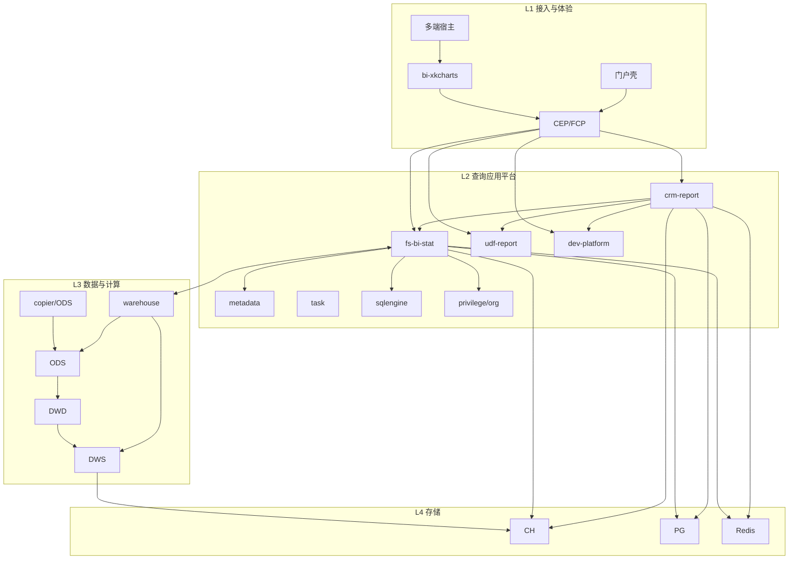
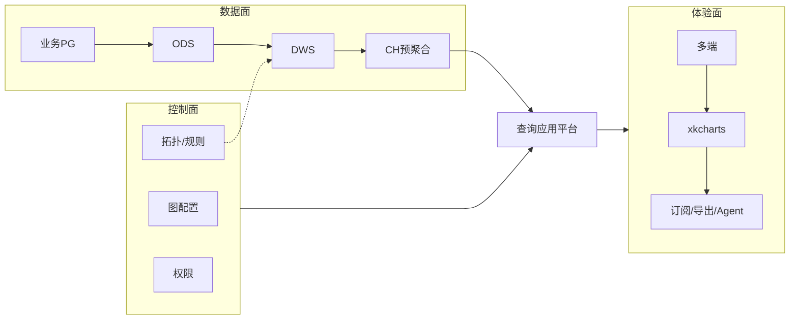

# BI 平台架构流程图

> 可交互版：`BI-平台架构流程图.html`（推荐）  
> 约定：**每张图上方先讲解，再给流程图。**

---

## 图 A · BI 平台分层架构（主图）

### 讲解

把 BI 看成分层平台：上层接用户，中层查询应用，下层数据生产，底存储/消息/中台依赖。

| 层级 | 是什么 | 起什么作用 | 典型组件 |
| --- | --- | --- | --- |
| L1 接入与体验 | 入口与图表运行时 | 多端打开、渲染、网关接入 | 宿主、xkcharts、CEP |
| L2 查询应用平台 | BI 应用服务群 | 配置权限 SQL 门户订阅导出 | crm-report/stat/metadata/udf/dev/task/sql* |
| L3 数据与计算平台 | 数仓同步预计算 | 入仓聚合拓扑视图就绪 | copier、warehouse、ODS/DWS |
| L4 存储平台 | 状态落盘 | 分析数据/配置/缓存 | CH/PG/Redis/Mongo |
| L5 消息配置观测 | 平台支撑 | 事件、灰度、发现、监控 | MQ/CMS/Dubbo/日志指标 |
| L6 中台依赖 | 外部水电煤 | 业务变更、组织、权限底座 | CRM、组织、data-auth |

### 流程图

---

## 图 B · 控制面 / 数据面 / 体验面

### 讲解

| 面 | 是什么 | 起什么作用 |
| --- | --- | --- |
| 控制面 | 配置与策略 | 决定怎么算、谁能看、何时订阅导出 |
| 数据面 | 数据生产 | 业务变更→同步→聚合→CH 预聚合 |
| 体验面 | 用户出口 | 图表渲染、订阅、导出、Agent |
| 查询应用平台 | 中间编排 | 读控制面+数据面，输出体验面 |

### 流程图

