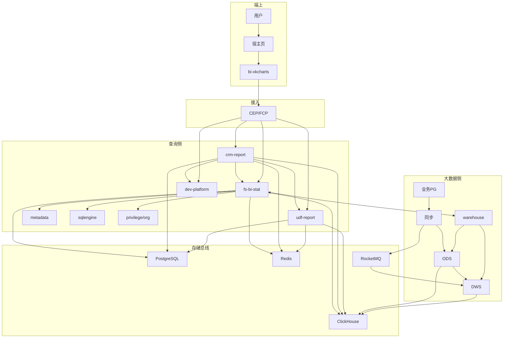
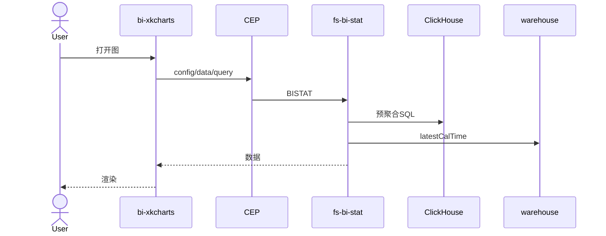
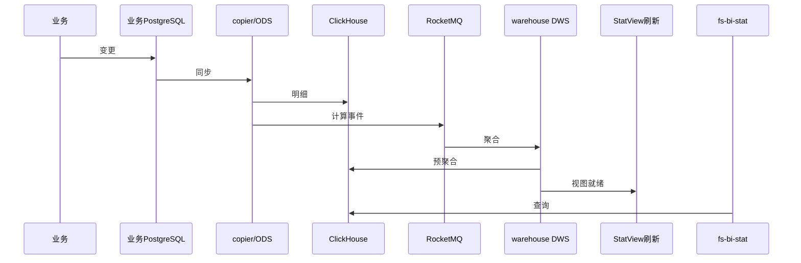
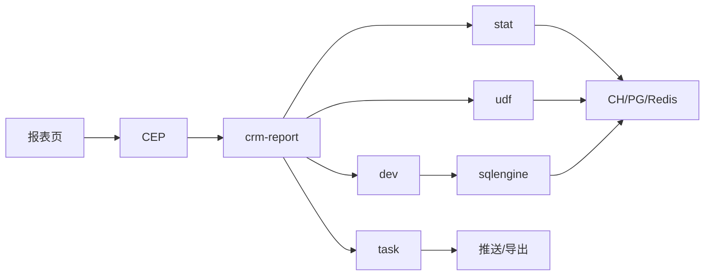

# BI 整体系统架构流程图

> 可交互版：`BI-整体系统架构流程图.html`（推荐）  
> 约定：**每张图上方先讲解节点含义，再给流程图。**

---

## 图 1 · 整体系统全景流程（主图）

### 讲解

这张图讲 BI 整系统三侧协同：端上负责看与点，查询侧负责权/配/查/导，大数据侧负责进得来、算得完。

| 区块 | 是什么 | 起什么作用 |
| --- | --- | --- |
| ① 端上 | 宿主页 + bi-xkcharts | 渲染交互，发 HTTP 查数 |
| ② 接入 | CEP/FCP | 鉴权、路由、trace、限流 |
| ③ 查询侧 | crm-report/stat/udf/dev/metadata/task/sql* | 门户编排、统计图、权限、SQL、订阅导出 |
| ④ 大数据侧 | 同步 + warehouse ODS/DWS | 入仓、预聚合、视图就绪 |
| ⑤ 存储与总线 | CH/PG/Redis/MQ | 分析数据、配置、缓存、事件 |

### 流程图

---

## 图 2 · 读路径：统计图出图流程

### 讲解

用户打开统计图时的读路径。默认读 CH 预聚合，不实时扫业务库。

| 节点 | 是什么 | 起什么作用 |
| --- | --- | --- |
| bi-xkcharts | 前端图表组件库 | 拉配置/数据并渲染 |
| CEP/FCP | 网关 | 鉴权路由到 BISTAT |
| fs-bi-stat | 统计图查询服务 | 权限、SQL、缓存编排 |
| Redis | 结果缓存 | 同条件短时命中（默认约 10 分钟） |
| ClickHouse | 分析库 | 返回预聚合/明细结果 |
| warehouse | 数仓 | 可选返回数据更新时间 |

### 流程图

---

## 图 3 · 写路径：数据生产到可查

### 讲解

业务数据如何变成统计图可查数据（写路径/数据生产）。

**总流程：** 业务写库 → 同步进 CH → MQ 通知可算 → DWS 预聚合 → StatView 就绪 → fs-bi-stat 可查。

| 节点 | 是什么 | 起什么作用 |
| --- | --- | --- |
| **业务 PostgreSQL** | CRM/PaaS 事务业务库 | **真相源**。订单/客户等变更先落这里，是同步起点 |
| **copier / ODS Transfer** | 同步组件（paas-bi-copier、warehouse ODS Transfer） | **搬运工**。PG→CH 明细入仓，并触发计算事件 |
| **ClickHouse** | 分析库 | **分析仓库**。存明细 + 预聚合，供查询 |
| **RocketMQ** | 消息队列 | **传话筒**。同步与计算解耦、削峰重试 |
| **warehouse DWS** | fs-bi-warehouse 汇总计算层 | **预加工车间**。聚合/拓扑，写 agg/dim 等 |
| **StatView 刷新** | 统计视图就绪环节 | **完工灯**。标记图数据可查，支撑更新时间 |
| **fs-bi-stat** | 查询侧统计图服务 | **传菜口**。不生产数据，读就绪结果出图 |

**易混：**
- 业务 PG ≠ BI 配置 PG
- ODS=明细入仓，DWS=汇总预聚合
- fs-bi-stat 在写路径末端是“消费已生产数据”，不是搬运同步

**人话：** 改订单 → 抄进分析仓 → 发任务单 → 预汇总 → 点亮完工灯 → 查询服务出图。

### 流程图

---

## 图 4 · 门户报表编排流程

### 讲解

报表/仪表盘由 crm-report 总包调度，再分发给 stat/udf/dev，订阅导出走 task/异步。

| 节点 | 是什么 | 起什么作用 |
| --- | --- | --- |
| crm-report | 门户/报表服务 | Dashboard/Report 编排、订阅导出入口 |
| fs-bi-stat | 统计图服务 | 图数据 |
| udf-report | UDF/交叉表 | 重 SQL/定制查询 |
| dev-platform | 宽表平台 | LWT 相关 |
| task | 调度 | 订阅定时 |
| sqlengine | SQL 引擎 | 统一执行 SQL |

### 流程图

---

## 图 5 · 配置变更驱动数仓计算

### 讲解

控制面在查询侧，数据面在仓：fs-bi 改规则并发 MQ，warehouse 才真正停/起算。

| 节点 | 是什么 | 起什么作用 |
| --- | --- | --- |
| 管理员启停 | 控制操作 | 发起是否还要算 |
| fs-bi 更新 PG 规则 | 配置变更 | 记录规则状态 |
| MQ | 事件总线 | 通知数仓 |
| DWS 停/起算 | 计算开关 | 省资源或恢复预聚合 |
| CH/端查询 | 结果与感知 | 用户看到启用/停用效果 |

### 流程图

