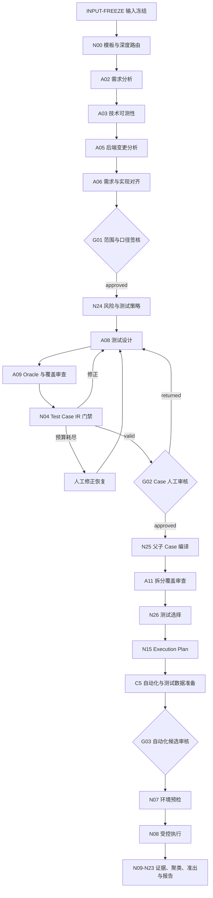

# 服务端需求自动化测试 All-in-One 说明

> 更新：2026-09-15。本文以当前 `qa-agents/` 实现、契约、策略、测试和运行脚本为准，
> 面向后续分享文档重写；历史时间线和逐步实跑记录见 `qa-agents/IMPLEMENTATION_STATUS.md`。

---

## 1. 一页结论

服务端需求自动化测试是一套 **需求级、可审计、fail-closed** 的质量工作流。它不是
“让模型直接写测试”的工具，而是把测试工作拆成：

1. 冻结需求和变更证据；
2. Agent 只输出结构化判断与候选；
3. 确定性程序做 Schema、哈希、策略、路径、权限和状态校验；
4. 人工 Gate 只在明确停顿点签核；
5. 执行、证据、缺陷、豁免和准出全部留下可回放记录。

### 分享时的核心叙事

| 问题 | 当前解法 | 已验证效果 |
| --- | --- | --- |
| 测试设计口径靠聊天记录传递 | `INPUT-FREEZE` + Artifact Envelope + 哈希绑定 | 需求、方案、代码、策略、Prompt、模型和输入版本可复现 |
| Agent 输出不可信 | Schema、来源引用、工具轨迹、独立审查、确定性门禁 | 非法输出拒收入主链，不能靠状态或口头描述放行 |
| Agent 之间上下文污染 | 不共享聊天历史，只传结构化 Artifact | 每个节点按契约消费最小输入，证据可回查 |
| 人工审批不可追溯 | G01/G02/G03 请求、决策、结果三份内容寻址文档 | Issue 状态不是审批；有效人工评论才生成决策 |
| 自动化容易越权 | Artifact-only 生成、最小权限 Runner、仓库只读、路径受限 | 候选默认不写业务仓，不建 MR，不上传外部系统 |
| 质量结论不可解释 | 执行证据、失败聚类、质量信号和确定性规则 | 缺结果输出 `inconclusive`，不伪造通过 |

### 当前定位

- 编排平台：Multica。
- 实现形态：本地/工作流参考运行时，已接真实 Multica Agent、真实需求和真实代码证据。
- 主链能力：从输入冻结、分析、对齐、人工范围签核、测试设计、Oracle 审查、Case 编译、
  自动化生成、测试数据规划，到参考执行和质量报告，均有契约与实现。
- 生产边界：尚未完成生产隔离 Runner、TAPD/MR/发布/通知等外部 Adapter、生产模型灰度和
  完整职责分离。当前不能把 `completed_with_gaps`、本地提交或人工批准解释为生产发布放行。

---

## 2. 系统目标与不做什么

### 2.1 目标

- 覆盖一个需求从输入冻结到质量关闭的完整生命周期。
- 用 `Test Intent` 固化“为什么测、防什么风险”。
- 用 `Test Case IR` 作为框架无关的测试主模型。
- 用 `Automation Manifest` 和 `Execution Plan` 分离代码候选与执行计划。
- 用 Multica 提供父卡、节点卡、Agent Run 和人工审核入口。
- 用确定性节点裁决冲突、覆盖、可执行性、环境、安全和准出。
- 用离线评估沉淀人工修正，避免同一类 Agent 错误重复发生。

### 2.2 非目标

- 不替代 QA Owner 的范围、口径和准出责任。
- 不允许 Agent 直接写业务仓库、创建 MR、上传测试资产或创建缺陷。
- 不把 Multica 卡片状态当成流程事实；卡片只是人工交互和状态投影。
- 不为通过测试而修改 Oracle 或业务断言。
- 不用本地参考执行环境冒充生产隔离环境。

### 2.3 设计原则

| 原则 | 实现含义 |
| --- | --- |
| Agent 判断、程序执行 | LLM 负责理解、设计、归因候选；校验、执行、统计、写入由确定性程序完成 |
| 生成与审查分离 | A08/A09、A14/A18、A22/N27 均为不同职责，审查者不能给生成者背书 |
| 一切内容寻址 | 输入、Artifact、请求、决策、策略、候选和审计均使用 SHA-256 绑定 |
| fail-closed | 缺字段、旧哈希、越权、路径逃逸、工具轨迹不合规一律 blocked/拒收 |
| 最小上下文 | 每个节点只接收该节点需要的冻结输入，避免共享聊天历史 |
| 一需求一稳定工作流 | 一个 `requirement_id` 对应一个 `workflow_id`；每次触发产生新 Run |
| 阶段卡是投影 | C1-C8 只展示内部节点状态，不能反向驱动调度 |

---

## 3. 核心概念

| 概念 | 含义 |
| --- | --- |
| `workflow_id` | 需求级稳定工作流，绑定父卡和配置 |
| `workflow_run_id` | 一次触发的运行实例；重跑产生新 Run，不覆盖历史 |
| `source_snapshot_id` | 冻结输入版本，绑定需求、方案、仓库、commit、OpenAPI、策略和知识快照 |
| Artifact | Agent/确定性节点的唯一正式输出，含 Schema、状态、证据、哈希和 Producer |
| 确定性节点 | `N*` 程序节点，负责路由、校验、编译、执行、聚合和决策 |
| Agent | `A*` 语义节点，只能输出候选或审查结论，不能直接修改主链状态 |
| Skill | 版本化能力包，声明适用 Agent、副作用类型和允许工具 |
| Human Gate | `G*` 人工停顿点，必须有绑定请求和有效决策 Artifact |
| Stage Card | C1-C8 用户视图，由内部节点状态投影生成 |
| Provider | 外部 Case 草稿提供方，只能以固定 commit 和 artifact-only 模式接入 |

---

## 4. 实现架构

```text
Multica 控制面
  ├─ 需求父卡 / C1-C8 阶段卡 / 节点卡
  ├─ Agent Issue / Run / 附件 / 评论 / 工具轨迹
  └─ 人工 Gate 交互
        │
        ▼
统一监听与编排层
  ├─ workflow_monitor：注册表、扫描锁、分发准确性监管、watchdog、审计链
  ├─ sync_eight_card_progress：事件消费、Agent 输出摄入、状态机推进、卡片投影
  ├─ autopilot：需求生命周期、Run 定义、Artifact 对账
  └─ workflow_center：一需求一父卡、阶段卡、动作清单和 Multica 同步
        │
        ▼
Agent Runtime
  ├─ profiles/*.json：Agent 身份、模型、Prompt、工具和输出契约
  ├─ multica/agent-instructions/*.md：版本化线上指令
  ├─ skills/*/SKILL.md：可复用能力
  └─ model_runtime / multica.py：运行时安全、输入 Bundle、输出抽取、语义校验、入库
        │
        ▼
确定性质量运行时
  ├─ source_collector / change_set / risk / case_compiler
  ├─ test_case_gate / case_executability / selection
  ├─ automation / execution / env_precheck / data_planning
  ├─ quality_pipeline / failure_triage / quality_report
  └─ security / contracts / storage / reporting / evaluation
        │
        ▼
契约、策略与知识
  ├─ contracts/*.schema.json：28 个 JSON Schema
  ├─ policies/*.json：19 个策略/注册表
  ├─ profiles/*.json：33 个 Agent Profile
  ├─ skills/*/SKILL.md：64 个 Skill 包
  └─ knowledge/*.json：版本化知识、能力目录、Provider 探查与业务契约
```

### 4.1 代码模块地图

| 模块 | 当前职责 |
| --- | --- |
| `cli.py` | QA Agent 主 CLI：采集、分析、审查、Gate、执行、报告、工作流中心等命令 |
| `autopilot.py` | 需求级生命周期、36 个节点定义（含 `INPUT-FREEZE`）、Run 对账、C1-C8 投影 |
| `workflow_center.py` | 工作流中心编译与 Multica 同步；父卡、Run、节点卡、动作清单和属性 |
| `workflow_monitor.py` | 多工作流注册表、扫描锁、分发计划、准确性熔断、审计链和 heartbeat |
| `scripts/sync_eight_card_progress.py` | 消费 Multica 事件、摄入 Agent Run、推进确定性状态机、自动派发和刷新八卡 |
| `multica.py` | 输入 Bundle、输出抽取、契约/语义/工具轨迹校验、Artifact 入库、Issue 回写 |
| `source_collector.py` / `change_set.py` | 登记仓库只读采集、固定 commit、ChangeSet 和 first-parent 基线 |
| `risk.py` / `selection.py` | N24 风险策略、N26 测试选择与策略折叠 |
| `case_compiler.py` / `stage_two_nodes.py` | N25 父子 Case 编译、N26 选择、N15 执行计划和分层收窄 |
| `test_case_gate.py` / `case_executability.py` | N04 IR 校验、修正闭环、机器可执行/能力缺失/人工/非法分类 |
| `automation.py` / `execution.py` | A14/A15 候选校验、N08 受控执行、超时/失败/证据处理 |
| `data_planning.py` / `test_data.py` | A22 意图、N28 资源 DAG、N27 安全计划、测试数据生命周期 |
| `env_precheck.py` | N07 环境预检、N16 幂等修复与补偿 |
| `quality_pipeline.py` / `failure_triage.py` | N09-N23 质量尾链、失败聚类、缺陷去重、豁免和准出 |
| `case_provider.py` | fs-qa-knowledge 固定版本探查、commit Gate、映射、IR 补全和影子对比 |
| `contracts.py` / `storage.py` / `security.py` | Envelope、内容哈希、路径受限 Store、权限和脱敏 |
| `evaluation.py` / `reporting.py` | 独立 Oracle 评估、JSON/文本/HTML 报告 |

### 4.2 六个职责分离

1. **Watcher**：发现评论、Issue revision、Agent Run 和注册表变化，只负责唤醒。
2. **Planner**：读取已验证 Artifact、策略和 DAG，生成分发计划。
3. **Validator**：验证 run、snapshot、bundle、request、policy、授权和工具轨迹。
4. **Dispatcher**：只执行二次校验通过的动作，并记录收据。
5. **Supervisor**：比对计划与实际分发，检测跨 Run、重复分发、Gate 绕过和审计篡改。
6. **Projector**：由内部节点状态计算 C1-C8 卡片，不读取卡片手工状态做调度。

---

## 5. 端到端工作流

### 5.1 主链总览



### 5.2 C1-C8 用户视图

| 阶段卡 | 用户含义 | 内部节点 |
| --- | --- | --- |
| C1 需求分析与变更对齐 | 需求、方案和代码差异是否理解 | `INPUT-FREEZE`、`N00`、`A02`、`A03`、`A05`、`A06` |
| C2 范围确认与测试策略 | 人工确认业务口径与测试范围 | `G01`、`N24` |
| C3 测试设计与审核 | Case、Oracle 和覆盖是否可信 | `A08`、`A09`、`N04`、`G02` |
| C4 Case 编译与执行计划 | 父子 Case 和执行策略 | `N25`、`A11`、`N26`、`N15` |
| C5 自动化与测试数据准备 | 自动化候选和数据计划 | `A14`、`A15`、`A22`、`A18-BE`、`A18-CT`、`N27`、`N05`、`G03` |
| C6 环境预检与测试执行 | 环境可用并受控执行 | `N07`、`N08`、`N17`、`N10` |
| C7 证据归一与准出判定 | 失败归因、缺陷和质量结论 | `N18`、`N09`、`N20`、`N11`、`N19` |
| C8 报告与关闭 | 报告、反馈和上线后验证 | `N12`、`N13`、`N23` |

### 5.3 关键确定性节点

| 节点 | 责任 |
| --- | --- |
| `N00` | 5 个确定性模板路由和 L1/L2/L3 深度；仅无法判定时调用 A01 建议 |
| `N01/N02` | 登记仓库只读采集、固定 commit、ChangeSet 和 first-parent 基线 |
| `N03/N04` | 设计与 Oracle 契约校验；N04 驱动 A08/A09 修正闭环和重试预算 |
| `N24` | 风险分级、必测层和测试策略；规则优先，未知项才走 A07 |
| `N25/N26/N15` | 父子 Case 编译、测试选择和执行计划；逐层继承与内容哈希绑定 |
| `N27` | 测试数据计划安全校验：namespace、setup/cleanup 配对、资源 ID、readiness、Secret |
| `N05` | 自动化候选语法、哈希、命令、权限、凭证、层根目录和多 Manifest 汇合 |
| `N07/N16` | 环境指纹、账号、Flag、租户、资源锁等预检；幂等修复与补偿 |
| `N08` | 受控执行、超时、并行、日志脱敏、执行证据和业务/基础设施失败分流 |
| `N09-N23` | 证据标准化、失败聚类、缺陷去重、质量信号、准出、豁免、报告和上线后审计 |

---

## 6. Agent 清单

### 6.1 主链 Agent

| Agent | 职责 | 关键约束 |
| --- | --- | --- |
| `A02` | 需求事实、业务规则、边界和开放问题抽取 | 只允许引用冻结来源 |
| `A03` | 技术方案、接口、数据和可测性分析 | 不改变需求口径 |
| `A05` | 服务端 ChangeSet 与行为影响分析 | 业务仓只读，输入 commit 固定 |
| `A06` | 需求与实现偏差、缺口和冲突对齐 | 输出问题进入 G01，不直接生成 Case |
| `A08` | Test Intent/Test Case IR 设计；人工或 G02 定向修正 | 必须覆盖审查反馈，不能复用旧问题集合 |
| `A09` | 独立 Oracle、覆盖和义务审查 | 不给 A08 背书，输出 blocking/non-blocking 问题 |
| `A11` | 父子 Case 拆分与层责任审查 | 输入为紧凑审查范围，最终 JSON 有限制 |
| `A14` | 服务端 API/集成/功能自动化候选 | 默认 artifact-only；单元测试策略暂停 |
| `A15` | 契约自动化候选 | 网络操作必须绑定已验证契约 |
| `A22` | 112 测试数据意图与计划 | 不直接持有环境凭证；可触发人工确认 |
| `A18-BE` | 服务端自动化独立审查 | 生成/审查分离，审查结果可替换过期结果 |
| `A18-CT` | 契约自动化独立审查 | 与 A15 同一契约独立复核 |

### 6.2 参考/按需 Agent

| Agent | 职责与状态 |
| --- | --- |
| `A01` | 路由建议；仅在 N00 规则无法判定时使用，最终仍由 N00 校验 |
| `A04` / `A13` | 前端变更分析与 Playwright 自动化 Profile；真实主链路由待补齐 |
| `A07` | 风险兜底建议；规则优先，未知项才调用 |
| `A12` | 测试选择建议；只能扩大/升级范围，不能缩小/降级 N26 强制策略 |
| `A16` | E2E 自动化 Profile；尚未进入执行和 N11 准出范围 |
| `A17-*` | 性能、安全、可用性、兼容、韧性和数据一致性专项 Profile |
| `A18-*` | 各专项自动化独立审查 Profile |
| `B01` / `D01` | pytest 与测试数据执行/保留资产 Skill 族 |
| `K01` | 产品测试知识治理、冲突检测、来源新鲜度与结构化 |

---

## 7. 契约体系

### 7.1 Artifact Envelope

每个正式输出必须包含：

- `workflow_run_id`、`artifact_id`、`source_snapshot_id`；
- `schema_version`、`producer`、`payload`、`status`；
- `evidence_refs`、`facts`、`inferences`、`assumptions`；
- `blocking_questions`、`reason_code`、`artifact_hash`。

`artifact_hash` 由除时间戳外的核心字段重新计算，不能信任 Agent 自报哈希。Artifact Store
按 Run 隔离路径，读取和写入均受路径校验，禁止跨 Run 引用。

当前 Artifact 状态为 12 个：

```text
completed, completed_with_gaps, needs_human, blocked, blocked_input,
not_applicable, skipped_by_policy, stale, cancelled, inconclusive,
failed_retryable, failed_fatal
```

### 7.2 测试四层模型

```text
Test Intent
  -> Test Case IR
  -> Automation Manifest
  -> Execution Plan
```

| 层 | 内容 | 禁止事项 |
| --- | --- | --- |
| Test Intent | 为什么测、风险、业务规则、场景、层级和证据 | 不含框架、文件路径、选择器、命令 |
| Test Case IR | 框架无关测试主模型、步骤、数据、Oracle、清理和执行策略 | 不重写上游需求语义 |
| Automation Manifest | 框架、目标仓库、代码位置、入口、映射、依赖、权限和产物 | 不重写业务预期 |
| Execution Plan | generate/update/run/manual/skip、环境、数据、超时和证据要求 | Agent 不能直接标 Case 已执行 |

### 7.3 输入冻结与失效

输入 Bundle 记录内容哈希、来源快照、Prompt、Profile、模型和策略。Agent 输出摄入时必须
重新校验：

- 任务、Issue、附件、模型、Prompt、工具轨迹与本节点一致；
- 输出契约、语义字段、来源引用和上游哈希有效；
- 修正轮次精确覆盖当前反馈，不混入旧问题；
- 失败反馈、重试次数和人工恢复不重置自动预算。

任一输入变化导致旧 Artifact `stale`，下游不得继续消费；在途 Issue 的输入 Bundle 不会被
重新生成覆盖，避免 Agent 绑定哈希漂移。

---

## 8. Multica 编排与监听

### 8.1 线上对象

- 一个需求父卡对应一个 `workflow_id`。
- 每次触发创建一个内部 Run Issue；父卡和 Run 状态分离。
- 每个重要节点可创建节点卡或 Agent Issue；Issue 状态只表示外部队列状态。
- Agent 输出通过附件或受控评论交付，统一经 `ingest-multica` 校验入库。
- C1-C8 由内部状态投影刷新，节点记录卡保留审计摘要。

### 8.2 统一 monitor

当前不再为每个 Run 安装一个 plist，而是由 `generated/active-workflows.json` 注册全部活跃
工作流：

- 扫描间隔：30 秒。
- Watchdog：60 秒检查，心跳超过 90 秒告警/可选 kickstart。
- 全局扫描锁 + 单 Run 锁：不同 Run 可并行，同一 Run 串行。
- 注册校验：路径必须位于允许根内，配置/spec/artifact 三方 `workflow_run_id` 一致，
  Gate 策略、Agent、Prompt 和运行时配置有效。
- 分发授权：同步器必须拿到与计划哈希一致的 `dispatch-authorization/1.0`。
- 准确性监管：跨 Run 结果、重复分发、未授权 Gate、计划外节点、审计链篡改均熔断。
- 恢复：准确性挂起必须显式 `--acknowledge-accuracy-violation`，不能自动恢复。

### 8.3 自动摄入与修正闭环

monitor 每轮：

1. 发现或注册活跃工作流；
2. 拉取 Issue、评论、Run 和附件状态；
3. 摄入最新 completed Agent Run，已摄入 Run 幂等跳过；
4. 对账 Artifact，运行可执行的确定性节点；
5. 根据 Gate、修正、C5、环境、质量尾链策略生成动作；
6. 校验并派发下一步 Agent 或人工卡；
7. 更新 C1-C8、审计链、游标和 heartbeat。

当前闭环包括：

- N04 失败自动派 A08 修正，预算耗尽转人工修正；
- 人工修正授权后派 A08 v1.3.0 恢复；
- G02 退回时派 A08 v1.4.0 定向修正，再经 A09/N04 复审；
- G01 通过后同轮可继续 N24 和 A08；
- N25 通过后派 A11，A11 通过后运行 N26/N15；
- N15/N27 后按计划派 A14/A15/A22，再派 A18 独立审查；
- N05 汇合所有生成与审查结果，全部不适用时可跳过 G03；
- N17 人工结果、N08 执行证据和 N12 报告刷新均按绑定哈希幂等处理。

---

## 9. 人工 Gate

### 9.1 共同规则

- Gate 有请求 Artifact、决策 Artifact、结果 Artifact 三份内容寻址文档。
- 请求绑定上游 Artifact、策略、审批人范围、问题和当前 Run。
- 决策必须绑定 request hash 和 policy hash。
- 重复状态同步不重复恢复下游。
- `blocked` 回指定节点，`cancelled` 终止，`approved` 只能进入显式 `next_node`。
- 试点采用 QA Owner 单签，仅限测试设计试点，不代表生产职责分离完成。

### 9.2 G01：范围与口径

G01 采用 `g01-comment-table/1.0` 结构化评论：

- 只有白名单成员的人工评论有效；
- 逐项确认 A02/A03/A05/A06 产生的问题；
- 无标签跟评只能补答当前最后一个未答项；
- 系统评论、Agent 评论、部分填写、旧请求哈希、非授权成员、只改状态均无效；
- G01 必须绑定本 Run C2 卡片所在项目，不能使用模板项目 ID 开卡；
- 全部缺口确认后生成 decision，随后可继续 N24 和 A08。

### 9.3 G02：Test Case IR

- 只有 N04 `valid=true` 才能打开。
- 展示父子 Case、Provider Case ID、Oracle、数据、层责任和覆盖缺口。
- `approved + next_node=N25` 才允许编译。
- `returned` 生成绑定场景的 A08 v1.4.0 修正输入。
- 审查轮次归档，旧轮次不能继续驱动新输入。

### 9.4 G03：自动化候选

- N05 必须确认所有声明的生成与审查结果均完成且无过期结果。
- 候选、Manifest、审查意见和文件哈希一致时才进入人工审核。
- 没有任何适用自动化生成时，可确定性跳过人工 Gate。

---

## 10. 自动化、测试数据与执行

### 10.1 自动化候选

1. A14/A15 根据已审核 Case 和策略生成 artifact-only 候选；
2. A18-BE/A18-CT 独立审查代码、契约、Oracle 和权限；
3. N05 做语法、哈希、命令、依赖、凭证、层根目录和白名单校验；
4. G03 人工确认后才允许候选进入后续阶段；
5. N29 只把候选落到运行目录隔离工作区，默认不写业务仓、不建 MR。

### 10.2 112 测试数据

A22 → N28 → N27 形成数据构造链：

- A22 从 Case 语义推断资源与数据意图，歧义保持 unresolved；
- N28 依据版本化 BI 能力目录生成资源 DAG；
- N27 校验 namespace、setup/cleanup 配对、资源 ID、readiness、只读检查和 Secret；
- Runner 按 `setup -> readiness -> test -> finally cleanup` 执行并记录响应哈希；
- 测试数据允许在隔离 namespace 中创建/删除资源，但只有 readiness 回查是只读；
- A22 的人工确认必须绑定 plan artifact，并逐项给出处置结论。只要 plan 仍是
  `needs_human`，同步每轮先消费审核人的处置再刷新审核卡：卡片刷新会把 `done`
  改写回 `in_review`（Multica 与进程内 issue 字典同时改），顺序反了确认永远读不到
  `done`，A22 长期停在审核中、C5 不再派发 A14/A15。实现见
  `scripts/sync_eight_card_progress.py::settle_a22_human_review`。
- 处置评论按人话解析（`UR-xx: confirmed/skip/return/need_evidence` 之外的列表编号、
  反引号、全角冒号、`跳过就行` 这类尾缀都要认）；审核人直接给出对象 ID（`BI_...`）
  视同 `confirmed`；疑问句不得放行；A22 贴回的计划 JSON 不作为处置；
  计划声明的评审 id（含 `UR-DISC-01` 这类非数字 id）原样保留，禁止重编号。

### 10.3 N07/N08 执行

N07 检查部署 commit、依赖健康、账号、Flag、租户、数据、运行时、namespace 和资源锁，
生成环境指纹；失败路由 N16 幂等修复。

N08 有两种参考模式：

| 模式 | 网络/Secret | 定位 |
| --- | --- | --- |
| `local_process_reference` | 默认全部禁止 | 本地无副作用参考执行 |
| `controlled_env_reference` | 仅注册环境类和策略允许的 env 名 | 非生产受控环境，仍不是生产隔离 Runner |

执行使用无 shell 命令、最小环境、分片并行、超时、日志脱敏和证据文件；业务失败进入 N09，
超时或基础设施错误进入 N10。缺少证据输出 `inconclusive`，不伪造通过。

---

## 11. Case Provider

外部 `fs-qa-knowledge` 是 Case 草稿 Provider，不是 A08 替代品。

### 11.1 已实现消费端

- 固定版本能力探查和 commit Gate；
- `qa-agent-provider/1.0`、`case-provider-input/1.0`、`case-provider-output/1.0` 契约；
- Provider Case 与 A08 补充 Case 的一一映射；
- IR 层、Oracle、测试数据和来源字段补全；
- 未覆盖测试义务自动补 A08 Case；
- G02 展示 `provider_case_id`；
- 影子对比默认 fail-closed，只有所有 Gate 通过后才可用。

### 11.2 当前阻塞

已评审 commit `64cf10c3d2e030285f7f634a4cc5c61539546713` 仍为 `incompatible`：

- 缺 `qa-agent-provider.json` capability manifest；
- 缺真正无副作用的 `artifact_only` 入口；
- 存在强制外部上传工作流。

因此 `production_enabled=false`。上游发布合规入口并经新 commit 评审、影子实跑通过前，
不能进入正式 A08 主链。

---

## 12. 权限与安全边界

| 边界 | 实现 |
| --- | --- |
| 业务代码仓库 | 只读采集；禁止 checkout、add、commit、push、MR、评论和流水线操作 |
| Artifact Store | Run 隔离、路径 realpath 校验、拒绝跨 Run 和外部根路径 |
| 模型 Runtime | 固定 Provider/模型/Prompt、无工具默认、凭证边界、输出契约校验；默认关闭 |
| Multica 输出 | 附件/评论过滤、任务绑定、工具轨迹审计、语义校验、拒收入库 |
| Agent 审批 | `agent_approval_allowed=false`；系统评论无效 |
| Secret | 只按策略允许的 env 名注入，不写入 Artifact/日志/报告 |
| 自动化候选 | artifact-only；N29 隔离落盘；默认不请求 MR |
| 外部写入 | TAPD/MR/发布/通知 Adapter 未完成前只能 blocked/pending，不能降级通过 |
| 业务断言 | 失败默认不可重试；修改候选保留原始证据 |
| 审计 | Artifact hash、dispatch receipt、事件链、heartbeat、Issue/Run/评论/工具轨迹 |

---

## 13. 质量尾链与评估

### 13.1 N09-N23

- N09：执行证据标准化、失败指纹和聚类；
- N10：环境/基础设施失败重试预算；
- N17：未执行用例和人工执行结果汇合；
- N18：运行质量信号、Flaky 隔离和覆盖缺口；
- N20：跨运行缺陷去重；
- N11：确定性准出判定；
- N19：豁免审计；
- N12：JSON/Markdown/HTML 报告；
- N13/N23：反馈入口和上线后验证授权审计。

### 13.2 离线评估

评估进程与 Agent 运行进程分离，读取独立 Oracle，输出 `evaluation.json`、`evaluation.txt`
和 `evaluation.html`。评估维度包括：

- 路由；
- 需求事实；
- 实现事实；
- 需求/实现对齐；
- 开放问题；
- 最小 Gate 决策；
- 测试义务召回；
- 人工修正错误类型；
- 首跑成功率、缺陷召回、执行缩减、失败聚类、Flaky/逃逸、耗时和成本。

当前本地保守 Profile 能验证工程骨架，但完整语义评估仍有差距；失败项不能通过放宽匹配、
修改 Oracle 或跳过 Gate 掩盖。

---

## 14. 当前实现状态

| 能力 | 状态 |
| --- | --- |
| Envelope、Schema、哈希、路径隔离 | 已实现 |
| 只读来源采集与 ChangeSet | 已实现参考版 |
| 本地保守 Profile 与离线评估 | 已实现 |
| Multica A02/A03/A05/A06/A08/A09/A11 真实运行 | 已完成试点闭环 |
| G01 结构化评论协议 | 已实现并 fail-closed |
| N04 自动修正、人工恢复、G02 退回修正 | 已实现闭环 |
| N25/A11/N26/N15 | 已实现并真实试点到 N15 |
| A14/A15/A22/A18/N27/N05/G03 | 已实现参考切片 |
| 统一 monitor 和分发准确性监管 | 已实现 |
| N07/N16/N08 参考执行 | 已实现，非生产隔离 |
| N09-N23 质量尾链 | 本地参考实现 |
| fs-qa-knowledge 消费端 | 已接，上游不兼容且阻塞 |
| TAPD 需求分支与 Bug 审批门 | 本地参考实现，外部 Adapter 未完成 |
| 生产模型网关、Prompt 灰度、影子流量 | 未完成 |
| TAPD Bug/MR/发布/群通知 Adapter | 未完成或待真实联调 |
| A16 E2E 纳入准出 | 未完成 |
| 生产 Oracle Registry、Secret 服务、测试资产服务 | 未完成 |

### 14.1 必须明确的边界

- 20260901 运行链的 N08 为 `0/7` 通过，N11 结论为 `blocked/pending`，不能作为准出通过。
- 20260909 重跑中 A09/N04/G02 未完成时，不能引用旧 `pilot-001` 结果冒充本轮进度。
- Provider 上游未发布 artifact-only 入口前，生产启用必须保持关闭。
- TAPD Bug 审批通过只代表等待 Adapter，不代表 TAPD 已建 Bug。
- 本地提交、`push=true` 或 `completed_with_gaps` 都不是生产发布放行。

---

## 15. 常用命令

```bash
# 全量测试
make -C qa-agents test

# 本地/参考主链
make -C qa-agents pilot
make -C qa-agents pilot-full

# 只读采集与评估
make -C qa-agents collect-pilot
make -C qa-agents evaluate-pilot

# 工作流中心
make -C qa-agents compile-workflow-center
make -C qa-agents sync-workflow-center
make -C qa-agents init-autopilot
make -C qa-agents reconcile-autopilot

# 统一监听器
PYTHONPATH=qa-agents/src python qa-agents/scripts/workflow_monitor.py \
  --registry generated/active-workflows.json scan

# 同事本机定时器
bash qa-agents/scripts/install-sync-timer.sh
```

具体参数和运行目录约定见 `qa-agents/docs/COLLEAGUE_SETUP.md`。

---

## 16. 分享文档建议大纲

如果基于本文制作分享材料，建议按以下叙事展开：

1. **从一次需求失控讲起**：需求口径、代码事实、测试义务、执行证据和审批分散在不同系统。
2. **给出核心抽象**：冻结输入、结构化 Artifact、确定性节点、人工 Gate、阶段卡投影。
3. **演示主流程**：C1-C8 从需求对齐到报告关闭，只突出 G01、A08/A09/N04/G02、N15/C5、N08/N11。
4. **展示可信机制**：哈希绑定、Schema 校验、独立审查、工具轨迹、分发监管和 fail-closed。
5. **用一个真实修正闭环说明价值**：A08 → A09 → N04 → 自动修正/人工恢复 → G02，不丢失历史。
6. **讲清自动化边界**：候选只落 Artifact/隔离工作区，业务仓只读，外部写入必须 Adapter 审计。
7. **展示测试数据自治**：A22/N28/N27 的资源 DAG、namespace、setup/cleanup 和 readiness。
8. **用当前短板收尾**：生产 Runner、外部 Adapter、Provider 上游、E2E、模型灰度和语义评估。

推荐一页架构图只画六层：Multica 控制面、监听编排、Agent Runtime、确定性质量运行时、
契约/策略/知识、审计存储；不要在首图展开所有 Agent。

---

## 17. 资产索引

| 资产 | 位置 |
| --- | --- |
| 顶层设计 | `QA_AGENT_DESIGN.md` |
| 可运行实现 | `qa-agents/src/qa_agents/` |
| 实现状态权威记录 | `qa-agents/IMPLEMENTATION_STATUS.md` |
| 同事接入指南 | `qa-agents/docs/COLLEAGUE_SETUP.md` |
| Provider 方案 | `qa-agents/docs/FS_QA_KNOWLEDGE_INTEGRATION.md` |
| 分享版网页流程图 | `qa-agents/docs/qa-agent-share-flow.html` |
| JSON Schema | `qa-agents/contracts/` |
| 策略/注册表 | `qa-agents/policies/` |
| Agent Profile | `qa-agents/profiles/` |
| Skill 包 | `qa-agents/skills/` |
| Multica 指令 | `qa-agents/multica/agent-instructions/` |
| 参考 DAG | `qa-agents/workflows/phase-one-reference-dag.json` |
| 测试 | `qa-agents/tests/` |
| 运行审计 | `qa-agents/runs/<run-id>/` 与 `generated/active-workflows.json` |

---

## 18. 术语速查

- **artifact-only**：只输出结构化文件，不产生外部副作用。
- **fail-closed**：无法证明有效时阻塞，不默认放行。
- **INPUT-FREEZE**：把本轮输入、版本和哈希固定，输入变化使下游失效。
- **Oracle**：可追溯的判定依据，不是测试代码自身的断言结果。
- **completed_with_gaps**：流程完成但存在明确缺口，不能解释为质量通过。
- **dispatch receipt**：实际派发动作的审计收据，用于与计划比对。
- **shadow comparison**：Provider/Agent 候选与主链结果的对比，不改变主链。
- **stage card**：C1-C8 用户视图，不是调度事实源。
