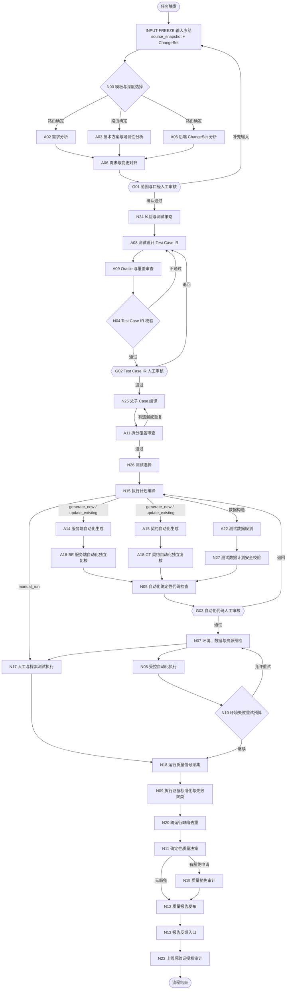

# QA 多 Agent 质量系统 All-in-One 说明文档

> 本文档是对本仓库 `qa-agents/` 参考实现及其顶层设计规范（`QA_AGENT_DESIGN.md`）的
> 一站式说明：系统目标、实现架构、端到端流程图、Agent 清单与各自 Skill、Agent 之间
> 的连接协议、数据契约、权限边界、Multica 编排、评估体系与当前建设状态。
>
> - 顶层设计规范：`QA_AGENT_DESIGN.md`
> - 可运行参考实现：`qa-agents/`
> - 实现状态（权威）：`qa-agents/IMPLEMENTATION_STATUS.md`
> - 运行时审计主记录：`qa-agents/runs/<run-id>/multica-run-manifest.json`
>
> 更新：2026-08-20（A22 确定性意图推断、已验证契约→recipe 注册、环境清单变量解析、112 真实生命周期、八卡同步自动推进与运行修复）

---

## 1. 系统定位与目标

系统是一个"生产级 QA 多 Agent 质量系统"，目标不是生成一堆看起来完整的测试 Case，而是
进入真实研发流程，建立一套能够：

- 理解需求、技术方案和前后端代码变更；
- 识别需求与实现之间的偏差；
- 基于风险生成可追踪的 `Test Intent` 与 `Test Case IR`；
- 拆分前端、后端、契约、E2E 和非功能测试；
- 生成、审查并执行自动化测试；
- 管理测试环境、测试数据和共享资源；
- 对失败做证据化聚类与归因；
- 给出**确定性**的质量门禁结论；
- 把人工修正沉淀为离线评估集。

编排平台是 **Multica**；Agent 之间的主契约是**版本化 JSON Artifact**；测试设计主契约是
`Test Intent` 与 `Test Case IR`；默认执行环境是隔离/临时环境；默认权限最小化，所有业务
代码仓库强制只读。

### 核心设计原则（§3）

| 原则 | 含义 |
| --- | --- |
| Agent 负责判断，程序负责执行 | LLM 只做理解/设计/归因；下载、Schema 校验、执行、统计全部由确定性程序完成 |
| 每个 Agent 一个稳定职责 | 生成与审查必须分离，审查 Agent 不得为生成 Agent 背书 |
| Agent 之间不共享聊天历史 | 节点间只传递结构化 Artifact，靠证据引用回查原始材料 |
| 测试语义与执行实现分层 | 需求分析 → Test Intent → Test Case IR → Automation Manifest → Execution Plan，逐层审核 |
| 结果必须可复现 | 每次运行冻结需求/commit/OpenAPI/环境/Agent/模型/Prompt 版本 |
| 禁止为通过而修改测试 | 业务断言失败默认不可重试，修改只能生成候选并保留原始证据 |
| 风险决定流程深度 | 低风险不强制全量 Agent，高风险必须增加契约/E2E/非功能和人工门禁 |
| 业务代码仓库绝对只读 | 系统级硬约束，任何 Prompt/人工 Gate/单次配置都不能覆盖 |
| 一需求一稳定工作流 | 一个 `requirement_id` 对应一个 `workflow_id` 和一张需求父卡，重触发只产生新 Run |

---

## 2. 实现架构总览

```
┌─────────────────────────────────────────────────────────────────────┐
│                        Multica（编排平台 / 控制面）                    │
│   Workspace: QA 多 Agent 质量系统                                    │
│   ├─ 项目1: QA 需求工作流中心（用户侧：每需求一张父卡，聚合 C1-C8）      │
│   ├─ 项目2: QA 内部执行与审计（Parent / Run / 节点 / 人工 Gate 技术卡） │
│   ├─ Squad: BI QA 质量系统试点组（LEAD 组长 + 已登记 Agent）           │
│   └─ Runtime: 固定 Codex Runtime（5a1ecc9c-...）+ 版本化 Agent 指令    │
└───────────────┬─────────────────────────────────────────────────────┘
                │ prepare-multica-*（最小权限输入 Bundle）
                │ fetch-multica（完整消息流审计）→ ingest-multica（契约/工具轨迹门禁）
                ▼
┌─────────────────────────────────────────────────────────────────────┐
│                  qa-agents 确定性参考实现（Python 包）                 │
│  src/qa_agents/                                                      │
│  ├─ 确定性节点：workflow / quality_pipeline / stage_two_nodes /      │
│  │   env_precheck / execution / failure_triage / selection / risk / │
│  │   test_case_gate / automation / data_planning / env_inventory / │
│  │   recipe_adapter / test_data ...                                │
│  ├─ Agent Profile：agents/（phase_one / automation）+ profiles/*.json│
│  ├─ 编排与适配：autopilot / workflow_center / multica / cli          │
│  ├─ 契约与安全：contracts / validation / security / storage          │
│  └─ 知识与 Skill：skill_registry / knowledge_* / case_provider       │
└───────────────┬─────────────────────────────────────────────────────┘
                │ 只读冻结快照（INPUT-FREEZE 生成 source_snapshot.json）
                ▼
┌─────────────────────────────────────────────────────────────────────┐
│        受管业务代码源（8 个仓库，business_source_read_only）          │
│  fs-bi / fs-bi-crm-report / fs-bi-dev-platform / fs-bi-udf-report / │
│  fs-bi-warehouse / fbi / bi-sdk / bi-xkcharts                       │
│  以及 fs-qa-knowledge（Case Provider，当前版本 incompatible）         │
└─────────────────────────────────────────────────────────────────────┘
```

### 代码模块地图（`qa-agents/src/qa_agents/`）

| 模块 | 职责 | 对应节点 |
| --- | --- | --- |
| `workflow.py` | 本地参考编排：N00 模板路由、PhaseOneWorkflow 主链 | N00、阶段 1 |
| `autopilot.py` | 需求级 Autopilot 生命周期、节点定义、八卡投影 | 编排层 |
| `workflow_center.py` | 需求工作流中心：父卡/Run 状态投影与 Multica 同步 | 编排层 |
| `multica.py` | Multica 适配：输入 Bundle、模型输出抽取、工具轨迹审计、语义校验、入库、Issue 回写 | 编排层 |
| `multica_cli.py` | multica CLI 解析（launchd 最小 PATH 兜底） | 编排层 |
| `quality_pipeline.py` | 服务端质量尾链：执行证据、N09-N23 确定性尾链 | N09-N23 |
| `stage_two_nodes.py` | N25/N26/N15 内容寻址驱动与绑定校验 | N25/N26/N15 |
| `agents/phase_one.py` | 阶段 1 Agent 的保守本地基线（A01-A12 等） | Agent 层 |
| `agents/automation.py` | 共享生成/审查引擎 + 分层/非功能 Profile（A13-A18-*） | Agent 层 |
| `gates.py` / `g01_review.py` / `g02_review.py` / `g03_review.py` | 人工 Gate 请求/决策/回流 | G01/G02/G03 |
| `contracts.py` / `validation.py` / `test_case_gate.py` | Artifact Envelope、状态枚举、内容哈希、Schema 校验 | 契约层 |
| `skill_registry.py` | Skill 注册表 + B01/D01 确定性授权路由（D01 数据构造 Skill 组合） | Skill 层 |
| `security.py` / `storage.py` | 权限策略、Secret 脱敏、路径隔离 Artifact Store | 安全层 |
| `source_collector.py` / `change_set.py` | N01 采集、N02 ChangeSet first-parent 基线 | INPUT-FREEZE |
| `risk.py` / `selection.py` / `case_compiler.py` / `case_provider.py` | N24 风险策略 / N26 选择 / N25 编译 / Case Provider Adapter | 确定性节点 |
| `env_precheck.py` / `execution.py` / `failure_triage.py` / `reporting.py` | N07 预检 / N08 受控执行 / N09 失败聚类 / N12 报告 | 执行与尾链 |
| `data_planning.py` / `test_data.py` / `chart_builder.py` | A22 确定性意图推断（9 类资源）、N28 资源 DAG、BI 资源构造 | 数据构造 |
| `recipe_adapter.py` | 已验证契约 → 证据门禁 recipe 候选（backlog 自适应） | A22/D01/backlog |
| `env_inventory.py` | 112 环境清单快照变量解析（字段 id/枚举/目录），未证明 → `runtime_required` | N28/N27 |
| `knowledge_packet_builder.py` / `test_knowledge.py` | K01 知识候选构建、知识快照 Skill | 知识层 |
| `candidate_landing.py` / `server_automation.py` | N29 候选落盘、N05/N06 自动化检查与回流 | 自动化 |
| `evaluation.py` / `model_runtime.py` / `human_correction.py` | 离线评估 / 结构化模型 Runtime 边界 / 人工修正恢复 | 支撑层 |

---

## 3. 工作流模式与总体流程

### 3.1 五种工作流模式（§4）

| 模式 | 触发输入 | 主要输出 |
| --- | --- | --- |
| 新需求测试设计 `new_requirement` | 需求、技术方案、一个或多个 ChangeSet | 完整 Test Case IR、覆盖矩阵、自动化计划 |
| 变更增量测试 `change_incremental` | MR、commit、commit range、发布变更集 | 变更影响、增量 Case、本次执行集合 |
| 发布回归 `release_regression` | 发布版本、变更清单 | 回归集合、执行结果、质量门禁结论 |
| Bug 复现与固化 `bug_reproduction` | Bug、日志、修复 MR | 最小复现 Case、自动化回归、修复验证 |
| 上线后验证 `post_release_verification` | 发布单、授权、上线后信号 | 只读冒烟、SLO/错误率/缺陷映射、审计结论 |

`N00` 用确定性模板注册表选择模板与执行深度（L1/L2/L3）；只有规则无法判定的输入才调用
A01 建议（`advice_only`），最终路由仍由 N00 校验决定。

### 3.2 端到端主链流程图



> 多入边只表达依赖关系，汇合节点（A06/N05/N18 等）必须等待路由选中的全部必需分支完成；
> 未选中的分支记为 `skipped_by_policy`，不能视为成功，也不能让汇合节点永久等待。

### 3.2.1 详细业务流图（业务视角，按 C1-C8 阶段卡分组）

> 可交互版本：`qa-agents/docs/business-flow.html`（浏览器打开，支持缩放与导出 SVG）；
> 独立源码：`qa-agents/docs/business-flow.mmd`；渲染引擎本地化在 `qa-agents/docs/mermaid.min.js`。

```mermaid
flowchart TD
    %% ================= 触发层 =================
    START([业务触发]) --> TRIGGER{触发类型}
    TRIGGER -->|需求 / commit 验证| M1[[new_requirement 新需求测试设计]]
    TRIGGER -->|MR / commit range| M2[[change_incremental 变更增量测试]]
    TRIGGER -->|发布版本 / 变更清单| M3[[release_regression 发布回归]]
    TRIGGER -->|Bug / 日志 / 修复 MR| M4[[bug_reproduction Bug 复现与固化]]
    TRIGGER -->|发布单授权| M5[[post_release_verification 上线后验证]]
    M1 & M2 & M3 & M4 & M5 --> N00

    %% ================= 阶段卡 C1 =================
    subgraph C1[阶段卡 C1 · 需求分析与变更对齐]
        direction TB
        N00{N00 模板路由与执行深度 L1/L2/L3}
        N00 -->|规则无法判定| A01[A01 路由建议 advice_only]
        A01 --> N00
        N00 -->|路由确定| FREEZE
        FREEZE[INPUT-FREEZE 输入冻结<br/>source_snapshot 不可变快照<br/>ChangeSet first-parent 基线] -->|冻结成功| P1{{并行分派}}
        FREEZE -->|输入缺失/矛盾| B1[blocked_input 返回补齐<br/>不基于残缺输入推理]
        P1 --> A02[A02 需求分析<br/>requirement-analysis/1.0]
        P1 --> A03[A03 技术方案与可测性分析<br/>technical-analysis/1.0]
        P1 --> A05[A05 后端变更分析<br/>change-analysis/1.0]
        A02 & A03 & A05 --> A06[A06 需求与变更对齐<br/>alignment-result/1.0<br/>等全部上游完成后才继续]
    end

    %% ================= 阶段卡 C2 =================
    subgraph C2[阶段卡 C2 · 范围确认与测试策略]
        direction TB
        A06 --> G01{{G01 范围与口径人工审核<br/>Multica Issue 控制面 in_review}}
        G01 -->|确认通过| N24[N24 风险与测试策略<br/>risk_level + required_layers]
        G01 -->|退回补充输入| FREEZE
        G01 -->|存在阻塞项| N24
        N24 -->|规则存在未决项| A07[A07 风险建议 advice_only]
        A07 --> N24
    end

    %% ================= 阶段卡 C3 =================
    subgraph C3[阶段卡 C3 · 测试设计与审核]
        direction TB
        N24 --> A08[A08 测试设计<br/>Test Intent + Test Case IR]
        A08 --> A09[A09 Oracle 与测试防范覆盖审查<br/>oracle-review/1.1]
        A09 --> N04{N04 Test Case IR 校验<br/>结构/来源/Oracle/覆盖}
        N04 -->|通过| G02{{G02 Test Case IR 人工审核}}
        N04 -->|不通过 自动预算内| A08
        N04 -->|不通过 预算耗尽| HR[人工修正恢复<br/>A08 v1.3.0 定向恢复<br/>预算不重置]
        HR --> A09
        G02 -->|退回| A08
    end

    %% ================= 阶段卡 C4 =================
    subgraph C4[阶段卡 C4 · Case 编译与执行计划]
        direction TB
        G02 -->|通过| N25[N25 父子 Case 编译<br/>按 expected.layers 分层收窄]
        N25 --> A11[A11 拆分覆盖审查<br/>split-review/1.0]
        A11 -->|遗漏/重复/层级错误| N25
        A11 -->|通过| N26[N26 测试选择<br/>策略强制/跳过/影响置信度]
        N26 -->|有未决项| A12[A12 选择建议 advice_only<br/>只能扩大或升级范围]
        A12 --> N26
        N26 -->|选择完成| N15[N15 执行计划编译<br/>五动作互斥 每条 Case 一个动作]
    end

    %% ================= 阶段卡 C5 =================
    subgraph C5[阶段卡 C5 · 自动化与测试数据准备]
        direction TB
        N15 -->|generate_new / update_existing| P5{{按层/类型并行分派}}
        N15 -->|run_existing| C6IN[直接进入 C6 预检]
        N15 -->|manual_run| C6IN
        N15 -->|skip| C6IN
        P5 --> A14[A14 后端自动化生成]
        P5 --> A15[A15 契约自动化生成]
        P5 --> A22[A22 测试数据规划<br/>只出计划 不持凭证]
        A14 --> A18BE[A18-BE 独立复核]
        A15 --> A18CT[A18-CT 独立复核]
        A22 --> N27[N27 数据计划安全校验]
        A18BE & A18CT & N27 --> N05[N05 自动化确定性代码检查<br/>语法/lint/哈希/权限/凭证/层根目录]
        N05 -->|通过| G03{{G03 自动化代码人工审核}}
        N05 -->|检出问题| FIX[按问题码定向回流]
        FIX --> A14
        FIX --> N15
        G03 -->|退回| N15
        G03 -->|通过| C6IN
    end

    %% ================= 阶段卡 C6 =================
    subgraph C6[阶段卡 C6 · 环境预检与测试执行]
        direction TB
        C6IN[N07 环境数据资源预检<br/>指纹/依赖/账号/数据/锁] -->|通过| P6{{执行分派}}
        C6IN -->|可恢复失败| N10
        P6 --> N08[N08 受控自动化执行<br/>无 shell 最小环境 并行 超时]
        P6 --> N17[N17 人工与探索测试执行<br/>结构化步骤/证据/结论]
        N08 --> N10{N10 环境失败重试预算<br/>业务失败不重试}
        N10 -->|预算内 可重试| C6IN
        N10 -->|继续| N18
        N10 -->|阻塞| N11
        N17 --> N18
    end

    %% ================= 阶段卡 C7 =================
    subgraph C7[阶段卡 C7 · 证据归一与质量决策]
        direction TB
        N18[N18 运行质量信号采集<br/>覆盖率/性能信号] --> N09[N09 证据标准化与失败聚类<br/>指纹归因 一个根因一组]
        N09 --> N20[N20 跨运行缺陷去重<br/>create / link / reopen / needs_human]
        N20 --> N11{N11 确定性质量决策<br/>passed / blocked / inconclusive}
        N11 -->|有豁免申请| N19[N19 质量豁免审计]
        N11 -->|无豁免| N12
        N19 --> N12
        N11 -->|证据不足| INC[inconclusive 不伪造通过]
        INC --> N12
    end

    %% ================= 阶段卡 C8 =================
    subgraph C8[阶段卡 C8 · 报告与关闭]
        direction TB
        N12[N12 质量报告发布<br/>JSON / Markdown / HTML 留证] --> N13[N13 报告反馈入口<br/>反馈归档为后续动作]
        N13 --> N23[N23 上线后验证授权审计<br/>只读冒烟 不触发生产写]
        N23 --> END([流程结束<br/>审计归档])
    end

    %% ================= 图例 =================
    subgraph LEGEND[图例]
        direction LR
        AG[Agent 智能判断<br/>输出契约化 Artifact]:::agent
        DT[确定性节点<br/>程序计算与校验]:::det
        HG[人工 Gate 审批]:::human
        DC{决策分支}:::dec
        RF[退回 / 回流]:::loop
        SK[跳过 / 不适用]:::skip
    end

    classDef agent fill:#e3f2fd,stroke:#1565c0,color:#0d2b45,stroke-width:1px
    classDef det fill:#e8f5e9,stroke:#2e7d32,color:#1b3b1f,stroke-width:1px
    classDef human fill:#fff3e0,stroke:#ef6c00,color:#4e342e,stroke-width:1.5px
    classDef dec fill:#f3e5f5,stroke:#6a1b9a,color:#3b1a4f,stroke-width:1px
    classDef loop fill:#fce4ec,stroke:#c62828,color:#4a1414,stroke-width:1px
    classDef skip fill:#f5f5f5,stroke:#9e9e9e,color:#424242,stroke-width:1px
    classDef start fill:#1a237e,stroke:#0d1547,color:#ffffff,stroke-width:2px

    class START,END start
    class A01,A02,A03,A05,A06,A07,A08,A09,A11,A12,A14,A15,A22,A18BE,A18CT agent
    class N00,FREEZE,N24,N04,N25,N26,N15,N27,N05,N07,N08,N17,N10,N18,N09,N20,N11,N19,N12,N13,N23,INC,P1,P5,P6,HR,FIX,B1,C6IN,N10 det
    class G01,G02,G03 human
    class TRIGGER,DC dec
    class RF loop
    class M1,M2,M3,M4,M5,SKIP skip

```



**读图说明**

- 颜色图例：蓝色 = Agent（模型智能判断），绿色 = 确定性节点（程序计算与校验），
  橙色 = 人工 Gate（必须人工审批），紫色 = 决策分支，红色回流 = 按问题码定向退回。
- 汇合节点（A06/N05/N18 等）必须等待本次路由选中的全部必需分支完成；未选中的分支记为
  `skipped_by_policy`，不会让汇合节点永久等待。
- 退回箭头不代表无限重试：N04 自动修正有预算（默认 2 次），预算耗尽后走
  "人工修正恢复"（A08 定向恢复输入），且**不重置自动预算**。
- N26 的 A12、N24 的 A07、N00 的 A01 都是 `advice_only` 建议 Agent，最终决策仍由对应
  确定性节点校验并拍板。
- C5 中的 `run_existing` / `manual_run` / `skip` 分支直接进入 C6 预检或对应执行路径，
  不会重复触发自动化生成。
- 业务代码仓库全程只读；自动化产物只以候选 Artifact 落盘，经 A18-*/N05/G03 审核后才能执行。

### 3.3 八张阶段卡（C1-C8）与内部节点归属

| 阶段卡 | 标题 | 内部节点 |
| --- | --- | --- |
| C1 | 需求分析与变更对齐 | INPUT-FREEZE、N00、A02、A03、A05、A06 |
| C2 | 范围确认与测试策略 | G01、N24 |
| C3 | 测试设计与审核 | A08、A09、N04、G02 |
| C4 | Case 编译与执行计划 | N25、A11、N26、N15 |
| C5 | 自动化与测试数据准备 | A14、A15、A22、A18-BE、A18-CT、N27、N05、G03 |
| C6 | 环境预检与测试执行 | N07、N08、N17、N10 |
| C7 | 证据归一与质量决策 | N18、N09、N20、N11、N19 |
| C8 | 报告与关闭 | N12、N13、N23 |

用户侧一需求一父卡，只展示 C1-C8；内部 Parent/Run/节点/人工 Gate 卡全部放在
`QA 内部执行与审计` 项目。`scripts/sync_eight_card_progress.py` 对账后按
`blocked > in_review > in_progress > done > backlog` 投影回八张卡，同 Projection 幂等。
A22 计划带未决数据需求时保持 `needs_human`，由 QA Owner 在审核 Issue 确认（置 `done`）后生成
`a22-human-confirmation`，C5 才能进入终态；未登记能力路由到 `capability_adapter_backlog`，由
`bi-recipe-adapter` skill 产出证据门禁候选（`verification_requirements` 闭合前不可执行）。

### 3.4 回流与人工升级路径（标准问题码）

| 问题类型 | 回流节点 |
| --- | --- |
| 前端/后端/契约/E2E/非功能代码问题 | 对应 A14/A15 生成 Profile |
| Case 层级、职责边界、拆分问题 | N25（随后重新 A11） |
| Test Case IR / Oracle / 测试数据定义问题 | A08（随后重新 A09/N04） |
| 风险策略问题 | N24 |
| 上游事实冲突 | A06 / G01 |
| 自动修正预算耗尽 | N04 输出 `next_node=human` → 人工修正恢复（A08 v1.3.0 定向恢复） |
| 未决数据需求 / 未登记数据能力 | A22 人工确认（`a22-human-confirmation`）/ `capability_adapter_backlog` → `bi-recipe-adapter` 证据门禁候选 |
| N27 拒绝测试数据计划 | A22 自动回流修订（`inputs/a22-correction-*`，循环到通过或预算耗尽转人工） |
| N08/N10 可重试失败（`failed_retryable`） | 记录卡人工审批重试（done 批准 / cancelled 拒绝 / blocked 暂缓） |

---

## 4. Agent 清单、职责与 Skill

### 4.1 服务端主链 Agent（12 个）

| ID | 名称 | 核心职责 | 输出契约 | 上游输入 |
| --- | --- | --- | --- | --- |
| A02 | Requirement Analyzer | 拆解冻结需求为原子需求、验收条件、歧义与人工确认项 | `requirement-analysis/1.0` | frozen_requirement |
| A03 | Technical Design & Testability Analyzer | 分析技术方案、组件依赖、可测性缺口、阻塞项与能力边界 | `technical-analysis/1.0` | frozen_technical_design、test_tool_capabilities |
| A05 | Backend Change Analyzer | 分析后端 ChangeSet 事实、影响范围、变更归属与实现偏差 | `change-analysis/1.0` | backend_change_set、read_only_source_snapshot |
| A06 | Change Alignment | 需求/技术方案/后端变更映射对齐，输出遗漏、冲突、未实现项 | `alignment-result/1.0` | A02+A03+A05 三份 Artifact |
| A08 | Test Designer | 按冻结需求与策略设计 Test Intent + Test Case IR 与覆盖矩阵 | `test-design-ir/1.1` | G01 范围、N24 策略、A06 等 |
| A09 | Oracle 与测试防范覆盖审查 | 审查 Oracle 规则、测试防范覆盖、遗漏与修正建议 | `oracle-review/1.1` | A08 IR、Oracle 规则库 |
| A11 | Split Coverage Auditor | 审查父子 Case 拆分后的覆盖完整性、冲突与遗漏 | `split-review/1.0` | N25 编译结果 |
| A14 | Server Automation | 生成后端 API/集成/功能自动化候选与 Manifest（`request.api` 取自 `api_catalog`，构造请求体逐字复用已验证契约） | `automation-generation/1.0` | N25 IR、N15 执行计划、`api_catalog`、`verified_setup_contracts`、A22 资源需求 |
| A15 | Contract Automation | 基于冻结 OpenAPI 生成契约自动化候选（`request.api` 取自 `api_catalog`） | `automation-generation/1.0` | N25 IR、N15 执行计划、`api_catalog` |
| A22 | Test Data Intent Agent | 从 Case 提取数据意图、业务状态与资源目标，只出计划不持凭证；确定性意图推断覆盖 9 类资源，唯一命中才给 `data_intent` | `test-data-plan/1.0` | N25 IR、N15 执行计划、测试数据策略、BI 能力目录 |
| A18-BE | Backend Automation Reviewer | 独立审查后端候选的断言、隔离、清理与权限 | `automation-review/1.0` | A14 产物、IR、Manifest、安全规则 |
| A18-CT | Contract Automation Reviewer | 独立审查契约候选的 Schema、操作与兼容判断 | `automation-review/1.0` | A15 产物、IR、Manifest、安全规则 |

### 4.2 参考/按需 Agent（不在服务端主链）

| ID | 角色 | 说明 |
| --- | --- | --- |
| A01 | Workflow Route Advisor | N00 无法判定时才调用，`advice_only`，不能创建/执行流程 |
| A04 | Frontend Change Analyzer | 前端变更分析，当前后端试点不触发 |
| A07 | Risk Strategy Advisor | N24 有未决项时兜底建议，规则优先 |
| A12 | Test Selection Advisor | N26 无法判定时才调用，建议只能扩大/升级范围，经 N26 校验折叠 |
| A13 / A16 | 前端 / E2E 自动化生成 | 参考 Profile，前端 Playwright 相关 Skill 当前为 forbidden |
| A17-PERF/SEC/A11Y/COMPAT/RES/DATA | 六个非功能专项生成 Profile | 复用 A14/A15 生成引擎，按风险策略启用 |
| A18-FE/E2E/PERF/SEC/A11Y/COMPAT/RES/DATA | 对应专项独立审查 Profile | 复用 A18 审查引擎 |
| K01 | Product Test Knowledge Curator | 从批准快照/只读代码/冻结 OpenAPI 提取知识候选并做冲突/新鲜度/来源校验 |
| LEAD | QA 流程组长 | Multica Squad 组长，协调八卡进度 |
| B01 / D01 | 聚合确定性路由身份 | 不是独立 LLM Agent：B01 路由后端/契约生成 Skill 组合，D01 路由数据构造 Skill 组合（未匹配 Case 路由 `bi-recipe-adapter`） |

### 4.3 Agent 的 Skill 清单（`policies/backend-skill-registry.json` + `skills/`）

Skill 是版本化、带副作用分类（`artifact_only` / `planning_only` / `validation_only`）与
**Agent 白名单**绑定的能力包，每个 Skill 目录内包含 `SKILL.md` 和 `agents/` 授权文件。
SkillRegistry 校验 `skill-registry/1.0`，任何未发布或未授权的 Skill 引用直接抛安全错误。
全局 `forbidden_skills`：`frontend-playwright`、`developer-unit-test`。

#### 按 Agent 的 Skill 绑定

| Agent | 绑定 Skill |
| --- | --- |
| A03 / A08 / A22 / K01 | `bi-knowledge-router`、`bi-product-docs-router`、8 个 `repo-*`（fs-bi、fs-bi-crm-report、fs-bi-dev-platform、fs-bi-udf-report、fs-bi-warehouse、fbi、bi-sdk、bi-xkcharts） |
| A08 / A09 | `requirement-case-render`（需求卡统一渲染规范） |
| A14 | `pytest-api-test`、`pytest-integration-test`、`pytest-parameterization`、`pytest-oracle-assertions`、`pytest-fixture-binding`、`pytest-evidence`、`pytest-security-boundary`、`retained-test-asset-naming`、`bi-chart-detail-scene` |
| A15 | `pytest-contract-test`、`pytest-parameterization`、`pytest-oracle-assertions`、`pytest-fixture-binding`、`pytest-evidence`、`pytest-security-boundary`、`retained-test-asset-naming`、`bi-chart-detail-scene`、`fxiaoke-112-auth-session`、`fxiaoke-personal-language-h5` |
| A16 | `fxiaoke-personal-language-h5` |
| A22 | `data-intent-parser`、`capability-catalog-resolver`、`bi-chart-detail-scene`、`bi-recipe-adapter`、`retained-test-asset-naming` + 上表知识路由 Skill |
| N07 | `fxiaoke-112-auth-session` |
| N27 | `data-plan-security-review`、`residue-verification`、`bi-chart-detail-scene` |
| N28 | `bi-chart-detail-scene`、`bi-chart-builder`、`bi-report-builder`、`bi-joined-table-builder`、`bi-pivot-table-builder`、`resource-dag-planner`、`namespace-isolation`、`setup-plan`、`readiness-plan`、`cleanup-plan`、`residue-verification`、`runtime-variable-binding`、`retained-test-asset-naming`、`bi-stat-schema`、`bi-aggregate-metric`、`bi-calculated-metric`、`bi-custom-dimension`、`bi-result-set-filter` |
| K01（额外） | `knowledge-source-ingestion`、`code-knowledge-extraction`、`product-rule-structuring`、`knowledge-provenance-binding`、`knowledge-conflict-detection`、`knowledge-freshness-validation`、`kdocs-authorized-snapshot`、`lexiang-authorized-snapshot`、`fxiaoke-help-snapshot`、`bug-finder-test-knowledge`、`authorized-product-browser-session` |
| B01（聚合） | 按 case 路由：`pytest-api-test`/`pytest-integration-test`/`pytest-contract-test` + 6 个共享 pytest Skill |
| D01（聚合） | 11 个 `COMMON_DATA` Skill + 按资源类型路由的 BI Skill + 未匹配 Case 路由 `bi-recipe-adapter` |

#### 按 Skill 族分类

- **pytest 生成族（artifact_only）**：`pytest-api-test`、`pytest-integration-test`、
  `pytest-contract-test`、`pytest-parameterization`、`pytest-oracle-assertions`、
  `pytest-fixture-binding`、`pytest-evidence`、`pytest-security-boundary`、`retained-test-asset-naming`
- **数据构造族（planning_only）**：`data-intent-parser`、`capability-catalog-resolver`、
  `resource-dag-planner`、`namespace-isolation`、`setup-plan`、`readiness-plan`、`cleanup-plan`、
  `residue-verification`、`runtime-variable-binding`、`data-plan-security-review`、`bi-recipe-adapter`
- **BI 资源族（planning_only）**：`bi-stat-schema`、`bi-aggregate-metric`、
  `bi-calculated-metric`、`bi-custom-dimension`、`bi-result-set-filter`、`bi-chart-builder`、
  `bi-report-builder`、`bi-joined-table-builder`、`bi-pivot-table-builder`、`bi-chart-detail-scene`
- **知识获取族（artifact_only / validation_only）**：`knowledge-source-ingestion`、
  `code-knowledge-extraction`、`product-rule-structuring`、`knowledge-provenance-binding`、
  `knowledge-conflict-detection`、`knowledge-freshness-validation`、`kdocs-authorized-snapshot`、
  `lexiang-authorized-snapshot`、`fxiaoke-help-snapshot`、`bug-finder-test-knowledge`、
  `authorized-product-browser-session`
- **知识路由/仓库族（validation_only）**：`bi-knowledge-router`、`bi-product-docs-router`、8 个 `repo-*`
- **认证/会话族（validation_only）**：`fxiaoke-112-auth-session`、`fxiaoke-personal-language-h5`
- **展示/渲染规范族**：`card-copy`（八卡/节点/审核卡文案）、`human-readable-workflow-output`（面向 Multica 详情页的四件套规范）、`requirement-case-render`

---

## 5. Agent 之间的连接协议

### 5.1 统一 Artifact Envelope（`artifact-envelope/1.0`）

Agent 之间**不共享聊天历史**，只传递版本化 JSON Artifact。每个产物外层统一：

```json
{
  "workflow_run_id": "run-20260806-001",
  "workflow_mode": "new_requirement",
  "schema_version": "1.0",
  "artifact_id": "requirement-analysis-001",
  "artifact_hash": "sha256:...",
  "producer": {
    "agent_id": "A02",
    "agent_version": "1.0.0",
    "model_provider": "provider-id",
    "model_snapshot": "immutable-model-id",
    "prompt_version": "git-sha",
    "inference_config_hash": "sha256:...",
    "tool_bundle_version": "toolset-1.2.0"
  },
  "created_at": "2026-08-06T10:00:00+08:00",
  "source_snapshot_id": "snapshot-001",
  "status": "completed",
  "confidence": 0.86,
  "facts": [], "inferences": [], "assumptions": [],
  "blocking_questions": [], "evidence_refs": [],
  "payload": {}
}
```

关键点：

- `artifact_hash` 是对规范字段集合的 canonical JSON 的 `sha256:` 值，校验时**重新计算**，
  不信任存储值（`artifact_hash_from_mapping`）。
- `producer` 记录 Agent/模型/Prompt/推理配置/工具包版本，实现可复现与审计。
- 业务结论必须带 `evidence_refs`；自报 `confidence` 仅观察，不作为门禁。
- 状态与业务结论是不同字段，Agent 不能通过 `completed` 表示"测试已通过"。

### 5.2 Artifact 状态机（13 态）

| 状态 | 含义 | 编排行为 |
| --- | --- | --- |
| `completed` | 完整满足节点契约 | 进入校验节点 |
| `completed_with_gaps` | 有非阻塞证据缺口 | 记录缺口后按策略进入校验/Gate |
| `needs_human` | 需要人工决策 | 暂停进入 Gate |
| `blocked_input` | 输入缺失或矛盾 | 返回输入采集节点 |
| `not_applicable` | 该组件/能力本次不适用 | 记录原因，不等分支 |
| `skipped_by_policy` | 适用但策略决定不运行 | 记录策略版本，不视为通过 |
| `stale` | 上游来源变化，产物失效 | 取消消费者并按失效图重算 |
| `cancelled` | 显式取消 | 保存部分证据 |
| `inconclusive` | 已运行但证据不足 | 进入人工或质量决策 |
| `failed_retryable` | 临时模型/工具错误 | 按预算有限重试 |
| `failed_fatal` | 无法继续 | 终止分支并保留诊断 |

`not_applicable` / `skipped_by_policy` / `inconclusive` / `passed` 之间不得互相转换。

### 5.3 输入冻结与版本失效（INPUT-FREEZE）

- 生成 `source_extraction_manifest.json`：记录每个输入来源、附件数、文本块/表格/图片/OCR、
  解析器版本、内容哈希、解析置信度与已知遗漏。
- 生成不可变 `source_snapshot.json`：需求/技术方案/前端 commit/后端 commit/OpenAPI 哈希/
  测试资产快照/环境目标。
- ChangeSet 统一契约（`change-set/1.0`）：标准化 MR/单 commit/merge commit/commit range/
  发布清单，diff 基线确定性（merge commit 强制 `first_parent`），记录 rename/delete/binary/
  submodule/生成文件状态，内容寻址缓存。
- 失效规则：MR 新 commit → 旧分析 `stale`；需求/方案版本变化 → 下游全部失效；
  OpenAPI 变化 → 契约/后端/前端 Case 失效；测试资产变化 → N26/N15 失效；
  环境部署与目标 commit 不一致 → 禁止出正式质量结论。

### 5.4 Multica 连接协议（Agent 出入站）

本地参考实现通过 `src/qa_agents/multica.py` 提供确定性的"入站 → 出站"闭环：

```
prepare-multica-*（本地确定性编译）
  ├─ 读取已验收 Artifact（内容哈希校验）
  ├─ 生成最小权限输入 Bundle：multica-agent-input/1.0
  │    ├─ profile_id / profile_version / output_contract
  │    ├─ allowed_inputs（精确白名单）
  │    ├─ integrity 标志（全部必须为 false）
  │    ├─ upstream_artifacts（哈希绑定）
  │    └─ bundle_hash
  └─ 输出到 runs/<run>/multica-inputs/<agent>-input.json
        │
        ▼
Multica Agent（固定 Runtime 5a1ecc9c-... + 版本化指令 multica/agent-instructions/<agent>-vX.Y.Z.md）
  ├─ 只允许：multica issue get / attachment download / cat <input> / 固定路径 jq
  ├─ 单条命令，禁止 &&、||、;、$(...)、反引号、管道、写文件、评论、改 Issue
  └─ 最终消息 = 一个裸 JSON（不允许 Markdown 围栏、附件交付、进度文本）
        │
        ▼
fetch-multica（保存完整消息审计流 → runs/<run>/multica-outputs/）
  └─ ingest-multica（出站 Gate，全部 fail-closed）
       ├─ bundle_hash 校验
       ├─ integrity 全部 false 校验
       ├─ audit_multica_tool_trace：命令/工具轨迹必须在白名单
       ├─ extract_multica_model_output：裸 JSON 抽取
       ├─ 绑定字段校验：schema_version / workflow_run_id / source_snapshot_id / input_bundle_hash
       ├─ 必填字段 + 证据集合 + 字段级语义校验（_validate_profile_semantics 等）
       ├─ 禁止 Oracle 字段（evaluation_oracle_registry 等 forbidden_inputs）
       └─ 通过后落盘为 Artifact Envelope（producer.runtime=multica，
            tool_bundle_version=multica-task:<task_id>，facts 记录工具轨迹审计结果）
        │
        ▼
sync-multica-issue-card（可选，显式操作）
  └─ 再次核对 Profile/运行/输入哈希/Issue ID，只把已接受结果绑定卡更新为 done
```

要点：

- 入库必须同时提供 `--task-id`、`--issue-id`、`--attachment-id`，任一身份或工具轨迹不匹配
  即失败；失败/影子/未入库候选不得调用 sync 命令。
- `validate-multica-candidate` 提供影子验证（不改变主链），`--expect-reject` 用于负向测试。
- 生成 Agent 与审查 Agent 使用不同 Runtime 身份与写权限，审查 Runtime 不得读生成 Agent
  的隐藏推理。
- A14/A15 输入 Bundle 额外携带 `api_catalog`（目标仓库 `idl/http` 的 operationId/method/path
  目录）与 `verified_setup_contracts`（112 已验证构造请求模板）；`regeneration_round` 用于
  刻意重跑时生成新 bundle 哈希，避免幂等恢复静默还原陈旧产物。
- 所有 shell 出站统一经 `resolve_multica_binary()` 解析 multica CLI（launchd 最小 PATH 兜底），
  定时器不再因找不到命令崩溃。

### 5.5 人工 Gate 协议（G01/G02/G03）

- Gate 以 **Multica Issue 为控制面**：进入 Gate 创建 `in_review` Issue；
  `done` → 继续，`blocked` → 退回指定节点，`cancelled` → 终止。
- 请求/决定/结果三份内容寻址文档 + 身份绑定 + 幂等恢复（重复状态同步不会重复恢复下游）。
- G01 采用 `g01-comment-table/1.0` 结构化评论表：逐问题确认、带身份/签名/内容哈希，
  无评论、部分填写、非授权成员、旧请求哈希、仅状态变更全部 fail-closed。
- G02 决策经 N25 前置校验：`decision=approved` 且 `next_node=N25` 才允许编译。
- 试点当前按用户决策采用 **QA Owner 单签**（`muqj11262 / qa_owner`），仅测试设计试点，
  无生产发布审批权限；接入真实发布流程前必须恢复产品/技术/QA 职责分离。
- 阶段卡的 `in_review` 只是聚合展示，不能替代审批协议。

### 5.6 Schema 兼容与迁移（§8.1）

- 向后兼容字段用 minor 升级；删字段/改语义/改类型用 major 升级。
- 迁移由确定性转换器完成；迁移后同时保留原 Artifact、迁移结果、转换器版本与差异。
- 找不到迁移路径 → `blocked_input`，禁止静默丢弃未知字段。
- 长流程恢复使用运行开始时冻结的 Schema 与 Agent 版本，不自动切最新版。

---

## 6. 测试模型四层契约

```text
Test Intent → Test Case IR → Automation Manifest → Execution Plan
```

| 层 | 生产者 | 内容 | 约束 |
| --- | --- | --- | --- |
| Test Intent | A08 | 需求/风险 ID、业务规则、场景、影响面、所需层级、来源证据 | 不含框架/文件路径/选择器/命令 |
| Test Case IR | A08 | 唯一 Case ID、父 Case、Intent ID、layer、test_level、risk、priority、前置/数据/步骤/预期（observation_point + matcher + oracle type + source_ref）、cleanup、execution_policy | 框架无关，是审核与生命周期管理的唯一主模型 |
| Automation Manifest | A14/A15 | 框架、目标测试仓库、代码位置、执行入口、Case 映射、依赖、权限、预期产物 | 只能引用 Test Case IR，不得重写业务预期 |
| Execution Plan | N15 | 每条 Case 恰好一个动作：`generate_new` / `update_existing` / `run_existing` / `manual_run` / `skip` | Agent 只能建议，不能把 Case 标记为已执行 |

N15 动作路由：`generate_new`/`update_existing` → A14/A15；`run_existing` → N07/N08；
`manual_run` → N17；`skip` → 记录证据与批准策略（不等于 passed）。

自动化候选的 Oracle 支持 `oracle` 对象与扁平条目（顶层 `matcher`/`observation_point`/
`expected_value`）两种形态，`CaseRunner.assert_oracles` 统一归一化求值；路径断言支持
`body.` 前缀、`$.a.b` JSONPath 风格与 `$` 根引用。非结构化 cleanup/residue 步骤记为
`skipped`（`cleanup_step_not_structured` / `residue_step_not_structured`），不把已通过测试误判失败。

---

## 7. 确定性节点与人工 Gate 明细

| 节点 | 职责 | 关键规则 |
| --- | --- | --- |
| INPUT-FREEZE | 输入冻结 | 不可变 snapshot、ChangeSet first-parent、内容寻址缓存 |
| N00 | 模板路由与深度 | 确定性注册表优先，A01 仅兜底 |
| N24 | 风险与测试策略 | 规则优先；认证/权限/删除/P0 冒烟不可被标记为"无需执行" |
| N04 | Test Case IR 校验 | 结构/来源/Oracle/覆盖规则，按问题类型分类回流（A08/N25/N24/A06/G01） |
| N25 | 父子 Case 编译 | G02 审批哈希 + A08 哈希绑定校验；按 `expected[].layers` 分层 |
| N26 | 测试选择 | 资产/风险/策略；无法解析影响范围时宁可扩大；P0 冒烟不可跳过 |
| N15 | 执行计划编译 | 五动作互斥；`run_existing` 必须引用已审核代码 commit |
| N27 | 数据计划安全校验 | setup/cleanup 可写但强制 namespace、操作配对、资源 ID、readiness 只读、Secret 边界；未决需求以 `completed_with_gaps + pending_human` 输出等 A22 人工确认；recipe 全量校验通过才可执行 |
| N05 | 自动化确定性代码检查 | 语法/lint/编译/安全扫描/哈希/命令/权限/凭证/层根目录越界拦截 |
| N07 | 环境数据资源预检 | 环境指纹、8 类预检、资源锁；失败禁止进入正式执行；接受 N27 `completed_with_gaps + pending_human` 作为有效数据验证证据 |
| N08 | 受控自动化执行 | 无 shell、最小环境、分片并行、超时、日志脱敏；业务失败→N09，超时/基础设施→N10；从策略声明的框架 venv 启动 pytest，Secret 由 `secret_providers` 按 `secret_map` 从 0600 本地配置注入；`failed_retryable` 进入人工重试审批 |
| N10 | 环境失败重试预算 | 按预算给继续/暂停/阻塞；无状态变化禁止原地重复预检；可重试失败由记录卡人工审批（done 批准重试 / cancelled 拒绝 / blocked 暂缓） |
| N17 | 人工/探索测试执行 | 结构化步骤/结果/截图/日志/结论；必测人工未完成时 N11 不能给 passed |
| N18 | 运行质量信号 | 覆盖率/性能等；只用于发现未执行区域，不能替代需求覆盖 |
| N09 | 证据标准化与失败聚类 | 规则优先指纹聚类；规则无法归因 → `needs_human`，不设归因 Agent |
| N20 | 跨运行缺陷去重 | `create_new` / `link_existing` / `reopen` / `needs_human` |
| N11 | 确定性质量决策 | 无失败≠通过；缺执行/必测人工未完成/关键跳过隔离 → blocked 或 inconclusive |
| N19 | 质量豁免审计 | 记录授权范围；超期/逃逸率纳入指标 |
| N12 | 质量报告发布 | JSON / Markdown / HTML 三态报告 |
| N13 | 报告反馈入口 | 反馈归档为后续动作 |
| N23 | 上线后验证授权审计 | 只读冒烟；线上信号不能触发生产写操作 |

非主链参考节点：N01（采集）、N02（ChangeSet）、N03（Schema 兼容，由 Envelope 承担）、
N06（修复路由，由标准问题码直接回流承担）、N14（资产快照）、N16（环境修复，由 N10 预算
承担）、N28（数据资源 DAG）、N29（候选落盘）、N21/N22（版本兼容/发布，由 Envelope 与
工作流配置承担）。

---

## 8. 权限与安全边界（§22）

| 维度 | 规则 |
| --- | --- |
| 业务仓库 | 8 个受管仓库一律 `business_source_read_only`；禁改文件/Git 历史/分支/标签/MR/评论/审批/流水线 |
| 自动化代码 | 只写独立登记测试仓库或工作流 Artifact 目录；`write_mode=artifact_only_candidate` |
| Agent 工具 | 白名单命令（issue get / attachment download / cat / 固定 jq），禁止组合、写、上传 |
| 凭证 | 凭证只由外部采集器以会话引用持有；Agent 不得读取/输出/写入；112 会话由 `fxiaoke-112-auth-session` 管理 |
| Secret | `SecurityPolicy.redact_secrets` 在入 Envelope 前脱敏；`assert_no_secret_values` 在所有入口校验；受控执行 Secret 由 execution-policy 的 `secret_providers` 从 `environment.112.local.json`（0600）注入且不落 Artifact；环境清单快照禁含 Secret |
| Oracle | Agent 运行身份禁止访问 `evaluation_oracle_registry`；评估器独立身份，产物冻结后才读 Oracle |
| Skill | 未发布/未授权 Skill 引用 → `SecurityPolicyError`；`forbidden_skills` 全局生效 |
| 模型 Runtime | 不可变模型快照、固定 prompt_version、禁用数据留存、禁止直连工具（语义分析 Runtime `tools=[]`） |
| 受控 Runner | 必须从策略声明的仓库内词法路径启动框架 venv（不 resolve 符号链接）；未声明则回退驱动解释器 |
| 审计 | 记录节点输入输出哈希、Agent Token/费用/重试、工具调用与被拒操作、审批人、资源锁占用 |

---

## 9. Multica 编排与试点现状

### 9.1 线上资源（`multica/workspace-manifest.json`）

| 资源 | ID | 说明 |
| --- | --- | --- |
| Workspace | `457d700f-6c27-4a59-871d-c2c56bca9f46` | `QA 多 Agent 质量系统`，Issue 前缀 QAA |
| Squad | `c9195ed4-dfb0-407a-83c6-13334d2a7216` | `BI QA 质量系统试点组`，LEAD `e7354c2e-...` |
| 内部项目 | `QA 内部执行与审计` | Parent/Run/节点/Gate 技术卡 |
| 需求项目 | `QA 需求工作流中心` | 每需求一张父卡（`qa_item_type=workflow`） |
| Runtime | `5a1ecc9c-8e48-4345-8d5e-be0efb3b9a54` | 在线固定 Runtime（A02-A11 已绑定） |
| 有效模型 Runtime | `deepseek-v4-flash` | 当前有效 Runtime；旧 Claude Runtime 认证 401 不可用，编排器不得自动回退 |
| 已登记 Agent | A02、A03、A05、A06、A08、A09、A11、LEAD | workflow-center-config 另登记 A14/A15/A18-BE/A18-CT/A22 的 node_agent 映射 |

`safety`：`artifact_only=true`、`business_repositories=read_only_external_evidence_only`、
`external_side_effects=denied`、`fs_qa_knowledge=read_only_external_evidence_only`、
`oracle_registry_access=denied`。

### 9.2 真实试点链（`pilot-001` / `multica-confidence-20260811-01`）

- `pilot-001`：A02/A03/A05/A06 真实 Stage 1 → G01 23 项逐项确认 → N24(critical) →
  A08 v1.3.0 人工恢复 → A09 → N04(valid) → G02 放行（QAA-24 `done`）→ N25 → A11 →
  N26 → N15（3 generate_new + 11 manual_run），主链闭环到 N15。
- 独立置信运行：A08/A09/N04 双轮自动修正后停在 `human`（预算耗尽），验证了自动回流、
  预算耗尽和人工升级协议。
- 人工恢复协议：QAA-19 授权 → QAA-20 因契约/工具轨迹违规被拒 → QAA-21 v1.3.0 合法恢复，
  自动预算保持 2 不重置，恢复后必须重新经过 A09/N04。
- 112 真实生命周期：`CASE-FUNC-RESULT-FILTER-DETAIL-112` / `CASE-AUTO-RESULT-FILTER-DETAIL-112`
  在真实 112 完成隔离指标创建、结果集筛选、查看明细断言（`s307011535` 与动态指标名）、
  finally 删除与无残留回查；后者由 A22/N28 自主生成同一生命周期，不含手写 setup/cleanup。
- 能力目录注册 5 个 recipe（普通指标创建 + 四类指标结果集筛选）；6 个候选
  （custom_dimension/joined_table/stat_chart/pivot/report/组合明细场景）等待 112 证据闭合。
- 八卡同步自动推进 C5-C8：A22 人工确认 → C5 终态；N07 预检 / N08 受控执行 / C7-C8 质量尾链
  自动运行；N08/N10 可重试失败进入人工重试审批；launchd 定时器 PATH 与 multica CLI 解析修复。

### 9.3 常用命令（`qa-agents/Makefile` / CLI）

```bash
make -C qa-agents test                 # 全量单元/契约测试
make -C qa-agents pilot                # 本地主链到 N04（不绕过 G02）
make -C qa-agents pilot-full           # 本地到 N15（--approve-g01 --approve-g02 仅本地）
make -C qa-agents pilot-automation     # 自动化路由 + G03 模拟
make -C qa-agents prepare-multica-pilot
make -C qa-agents run-n25-after-g02-pilot
make -C qa-agents prepare-multica-split-review-pilot
make -C qa-agents run-n26-after-a11-pilot
make -C qa-agents run-n15-after-n26-pilot
make -C qa-agents compile-workflow-center / sync-workflow-center
make -C qa-agents run-server-full-pilot # 环境预检 + 受控执行 + 质量尾链参考切片
make -C qa-agents prepare-autonomous-test-data-pilot # A22/N28/N27 自主测试数据构造
make -C qa-agents prepare-recipe-candidates          # 已验证契约 → 证据门禁 recipe 候选
make -C qa-agents prepare-test-data --inventory <snapshot>  # 112 环境清单变量解析
bash qa-agents/scripts/install-sync-timer.sh          # 安装八卡同步 LaunchAgent 定时器
```

生产链必须走 `fetch-multica` → `ingest-multica`（可加 `--sync-issue-card`）→
`sync-multica-issue-card`；本地 `--approve-*` 开关只用于开发验证。

---

## 10. 评估体系（§25）

- 固定评估集：历史需求+人工标准 Case、历史 Bug/修复 MR/回归 Case、前后端/契约/跨服务 MR
  样本、注入缺陷与契约不兼容、缺失/矛盾/模糊需求、环境/数据/自动化失败样本。
- 首个纵向基准：`qa-agents/eval/workflows/pilot-001-detail-drill-message-i18n/`
  （`input/` + `oracle/` 分离；生产要求不同仓库/ACL）。
- 数据分区：`development` / `validation` / `sealed_holdout`；P0/P1 Oracle 至少双人独立标注。
- 核心指标：关键需求覆盖率与漏检率、按 P0/P1 加权的召回、无证据事实率、无效/重复 Case
  比例、Oracle 无证据率、层级拆分准确率、人工修改比例、自动化首跑成功率、测试选择缺陷
  召回率与执行缩减比、失败聚类准确率、Flaky/豁免/逃逸指标、单次工作流耗时与 Token 费用等。
- 反馈闭环：人工修正 → 保存原始输出与修正 → 标注错误类型 → 入候选评估集 → 离线更新 →
  回归评估 → 版本化发布 Agent；任一关键指标恶化自动停止灰度并回滚。

---

## 11. 分阶段建设路线与当前状态

| 阶段 | 内容 | 状态（2026-08-20） |
| --- | --- | --- |
| 阶段 0 | 契约、Envelope、本地 Artifact、评估基础 | ✅ 已实现 |
| 阶段 1 | 测试设计质量闭环（A02-A09/N04/G01/G02 人工恢复） | ✅ 真实试点闭环到 G02/N25 |
| 阶段 2 | 测试选择与代码生成（N25/A11/N26/N15、A14/A15/A18/N05/G03） | ✅ 阶段二真实链到 N15；自动化参考切片就绪 |
| 阶段 3 | 环境自主执行（N07/N08/N17/N10/N16） | 🔶 参考切片已实现；生产隔离 Runner 未完成 |
| 阶段 4 | 确定性质量门禁（N09-N12/N17-N23） | 🔶 本地 reference 已实现；外部发布 Adapter 未完成 |
| 阶段 5 | 有限自治闭环 | ⏳ 未开始 |

已实现的横向能力：Autopilot 生命周期与需求工作流中心、八卡投影同步（A22 人工确认、
N07/N08/质量尾链自动推进、重试审批）、Multica 真实试点、A22/N28/N27 自主测试数据构造
（确定性意图推断 9 类资源 + 112 真实生命周期通过）、已验证契约 → recipe 注册与 backlog
候选（`bi-recipe-adapter`）、环境清单变量解析、K01 知识治理、B01/D01 Skill 路由、
质量尾链全部节点参考实现、离线评估与可读报告。

已知阻塞项（来自 IMPLEMENTATION_STATUS 与设计文档）：生产隔离 Runner、真实环境/人工执行
证据、外部发布 Adapter、A11 真实审核的后续驱动、完整离线评估的语义差距收敛、生产模型网关
与 Prompt 发布/灰度/回滚。

---

## 12. 快速阅读索引

- 顶层设计：`QA_AGENT_DESIGN.md`（架构原则 §3、流程 §4-5、Agent 清单 §6、Envelope §8、
  测试模型 §12、自动化 §16、尾链 §18-19、权限 §22、评估 §25、路线 §27；
  八卡用户视图与同步说明 §5.1.1，原 `MULTICA_8_CARD_SIMPLE.md` 已并入）
- 实现状态：`qa-agents/IMPLEMENTATION_STATUS.md`
- 参考实现 README：`qa-agents/README.md`
- 契约 Schema：`qa-agents/contracts/*.schema.json`（24 个）
- 策略：`qa-agents/policies/*.json`（risk/quality/selection/execution/permission/repository/
  automation-target/backend-skill-registry/model-runtime/g01-g03/human-correction 等 19 个）
- Agent Profile：`qa-agents/profiles/*.json`（33 个）
- Skill 包：`qa-agents/skills/*/SKILL.md`（56 个）
- Multica 指令：`qa-agents/multica/agent-instructions/*.md`（版本化）
- 工作流 DAG 参考：`qa-agents/workflows/phase-one-reference-dag.json`
- 运行产物：`qa-agents/runs/pilot-001/`（multica-stage1..16、g01、g02、multica-inputs、multica-outputs）
- 测试：`qa-agents/tests/`（52 个测试文件，608 个用例通过）
